# DeepSignal SETI Candidate Report

**Generated:** 2026-06-08 07:07 UTC
**Pipeline version:** 2.0.0

## Executive Summary

The DeepSignal pipeline processed 78 radio telescope observations across 40 astronomical targets. Anomaly detection identified **213 candidates** for cross-referencing.

| Tier | Score Range | Count | Description |
|------|-------------|-------|-------------|
| 1 | ≥ 70 | 63 | Strongly recommended for follow-up |
| 2 | 50–69 | 136 | Additional observations warranted |
| 3 | < 50 | 14 | Low priority |

## Signal Statistics

- SNR mean: 4.35  std: 5.33
- SNR range: [1.14, 35.17]

## Tier 1 — High Priority

### Tau Ceti — Score 100/100

🔭 **[View in Aladin Sky Atlas (DSS2 Optical)](https://aladin.u-strasbg.fr/AladinLite/?target=26.0170+-15.9375&fov=0.5&survey=P/DSS2/color)**
*Multi-wavelength: [DSS2 Optical](https://aladin.u-strasbg.fr/AladinLite/?target=26.0170+-15.9375&fov=0.5&survey=P/DSS2/color) · [2MASS NIR](https://aladin.u-strasbg.fr/AladinLite/?target=26.0170+-15.9375&fov=0.5&survey=P/2MASS/color)*

- **Position:** RA=26.0170°, Dec=-15.9375°
- **Frequency:** 6794.79 MHz
- **SNR:** 35.2
- **Bandwidth:** 0.00568866 MHz
- **Drift rate:** 1.5186 Hz/s
- **Detection method(s):** zscore

**Cross-check evidence:**

  - Known SETI priority target: Tau Ceti
  - Exoplanet system nearby: tau Cet g, tau Cet h, tau Cet f
  - Doppler drift rate 1.5186 Hz/s consistent with technological origin
  - High SNR: 35.2
  - Multi-channel confirmation: 2 independent data sources detect this target

### Proxima Centauri — Score 100/100

🔭 **[View in Aladin Sky Atlas (DSS2 Optical)](https://aladin.u-strasbg.fr/AladinLite/?target=217.4288+-62.6793&fov=0.5&survey=P/DSS2/color)**
*Multi-wavelength: [DSS2 Optical](https://aladin.u-strasbg.fr/AladinLite/?target=217.4288+-62.6793&fov=0.5&survey=P/DSS2/color) · [2MASS NIR](https://aladin.u-strasbg.fr/AladinLite/?target=217.4288+-62.6793&fov=0.5&survey=P/2MASS/color)*

- **Position:** RA=217.4288°, Dec=-62.6793°
- **Frequency:** 4949.91 MHz
- **SNR:** 21.3
- **Bandwidth:** 0.0008936 MHz
- **Drift rate:** 1.9942 Hz/s
- **Detection method(s):** doppler_drift

**Cross-check evidence:**

  - Known SETI priority target: Proxima Centauri
  - Exoplanet system nearby: Proxima Cen b, Proxima Cen b, Proxima Cen d
  - Doppler drift rate 1.9942 Hz/s consistent with technological origin
  - High SNR: 21.3
  - Multi-channel confirmation: 2 independent data sources detect this target

### Tau Ceti — Score 75/100

🔭 **[View in Aladin Sky Atlas (DSS2 Optical)](https://aladin.u-strasbg.fr/AladinLite/?target=26.0170+-15.9375&fov=0.5&survey=P/DSS2/color)**
*Multi-wavelength: [DSS2 Optical](https://aladin.u-strasbg.fr/AladinLite/?target=26.0170+-15.9375&fov=0.5&survey=P/DSS2/color) · [2MASS NIR](https://aladin.u-strasbg.fr/AladinLite/?target=26.0170+-15.9375&fov=0.5&survey=P/2MASS/color)*

- **Position:** RA=26.0170°, Dec=-15.9375°
- **Frequency:** 8074.58 MHz
- **SNR:** 1.8
- **Bandwidth:** 151.2455 MHz
- **Drift rate:** 0.0879 Hz/s
- **Detection method(s):** doppler_drift

**Cross-check evidence:**

  - Known SETI priority target: Tau Ceti
  - Frequency in known RFI band: X-band satellite TT&C
  - Exoplanet system nearby: tau Cet g, tau Cet h, tau Cet f
  - Doppler drift rate 0.0879 Hz/s consistent with technological origin
  - Multi-channel confirmation: 2 independent data sources detect this target

### Tau Ceti — Score 100/100

🔭 **[View in Aladin Sky Atlas (DSS2 Optical)](https://aladin.u-strasbg.fr/AladinLite/?target=26.0170+-15.9375&fov=0.5&survey=P/DSS2/color)**
*Multi-wavelength: [DSS2 Optical](https://aladin.u-strasbg.fr/AladinLite/?target=26.0170+-15.9375&fov=0.5&survey=P/DSS2/color) · [2MASS NIR](https://aladin.u-strasbg.fr/AladinLite/?target=26.0170+-15.9375&fov=0.5&survey=P/2MASS/color)*

- **Position:** RA=26.0170°, Dec=-15.9375°
- **Frequency:** 4190.73 MHz
- **SNR:** 2.5
- **Bandwidth:** 488.2792 MHz
- **Drift rate:** -0.0428 Hz/s
- **Detection method(s):** doppler_drift

**Cross-check evidence:**

  - Known SETI priority target: Tau Ceti
  - Exoplanet system nearby: tau Cet g, tau Cet h, tau Cet f
  - Doppler drift rate 0.0428 Hz/s consistent with technological origin
  - Multi-channel confirmation: 2 independent data sources detect this target

### Epsilon Eridani — Score 100/100

🔭 **[View in Aladin Sky Atlas (DSS2 Optical)](https://aladin.u-strasbg.fr/AladinLite/?target=53.2327+-9.4582&fov=0.5&survey=P/DSS2/color)**
*Multi-wavelength: [DSS2 Optical](https://aladin.u-strasbg.fr/AladinLite/?target=53.2327+-9.4582&fov=0.5&survey=P/DSS2/color) · [2MASS NIR](https://aladin.u-strasbg.fr/AladinLite/?target=53.2327+-9.4582&fov=0.5&survey=P/2MASS/color)*

- **Position:** RA=53.2327°, Dec=-9.4582°
- **Frequency:** 1394.23 MHz
- **SNR:** 3.4
- **Bandwidth:** 161.7158 MHz
- **Drift rate:** 0.2142 Hz/s
- **Detection method(s):** doppler_drift

**Cross-check evidence:**

  - Known SETI priority target: Epsilon Eridani
  - Exoplanet system nearby: eps Eri b, eps Eri b, eps Eri b
  - Doppler drift rate 0.2142 Hz/s consistent with technological origin
  - Multi-channel confirmation: 2 independent data sources detect this target

### Epsilon Eridani — Score 100/100

🔭 **[View in Aladin Sky Atlas (DSS2 Optical)](https://aladin.u-strasbg.fr/AladinLite/?target=53.2327+-9.4582&fov=0.5&survey=P/DSS2/color)**
*Multi-wavelength: [DSS2 Optical](https://aladin.u-strasbg.fr/AladinLite/?target=53.2327+-9.4582&fov=0.5&survey=P/DSS2/color) · [2MASS NIR](https://aladin.u-strasbg.fr/AladinLite/?target=53.2327+-9.4582&fov=0.5&survey=P/2MASS/color)*

- **Position:** RA=53.2327°, Dec=-9.4582°
- **Frequency:** 3932.43 MHz
- **SNR:** 3.7
- **Bandwidth:** 248.1839 MHz
- **Drift rate:** 0.1129 Hz/s
- **Detection method(s):** doppler_drift

**Cross-check evidence:**

  - Known SETI priority target: Epsilon Eridani
  - Exoplanet system nearby: eps Eri b, eps Eri b, eps Eri b
  - Doppler drift rate 0.1129 Hz/s consistent with technological origin
  - Multi-channel confirmation: 2 independent data sources detect this target

### Gliese 667C — Score 95/100

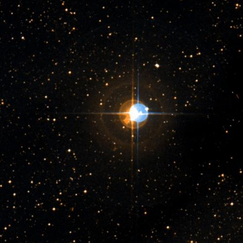
🔭 **[View in Aladin Sky Atlas (DSS2 Optical)](https://aladin.u-strasbg.fr/AladinLite/?target=259.7488+-34.9977&fov=0.5&survey=P/DSS2/color)**
*Multi-wavelength: [DSS2 Optical](https://aladin.u-strasbg.fr/AladinLite/?target=259.7488+-34.9977&fov=0.5&survey=P/DSS2/color) · [2MASS NIR](https://aladin.u-strasbg.fr/AladinLite/?target=259.7488+-34.9977&fov=0.5&survey=P/2MASS/color)*

- **Position:** RA=259.7488°, Dec=-34.9977°
- **Frequency:** 3042.18 MHz
- **SNR:** 3.9
- **Bandwidth:** 367.9256 MHz
- **Drift rate:** 0.0543 Hz/s
- **Detection method(s):** doppler_drift

**Cross-check evidence:**

  - Known SETI priority target: Gliese 667C
  - Exoplanet system nearby: GJ 667 C f, GJ 667 C b, GJ 667 C c
  - Doppler drift rate 0.0543 Hz/s consistent with technological origin

### Vega — Score 75/100

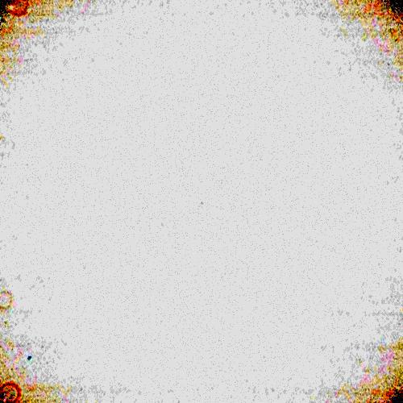
🔭 **[View in Aladin Sky Atlas (DSS2 Optical)](https://aladin.u-strasbg.fr/AladinLite/?target=279.2347+38.7837&fov=0.5&survey=P/DSS2/color)**
*Multi-wavelength: [DSS2 Optical](https://aladin.u-strasbg.fr/AladinLite/?target=279.2347+38.7837&fov=0.5&survey=P/DSS2/color) · [GALEX UV](https://aladin.u-strasbg.fr/AladinLite/?target=279.2347+38.7837&fov=0.5&survey=P/GALEX/color)*

- **Position:** RA=279.2347°, Dec=38.7837°
- **Frequency:** 2030.77 MHz
- **SNR:** 4.4
- **Bandwidth:** 367.3612 MHz
- **Drift rate:** -0.1683 Hz/s
- **Detection method(s):** doppler_drift

**Cross-check evidence:**

  - Doppler drift rate 0.1683 Hz/s consistent with technological origin
  - Multi-channel confirmation: 2 independent data sources detect this target

### 61 Cygni A — Score 90/100

🔭 **[View in Aladin Sky Atlas (DSS2 Optical)](https://aladin.u-strasbg.fr/AladinLite/?target=316.7282+38.7488&fov=0.5&survey=P/DSS2/color)**
*Multi-wavelength: [DSS2 Optical](https://aladin.u-strasbg.fr/AladinLite/?target=316.7282+38.7488&fov=0.5&survey=P/DSS2/color) · [GALEX UV](https://aladin.u-strasbg.fr/AladinLite/?target=316.7282+38.7488&fov=0.5&survey=P/GALEX/color)*

- **Position:** RA=316.7282°, Dec=38.7488°
- **Frequency:** 6712.46 MHz
- **SNR:** 3.9
- **Bandwidth:** 321.4318 MHz
- **Drift rate:** 0.0793 Hz/s
- **Detection method(s):** doppler_drift

**Cross-check evidence:**

  - Known SETI priority target: 61 Cygni A
  - Doppler drift rate 0.0793 Hz/s consistent with technological origin
  - Multi-channel confirmation: 2 independent data sources detect this target

### 61 Cygni A — Score 70/100

🔭 **[View in Aladin Sky Atlas (DSS2 Optical)](https://aladin.u-strasbg.fr/AladinLite/?target=316.7282+38.7488&fov=0.5&survey=P/DSS2/color)**
*Multi-wavelength: [DSS2 Optical](https://aladin.u-strasbg.fr/AladinLite/?target=316.7282+38.7488&fov=0.5&survey=P/DSS2/color) · [GALEX UV](https://aladin.u-strasbg.fr/AladinLite/?target=316.7282+38.7488&fov=0.5&survey=P/GALEX/color)*

- **Position:** RA=316.7282°, Dec=38.7488°
- **Frequency:** 2931.26 MHz
- **SNR:** 19.9
- **Bandwidth:** 0.00264941 MHz
- **Drift rate:** 1.3272 Hz/s
- **Detection method(s):** doppler_drift

**Cross-check evidence:**

  - Known SETI priority target: 61 Cygni A
  - Frequency in known RFI band: S-band weather radar
  - Doppler drift rate 1.3272 Hz/s consistent with technological origin
  - High SNR: 19.9
  - Multi-channel confirmation: 2 independent data sources detect this target

### Epsilon Indi A — Score 80/100

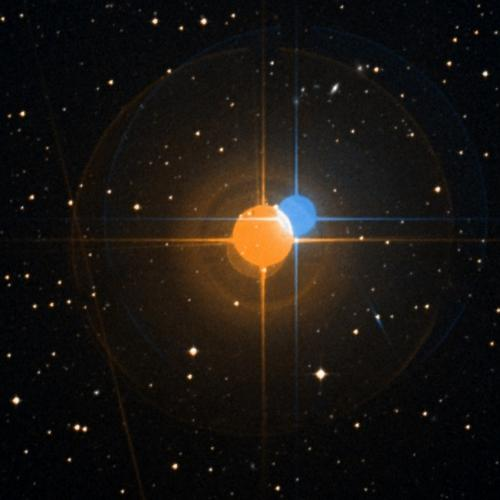
🔭 **[View in Aladin Sky Atlas (DSS2 Optical)](https://aladin.u-strasbg.fr/AladinLite/?target=330.8400+-56.7867&fov=0.5&survey=P/DSS2/color)**
*Multi-wavelength: [DSS2 Optical](https://aladin.u-strasbg.fr/AladinLite/?target=330.8400+-56.7867&fov=0.5&survey=P/DSS2/color) · [2MASS NIR](https://aladin.u-strasbg.fr/AladinLite/?target=330.8400+-56.7867&fov=0.5&survey=P/2MASS/color)*

- **Position:** RA=330.8400°, Dec=-56.7867°
- **Frequency:** 6672.54 MHz
- **SNR:** 1.3
- **Bandwidth:** 244.725 MHz
- **Drift rate:** -0.1323 Hz/s
- **Detection method(s):** doppler_drift

**Cross-check evidence:**

  - Exoplanet system nearby: eps Ind A b, eps Ind A b, eps Ind A b
  - Doppler drift rate 0.1323 Hz/s consistent with technological origin

### Ross 128 — Score 100/100

🔭 **[View in Aladin Sky Atlas (DSS2 Optical)](https://aladin.u-strasbg.fr/AladinLite/?target=176.9351+0.8048&fov=0.5&survey=P/DSS2/color)**
*Multi-wavelength: [DSS2 Optical](https://aladin.u-strasbg.fr/AladinLite/?target=176.9351+0.8048&fov=0.5&survey=P/DSS2/color) · [2MASS NIR](https://aladin.u-strasbg.fr/AladinLite/?target=176.9351+0.8048&fov=0.5&survey=P/2MASS/color)*

- **Position:** RA=176.9351°, Dec=0.8048°
- **Frequency:** 8709.53 MHz
- **SNR:** 2.1
- **Bandwidth:** 403.4078 MHz
- **Drift rate:** 0.0233 Hz/s
- **Detection method(s):** doppler_drift

**Cross-check evidence:**

  - Known SETI priority target: Ross 128
  - Exoplanet system nearby: Ross 128 b
  - Doppler drift rate 0.0233 Hz/s consistent with technological origin
  - Multi-channel confirmation: 2 independent data sources detect this target

### HD 136352 — Score 80/100

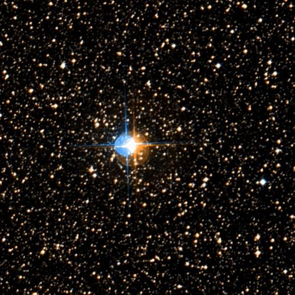
🔭 **[View in Aladin Sky Atlas (DSS2 Optical)](https://aladin.u-strasbg.fr/AladinLite/?target=230.4401+-48.3188&fov=0.5&survey=P/DSS2/color)**
*Multi-wavelength: [DSS2 Optical](https://aladin.u-strasbg.fr/AladinLite/?target=230.4401+-48.3188&fov=0.5&survey=P/DSS2/color) · [2MASS NIR](https://aladin.u-strasbg.fr/AladinLite/?target=230.4401+-48.3188&fov=0.5&survey=P/2MASS/color)*

- **Position:** RA=230.4401°, Dec=-48.3188°
- **Frequency:** 6848.62 MHz
- **SNR:** 3.0
- **Bandwidth:** 133.7777 MHz
- **Drift rate:** 0.0220 Hz/s
- **Detection method(s):** doppler_drift

**Cross-check evidence:**

  - Exoplanet system nearby: HD 136352 d, HD 136352 d, HD 136352 b
  - Doppler drift rate 0.0220 Hz/s consistent with technological origin

### HD 136352 — Score 80/100

🔭 **[View in Aladin Sky Atlas (DSS2 Optical)](https://aladin.u-strasbg.fr/AladinLite/?target=230.4401+-48.3188&fov=0.5&survey=P/DSS2/color)**
*Multi-wavelength: [DSS2 Optical](https://aladin.u-strasbg.fr/AladinLite/?target=230.4401+-48.3188&fov=0.5&survey=P/DSS2/color) · [2MASS NIR](https://aladin.u-strasbg.fr/AladinLite/?target=230.4401+-48.3188&fov=0.5&survey=P/2MASS/color)*

- **Position:** RA=230.4401°, Dec=-48.3188°
- **Frequency:** 3968.75 MHz
- **SNR:** 5.7
- **Bandwidth:** 157.8097 MHz
- **Drift rate:** -0.1189 Hz/s
- **Detection method(s):** doppler_drift

**Cross-check evidence:**

  - Exoplanet system nearby: HD 136352 d, HD 136352 d, HD 136352 b
  - Doppler drift rate 0.1189 Hz/s consistent with technological origin

### TOI-2018 — Score 80/100

🔭 **[View in Aladin Sky Atlas (DSS2 Optical)](https://aladin.u-strasbg.fr/AladinLite/?target=229.8374+29.2079&fov=0.5&survey=P/DSS2/color)**
*Multi-wavelength: [DSS2 Optical](https://aladin.u-strasbg.fr/AladinLite/?target=229.8374+29.2079&fov=0.5&survey=P/DSS2/color) · [2MASS NIR](https://aladin.u-strasbg.fr/AladinLite/?target=229.8374+29.2079&fov=0.5&survey=P/2MASS/color)*

- **Position:** RA=229.8374°, Dec=29.2079°
- **Frequency:** 5379.93 MHz
- **SNR:** 3.3
- **Bandwidth:** 296.2828 MHz
- **Drift rate:** -0.0990 Hz/s
- **Detection method(s):** doppler_drift

**Cross-check evidence:**

  - Exoplanet system nearby: TOI-2018 b, TOI-2018 b
  - Doppler drift rate 0.0990 Hz/s consistent with technological origin

### TOI-620 — Score 80/100

🔭 **[View in Aladin Sky Atlas (DSS2 Optical)](https://aladin.u-strasbg.fr/AladinLite/?target=142.1734+-12.1672&fov=0.5&survey=P/DSS2/color)**
*Multi-wavelength: [DSS2 Optical](https://aladin.u-strasbg.fr/AladinLite/?target=142.1734+-12.1672&fov=0.5&survey=P/DSS2/color) · [2MASS NIR](https://aladin.u-strasbg.fr/AladinLite/?target=142.1734+-12.1672&fov=0.5&survey=P/2MASS/color)*

- **Position:** RA=142.1734°, Dec=-12.1672°
- **Frequency:** 4338.30 MHz
- **SNR:** 4.1
- **Bandwidth:** 431.9159 MHz
- **Drift rate:** -0.0903 Hz/s
- **Detection method(s):** doppler_drift

**Cross-check evidence:**

  - Exoplanet system nearby: TOI-620 b, TOI-620 b
  - Doppler drift rate 0.0903 Hz/s consistent with technological origin

### Kepler-42 — Score 80/100

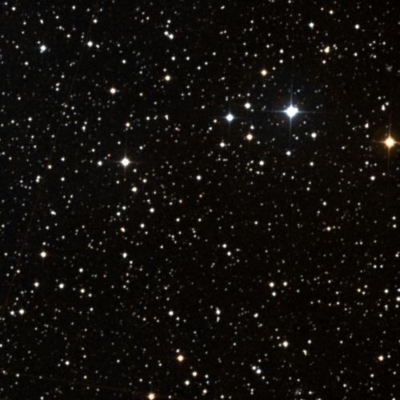
🔭 **[View in Aladin Sky Atlas (DSS2 Optical)](https://aladin.u-strasbg.fr/AladinLite/?target=292.2196+44.6174&fov=0.5&survey=P/DSS2/color)**
*Multi-wavelength: [DSS2 Optical](https://aladin.u-strasbg.fr/AladinLite/?target=292.2196+44.6174&fov=0.5&survey=P/DSS2/color) · [2MASS NIR](https://aladin.u-strasbg.fr/AladinLite/?target=292.2196+44.6174&fov=0.5&survey=P/2MASS/color)*

- **Position:** RA=292.2196°, Dec=44.6174°
- **Frequency:** 1404.20 MHz
- **SNR:** 1.4
- **Bandwidth:** 274.0388 MHz
- **Drift rate:** 0.0173 Hz/s
- **Detection method(s):** doppler_drift

**Cross-check evidence:**

  - Exoplanet system nearby: Kepler-1202 b, Kepler-42 d, Kepler-42 b
  - Doppler drift rate 0.0173 Hz/s consistent with technological origin

### TOI-544 — Score 80/100

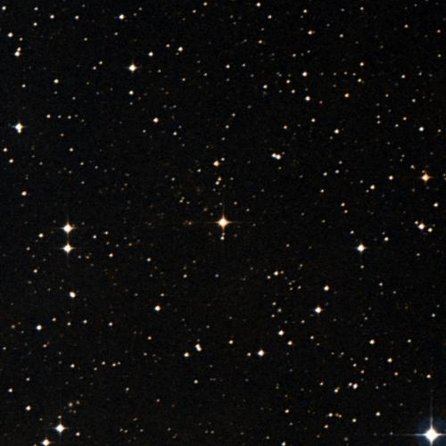
🔭 **[View in Aladin Sky Atlas (DSS2 Optical)](https://aladin.u-strasbg.fr/AladinLite/?target=82.2901+-0.3429&fov=0.5&survey=P/DSS2/color)**
*Multi-wavelength: [DSS2 Optical](https://aladin.u-strasbg.fr/AladinLite/?target=82.2901+-0.3429&fov=0.5&survey=P/DSS2/color) · [2MASS NIR](https://aladin.u-strasbg.fr/AladinLite/?target=82.2901+-0.3429&fov=0.5&survey=P/2MASS/color)*

- **Position:** RA=82.2901°, Dec=-0.3429°
- **Frequency:** 6954.95 MHz
- **SNR:** 3.4
- **Bandwidth:** 249.4631 MHz
- **Drift rate:** 0.1536 Hz/s
- **Detection method(s):** doppler_drift

**Cross-check evidence:**

  - Exoplanet system nearby: TOI-544 b, TOI-544 b, TOI-544 b
  - Doppler drift rate 0.1536 Hz/s consistent with technological origin

### TOI-3884 — Score 80/100

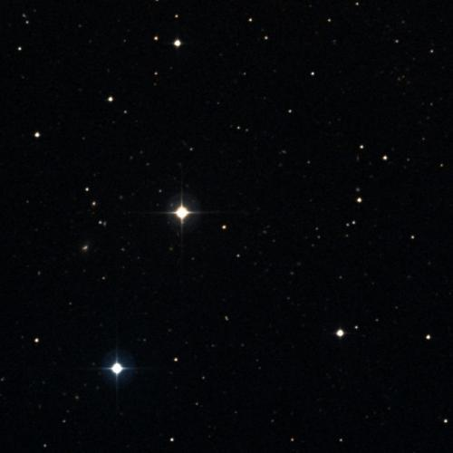
🔭 **[View in Aladin Sky Atlas (DSS2 Optical)](https://aladin.u-strasbg.fr/AladinLite/?target=181.5718+12.5070&fov=0.5&survey=P/DSS2/color)**
*Multi-wavelength: [DSS2 Optical](https://aladin.u-strasbg.fr/AladinLite/?target=181.5718+12.5070&fov=0.5&survey=P/DSS2/color) · [2MASS NIR](https://aladin.u-strasbg.fr/AladinLite/?target=181.5718+12.5070&fov=0.5&survey=P/2MASS/color)*

- **Position:** RA=181.5718°, Dec=12.5070°
- **Frequency:** 2379.56 MHz
- **SNR:** 5.6
- **Bandwidth:** 171.7073 MHz
- **Drift rate:** -0.1107 Hz/s
- **Detection method(s):** doppler_drift

**Cross-check evidence:**

  - Exoplanet system nearby: TOI-3884 b, TOI-3884 b, TOI-3884 b
  - Doppler drift rate 0.1107 Hz/s consistent with technological origin

### K2-3 — Score 80/100

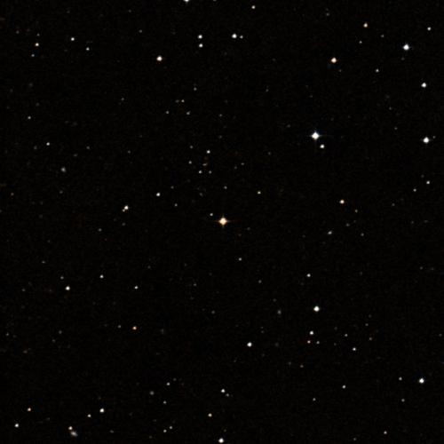
🔭 **[View in Aladin Sky Atlas (DSS2 Optical)](https://aladin.u-strasbg.fr/AladinLite/?target=172.3354+-1.4551&fov=0.5&survey=P/DSS2/color)**
*Multi-wavelength: [DSS2 Optical](https://aladin.u-strasbg.fr/AladinLite/?target=172.3354+-1.4551&fov=0.5&survey=P/DSS2/color) · [2MASS NIR](https://aladin.u-strasbg.fr/AladinLite/?target=172.3354+-1.4551&fov=0.5&survey=P/2MASS/color)*

- **Position:** RA=172.3354°, Dec=-1.4551°
- **Frequency:** 7996.64 MHz
- **SNR:** 2.7
- **Bandwidth:** 488.7306 MHz
- **Drift rate:** -0.0163 Hz/s
- **Detection method(s):** doppler_drift

**Cross-check evidence:**

  - Exoplanet system nearby: K2-3 d, K2-3 b, K2-3 c
  - Doppler drift rate 0.0163 Hz/s consistent with technological origin

### K2-3 — Score 80/100

🔭 **[View in Aladin Sky Atlas (DSS2 Optical)](https://aladin.u-strasbg.fr/AladinLite/?target=172.3354+-1.4551&fov=0.5&survey=P/DSS2/color)**
*Multi-wavelength: [DSS2 Optical](https://aladin.u-strasbg.fr/AladinLite/?target=172.3354+-1.4551&fov=0.5&survey=P/DSS2/color) · [2MASS NIR](https://aladin.u-strasbg.fr/AladinLite/?target=172.3354+-1.4551&fov=0.5&survey=P/2MASS/color)*

- **Position:** RA=172.3354°, Dec=-1.4551°
- **Frequency:** 3066.90 MHz
- **SNR:** 3.8
- **Bandwidth:** 152.7289 MHz
- **Drift rate:** -0.2050 Hz/s
- **Detection method(s):** doppler_drift

**Cross-check evidence:**

  - Exoplanet system nearby: K2-3 d, K2-3 b, K2-3 c
  - Doppler drift rate 0.2050 Hz/s consistent with technological origin

### K2-3 — Score 80/100

🔭 **[View in Aladin Sky Atlas (DSS2 Optical)](https://aladin.u-strasbg.fr/AladinLite/?target=172.3354+-1.4551&fov=0.5&survey=P/DSS2/color)**
*Multi-wavelength: [DSS2 Optical](https://aladin.u-strasbg.fr/AladinLite/?target=172.3354+-1.4551&fov=0.5&survey=P/DSS2/color) · [2MASS NIR](https://aladin.u-strasbg.fr/AladinLite/?target=172.3354+-1.4551&fov=0.5&survey=P/2MASS/color)*

- **Position:** RA=172.3354°, Dec=-1.4551°
- **Frequency:** 7248.36 MHz
- **SNR:** 1.8
- **Bandwidth:** 332.4466 MHz
- **Drift rate:** -0.0334 Hz/s
- **Detection method(s):** doppler_drift

**Cross-check evidence:**

  - Exoplanet system nearby: K2-3 d, K2-3 b, K2-3 c
  - Doppler drift rate 0.0334 Hz/s consistent with technological origin

### K2-3 — Score 80/100

🔭 **[View in Aladin Sky Atlas (DSS2 Optical)](https://aladin.u-strasbg.fr/AladinLite/?target=172.3354+-1.4551&fov=0.5&survey=P/DSS2/color)**
*Multi-wavelength: [DSS2 Optical](https://aladin.u-strasbg.fr/AladinLite/?target=172.3354+-1.4551&fov=0.5&survey=P/DSS2/color) · [2MASS NIR](https://aladin.u-strasbg.fr/AladinLite/?target=172.3354+-1.4551&fov=0.5&survey=P/2MASS/color)*

- **Position:** RA=172.3354°, Dec=-1.4551°
- **Frequency:** 7650.86 MHz
- **SNR:** 2.1
- **Bandwidth:** 152.4231 MHz
- **Drift rate:** -0.0328 Hz/s
- **Detection method(s):** doppler_drift

**Cross-check evidence:**

  - Exoplanet system nearby: K2-3 d, K2-3 b, K2-3 c
  - Doppler drift rate 0.0328 Hz/s consistent with technological origin

### Wolf 503 — Score 80/100

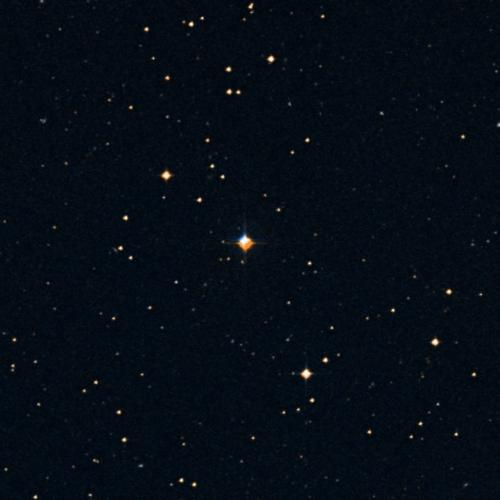
🔭 **[View in Aladin Sky Atlas (DSS2 Optical)](https://aladin.u-strasbg.fr/AladinLite/?target=206.8462+-6.1393&fov=0.5&survey=P/DSS2/color)**
*Multi-wavelength: [DSS2 Optical](https://aladin.u-strasbg.fr/AladinLite/?target=206.8462+-6.1393&fov=0.5&survey=P/DSS2/color) · [2MASS NIR](https://aladin.u-strasbg.fr/AladinLite/?target=206.8462+-6.1393&fov=0.5&survey=P/2MASS/color)*

- **Position:** RA=206.8462°, Dec=-6.1393°
- **Frequency:** 6965.78 MHz
- **SNR:** 2.5
- **Bandwidth:** 482.2493 MHz
- **Drift rate:** -0.0696 Hz/s
- **Detection method(s):** doppler_drift

**Cross-check evidence:**

  - Exoplanet system nearby: Wolf 503 b, Wolf 503 b, Wolf 503 b
  - Doppler drift rate 0.0696 Hz/s consistent with technological origin

### TOI-674 — Score 80/100

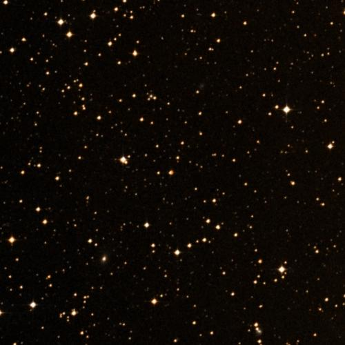
🔭 **[View in Aladin Sky Atlas (DSS2 Optical)](https://aladin.u-strasbg.fr/AladinLite/?target=164.5866+-36.8581&fov=0.5&survey=P/DSS2/color)**
*Multi-wavelength: [DSS2 Optical](https://aladin.u-strasbg.fr/AladinLite/?target=164.5866+-36.8581&fov=0.5&survey=P/DSS2/color) · [2MASS NIR](https://aladin.u-strasbg.fr/AladinLite/?target=164.5866+-36.8581&fov=0.5&survey=P/2MASS/color)*

- **Position:** RA=164.5866°, Dec=-36.8581°
- **Frequency:** 4772.03 MHz
- **SNR:** 6.9
- **Bandwidth:** 486.4928 MHz
- **Drift rate:** -0.0853 Hz/s
- **Detection method(s):** doppler_drift

**Cross-check evidence:**

  - Exoplanet system nearby: TOI-674 b, TOI-674 b, TOI-674 b
  - Doppler drift rate 0.0853 Hz/s consistent with technological origin

### TOI-757 — Score 80/100

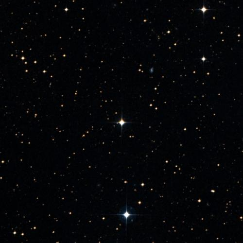
🔭 **[View in Aladin Sky Atlas (DSS2 Optical)](https://aladin.u-strasbg.fr/AladinLite/?target=187.9948+-35.5545&fov=0.5&survey=P/DSS2/color)**
*Multi-wavelength: [DSS2 Optical](https://aladin.u-strasbg.fr/AladinLite/?target=187.9948+-35.5545&fov=0.5&survey=P/DSS2/color) · [2MASS NIR](https://aladin.u-strasbg.fr/AladinLite/?target=187.9948+-35.5545&fov=0.5&survey=P/2MASS/color)*

- **Position:** RA=187.9948°, Dec=-35.5545°
- **Frequency:** 5206.43 MHz
- **SNR:** 3.2
- **Bandwidth:** 413.9054 MHz
- **Drift rate:** 0.1206 Hz/s
- **Detection method(s):** doppler_drift

**Cross-check evidence:**

  - Exoplanet system nearby: TOI-757 b, TOI-757 b
  - Doppler drift rate 0.1206 Hz/s consistent with technological origin

### TOI-757 — Score 80/100

🔭 **[View in Aladin Sky Atlas (DSS2 Optical)](https://aladin.u-strasbg.fr/AladinLite/?target=187.9948+-35.5545&fov=0.5&survey=P/DSS2/color)**
*Multi-wavelength: [DSS2 Optical](https://aladin.u-strasbg.fr/AladinLite/?target=187.9948+-35.5545&fov=0.5&survey=P/DSS2/color) · [2MASS NIR](https://aladin.u-strasbg.fr/AladinLite/?target=187.9948+-35.5545&fov=0.5&survey=P/2MASS/color)*

- **Position:** RA=187.9948°, Dec=-35.5545°
- **Frequency:** 8809.65 MHz
- **SNR:** 2.1
- **Bandwidth:** 341.2429 MHz
- **Drift rate:** -0.0877 Hz/s
- **Detection method(s):** doppler_drift

**Cross-check evidence:**

  - Exoplanet system nearby: TOI-757 b, TOI-757 b
  - Doppler drift rate 0.0877 Hz/s consistent with technological origin

### Kepler-37 — Score 80/100

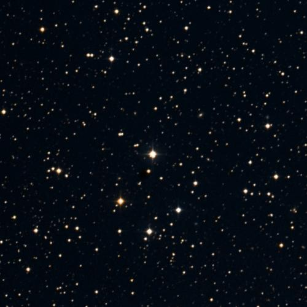
🔭 **[View in Aladin Sky Atlas (DSS2 Optical)](https://aladin.u-strasbg.fr/AladinLite/?target=284.0593+44.5184&fov=0.5&survey=P/DSS2/color)**
*Multi-wavelength: [DSS2 Optical](https://aladin.u-strasbg.fr/AladinLite/?target=284.0593+44.5184&fov=0.5&survey=P/DSS2/color) · [2MASS NIR](https://aladin.u-strasbg.fr/AladinLite/?target=284.0593+44.5184&fov=0.5&survey=P/2MASS/color)*

- **Position:** RA=284.0593°, Dec=44.5184°
- **Frequency:** 8807.42 MHz
- **SNR:** 7.9
- **Bandwidth:** 281.5588 MHz
- **Drift rate:** -0.1287 Hz/s
- **Detection method(s):** doppler_drift

**Cross-check evidence:**

  - Exoplanet system nearby: Kepler-37 c, Kepler-37 c, Kepler-37 d
  - Doppler drift rate 0.1287 Hz/s consistent with technological origin

### Kepler-138 — Score 80/100

🔭 **[View in Aladin Sky Atlas (DSS2 Optical)](https://aladin.u-strasbg.fr/AladinLite/?target=290.3814+43.2931&fov=0.5&survey=P/DSS2/color)**
*Multi-wavelength: [DSS2 Optical](https://aladin.u-strasbg.fr/AladinLite/?target=290.3814+43.2931&fov=0.5&survey=P/DSS2/color) · [2MASS NIR](https://aladin.u-strasbg.fr/AladinLite/?target=290.3814+43.2931&fov=0.5&survey=P/2MASS/color)*

- **Position:** RA=290.3814°, Dec=43.2931°
- **Frequency:** 8421.98 MHz
- **SNR:** 2.4
- **Bandwidth:** 224.1339 MHz
- **Drift rate:** 0.0777 Hz/s
- **Detection method(s):** doppler_drift

**Cross-check evidence:**

  - Exoplanet system nearby: Kepler-716 c, Kepler-138 c, Kepler-138 c
  - Doppler drift rate 0.0777 Hz/s consistent with technological origin

### Kepler-138 — Score 80/100

🔭 **[View in Aladin Sky Atlas (DSS2 Optical)](https://aladin.u-strasbg.fr/AladinLite/?target=290.3814+43.2931&fov=0.5&survey=P/DSS2/color)**
*Multi-wavelength: [DSS2 Optical](https://aladin.u-strasbg.fr/AladinLite/?target=290.3814+43.2931&fov=0.5&survey=P/DSS2/color) · [2MASS NIR](https://aladin.u-strasbg.fr/AladinLite/?target=290.3814+43.2931&fov=0.5&survey=P/2MASS/color)*

- **Position:** RA=290.3814°, Dec=43.2931°
- **Frequency:** 2489.79 MHz
- **SNR:** 2.5
- **Bandwidth:** 213.888 MHz
- **Drift rate:** -0.1375 Hz/s
- **Detection method(s):** doppler_drift

**Cross-check evidence:**

  - Exoplanet system nearby: Kepler-716 c, Kepler-138 c, Kepler-138 c
  - Doppler drift rate 0.1375 Hz/s consistent with technological origin

### K2-240 — Score 80/100

🔭 **[View in Aladin Sky Atlas (DSS2 Optical)](https://aladin.u-strasbg.fr/AladinLite/?target=227.8494+-17.8754&fov=0.5&survey=P/DSS2/color)**
*Multi-wavelength: [DSS2 Optical](https://aladin.u-strasbg.fr/AladinLite/?target=227.8494+-17.8754&fov=0.5&survey=P/DSS2/color) · [2MASS NIR](https://aladin.u-strasbg.fr/AladinLite/?target=227.8494+-17.8754&fov=0.5&survey=P/2MASS/color)*

- **Position:** RA=227.8494°, Dec=-17.8754°
- **Frequency:** 1498.56 MHz
- **SNR:** 2.1
- **Bandwidth:** 169.8566 MHz
- **Drift rate:** 0.0472 Hz/s
- **Detection method(s):** doppler_drift

**Cross-check evidence:**

  - Exoplanet system nearby: K2-240 b, K2-240 c
  - Doppler drift rate 0.0472 Hz/s consistent with technological origin

### TOI-6000 — Score 80/100

🔭 **[View in Aladin Sky Atlas (DSS2 Optical)](https://aladin.u-strasbg.fr/AladinLite/?target=292.6063+68.1546&fov=0.5&survey=P/DSS2/color)**
*Multi-wavelength: [DSS2 Optical](https://aladin.u-strasbg.fr/AladinLite/?target=292.6063+68.1546&fov=0.5&survey=P/DSS2/color) · [2MASS NIR](https://aladin.u-strasbg.fr/AladinLite/?target=292.6063+68.1546&fov=0.5&survey=P/2MASS/color)*

- **Position:** RA=292.6063°, Dec=68.1546°
- **Frequency:** 1391.28 MHz
- **SNR:** 11.1
- **Bandwidth:** 172.5994 MHz
- **Drift rate:** 0.2093 Hz/s
- **Detection method(s):** doppler_drift

**Cross-check evidence:**

  - Exoplanet system nearby: TOI-6000 b, TOI-6000 b
  - Doppler drift rate 0.2093 Hz/s consistent with technological origin

### K2-321 — Score 80/100

🔭 **[View in Aladin Sky Atlas (DSS2 Optical)](https://aladin.u-strasbg.fr/AladinLite/?target=156.4055+2.5139&fov=0.5&survey=P/DSS2/color)**
*Multi-wavelength: [DSS2 Optical](https://aladin.u-strasbg.fr/AladinLite/?target=156.4055+2.5139&fov=0.5&survey=P/DSS2/color) · [2MASS NIR](https://aladin.u-strasbg.fr/AladinLite/?target=156.4055+2.5139&fov=0.5&survey=P/2MASS/color)*

- **Position:** RA=156.4055°, Dec=2.5139°
- **Frequency:** 1467.66 MHz
- **SNR:** 1.1
- **Bandwidth:** 469.9367 MHz
- **Drift rate:** 0.0927 Hz/s
- **Detection method(s):** doppler_drift

**Cross-check evidence:**

  - Exoplanet system nearby: K2-321 b, K2-321 b, K2-321 b
  - Doppler drift rate 0.0927 Hz/s consistent with technological origin

### K2-321 — Score 80/100

🔭 **[View in Aladin Sky Atlas (DSS2 Optical)](https://aladin.u-strasbg.fr/AladinLite/?target=156.4055+2.5139&fov=0.5&survey=P/DSS2/color)**
*Multi-wavelength: [DSS2 Optical](https://aladin.u-strasbg.fr/AladinLite/?target=156.4055+2.5139&fov=0.5&survey=P/DSS2/color) · [2MASS NIR](https://aladin.u-strasbg.fr/AladinLite/?target=156.4055+2.5139&fov=0.5&survey=P/2MASS/color)*

- **Position:** RA=156.4055°, Dec=2.5139°
- **Frequency:** 8010.97 MHz
- **SNR:** 2.4
- **Bandwidth:** 153.8209 MHz
- **Drift rate:** 0.0153 Hz/s
- **Detection method(s):** doppler_drift

**Cross-check evidence:**

  - Exoplanet system nearby: K2-321 b, K2-321 b, K2-321 b
  - Doppler drift rate 0.0153 Hz/s consistent with technological origin

### K2-384 — Score 80/100

🔭 **[View in Aladin Sky Atlas (DSS2 Optical)](https://aladin.u-strasbg.fr/AladinLite/?target=20.4998+0.7510&fov=0.5&survey=P/DSS2/color)**
*Multi-wavelength: [DSS2 Optical](https://aladin.u-strasbg.fr/AladinLite/?target=20.4998+0.7510&fov=0.5&survey=P/DSS2/color) · [2MASS NIR](https://aladin.u-strasbg.fr/AladinLite/?target=20.4998+0.7510&fov=0.5&survey=P/2MASS/color)*

- **Position:** RA=20.4998°, Dec=0.7510°
- **Frequency:** 5165.19 MHz
- **SNR:** 3.0
- **Bandwidth:** 254.0358 MHz
- **Drift rate:** 0.0296 Hz/s
- **Detection method(s):** doppler_drift

**Cross-check evidence:**

  - Exoplanet system nearby: K2-384 d, K2-384 f, K2-384 e
  - Doppler drift rate 0.0296 Hz/s consistent with technological origin

### K2-384 — Score 80/100

🔭 **[View in Aladin Sky Atlas (DSS2 Optical)](https://aladin.u-strasbg.fr/AladinLite/?target=20.4998+0.7510&fov=0.5&survey=P/DSS2/color)**
*Multi-wavelength: [DSS2 Optical](https://aladin.u-strasbg.fr/AladinLite/?target=20.4998+0.7510&fov=0.5&survey=P/DSS2/color) · [2MASS NIR](https://aladin.u-strasbg.fr/AladinLite/?target=20.4998+0.7510&fov=0.5&survey=P/2MASS/color)*

- **Position:** RA=20.4998°, Dec=0.7510°
- **Frequency:** 5300.90 MHz
- **SNR:** 6.4
- **Bandwidth:** 266.7557 MHz
- **Drift rate:** -0.1534 Hz/s
- **Detection method(s):** doppler_drift

**Cross-check evidence:**

  - Exoplanet system nearby: K2-384 d, K2-384 f, K2-384 e
  - Doppler drift rate 0.1534 Hz/s consistent with technological origin

### K2-384 — Score 80/100

🔭 **[View in Aladin Sky Atlas (DSS2 Optical)](https://aladin.u-strasbg.fr/AladinLite/?target=20.4998+0.7510&fov=0.5&survey=P/DSS2/color)**
*Multi-wavelength: [DSS2 Optical](https://aladin.u-strasbg.fr/AladinLite/?target=20.4998+0.7510&fov=0.5&survey=P/DSS2/color) · [2MASS NIR](https://aladin.u-strasbg.fr/AladinLite/?target=20.4998+0.7510&fov=0.5&survey=P/2MASS/color)*

- **Position:** RA=20.4998°, Dec=0.7510°
- **Frequency:** 4297.53 MHz
- **SNR:** 2.6
- **Bandwidth:** 230.9982 MHz
- **Drift rate:** -0.1053 Hz/s
- **Detection method(s):** doppler_drift

**Cross-check evidence:**

  - Exoplanet system nearby: K2-384 d, K2-384 f, K2-384 e
  - Doppler drift rate 0.1053 Hz/s consistent with technological origin

### K2-21 — Score 80/100

🔭 **[View in Aladin Sky Atlas (DSS2 Optical)](https://aladin.u-strasbg.fr/AladinLite/?target=340.3038+-14.4893&fov=0.5&survey=P/DSS2/color)**
*Multi-wavelength: [DSS2 Optical](https://aladin.u-strasbg.fr/AladinLite/?target=340.3038+-14.4893&fov=0.5&survey=P/DSS2/color) · [2MASS NIR](https://aladin.u-strasbg.fr/AladinLite/?target=340.3038+-14.4893&fov=0.5&survey=P/2MASS/color)*

- **Position:** RA=340.3038°, Dec=-14.4893°
- **Frequency:** 9539.72 MHz
- **SNR:** 6.5
- **Bandwidth:** 466.5392 MHz
- **Drift rate:** 0.1177 Hz/s
- **Detection method(s):** doppler_drift

**Cross-check evidence:**

  - Exoplanet system nearby: K2-21 c, K2-21 b, K2-21 b
  - Doppler drift rate 0.1177 Hz/s consistent with technological origin

### TOI-1136 — Score 80/100

🔭 **[View in Aladin Sky Atlas (DSS2 Optical)](https://aladin.u-strasbg.fr/AladinLite/?target=192.1849+64.8553&fov=0.5&survey=P/DSS2/color)**
*Multi-wavelength: [DSS2 Optical](https://aladin.u-strasbg.fr/AladinLite/?target=192.1849+64.8553&fov=0.5&survey=P/DSS2/color) · [2MASS NIR](https://aladin.u-strasbg.fr/AladinLite/?target=192.1849+64.8553&fov=0.5&survey=P/2MASS/color)*

- **Position:** RA=192.1849°, Dec=64.8553°
- **Frequency:** 8637.04 MHz
- **SNR:** 4.1
- **Bandwidth:** 361.0349 MHz
- **Drift rate:** -0.0297 Hz/s
- **Detection method(s):** doppler_drift

**Cross-check evidence:**

  - Exoplanet system nearby: TOI-1136 f, TOI-1136 d, TOI-1136 c
  - Doppler drift rate 0.0297 Hz/s consistent with technological origin

### TOI-4641 — Score 80/100

🔭 **[View in Aladin Sky Atlas (DSS2 Optical)](https://aladin.u-strasbg.fr/AladinLite/?target=42.5582+25.3335&fov=0.5&survey=P/DSS2/color)**
*Multi-wavelength: [DSS2 Optical](https://aladin.u-strasbg.fr/AladinLite/?target=42.5582+25.3335&fov=0.5&survey=P/DSS2/color) · [2MASS NIR](https://aladin.u-strasbg.fr/AladinLite/?target=42.5582+25.3335&fov=0.5&survey=P/2MASS/color)*

- **Position:** RA=42.5582°, Dec=25.3335°
- **Frequency:** 2188.93 MHz
- **SNR:** 4.0
- **Bandwidth:** 345.7519 MHz
- **Drift rate:** 0.1821 Hz/s
- **Detection method(s):** doppler_drift

**Cross-check evidence:**

  - Exoplanet system nearby: TOI-4641 b, TOI-4641 b
  - Doppler drift rate 0.1821 Hz/s consistent with technological origin

### TOI-1174 — Score 80/100

🔭 **[View in Aladin Sky Atlas (DSS2 Optical)](https://aladin.u-strasbg.fr/AladinLite/?target=209.2172+68.6182&fov=0.5&survey=P/DSS2/color)**
*Multi-wavelength: [DSS2 Optical](https://aladin.u-strasbg.fr/AladinLite/?target=209.2172+68.6182&fov=0.5&survey=P/DSS2/color) · [2MASS NIR](https://aladin.u-strasbg.fr/AladinLite/?target=209.2172+68.6182&fov=0.5&survey=P/2MASS/color)*

- **Position:** RA=209.2172°, Dec=68.6182°
- **Frequency:** 5429.38 MHz
- **SNR:** 2.0
- **Bandwidth:** 339.8374 MHz
- **Drift rate:** 0.0591 Hz/s
- **Detection method(s):** doppler_drift

**Cross-check evidence:**

  - Exoplanet system nearby: TOI-1174 b, TOI-1174 b, TOI-1174 b
  - Doppler drift rate 0.0591 Hz/s consistent with technological origin

### TOI-1174 — Score 80/100

🔭 **[View in Aladin Sky Atlas (DSS2 Optical)](https://aladin.u-strasbg.fr/AladinLite/?target=209.2172+68.6182&fov=0.5&survey=P/DSS2/color)**
*Multi-wavelength: [DSS2 Optical](https://aladin.u-strasbg.fr/AladinLite/?target=209.2172+68.6182&fov=0.5&survey=P/DSS2/color) · [2MASS NIR](https://aladin.u-strasbg.fr/AladinLite/?target=209.2172+68.6182&fov=0.5&survey=P/2MASS/color)*

- **Position:** RA=209.2172°, Dec=68.6182°
- **Frequency:** 1789.38 MHz
- **SNR:** 4.2
- **Bandwidth:** 363.1453 MHz
- **Drift rate:** -0.0571 Hz/s
- **Detection method(s):** doppler_drift

**Cross-check evidence:**

  - Exoplanet system nearby: TOI-1174 b, TOI-1174 b, TOI-1174 b
  - Doppler drift rate 0.0571 Hz/s consistent with technological origin

### TOI-1174 — Score 80/100

🔭 **[View in Aladin Sky Atlas (DSS2 Optical)](https://aladin.u-strasbg.fr/AladinLite/?target=209.2172+68.6182&fov=0.5&survey=P/DSS2/color)**
*Multi-wavelength: [DSS2 Optical](https://aladin.u-strasbg.fr/AladinLite/?target=209.2172+68.6182&fov=0.5&survey=P/DSS2/color) · [2MASS NIR](https://aladin.u-strasbg.fr/AladinLite/?target=209.2172+68.6182&fov=0.5&survey=P/2MASS/color)*

- **Position:** RA=209.2172°, Dec=68.6182°
- **Frequency:** 7041.08 MHz
- **SNR:** 3.1
- **Bandwidth:** 233.4551 MHz
- **Drift rate:** 0.0234 Hz/s
- **Detection method(s):** doppler_drift

**Cross-check evidence:**

  - Exoplanet system nearby: TOI-1174 b, TOI-1174 b, TOI-1174 b
  - Doppler drift rate 0.0234 Hz/s consistent with technological origin

### Kepler-93 — Score 80/100

🔭 **[View in Aladin Sky Atlas (DSS2 Optical)](https://aladin.u-strasbg.fr/AladinLite/?target=291.4181+38.6723&fov=0.5&survey=P/DSS2/color)**
*Multi-wavelength: [DSS2 Optical](https://aladin.u-strasbg.fr/AladinLite/?target=291.4181+38.6723&fov=0.5&survey=P/DSS2/color) · [2MASS NIR](https://aladin.u-strasbg.fr/AladinLite/?target=291.4181+38.6723&fov=0.5&survey=P/2MASS/color)*

- **Position:** RA=291.4181°, Dec=38.6723°
- **Frequency:** 4277.73 MHz
- **SNR:** 2.5
- **Bandwidth:** 225.776 MHz
- **Drift rate:** 0.0383 Hz/s
- **Detection method(s):** doppler_drift

**Cross-check evidence:**

  - Exoplanet system nearby: Kepler-93 b, Kepler-93 b, Kepler-93 b
  - Doppler drift rate 0.0383 Hz/s consistent with technological origin

### Kepler-446 — Score 80/100

🔭 **[View in Aladin Sky Atlas (DSS2 Optical)](https://aladin.u-strasbg.fr/AladinLite/?target=282.2501+44.9210&fov=0.5&survey=P/DSS2/color)**
*Multi-wavelength: [DSS2 Optical](https://aladin.u-strasbg.fr/AladinLite/?target=282.2501+44.9210&fov=0.5&survey=P/DSS2/color) · [2MASS NIR](https://aladin.u-strasbg.fr/AladinLite/?target=282.2501+44.9210&fov=0.5&survey=P/2MASS/color)*

- **Position:** RA=282.2501°, Dec=44.9210°
- **Frequency:** 4941.14 MHz
- **SNR:** 5.7
- **Bandwidth:** 253.3279 MHz
- **Drift rate:** -0.0744 Hz/s
- **Detection method(s):** doppler_drift

**Cross-check evidence:**

  - Exoplanet system nearby: Kepler-446 d, Kepler-446 c, Kepler-446 d
  - Doppler drift rate 0.0744 Hz/s consistent with technological origin

### Kepler-446 — Score 80/100

🔭 **[View in Aladin Sky Atlas (DSS2 Optical)](https://aladin.u-strasbg.fr/AladinLite/?target=282.2501+44.9210&fov=0.5&survey=P/DSS2/color)**
*Multi-wavelength: [DSS2 Optical](https://aladin.u-strasbg.fr/AladinLite/?target=282.2501+44.9210&fov=0.5&survey=P/DSS2/color) · [2MASS NIR](https://aladin.u-strasbg.fr/AladinLite/?target=282.2501+44.9210&fov=0.5&survey=P/2MASS/color)*

- **Position:** RA=282.2501°, Dec=44.9210°
- **Frequency:** 8022.71 MHz
- **SNR:** 2.7
- **Bandwidth:** 291.7478 MHz
- **Drift rate:** 0.1329 Hz/s
- **Detection method(s):** doppler_drift

**Cross-check evidence:**

  - Exoplanet system nearby: Kepler-446 d, Kepler-446 c, Kepler-446 d
  - Doppler drift rate 0.1329 Hz/s consistent with technological origin

### Kepler-446 — Score 80/100

🔭 **[View in Aladin Sky Atlas (DSS2 Optical)](https://aladin.u-strasbg.fr/AladinLite/?target=282.2501+44.9210&fov=0.5&survey=P/DSS2/color)**
*Multi-wavelength: [DSS2 Optical](https://aladin.u-strasbg.fr/AladinLite/?target=282.2501+44.9210&fov=0.5&survey=P/DSS2/color) · [2MASS NIR](https://aladin.u-strasbg.fr/AladinLite/?target=282.2501+44.9210&fov=0.5&survey=P/2MASS/color)*

- **Position:** RA=282.2501°, Dec=44.9210°
- **Frequency:** 7459.84 MHz
- **SNR:** 3.6
- **Bandwidth:** 480.4779 MHz
- **Drift rate:** 0.2328 Hz/s
- **Detection method(s):** doppler_drift

**Cross-check evidence:**

  - Exoplanet system nearby: Kepler-446 d, Kepler-446 c, Kepler-446 d
  - Doppler drift rate 0.2328 Hz/s consistent with technological origin

### Kepler-446 — Score 80/100

🔭 **[View in Aladin Sky Atlas (DSS2 Optical)](https://aladin.u-strasbg.fr/AladinLite/?target=282.2501+44.9210&fov=0.5&survey=P/DSS2/color)**
*Multi-wavelength: [DSS2 Optical](https://aladin.u-strasbg.fr/AladinLite/?target=282.2501+44.9210&fov=0.5&survey=P/DSS2/color) · [2MASS NIR](https://aladin.u-strasbg.fr/AladinLite/?target=282.2501+44.9210&fov=0.5&survey=P/2MASS/color)*

- **Position:** RA=282.2501°, Dec=44.9210°
- **Frequency:** 2097.30 MHz
- **SNR:** 2.2
- **Bandwidth:** 335.3032 MHz
- **Drift rate:** 0.0108 Hz/s
- **Detection method(s):** doppler_drift

**Cross-check evidence:**

  - Exoplanet system nearby: Kepler-446 d, Kepler-446 c, Kepler-446 d
  - Doppler drift rate 0.0108 Hz/s consistent with technological origin

### Kepler-446 — Score 80/100

🔭 **[View in Aladin Sky Atlas (DSS2 Optical)](https://aladin.u-strasbg.fr/AladinLite/?target=282.2501+44.9210&fov=0.5&survey=P/DSS2/color)**
*Multi-wavelength: [DSS2 Optical](https://aladin.u-strasbg.fr/AladinLite/?target=282.2501+44.9210&fov=0.5&survey=P/DSS2/color) · [2MASS NIR](https://aladin.u-strasbg.fr/AladinLite/?target=282.2501+44.9210&fov=0.5&survey=P/2MASS/color)*

- **Position:** RA=282.2501°, Dec=44.9210°
- **Frequency:** 8428.60 MHz
- **SNR:** 1.2
- **Bandwidth:** 218.1436 MHz
- **Drift rate:** -0.0794 Hz/s
- **Detection method(s):** doppler_drift

**Cross-check evidence:**

  - Exoplanet system nearby: Kepler-446 d, Kepler-446 c, Kepler-446 d
  - Doppler drift rate 0.0794 Hz/s consistent with technological origin

### Proxima Centauri — Score 100/100

🔭 **[View in Aladin Sky Atlas (DSS2 Optical)](https://aladin.u-strasbg.fr/AladinLite/?target=217.4288+-62.6793&fov=0.5&survey=P/DSS2/color)**
*Multi-wavelength: [DSS2 Optical](https://aladin.u-strasbg.fr/AladinLite/?target=217.4288+-62.6793&fov=0.5&survey=P/DSS2/color) · [2MASS NIR](https://aladin.u-strasbg.fr/AladinLite/?target=217.4288+-62.6793&fov=0.5&survey=P/2MASS/color)*

- **Position:** RA=217.4288°, Dec=-62.6793°
- **Frequency:** 0.00 MHz
- **SNR:** 5.7
- **Bandwidth:** 0.0 MHz
- **Drift rate:** 0.0000 Hz/s
- **Detection method(s):** optical_laser_pulse

**Cross-check evidence:**

  - Known SETI priority target: Proxima Centauri
  - Exoplanet system nearby: Proxima Cen b, Proxima Cen b, Proxima Cen d
  - Ultra-narrowband signal (< 10 Hz) — unlikely natural
  - Multi-channel confirmation: 2 independent data sources detect this target

### Tau Ceti — Score 100/100

🔭 **[View in Aladin Sky Atlas (DSS2 Optical)](https://aladin.u-strasbg.fr/AladinLite/?target=26.0170+-15.9375&fov=0.5&survey=P/DSS2/color)**
*Multi-wavelength: [DSS2 Optical](https://aladin.u-strasbg.fr/AladinLite/?target=26.0170+-15.9375&fov=0.5&survey=P/DSS2/color) · [2MASS NIR](https://aladin.u-strasbg.fr/AladinLite/?target=26.0170+-15.9375&fov=0.5&survey=P/2MASS/color)*

- **Position:** RA=26.0170°, Dec=-15.9375°
- **Frequency:** 0.00 MHz
- **SNR:** 24.7
- **Bandwidth:** 0.0 MHz
- **Drift rate:** 0.0000 Hz/s
- **Detection method(s):** optical_laser_pulse

**Cross-check evidence:**

  - Known SETI priority target: Tau Ceti
  - Exoplanet system nearby: tau Cet g, tau Cet h, tau Cet f
  - Ultra-narrowband signal (< 10 Hz) — unlikely natural
  - High SNR: 24.7
  - Multi-channel confirmation: 2 independent data sources detect this target

### Epsilon Eridani — Score 100/100

🔭 **[View in Aladin Sky Atlas (DSS2 Optical)](https://aladin.u-strasbg.fr/AladinLite/?target=53.2327+-9.4582&fov=0.5&survey=P/DSS2/color)**
*Multi-wavelength: [DSS2 Optical](https://aladin.u-strasbg.fr/AladinLite/?target=53.2327+-9.4582&fov=0.5&survey=P/DSS2/color) · [2MASS NIR](https://aladin.u-strasbg.fr/AladinLite/?target=53.2327+-9.4582&fov=0.5&survey=P/2MASS/color)*

- **Position:** RA=53.2327°, Dec=-9.4582°
- **Frequency:** 0.00 MHz
- **SNR:** 41.2
- **Bandwidth:** 0.0 MHz
- **Drift rate:** 0.0000 Hz/s
- **Detection method(s):** optical_laser_pulse

**Cross-check evidence:**

  - Known SETI priority target: Epsilon Eridani
  - Exoplanet system nearby: eps Eri b, eps Eri b, eps Eri b
  - Ultra-narrowband signal (< 10 Hz) — unlikely natural
  - High SNR: 41.2
  - Multi-channel confirmation: 2 independent data sources detect this target

### Vega — Score 80/100

🔭 **[View in Aladin Sky Atlas (DSS2 Optical)](https://aladin.u-strasbg.fr/AladinLite/?target=279.2347+38.7837&fov=0.5&survey=P/DSS2/color)**
*Multi-wavelength: [DSS2 Optical](https://aladin.u-strasbg.fr/AladinLite/?target=279.2347+38.7837&fov=0.5&survey=P/DSS2/color) · [GALEX UV](https://aladin.u-strasbg.fr/AladinLite/?target=279.2347+38.7837&fov=0.5&survey=P/GALEX/color)*

- **Position:** RA=279.2347°, Dec=38.7837°
- **Frequency:** 0.00 MHz
- **SNR:** 6.2
- **Bandwidth:** 0.0 MHz
- **Drift rate:** 0.0000 Hz/s
- **Detection method(s):** optical_laser_pulse

**Cross-check evidence:**

  - Ultra-narrowband signal (< 10 Hz) — unlikely natural
  - Multi-channel confirmation: 2 independent data sources detect this target

### 61 Cygni A — Score 95/100

🔭 **[View in Aladin Sky Atlas (DSS2 Optical)](https://aladin.u-strasbg.fr/AladinLite/?target=316.7282+38.7488&fov=0.5&survey=P/DSS2/color)**
*Multi-wavelength: [DSS2 Optical](https://aladin.u-strasbg.fr/AladinLite/?target=316.7282+38.7488&fov=0.5&survey=P/DSS2/color) · [GALEX UV](https://aladin.u-strasbg.fr/AladinLite/?target=316.7282+38.7488&fov=0.5&survey=P/GALEX/color)*

- **Position:** RA=316.7282°, Dec=38.7488°
- **Frequency:** 0.00 MHz
- **SNR:** 5.5
- **Bandwidth:** 0.0 MHz
- **Drift rate:** 0.0000 Hz/s
- **Detection method(s):** optical_laser_pulse

**Cross-check evidence:**

  - Known SETI priority target: 61 Cygni A
  - Ultra-narrowband signal (< 10 Hz) — unlikely natural
  - Multi-channel confirmation: 2 independent data sources detect this target

### Ross 128 — Score 100/100

🔭 **[View in Aladin Sky Atlas (DSS2 Optical)](https://aladin.u-strasbg.fr/AladinLite/?target=176.9351+0.8048&fov=0.5&survey=P/DSS2/color)**
*Multi-wavelength: [DSS2 Optical](https://aladin.u-strasbg.fr/AladinLite/?target=176.9351+0.8048&fov=0.5&survey=P/DSS2/color) · [2MASS NIR](https://aladin.u-strasbg.fr/AladinLite/?target=176.9351+0.8048&fov=0.5&survey=P/2MASS/color)*

- **Position:** RA=176.9351°, Dec=0.8048°
- **Frequency:** 0.00 MHz
- **SNR:** 6.1
- **Bandwidth:** 0.0 MHz
- **Drift rate:** 0.0000 Hz/s
- **Detection method(s):** optical_laser_pulse

**Cross-check evidence:**

  - Known SETI priority target: Ross 128
  - Exoplanet system nearby: Ross 128 b
  - Ultra-narrowband signal (< 10 Hz) — unlikely natural
  - Multi-channel confirmation: 2 independent data sources detect this target

### TOI-700 — Score 75/100

🔭 **[View in Aladin Sky Atlas (2MASS NIR)](https://aladin.u-strasbg.fr/AladinLite/?target=35.1611+-56.7867&fov=0.5&survey=P/2MASS/color)**
*Multi-wavelength: [2MASS NIR](https://aladin.u-strasbg.fr/AladinLite/?target=35.1611+-56.7867&fov=0.5&survey=P/2MASS/color) · [DSS2 Optical](https://aladin.u-strasbg.fr/AladinLite/?target=35.1611+-56.7867&fov=0.5&survey=P/DSS2/color)*

- **Position:** RA=35.1611°, Dec=-56.7867°
- **Frequency:** 0.00 MHz
- **SNR:** 10.0
- **Bandwidth:** 0.0 MHz
- **Drift rate:** 0.0000 Hz/s
- **Detection method(s):** lightcurve_anomaly

**Cross-check evidence:**

  - Ultra-narrowband signal (< 10 Hz) — unlikely natural
  - Multi-channel confirmation: 2 independent data sources detect this target

### LHS 1140b — Score 75/100

🔭 **[View in Aladin Sky Atlas (2MASS NIR)](https://aladin.u-strasbg.fr/AladinLite/?target=18.0018+-15.2670&fov=0.5&survey=P/2MASS/color)**
*Multi-wavelength: [2MASS NIR](https://aladin.u-strasbg.fr/AladinLite/?target=18.0018+-15.2670&fov=0.5&survey=P/2MASS/color) · [WISE 22µm](https://aladin.u-strasbg.fr/AladinLite/?target=18.0018+-15.2670&fov=0.5&survey=P/WISE/W4)*

- **Position:** RA=18.0018°, Dec=-15.2670°
- **Frequency:** 0.00 MHz
- **SNR:** 3.0
- **Bandwidth:** 0.0 MHz
- **Drift rate:** 0.0000 Hz/s
- **Detection method(s):** atmospheric_biosignature

**Cross-check evidence:**

  - Ultra-narrowband signal (< 10 Hz) — unlikely natural

### HD 209458b — Score 90/100

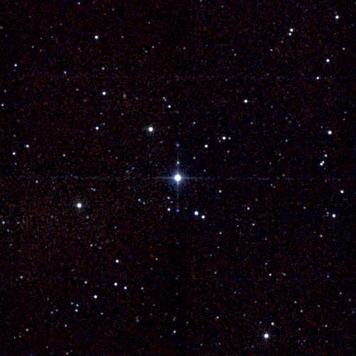
🔭 **[View in Aladin Sky Atlas (2MASS NIR)](https://aladin.u-strasbg.fr/AladinLite/?target=330.7950+18.8840&fov=0.5&survey=P/2MASS/color)**
*Multi-wavelength: [2MASS NIR](https://aladin.u-strasbg.fr/AladinLite/?target=330.7950+18.8840&fov=0.5&survey=P/2MASS/color) · [WISE 22µm](https://aladin.u-strasbg.fr/AladinLite/?target=330.7950+18.8840&fov=0.5&survey=P/WISE/W4)*

- **Position:** RA=330.7950°, Dec=18.8840°
- **Frequency:** 0.00 MHz
- **SNR:** 2.5
- **Bandwidth:** 0.0 MHz
- **Drift rate:** 0.0000 Hz/s
- **Detection method(s):** atmospheric_biosignature

**Cross-check evidence:**

  - Exoplanet system nearby: HD 209458 b, HD 209458 b, HD 209458 b
  - Ultra-narrowband signal (< 10 Hz) — unlikely natural

### TOI-SIM-0001 — Score 75/100

🔭 **[View in Aladin Sky Atlas (2MASS NIR)](https://aladin.u-strasbg.fr/AladinLite/?target=77.3791+-13.7011&fov=0.5&survey=P/2MASS/color)**
*Multi-wavelength: [2MASS NIR](https://aladin.u-strasbg.fr/AladinLite/?target=77.3791+-13.7011&fov=0.5&survey=P/2MASS/color) · [WISE 22µm](https://aladin.u-strasbg.fr/AladinLite/?target=77.3791+-13.7011&fov=0.5&survey=P/WISE/W4)*

- **Position:** RA=77.3791°, Dec=-13.7011°
- **Frequency:** 0.00 MHz
- **SNR:** 3.0
- **Bandwidth:** 0.0 MHz
- **Drift rate:** 0.0000 Hz/s
- **Detection method(s):** atmospheric_biosignature

**Cross-check evidence:**

  - Ultra-narrowband signal (< 10 Hz) — unlikely natural

### 1I/ʻOumuamua — Score 75/100

🔭 **[View in Aladin Sky Atlas (DSS2 Optical)](https://aladin.u-strasbg.fr/AladinLite/?target=23.4578+26.8011&fov=0.5&survey=P/DSS2/color)**
*Multi-wavelength: [DSS2 Optical](https://aladin.u-strasbg.fr/AladinLite/?target=23.4578+26.8011&fov=0.5&survey=P/DSS2/color) · [2MASS NIR](https://aladin.u-strasbg.fr/AladinLite/?target=23.4578+26.8011&fov=0.5&survey=P/2MASS/color)*

- **Position:** RA=23.4578°, Dec=26.8011°
- **Frequency:** 0.00 MHz
- **SNR:** 0.0
- **Bandwidth:** 0.0 MHz
- **Drift rate:** 0.0000 Hz/s
- **Detection method(s):** interstellar_trajectory

**Cross-check evidence:**

  - Ultra-narrowband signal (< 10 Hz) — unlikely natural

### SIM_ISO_0001 — Score 75/100

🔭 **[View in Aladin Sky Atlas (DSS2 Optical)](https://aladin.u-strasbg.fr/AladinLite/?target=65.5670+50.5077&fov=0.5&survey=P/DSS2/color)**
*Multi-wavelength: [DSS2 Optical](https://aladin.u-strasbg.fr/AladinLite/?target=65.5670+50.5077&fov=0.5&survey=P/DSS2/color) · [2MASS NIR](https://aladin.u-strasbg.fr/AladinLite/?target=65.5670+50.5077&fov=0.5&survey=P/2MASS/color)*

- **Position:** RA=65.5670°, Dec=50.5077°
- **Frequency:** 0.00 MHz
- **SNR:** 0.0
- **Bandwidth:** 0.0 MHz
- **Drift rate:** 0.0000 Hz/s
- **Detection method(s):** interstellar_trajectory

**Cross-check evidence:**

  - Ultra-narrowband signal (< 10 Hz) — unlikely natural

### SIM_ISO_0002 — Score 75/100

🔭 **[View in Aladin Sky Atlas (DSS2 Optical)](https://aladin.u-strasbg.fr/AladinLite/?target=7.3274+33.9141&fov=0.5&survey=P/DSS2/color)**
*Multi-wavelength: [DSS2 Optical](https://aladin.u-strasbg.fr/AladinLite/?target=7.3274+33.9141&fov=0.5&survey=P/DSS2/color) · [2MASS NIR](https://aladin.u-strasbg.fr/AladinLite/?target=7.3274+33.9141&fov=0.5&survey=P/2MASS/color)*

- **Position:** RA=7.3274°, Dec=33.9141°
- **Frequency:** 0.00 MHz
- **SNR:** 0.0
- **Bandwidth:** 0.0 MHz
- **Drift rate:** 0.0000 Hz/s
- **Detection method(s):** interstellar_trajectory

**Cross-check evidence:**

  - Ultra-narrowband signal (< 10 Hz) — unlikely natural

### SIM_ISO_0004 — Score 75/100

🔭 **[View in Aladin Sky Atlas (DSS2 Optical)](https://aladin.u-strasbg.fr/AladinLite/?target=219.6372+2.1438&fov=0.5&survey=P/DSS2/color)**
*Multi-wavelength: [DSS2 Optical](https://aladin.u-strasbg.fr/AladinLite/?target=219.6372+2.1438&fov=0.5&survey=P/DSS2/color) · [2MASS NIR](https://aladin.u-strasbg.fr/AladinLite/?target=219.6372+2.1438&fov=0.5&survey=P/2MASS/color)*

- **Position:** RA=219.6372°, Dec=2.1438°
- **Frequency:** 0.00 MHz
- **SNR:** 0.0
- **Bandwidth:** 0.0 MHz
- **Drift rate:** 0.0000 Hz/s
- **Detection method(s):** interstellar_trajectory

**Cross-check evidence:**

  - Ultra-narrowband signal (< 10 Hz) — unlikely natural

## Tier 2 — Moderate Interest

### TOI-2018 — Score 60/100

🔭 **[View in Aladin Sky Atlas (DSS2 Optical)](https://aladin.u-strasbg.fr/AladinLite/?target=229.8374+29.2079&fov=0.5&survey=P/DSS2/color)**
*Multi-wavelength: [DSS2 Optical](https://aladin.u-strasbg.fr/AladinLite/?target=229.8374+29.2079&fov=0.5&survey=P/DSS2/color) · [2MASS NIR](https://aladin.u-strasbg.fr/AladinLite/?target=229.8374+29.2079&fov=0.5&survey=P/2MASS/color)*

- **Position:** RA=229.8374°, Dec=29.2079°
- **Frequency:** 1205.23 MHz
- **SNR:** 24.9
- **Bandwidth:** 483.4237 MHz
- **Drift rate:** 1.3476 Hz/s
- **Detection method(s):** zscore

**Cross-check evidence:**

  - Frequency in known RFI band: DME/TACAN aeronautical navigation
  - Exoplanet system nearby: TOI-2018 b, TOI-2018 b
  - Doppler drift rate 1.3476 Hz/s consistent with technological origin
  - High SNR: 24.9

### HD 40307 — Score 65/100

🔭 **[View in Aladin Sky Atlas (DSS2 Optical)](https://aladin.u-strasbg.fr/AladinLite/?target=89.3360+-60.0161&fov=0.5&survey=P/DSS2/color)**
*Multi-wavelength: [DSS2 Optical](https://aladin.u-strasbg.fr/AladinLite/?target=89.3360+-60.0161&fov=0.5&survey=P/DSS2/color) · [2MASS NIR](https://aladin.u-strasbg.fr/AladinLite/?target=89.3360+-60.0161&fov=0.5&survey=P/2MASS/color)*

- **Position:** RA=89.3360°, Dec=-60.0161°
- **Frequency:** 7346.49 MHz
- **SNR:** 2.1
- **Bandwidth:** 412.2916 MHz
- **Drift rate:** -0.0639 Hz/s
- **Detection method(s):** doppler_drift

**Cross-check evidence:**

  - Doppler drift rate 0.0639 Hz/s consistent with technological origin

### 61 Cygni A — Score 60/100

🔭 **[View in Aladin Sky Atlas (DSS2 Optical)](https://aladin.u-strasbg.fr/AladinLite/?target=316.7282+38.7488&fov=0.5&survey=P/DSS2/color)**
*Multi-wavelength: [DSS2 Optical](https://aladin.u-strasbg.fr/AladinLite/?target=316.7282+38.7488&fov=0.5&survey=P/DSS2/color) · [GALEX UV](https://aladin.u-strasbg.fr/AladinLite/?target=316.7282+38.7488&fov=0.5&survey=P/GALEX/color)*

- **Position:** RA=316.7282°, Dec=38.7488°
- **Frequency:** 6013.29 MHz
- **SNR:** 3.7
- **Bandwidth:** 413.5593 MHz
- **Drift rate:** -0.0309 Hz/s
- **Detection method(s):** doppler_drift

**Cross-check evidence:**

  - Known SETI priority target: 61 Cygni A
  - Frequency in known RFI band: C-band uplink satellite
  - Doppler drift rate 0.0309 Hz/s consistent with technological origin
  - Multi-channel confirmation: 2 independent data sources detect this target

### Epsilon Indi A — Score 50/100

🔭 **[View in Aladin Sky Atlas (DSS2 Optical)](https://aladin.u-strasbg.fr/AladinLite/?target=330.8400+-56.7867&fov=0.5&survey=P/DSS2/color)**
*Multi-wavelength: [DSS2 Optical](https://aladin.u-strasbg.fr/AladinLite/?target=330.8400+-56.7867&fov=0.5&survey=P/DSS2/color) · [2MASS NIR](https://aladin.u-strasbg.fr/AladinLite/?target=330.8400+-56.7867&fov=0.5&survey=P/2MASS/color)*

- **Position:** RA=330.8400°, Dec=-56.7867°
- **Frequency:** 1204.41 MHz
- **SNR:** 1.5
- **Bandwidth:** 136.0191 MHz
- **Drift rate:** 0.0487 Hz/s
- **Detection method(s):** doppler_drift

**Cross-check evidence:**

  - Frequency in known RFI band: DME/TACAN aeronautical navigation
  - Exoplanet system nearby: eps Ind A b, eps Ind A b, eps Ind A b
  - Doppler drift rate 0.0487 Hz/s consistent with technological origin

### Fomalhaut — Score 65/100

🔭 **[View in Aladin Sky Atlas (DSS2 Optical)](https://aladin.u-strasbg.fr/AladinLite/?target=344.4127+-29.6223&fov=0.5&survey=P/DSS2/color)**
*Multi-wavelength: [DSS2 Optical](https://aladin.u-strasbg.fr/AladinLite/?target=344.4127+-29.6223&fov=0.5&survey=P/DSS2/color) · [2MASS NIR](https://aladin.u-strasbg.fr/AladinLite/?target=344.4127+-29.6223&fov=0.5&survey=P/2MASS/color)*

- **Position:** RA=344.4127°, Dec=-29.6223°
- **Frequency:** 7297.36 MHz
- **SNR:** 5.2
- **Bandwidth:** 206.348 MHz
- **Drift rate:** -0.0356 Hz/s
- **Detection method(s):** doppler_drift

**Cross-check evidence:**

  - Doppler drift rate 0.0356 Hz/s consistent with technological origin

### Fomalhaut — Score 65/100

🔭 **[View in Aladin Sky Atlas (DSS2 Optical)](https://aladin.u-strasbg.fr/AladinLite/?target=344.4127+-29.6223&fov=0.5&survey=P/DSS2/color)**
*Multi-wavelength: [DSS2 Optical](https://aladin.u-strasbg.fr/AladinLite/?target=344.4127+-29.6223&fov=0.5&survey=P/DSS2/color) · [2MASS NIR](https://aladin.u-strasbg.fr/AladinLite/?target=344.4127+-29.6223&fov=0.5&survey=P/2MASS/color)*

- **Position:** RA=344.4127°, Dec=-29.6223°
- **Frequency:** 5044.25 MHz
- **SNR:** 1.7
- **Bandwidth:** 208.8966 MHz
- **Drift rate:** -0.0339 Hz/s
- **Detection method(s):** doppler_drift

**Cross-check evidence:**

  - Doppler drift rate 0.0339 Hz/s consistent with technological origin

### Fomalhaut — Score 65/100

🔭 **[View in Aladin Sky Atlas (DSS2 Optical)](https://aladin.u-strasbg.fr/AladinLite/?target=344.4127+-29.6223&fov=0.5&survey=P/DSS2/color)**
*Multi-wavelength: [DSS2 Optical](https://aladin.u-strasbg.fr/AladinLite/?target=344.4127+-29.6223&fov=0.5&survey=P/DSS2/color) · [2MASS NIR](https://aladin.u-strasbg.fr/AladinLite/?target=344.4127+-29.6223&fov=0.5&survey=P/2MASS/color)*

- **Position:** RA=344.4127°, Dec=-29.6223°
- **Frequency:** 5101.99 MHz
- **SNR:** 3.4
- **Bandwidth:** 180.9453 MHz
- **Drift rate:** 0.0238 Hz/s
- **Detection method(s):** doppler_drift

**Cross-check evidence:**

  - Doppler drift rate 0.0238 Hz/s consistent with technological origin

### TOI-2018 — Score 50/100

🔭 **[View in Aladin Sky Atlas (DSS2 Optical)](https://aladin.u-strasbg.fr/AladinLite/?target=229.8374+29.2079&fov=0.5&survey=P/DSS2/color)**
*Multi-wavelength: [DSS2 Optical](https://aladin.u-strasbg.fr/AladinLite/?target=229.8374+29.2079&fov=0.5&survey=P/DSS2/color) · [2MASS NIR](https://aladin.u-strasbg.fr/AladinLite/?target=229.8374+29.2079&fov=0.5&survey=P/2MASS/color)*

- **Position:** RA=229.8374°, Dec=29.2079°
- **Frequency:** 9326.08 MHz
- **SNR:** 1.4
- **Bandwidth:** 332.4245 MHz
- **Drift rate:** 0.0635 Hz/s
- **Detection method(s):** doppler_drift

**Cross-check evidence:**

  - Frequency in known RFI band: X-band marine/aviation radar
  - Exoplanet system nearby: TOI-2018 b, TOI-2018 b
  - Doppler drift rate 0.0635 Hz/s consistent with technological origin

### TOI-2427 — Score 50/100

🔭 **[View in Aladin Sky Atlas (DSS2 Optical)](https://aladin.u-strasbg.fr/AladinLite/?target=52.2917+-31.3629&fov=0.5&survey=P/DSS2/color)**
*Multi-wavelength: [DSS2 Optical](https://aladin.u-strasbg.fr/AladinLite/?target=52.2917+-31.3629&fov=0.5&survey=P/DSS2/color) · [2MASS NIR](https://aladin.u-strasbg.fr/AladinLite/?target=52.2917+-31.3629&fov=0.5&survey=P/2MASS/color)*

- **Position:** RA=52.2917°, Dec=-31.3629°
- **Frequency:** 3402.78 MHz
- **SNR:** 2.2
- **Bandwidth:** 232.6276 MHz
- **Drift rate:** -0.0612 Hz/s
- **Detection method(s):** doppler_drift

**Cross-check evidence:**

  - Frequency in known RFI band: C-band downlink satellite
  - Exoplanet system nearby: TOI-2427 b, TOI-2427 b
  - Doppler drift rate 0.0612 Hz/s consistent with technological origin

### TOI-2427 — Score 50/100

🔭 **[View in Aladin Sky Atlas (DSS2 Optical)](https://aladin.u-strasbg.fr/AladinLite/?target=52.2917+-31.3629&fov=0.5&survey=P/DSS2/color)**
*Multi-wavelength: [DSS2 Optical](https://aladin.u-strasbg.fr/AladinLite/?target=52.2917+-31.3629&fov=0.5&survey=P/DSS2/color) · [2MASS NIR](https://aladin.u-strasbg.fr/AladinLite/?target=52.2917+-31.3629&fov=0.5&survey=P/2MASS/color)*

- **Position:** RA=52.2917°, Dec=-31.3629°
- **Frequency:** 1194.51 MHz
- **SNR:** 2.9
- **Bandwidth:** 430.5168 MHz
- **Drift rate:** -0.0159 Hz/s
- **Detection method(s):** doppler_drift

**Cross-check evidence:**

  - Frequency in known RFI band: DME/TACAN aeronautical navigation
  - Exoplanet system nearby: TOI-2427 b, TOI-2427 b
  - Doppler drift rate 0.0159 Hz/s consistent with technological origin

### TOI-700 — Score 60/100

🔭 **[View in Aladin Sky Atlas (2MASS NIR)](https://aladin.u-strasbg.fr/AladinLite/?target=35.1611+-56.7867&fov=0.5&survey=P/2MASS/color)**
*Multi-wavelength: [2MASS NIR](https://aladin.u-strasbg.fr/AladinLite/?target=35.1611+-56.7867&fov=0.5&survey=P/2MASS/color) · [DSS2 Optical](https://aladin.u-strasbg.fr/AladinLite/?target=35.1611+-56.7867&fov=0.5&survey=P/DSS2/color)*

- **Position:** RA=97.0957°, Dec=-65.5786°
- **Frequency:** 1977.18 MHz
- **SNR:** 2.6
- **Bandwidth:** 368.896 MHz
- **Drift rate:** 0.1768 Hz/s
- **Detection method(s):** doppler_drift

**Cross-check evidence:**

  - Frequency in known RFI band: WCDMA / UMTS uplink
  - Exoplanet system nearby: TOI-700 c, TOI-700 d, TOI-700 b
  - Doppler drift rate 0.1768 Hz/s consistent with technological origin
  - Multi-channel confirmation: 2 independent data sources detect this target

### TOI-700 — Score 60/100

🔭 **[View in Aladin Sky Atlas (2MASS NIR)](https://aladin.u-strasbg.fr/AladinLite/?target=35.1611+-56.7867&fov=0.5&survey=P/2MASS/color)**
*Multi-wavelength: [2MASS NIR](https://aladin.u-strasbg.fr/AladinLite/?target=35.1611+-56.7867&fov=0.5&survey=P/2MASS/color) · [DSS2 Optical](https://aladin.u-strasbg.fr/AladinLite/?target=35.1611+-56.7867&fov=0.5&survey=P/DSS2/color)*

- **Position:** RA=97.0957°, Dec=-65.5786°
- **Frequency:** 1969.67 MHz
- **SNR:** 1.5
- **Bandwidth:** 466.4047 MHz
- **Drift rate:** -0.0965 Hz/s
- **Detection method(s):** doppler_drift

**Cross-check evidence:**

  - Frequency in known RFI band: WCDMA / UMTS uplink
  - Exoplanet system nearby: TOI-700 c, TOI-700 d, TOI-700 b
  - Doppler drift rate 0.0965 Hz/s consistent with technological origin
  - Multi-channel confirmation: 2 independent data sources detect this target

### HAT-P-11 — Score 50/100

🔭 **[View in Aladin Sky Atlas (DSS2 Optical)](https://aladin.u-strasbg.fr/AladinLite/?target=297.7102+48.0819&fov=0.5&survey=P/DSS2/color)**
*Multi-wavelength: [DSS2 Optical](https://aladin.u-strasbg.fr/AladinLite/?target=297.7102+48.0819&fov=0.5&survey=P/DSS2/color) · [2MASS NIR](https://aladin.u-strasbg.fr/AladinLite/?target=297.7102+48.0819&fov=0.5&survey=P/2MASS/color)*

- **Position:** RA=297.7102°, Dec=48.0819°
- **Frequency:** 3618.26 MHz
- **SNR:** 2.7
- **Bandwidth:** 306.0229 MHz
- **Drift rate:** -0.0655 Hz/s
- **Detection method(s):** doppler_drift

**Cross-check evidence:**

  - Frequency in known RFI band: C-band downlink satellite
  - Exoplanet system nearby: HAT-P-11 b, HAT-P-11 b, HAT-P-11 b
  - Doppler drift rate 0.0655 Hz/s consistent with technological origin

### Kepler-42 — Score 50/100

🔭 **[View in Aladin Sky Atlas (DSS2 Optical)](https://aladin.u-strasbg.fr/AladinLite/?target=292.2196+44.6174&fov=0.5&survey=P/DSS2/color)**
*Multi-wavelength: [DSS2 Optical](https://aladin.u-strasbg.fr/AladinLite/?target=292.2196+44.6174&fov=0.5&survey=P/DSS2/color) · [2MASS NIR](https://aladin.u-strasbg.fr/AladinLite/?target=292.2196+44.6174&fov=0.5&survey=P/2MASS/color)*

- **Position:** RA=292.2196°, Dec=44.6174°
- **Frequency:** 9017.13 MHz
- **SNR:** 3.1
- **Bandwidth:** 457.3787 MHz
- **Drift rate:** 0.1306 Hz/s
- **Detection method(s):** doppler_drift

**Cross-check evidence:**

  - Frequency in known RFI band: X-band marine/aviation radar
  - Exoplanet system nearby: Kepler-1202 b, Kepler-42 d, Kepler-42 b
  - Doppler drift rate 0.1306 Hz/s consistent with technological origin

### TOI-3884 — Score 50/100

🔭 **[View in Aladin Sky Atlas (DSS2 Optical)](https://aladin.u-strasbg.fr/AladinLite/?target=181.5718+12.5070&fov=0.5&survey=P/DSS2/color)**
*Multi-wavelength: [DSS2 Optical](https://aladin.u-strasbg.fr/AladinLite/?target=181.5718+12.5070&fov=0.5&survey=P/DSS2/color) · [2MASS NIR](https://aladin.u-strasbg.fr/AladinLite/?target=181.5718+12.5070&fov=0.5&survey=P/2MASS/color)*

- **Position:** RA=181.5718°, Dec=12.5070°
- **Frequency:** 9431.32 MHz
- **SNR:** 6.2
- **Bandwidth:** 196.3882 MHz
- **Drift rate:** 0.1724 Hz/s
- **Detection method(s):** doppler_drift

**Cross-check evidence:**

  - Frequency in known RFI band: X-band marine/aviation radar
  - Exoplanet system nearby: TOI-3884 b, TOI-3884 b, TOI-3884 b
  - Doppler drift rate 0.1724 Hz/s consistent with technological origin

### TOI-757 — Score 50/100

🔭 **[View in Aladin Sky Atlas (DSS2 Optical)](https://aladin.u-strasbg.fr/AladinLite/?target=187.9948+-35.5545&fov=0.5&survey=P/DSS2/color)**
*Multi-wavelength: [DSS2 Optical](https://aladin.u-strasbg.fr/AladinLite/?target=187.9948+-35.5545&fov=0.5&survey=P/DSS2/color) · [2MASS NIR](https://aladin.u-strasbg.fr/AladinLite/?target=187.9948+-35.5545&fov=0.5&survey=P/2MASS/color)*

- **Position:** RA=187.9948°, Dec=-35.5545°
- **Frequency:** 8171.35 MHz
- **SNR:** 2.5
- **Bandwidth:** 193.0563 MHz
- **Drift rate:** -0.1062 Hz/s
- **Detection method(s):** doppler_drift

**Cross-check evidence:**

  - Frequency in known RFI band: X-band satellite TT&C
  - Exoplanet system nearby: TOI-757 b, TOI-757 b
  - Doppler drift rate 0.1062 Hz/s consistent with technological origin

### Kepler-37 — Score 50/100

🔭 **[View in Aladin Sky Atlas (DSS2 Optical)](https://aladin.u-strasbg.fr/AladinLite/?target=284.0593+44.5184&fov=0.5&survey=P/DSS2/color)**
*Multi-wavelength: [DSS2 Optical](https://aladin.u-strasbg.fr/AladinLite/?target=284.0593+44.5184&fov=0.5&survey=P/DSS2/color) · [2MASS NIR](https://aladin.u-strasbg.fr/AladinLite/?target=284.0593+44.5184&fov=0.5&survey=P/2MASS/color)*

- **Position:** RA=284.0593°, Dec=44.5184°
- **Frequency:** 8349.12 MHz
- **SNR:** 1.5
- **Bandwidth:** 142.1112 MHz
- **Drift rate:** -0.0368 Hz/s
- **Detection method(s):** doppler_drift

**Cross-check evidence:**

  - Frequency in known RFI band: X-band satellite TT&C
  - Exoplanet system nearby: Kepler-37 c, Kepler-37 c, Kepler-37 d
  - Doppler drift rate 0.0368 Hz/s consistent with technological origin

### TOI-6000 — Score 50/100

🔭 **[View in Aladin Sky Atlas (DSS2 Optical)](https://aladin.u-strasbg.fr/AladinLite/?target=292.6063+68.1546&fov=0.5&survey=P/DSS2/color)**
*Multi-wavelength: [DSS2 Optical](https://aladin.u-strasbg.fr/AladinLite/?target=292.6063+68.1546&fov=0.5&survey=P/DSS2/color) · [2MASS NIR](https://aladin.u-strasbg.fr/AladinLite/?target=292.6063+68.1546&fov=0.5&survey=P/2MASS/color)*

- **Position:** RA=292.6063°, Dec=68.1546°
- **Frequency:** 6141.09 MHz
- **SNR:** 1.9
- **Bandwidth:** 266.505 MHz
- **Drift rate:** -0.1112 Hz/s
- **Detection method(s):** doppler_drift

**Cross-check evidence:**

  - Frequency in known RFI band: C-band uplink satellite
  - Exoplanet system nearby: TOI-6000 b, TOI-6000 b
  - Doppler drift rate 0.1112 Hz/s consistent with technological origin

### TOI-1136 — Score 50/100

🔭 **[View in Aladin Sky Atlas (DSS2 Optical)](https://aladin.u-strasbg.fr/AladinLite/?target=192.1849+64.8553&fov=0.5&survey=P/DSS2/color)**
*Multi-wavelength: [DSS2 Optical](https://aladin.u-strasbg.fr/AladinLite/?target=192.1849+64.8553&fov=0.5&survey=P/DSS2/color) · [2MASS NIR](https://aladin.u-strasbg.fr/AladinLite/?target=192.1849+64.8553&fov=0.5&survey=P/2MASS/color)*

- **Position:** RA=192.1849°, Dec=64.8553°
- **Frequency:** 3593.40 MHz
- **SNR:** 1.5
- **Bandwidth:** 393.9573 MHz
- **Drift rate:** 0.0782 Hz/s
- **Detection method(s):** doppler_drift

**Cross-check evidence:**

  - Frequency in known RFI band: C-band downlink satellite
  - Exoplanet system nearby: TOI-1136 f, TOI-1136 d, TOI-1136 c
  - Doppler drift rate 0.0782 Hz/s consistent with technological origin

### TOI-4641 — Score 50/100

🔭 **[View in Aladin Sky Atlas (DSS2 Optical)](https://aladin.u-strasbg.fr/AladinLite/?target=42.5582+25.3335&fov=0.5&survey=P/DSS2/color)**
*Multi-wavelength: [DSS2 Optical](https://aladin.u-strasbg.fr/AladinLite/?target=42.5582+25.3335&fov=0.5&survey=P/DSS2/color) · [2MASS NIR](https://aladin.u-strasbg.fr/AladinLite/?target=42.5582+25.3335&fov=0.5&survey=P/2MASS/color)*

- **Position:** RA=42.5582°, Dec=25.3335°
- **Frequency:** 1760.44 MHz
- **SNR:** 2.6
- **Bandwidth:** 474.3759 MHz
- **Drift rate:** -0.1172 Hz/s
- **Detection method(s):** doppler_drift

**Cross-check evidence:**

  - Frequency in known RFI band: 4G LTE 1800 MHz
  - Exoplanet system nearby: TOI-4641 b, TOI-4641 b
  - Doppler drift rate 0.1172 Hz/s consistent with technological origin

### WASP-8 — Score 50/100

🔭 **[View in Aladin Sky Atlas (DSS2 Optical)](https://aladin.u-strasbg.fr/AladinLite/?target=359.9009+-35.0313&fov=0.5&survey=P/DSS2/color)**
*Multi-wavelength: [DSS2 Optical](https://aladin.u-strasbg.fr/AladinLite/?target=359.9009+-35.0313&fov=0.5&survey=P/DSS2/color) · [2MASS NIR](https://aladin.u-strasbg.fr/AladinLite/?target=359.9009+-35.0313&fov=0.5&survey=P/2MASS/color)*

- **Position:** RA=359.9009°, Dec=-35.0313°
- **Frequency:** 6343.14 MHz
- **SNR:** 1.9
- **Bandwidth:** 413.0496 MHz
- **Drift rate:** -0.1014 Hz/s
- **Detection method(s):** doppler_drift

**Cross-check evidence:**

  - Frequency in known RFI band: C-band uplink satellite
  - Exoplanet system nearby: WASP-8 c, WASP-8 b, WASP-8 b
  - Doppler drift rate 0.1014 Hz/s consistent with technological origin

### WASP-8 — Score 50/100

🔭 **[View in Aladin Sky Atlas (DSS2 Optical)](https://aladin.u-strasbg.fr/AladinLite/?target=359.9009+-35.0313&fov=0.5&survey=P/DSS2/color)**
*Multi-wavelength: [DSS2 Optical](https://aladin.u-strasbg.fr/AladinLite/?target=359.9009+-35.0313&fov=0.5&survey=P/DSS2/color) · [2MASS NIR](https://aladin.u-strasbg.fr/AladinLite/?target=359.9009+-35.0313&fov=0.5&survey=P/2MASS/color)*

- **Position:** RA=359.9009°, Dec=-35.0313°
- **Frequency:** 6310.68 MHz
- **SNR:** 3.2
- **Bandwidth:** 138.0197 MHz
- **Drift rate:** 0.1155 Hz/s
- **Detection method(s):** doppler_drift

**Cross-check evidence:**

  - Frequency in known RFI band: C-band uplink satellite
  - Exoplanet system nearby: WASP-8 c, WASP-8 b, WASP-8 b
  - Doppler drift rate 0.1155 Hz/s consistent with technological origin

### TOI-216 — Score 65/100

🔭 **[View in Aladin Sky Atlas (2MASS NIR)](https://aladin.u-strasbg.fr/AladinLite/?target=271.2716+-27.6274&fov=0.5&survey=P/2MASS/color)**
*Multi-wavelength: [2MASS NIR](https://aladin.u-strasbg.fr/AladinLite/?target=271.2716+-27.6274&fov=0.5&survey=P/2MASS/color) · [DSS2 Optical](https://aladin.u-strasbg.fr/AladinLite/?target=271.2716+-27.6274&fov=0.5&survey=P/DSS2/color)*

- **Position:** RA=271.2716°, Dec=-27.6274°
- **Frequency:** 0.00 MHz
- **SNR:** 10.0
- **Bandwidth:** 0.0 MHz
- **Drift rate:** 0.0000 Hz/s
- **Detection method(s):** lightcurve_anomaly

**Cross-check evidence:**

  - Ultra-narrowband signal (< 10 Hz) — unlikely natural

### SIM_STAR_0000 — Score 65/100

🔭 **[View in Aladin Sky Atlas (2MASS NIR)](https://aladin.u-strasbg.fr/AladinLite/?target=311.3271+42.6363&fov=0.5&survey=P/2MASS/color)**
*Multi-wavelength: [2MASS NIR](https://aladin.u-strasbg.fr/AladinLite/?target=311.3271+42.6363&fov=0.5&survey=P/2MASS/color) · [DSS2 Optical](https://aladin.u-strasbg.fr/AladinLite/?target=311.3271+42.6363&fov=0.5&survey=P/DSS2/color)*

- **Position:** RA=311.3271°, Dec=42.6363°
- **Frequency:** 0.00 MHz
- **SNR:** 10.0
- **Bandwidth:** 0.0 MHz
- **Drift rate:** 0.0000 Hz/s
- **Detection method(s):** lightcurve_anomaly

**Cross-check evidence:**

  - Ultra-narrowband signal (< 10 Hz) — unlikely natural

### SIM_STAR_0001 — Score 65/100

🔭 **[View in Aladin Sky Atlas (2MASS NIR)](https://aladin.u-strasbg.fr/AladinLite/?target=94.1207+-50.7361&fov=0.5&survey=P/2MASS/color)**
*Multi-wavelength: [2MASS NIR](https://aladin.u-strasbg.fr/AladinLite/?target=94.1207+-50.7361&fov=0.5&survey=P/2MASS/color) · [DSS2 Optical](https://aladin.u-strasbg.fr/AladinLite/?target=94.1207+-50.7361&fov=0.5&survey=P/DSS2/color)*

- **Position:** RA=94.1207°, Dec=-50.7361°
- **Frequency:** 0.00 MHz
- **SNR:** 10.0
- **Bandwidth:** 0.0 MHz
- **Drift rate:** 0.0000 Hz/s
- **Detection method(s):** lightcurve_anomaly

**Cross-check evidence:**

  - Ultra-narrowband signal (< 10 Hz) — unlikely natural

### SIM_STAR_0002 — Score 65/100

🔭 **[View in Aladin Sky Atlas (2MASS NIR)](https://aladin.u-strasbg.fr/AladinLite/?target=220.9650+-59.6843&fov=0.5&survey=P/2MASS/color)**
*Multi-wavelength: [2MASS NIR](https://aladin.u-strasbg.fr/AladinLite/?target=220.9650+-59.6843&fov=0.5&survey=P/2MASS/color) · [DSS2 Optical](https://aladin.u-strasbg.fr/AladinLite/?target=220.9650+-59.6843&fov=0.5&survey=P/DSS2/color)*

- **Position:** RA=220.9650°, Dec=-59.6843°
- **Frequency:** 0.00 MHz
- **SNR:** 10.0
- **Bandwidth:** 0.0 MHz
- **Drift rate:** 0.0000 Hz/s
- **Detection method(s):** lightcurve_anomaly

**Cross-check evidence:**

  - Ultra-narrowband signal (< 10 Hz) — unlikely natural

### SIM_STAR_0003 — Score 65/100

🔭 **[View in Aladin Sky Atlas (2MASS NIR)](https://aladin.u-strasbg.fr/AladinLite/?target=354.5293+-25.6444&fov=0.5&survey=P/2MASS/color)**
*Multi-wavelength: [2MASS NIR](https://aladin.u-strasbg.fr/AladinLite/?target=354.5293+-25.6444&fov=0.5&survey=P/2MASS/color) · [DSS2 Optical](https://aladin.u-strasbg.fr/AladinLite/?target=354.5293+-25.6444&fov=0.5&survey=P/DSS2/color)*

- **Position:** RA=354.5293°, Dec=-25.6444°
- **Frequency:** 0.00 MHz
- **SNR:** 10.0
- **Bandwidth:** 0.0 MHz
- **Drift rate:** 0.0000 Hz/s
- **Detection method(s):** lightcurve_anomaly

**Cross-check evidence:**

  - Ultra-narrowband signal (< 10 Hz) — unlikely natural

### SIM_STAR_0006 — Score 65/100

🔭 **[View in Aladin Sky Atlas (2MASS NIR)](https://aladin.u-strasbg.fr/AladinLite/?target=293.0423+-0.2559&fov=0.5&survey=P/2MASS/color)**
*Multi-wavelength: [2MASS NIR](https://aladin.u-strasbg.fr/AladinLite/?target=293.0423+-0.2559&fov=0.5&survey=P/2MASS/color) · [DSS2 Optical](https://aladin.u-strasbg.fr/AladinLite/?target=293.0423+-0.2559&fov=0.5&survey=P/DSS2/color)*

- **Position:** RA=293.0423°, Dec=-0.2559°
- **Frequency:** 0.00 MHz
- **SNR:** 10.0
- **Bandwidth:** 0.0 MHz
- **Drift rate:** 0.0000 Hz/s
- **Detection method(s):** lightcurve_anomaly

**Cross-check evidence:**

  - Ultra-narrowband signal (< 10 Hz) — unlikely natural

### SIM_STAR_0007 — Score 65/100

🔭 **[View in Aladin Sky Atlas (2MASS NIR)](https://aladin.u-strasbg.fr/AladinLite/?target=279.6070+57.5074&fov=0.5&survey=P/2MASS/color)**
*Multi-wavelength: [2MASS NIR](https://aladin.u-strasbg.fr/AladinLite/?target=279.6070+57.5074&fov=0.5&survey=P/2MASS/color) · [DSS2 Optical](https://aladin.u-strasbg.fr/AladinLite/?target=279.6070+57.5074&fov=0.5&survey=P/DSS2/color)*

- **Position:** RA=279.6070°, Dec=57.5074°
- **Frequency:** 0.00 MHz
- **SNR:** 10.0
- **Bandwidth:** 0.0 MHz
- **Drift rate:** 0.0000 Hz/s
- **Detection method(s):** lightcurve_anomaly

**Cross-check evidence:**

  - Ultra-narrowband signal (< 10 Hz) — unlikely natural

### J0251.6+0628 — Score 55/100

🔭 **[View in Aladin Sky Atlas (Fermi γ-ray)](https://aladin.u-strasbg.fr/AladinLite/?target=42.9005+6.4710&fov=0.5&survey=P/Fermi/color)**
*Multi-wavelength: [Fermi γ-ray](https://aladin.u-strasbg.fr/AladinLite/?target=42.9005+6.4710&fov=0.5&survey=P/Fermi/color) · [DSS2 Optical](https://aladin.u-strasbg.fr/AladinLite/?target=42.9005+6.4710&fov=0.5&survey=P/DSS2/color)*

- **Position:** RA=42.9005°, Dec=6.4710°
- **Frequency:** 0.00 MHz
- **SNR:** 0.0
- **Bandwidth:** 0.0 MHz
- **Drift rate:** 0.0000 Hz/s
- **Detection method(s):** gamma_unidentified

**Cross-check evidence:**

  - Ultra-narrowband signal (< 10 Hz) — unlikely natural

### J0259.0+0552 — Score 55/100

🔭 **[View in Aladin Sky Atlas (Fermi γ-ray)](https://aladin.u-strasbg.fr/AladinLite/?target=44.7519+5.8780&fov=0.5&survey=P/Fermi/color)**
*Multi-wavelength: [Fermi γ-ray](https://aladin.u-strasbg.fr/AladinLite/?target=44.7519+5.8780&fov=0.5&survey=P/Fermi/color) · [DSS2 Optical](https://aladin.u-strasbg.fr/AladinLite/?target=44.7519+5.8780&fov=0.5&survey=P/DSS2/color)*

- **Position:** RA=44.7519°, Dec=5.8780°
- **Frequency:** 0.00 MHz
- **SNR:** 0.0
- **Bandwidth:** 0.0 MHz
- **Drift rate:** 0.0000 Hz/s
- **Detection method(s):** gamma_unidentified

**Cross-check evidence:**

  - Ultra-narrowband signal (< 10 Hz) — unlikely natural

### J0412.6+2253c — Score 55/100

🔭 **[View in Aladin Sky Atlas (Fermi γ-ray)](https://aladin.u-strasbg.fr/AladinLite/?target=63.1542+22.8932&fov=0.5&survey=P/Fermi/color)**
*Multi-wavelength: [Fermi γ-ray](https://aladin.u-strasbg.fr/AladinLite/?target=63.1542+22.8932&fov=0.5&survey=P/Fermi/color) · [DSS2 Optical](https://aladin.u-strasbg.fr/AladinLite/?target=63.1542+22.8932&fov=0.5&survey=P/DSS2/color)*

- **Position:** RA=63.1542°, Dec=22.8932°
- **Frequency:** 0.00 MHz
- **SNR:** 0.0
- **Bandwidth:** 0.0 MHz
- **Drift rate:** 0.0000 Hz/s
- **Detection method(s):** gamma_unidentified

**Cross-check evidence:**

  - Ultra-narrowband signal (< 10 Hz) — unlikely natural

### J0337.5+2423c — Score 55/100

🔭 **[View in Aladin Sky Atlas (Fermi γ-ray)](https://aladin.u-strasbg.fr/AladinLite/?target=54.3941+24.3836&fov=0.5&survey=P/Fermi/color)**
*Multi-wavelength: [Fermi γ-ray](https://aladin.u-strasbg.fr/AladinLite/?target=54.3941+24.3836&fov=0.5&survey=P/Fermi/color) · [DSS2 Optical](https://aladin.u-strasbg.fr/AladinLite/?target=54.3941+24.3836&fov=0.5&survey=P/DSS2/color)*

- **Position:** RA=54.3941°, Dec=24.3836°
- **Frequency:** 0.00 MHz
- **SNR:** 0.0
- **Bandwidth:** 0.0 MHz
- **Drift rate:** 0.0000 Hz/s
- **Detection method(s):** gamma_unidentified

**Cross-check evidence:**

  - Ultra-narrowband signal (< 10 Hz) — unlikely natural

### J0327.3+2355c — Score 55/100

🔭 **[View in Aladin Sky Atlas (Fermi γ-ray)](https://aladin.u-strasbg.fr/AladinLite/?target=51.8496+23.9263&fov=0.5&survey=P/Fermi/color)**
*Multi-wavelength: [Fermi γ-ray](https://aladin.u-strasbg.fr/AladinLite/?target=51.8496+23.9263&fov=0.5&survey=P/Fermi/color) · [DSS2 Optical](https://aladin.u-strasbg.fr/AladinLite/?target=51.8496+23.9263&fov=0.5&survey=P/DSS2/color)*

- **Position:** RA=51.8496°, Dec=23.9263°
- **Frequency:** 0.00 MHz
- **SNR:** 0.0
- **Bandwidth:** 0.0 MHz
- **Drift rate:** 0.0000 Hz/s
- **Detection method(s):** gamma_unidentified

**Cross-check evidence:**

  - Ultra-narrowband signal (< 10 Hz) — unlikely natural

### J0230.3+1713 — Score 55/100

🔭 **[View in Aladin Sky Atlas (Fermi γ-ray)](https://aladin.u-strasbg.fr/AladinLite/?target=37.5976+17.2224&fov=0.5&survey=P/Fermi/color)**
*Multi-wavelength: [Fermi γ-ray](https://aladin.u-strasbg.fr/AladinLite/?target=37.5976+17.2224&fov=0.5&survey=P/Fermi/color) · [DSS2 Optical](https://aladin.u-strasbg.fr/AladinLite/?target=37.5976+17.2224&fov=0.5&survey=P/DSS2/color)*

- **Position:** RA=37.5976°, Dec=17.2224°
- **Frequency:** 0.00 MHz
- **SNR:** 0.0
- **Bandwidth:** 0.0 MHz
- **Drift rate:** 0.0000 Hz/s
- **Detection method(s):** gamma_unidentified

**Cross-check evidence:**

  - Ultra-narrowband signal (< 10 Hz) — unlikely natural

### J0209.8+2626 — Score 55/100

🔭 **[View in Aladin Sky Atlas (Fermi γ-ray)](https://aladin.u-strasbg.fr/AladinLite/?target=32.4640+26.4335&fov=0.5&survey=P/Fermi/color)**
*Multi-wavelength: [Fermi γ-ray](https://aladin.u-strasbg.fr/AladinLite/?target=32.4640+26.4335&fov=0.5&survey=P/Fermi/color) · [DSS2 Optical](https://aladin.u-strasbg.fr/AladinLite/?target=32.4640+26.4335&fov=0.5&survey=P/DSS2/color)*

- **Position:** RA=32.4640°, Dec=26.4335°
- **Frequency:** 0.00 MHz
- **SNR:** 0.0
- **Bandwidth:** 0.0 MHz
- **Drift rate:** 0.0000 Hz/s
- **Detection method(s):** gamma_unidentified

**Cross-check evidence:**

  - Ultra-narrowband signal (< 10 Hz) — unlikely natural

### J0314.2+2419 — Score 55/100

🔭 **[View in Aladin Sky Atlas (Fermi γ-ray)](https://aladin.u-strasbg.fr/AladinLite/?target=48.5640+24.3249&fov=0.5&survey=P/Fermi/color)**
*Multi-wavelength: [Fermi γ-ray](https://aladin.u-strasbg.fr/AladinLite/?target=48.5640+24.3249&fov=0.5&survey=P/Fermi/color) · [DSS2 Optical](https://aladin.u-strasbg.fr/AladinLite/?target=48.5640+24.3249&fov=0.5&survey=P/DSS2/color)*

- **Position:** RA=48.5640°, Dec=24.3249°
- **Frequency:** 0.00 MHz
- **SNR:** 0.0
- **Bandwidth:** 0.0 MHz
- **Drift rate:** 0.0000 Hz/s
- **Detection method(s):** gamma_unidentified

**Cross-check evidence:**

  - Ultra-narrowband signal (< 10 Hz) — unlikely natural

### J0314.1+2827 — Score 55/100

🔭 **[View in Aladin Sky Atlas (Fermi γ-ray)](https://aladin.u-strasbg.fr/AladinLite/?target=48.5469+28.4522&fov=0.5&survey=P/Fermi/color)**
*Multi-wavelength: [Fermi γ-ray](https://aladin.u-strasbg.fr/AladinLite/?target=48.5469+28.4522&fov=0.5&survey=P/Fermi/color) · [DSS2 Optical](https://aladin.u-strasbg.fr/AladinLite/?target=48.5469+28.4522&fov=0.5&survey=P/DSS2/color)*

- **Position:** RA=48.5469°, Dec=28.4522°
- **Frequency:** 0.00 MHz
- **SNR:** 0.0
- **Bandwidth:** 0.0 MHz
- **Drift rate:** 0.0000 Hz/s
- **Detection method(s):** gamma_unidentified

**Cross-check evidence:**

  - Ultra-narrowband signal (< 10 Hz) — unlikely natural

### J0311.3+2940 — Score 55/100

🔭 **[View in Aladin Sky Atlas (Fermi γ-ray)](https://aladin.u-strasbg.fr/AladinLite/?target=47.8296+29.6762&fov=0.5&survey=P/Fermi/color)**
*Multi-wavelength: [Fermi γ-ray](https://aladin.u-strasbg.fr/AladinLite/?target=47.8296+29.6762&fov=0.5&survey=P/Fermi/color) · [DSS2 Optical](https://aladin.u-strasbg.fr/AladinLite/?target=47.8296+29.6762&fov=0.5&survey=P/DSS2/color)*

- **Position:** RA=47.8296°, Dec=29.6762°
- **Frequency:** 0.00 MHz
- **SNR:** 0.0
- **Bandwidth:** 0.0 MHz
- **Drift rate:** 0.0000 Hz/s
- **Detection method(s):** gamma_unidentified

**Cross-check evidence:**

  - Ultra-narrowband signal (< 10 Hz) — unlikely natural

### J0224.8+2937 — Score 55/100

🔭 **[View in Aladin Sky Atlas (Fermi γ-ray)](https://aladin.u-strasbg.fr/AladinLite/?target=36.2141+29.6292&fov=0.5&survey=P/Fermi/color)**
*Multi-wavelength: [Fermi γ-ray](https://aladin.u-strasbg.fr/AladinLite/?target=36.2141+29.6292&fov=0.5&survey=P/Fermi/color) · [DSS2 Optical](https://aladin.u-strasbg.fr/AladinLite/?target=36.2141+29.6292&fov=0.5&survey=P/DSS2/color)*

- **Position:** RA=36.2141°, Dec=29.6292°
- **Frequency:** 0.00 MHz
- **SNR:** 0.0
- **Bandwidth:** 0.0 MHz
- **Drift rate:** 0.0000 Hz/s
- **Detection method(s):** gamma_unidentified

**Cross-check evidence:**

  - Ultra-narrowband signal (< 10 Hz) — unlikely natural

### J0300.4+3450 — Score 55/100

🔭 **[View in Aladin Sky Atlas (Fermi γ-ray)](https://aladin.u-strasbg.fr/AladinLite/?target=45.1176+34.8442&fov=0.5&survey=P/Fermi/color)**
*Multi-wavelength: [Fermi γ-ray](https://aladin.u-strasbg.fr/AladinLite/?target=45.1176+34.8442&fov=0.5&survey=P/Fermi/color) · [DSS2 Optical](https://aladin.u-strasbg.fr/AladinLite/?target=45.1176+34.8442&fov=0.5&survey=P/DSS2/color)*

- **Position:** RA=45.1176°, Dec=34.8442°
- **Frequency:** 0.00 MHz
- **SNR:** 0.0
- **Bandwidth:** 0.0 MHz
- **Drift rate:** 0.0000 Hz/s
- **Detection method(s):** gamma_unidentified

**Cross-check evidence:**

  - Ultra-narrowband signal (< 10 Hz) — unlikely natural

### J0447.2+2446 — Score 55/100

🔭 **[View in Aladin Sky Atlas (Fermi γ-ray)](https://aladin.u-strasbg.fr/AladinLite/?target=71.8014+24.7701&fov=0.5&survey=P/Fermi/color)**
*Multi-wavelength: [Fermi γ-ray](https://aladin.u-strasbg.fr/AladinLite/?target=71.8014+24.7701&fov=0.5&survey=P/Fermi/color) · [DSS2 Optical](https://aladin.u-strasbg.fr/AladinLite/?target=71.8014+24.7701&fov=0.5&survey=P/DSS2/color)*

- **Position:** RA=71.8014°, Dec=24.7701°
- **Frequency:** 0.00 MHz
- **SNR:** 0.0
- **Bandwidth:** 0.0 MHz
- **Drift rate:** 0.0000 Hz/s
- **Detection method(s):** gamma_unidentified

**Cross-check evidence:**

  - Ultra-narrowband signal (< 10 Hz) — unlikely natural

### J0441.8+2600c — Score 55/100

🔭 **[View in Aladin Sky Atlas (Fermi γ-ray)](https://aladin.u-strasbg.fr/AladinLite/?target=70.4747+26.0148&fov=0.5&survey=P/Fermi/color)**
*Multi-wavelength: [Fermi γ-ray](https://aladin.u-strasbg.fr/AladinLite/?target=70.4747+26.0148&fov=0.5&survey=P/Fermi/color) · [DSS2 Optical](https://aladin.u-strasbg.fr/AladinLite/?target=70.4747+26.0148&fov=0.5&survey=P/DSS2/color)*

- **Position:** RA=70.4747°, Dec=26.0148°
- **Frequency:** 0.00 MHz
- **SNR:** 0.0
- **Bandwidth:** 0.0 MHz
- **Drift rate:** 0.0000 Hz/s
- **Detection method(s):** gamma_unidentified

**Cross-check evidence:**

  - Ultra-narrowband signal (< 10 Hz) — unlikely natural

### J0448.3+2743 — Score 55/100

🔭 **[View in Aladin Sky Atlas (Fermi γ-ray)](https://aladin.u-strasbg.fr/AladinLite/?target=72.0863+27.7267&fov=0.5&survey=P/Fermi/color)**
*Multi-wavelength: [Fermi γ-ray](https://aladin.u-strasbg.fr/AladinLite/?target=72.0863+27.7267&fov=0.5&survey=P/Fermi/color) · [DSS2 Optical](https://aladin.u-strasbg.fr/AladinLite/?target=72.0863+27.7267&fov=0.5&survey=P/DSS2/color)*

- **Position:** RA=72.0863°, Dec=27.7267°
- **Frequency:** 0.00 MHz
- **SNR:** 0.0
- **Bandwidth:** 0.0 MHz
- **Drift rate:** 0.0000 Hz/s
- **Detection method(s):** gamma_unidentified

**Cross-check evidence:**

  - Ultra-narrowband signal (< 10 Hz) — unlikely natural

### J0453.3+2843 — Score 55/100

🔭 **[View in Aladin Sky Atlas (Fermi γ-ray)](https://aladin.u-strasbg.fr/AladinLite/?target=73.3340+28.7304&fov=0.5&survey=P/Fermi/color)**
*Multi-wavelength: [Fermi γ-ray](https://aladin.u-strasbg.fr/AladinLite/?target=73.3340+28.7304&fov=0.5&survey=P/Fermi/color) · [DSS2 Optical](https://aladin.u-strasbg.fr/AladinLite/?target=73.3340+28.7304&fov=0.5&survey=P/DSS2/color)*

- **Position:** RA=73.3340°, Dec=28.7304°
- **Frequency:** 0.00 MHz
- **SNR:** 0.0
- **Bandwidth:** 0.0 MHz
- **Drift rate:** 0.0000 Hz/s
- **Detection method(s):** gamma_unidentified

**Cross-check evidence:**

  - Ultra-narrowband signal (< 10 Hz) — unlikely natural

### J0443.9+2921 — Score 55/100

🔭 **[View in Aladin Sky Atlas (Fermi γ-ray)](https://aladin.u-strasbg.fr/AladinLite/?target=70.9833+29.3642&fov=0.5&survey=P/Fermi/color)**
*Multi-wavelength: [Fermi γ-ray](https://aladin.u-strasbg.fr/AladinLite/?target=70.9833+29.3642&fov=0.5&survey=P/Fermi/color) · [DSS2 Optical](https://aladin.u-strasbg.fr/AladinLite/?target=70.9833+29.3642&fov=0.5&survey=P/DSS2/color)*

- **Position:** RA=70.9833°, Dec=29.3642°
- **Frequency:** 0.00 MHz
- **SNR:** 0.0
- **Bandwidth:** 0.0 MHz
- **Drift rate:** 0.0000 Hz/s
- **Detection method(s):** gamma_unidentified

**Cross-check evidence:**

  - Ultra-narrowband signal (< 10 Hz) — unlikely natural

### J0436.9+2915 — Score 55/100

🔭 **[View in Aladin Sky Atlas (Fermi γ-ray)](https://aladin.u-strasbg.fr/AladinLite/?target=69.2464+29.2565&fov=0.5&survey=P/Fermi/color)**
*Multi-wavelength: [Fermi γ-ray](https://aladin.u-strasbg.fr/AladinLite/?target=69.2464+29.2565&fov=0.5&survey=P/Fermi/color) · [DSS2 Optical](https://aladin.u-strasbg.fr/AladinLite/?target=69.2464+29.2565&fov=0.5&survey=P/DSS2/color)*

- **Position:** RA=69.2464°, Dec=29.2565°
- **Frequency:** 0.00 MHz
- **SNR:** 0.0
- **Bandwidth:** 0.0 MHz
- **Drift rate:** 0.0000 Hz/s
- **Detection method(s):** gamma_unidentified

**Cross-check evidence:**

  - Ultra-narrowband signal (< 10 Hz) — unlikely natural

### J0409.2+2542 — Score 55/100

🔭 **[View in Aladin Sky Atlas (Fermi γ-ray)](https://aladin.u-strasbg.fr/AladinLite/?target=62.3144+25.7022&fov=0.5&survey=P/Fermi/color)**
*Multi-wavelength: [Fermi γ-ray](https://aladin.u-strasbg.fr/AladinLite/?target=62.3144+25.7022&fov=0.5&survey=P/Fermi/color) · [DSS2 Optical](https://aladin.u-strasbg.fr/AladinLite/?target=62.3144+25.7022&fov=0.5&survey=P/DSS2/color)*

- **Position:** RA=62.3144°, Dec=25.7022°
- **Frequency:** 0.00 MHz
- **SNR:** 0.0
- **Bandwidth:** 0.0 MHz
- **Drift rate:** 0.0000 Hz/s
- **Detection method(s):** gamma_unidentified

**Cross-check evidence:**

  - Ultra-narrowband signal (< 10 Hz) — unlikely natural

### J0356.9+3013c — Score 55/100

🔭 **[View in Aladin Sky Atlas (Fermi γ-ray)](https://aladin.u-strasbg.fr/AladinLite/?target=59.2279+30.2240&fov=0.5&survey=P/Fermi/color)**
*Multi-wavelength: [Fermi γ-ray](https://aladin.u-strasbg.fr/AladinLite/?target=59.2279+30.2240&fov=0.5&survey=P/Fermi/color) · [DSS2 Optical](https://aladin.u-strasbg.fr/AladinLite/?target=59.2279+30.2240&fov=0.5&survey=P/DSS2/color)*

- **Position:** RA=59.2279°, Dec=30.2240°
- **Frequency:** 0.00 MHz
- **SNR:** 0.0
- **Bandwidth:** 0.0 MHz
- **Drift rate:** 0.0000 Hz/s
- **Detection method(s):** gamma_unidentified

**Cross-check evidence:**

  - Ultra-narrowband signal (< 10 Hz) — unlikely natural

### J0424.8+3117 — Score 55/100

🔭 **[View in Aladin Sky Atlas (Fermi γ-ray)](https://aladin.u-strasbg.fr/AladinLite/?target=66.2096+31.2863&fov=0.5&survey=P/Fermi/color)**
*Multi-wavelength: [Fermi γ-ray](https://aladin.u-strasbg.fr/AladinLite/?target=66.2096+31.2863&fov=0.5&survey=P/Fermi/color) · [DSS2 Optical](https://aladin.u-strasbg.fr/AladinLite/?target=66.2096+31.2863&fov=0.5&survey=P/DSS2/color)*

- **Position:** RA=66.2096°, Dec=31.2863°
- **Frequency:** 0.00 MHz
- **SNR:** 0.0
- **Bandwidth:** 0.0 MHz
- **Drift rate:** 0.0000 Hz/s
- **Detection method(s):** gamma_unidentified

**Cross-check evidence:**

  - Ultra-narrowband signal (< 10 Hz) — unlikely natural

### J0435.5+3232 — Score 55/100

🔭 **[View in Aladin Sky Atlas (Fermi γ-ray)](https://aladin.u-strasbg.fr/AladinLite/?target=68.8755+32.5492&fov=0.5&survey=P/Fermi/color)**
*Multi-wavelength: [Fermi γ-ray](https://aladin.u-strasbg.fr/AladinLite/?target=68.8755+32.5492&fov=0.5&survey=P/Fermi/color) · [DSS2 Optical](https://aladin.u-strasbg.fr/AladinLite/?target=68.8755+32.5492&fov=0.5&survey=P/DSS2/color)*

- **Position:** RA=68.8755°, Dec=32.5492°
- **Frequency:** 0.00 MHz
- **SNR:** 0.0
- **Bandwidth:** 0.0 MHz
- **Drift rate:** 0.0000 Hz/s
- **Detection method(s):** gamma_unidentified

**Cross-check evidence:**

  - Ultra-narrowband signal (< 10 Hz) — unlikely natural

### J0431.0+3529c — Score 55/100

🔭 **[View in Aladin Sky Atlas (Fermi γ-ray)](https://aladin.u-strasbg.fr/AladinLite/?target=67.7650+35.4949&fov=0.5&survey=P/Fermi/color)**
*Multi-wavelength: [Fermi γ-ray](https://aladin.u-strasbg.fr/AladinLite/?target=67.7650+35.4949&fov=0.5&survey=P/Fermi/color) · [DSS2 Optical](https://aladin.u-strasbg.fr/AladinLite/?target=67.7650+35.4949&fov=0.5&survey=P/DSS2/color)*

- **Position:** RA=67.7650°, Dec=35.4949°
- **Frequency:** 0.00 MHz
- **SNR:** 0.0
- **Bandwidth:** 0.0 MHz
- **Drift rate:** 0.0000 Hz/s
- **Detection method(s):** gamma_unidentified

**Cross-check evidence:**

  - Ultra-narrowband signal (< 10 Hz) — unlikely natural

### J0442.8+3609 — Score 55/100

🔭 **[View in Aladin Sky Atlas (Fermi γ-ray)](https://aladin.u-strasbg.fr/AladinLite/?target=70.7103+36.1640&fov=0.5&survey=P/Fermi/color)**
*Multi-wavelength: [Fermi γ-ray](https://aladin.u-strasbg.fr/AladinLite/?target=70.7103+36.1640&fov=0.5&survey=P/Fermi/color) · [DSS2 Optical](https://aladin.u-strasbg.fr/AladinLite/?target=70.7103+36.1640&fov=0.5&survey=P/DSS2/color)*

- **Position:** RA=70.7103°, Dec=36.1640°
- **Frequency:** 0.00 MHz
- **SNR:** 0.0
- **Bandwidth:** 0.0 MHz
- **Drift rate:** 0.0000 Hz/s
- **Detection method(s):** gamma_unidentified

**Cross-check evidence:**

  - Ultra-narrowband signal (< 10 Hz) — unlikely natural

### J0427.9+3632c — Score 55/100

🔭 **[View in Aladin Sky Atlas (Fermi γ-ray)](https://aladin.u-strasbg.fr/AladinLite/?target=66.9813+36.5339&fov=0.5&survey=P/Fermi/color)**
*Multi-wavelength: [Fermi γ-ray](https://aladin.u-strasbg.fr/AladinLite/?target=66.9813+36.5339&fov=0.5&survey=P/Fermi/color) · [DSS2 Optical](https://aladin.u-strasbg.fr/AladinLite/?target=66.9813+36.5339&fov=0.5&survey=P/DSS2/color)*

- **Position:** RA=66.9813°, Dec=36.5339°
- **Frequency:** 0.00 MHz
- **SNR:** 0.0
- **Bandwidth:** 0.0 MHz
- **Drift rate:** 0.0000 Hz/s
- **Detection method(s):** gamma_unidentified

**Cross-check evidence:**

  - Ultra-narrowband signal (< 10 Hz) — unlikely natural

### J0535.0+3615c — Score 55/100

🔭 **[View in Aladin Sky Atlas (Fermi γ-ray)](https://aladin.u-strasbg.fr/AladinLite/?target=83.7684+36.2573&fov=0.5&survey=P/Fermi/color)**
*Multi-wavelength: [Fermi γ-ray](https://aladin.u-strasbg.fr/AladinLite/?target=83.7684+36.2573&fov=0.5&survey=P/Fermi/color) · [DSS2 Optical](https://aladin.u-strasbg.fr/AladinLite/?target=83.7684+36.2573&fov=0.5&survey=P/DSS2/color)*

- **Position:** RA=83.7684°, Dec=36.2573°
- **Frequency:** 0.00 MHz
- **SNR:** 0.0
- **Bandwidth:** 0.0 MHz
- **Drift rate:** 0.0000 Hz/s
- **Detection method(s):** gamma_unidentified

**Cross-check evidence:**

  - Ultra-narrowband signal (< 10 Hz) — unlikely natural

### J0534.0+3746c — Score 55/100

🔭 **[View in Aladin Sky Atlas (Fermi γ-ray)](https://aladin.u-strasbg.fr/AladinLite/?target=83.5139+37.7713&fov=0.5&survey=P/Fermi/color)**
*Multi-wavelength: [Fermi γ-ray](https://aladin.u-strasbg.fr/AladinLite/?target=83.5139+37.7713&fov=0.5&survey=P/Fermi/color) · [DSS2 Optical](https://aladin.u-strasbg.fr/AladinLite/?target=83.5139+37.7713&fov=0.5&survey=P/DSS2/color)*

- **Position:** RA=83.5139°, Dec=37.7713°
- **Frequency:** 0.00 MHz
- **SNR:** 0.0
- **Bandwidth:** 0.0 MHz
- **Drift rate:** 0.0000 Hz/s
- **Detection method(s):** gamma_unidentified

**Cross-check evidence:**

  - Ultra-narrowband signal (< 10 Hz) — unlikely natural

### J0501.7+4459 — Score 55/100

🔭 **[View in Aladin Sky Atlas (Fermi γ-ray)](https://aladin.u-strasbg.fr/AladinLite/?target=75.4394+44.9917&fov=0.5&survey=P/Fermi/color)**
*Multi-wavelength: [Fermi γ-ray](https://aladin.u-strasbg.fr/AladinLite/?target=75.4394+44.9917&fov=0.5&survey=P/Fermi/color) · [DSS2 Optical](https://aladin.u-strasbg.fr/AladinLite/?target=75.4394+44.9917&fov=0.5&survey=P/DSS2/color)*

- **Position:** RA=75.4394°, Dec=44.9917°
- **Frequency:** 0.00 MHz
- **SNR:** 0.0
- **Bandwidth:** 0.0 MHz
- **Drift rate:** 0.0000 Hz/s
- **Detection method(s):** gamma_unidentified

**Cross-check evidence:**

  - Ultra-narrowband signal (< 10 Hz) — unlikely natural

### J0553.5+4810 — Score 55/100

🔭 **[View in Aladin Sky Atlas (Fermi γ-ray)](https://aladin.u-strasbg.fr/AladinLite/?target=88.3975+48.1726&fov=0.5&survey=P/Fermi/color)**
*Multi-wavelength: [Fermi γ-ray](https://aladin.u-strasbg.fr/AladinLite/?target=88.3975+48.1726&fov=0.5&survey=P/Fermi/color) · [DSS2 Optical](https://aladin.u-strasbg.fr/AladinLite/?target=88.3975+48.1726&fov=0.5&survey=P/DSS2/color)*

- **Position:** RA=88.3975°, Dec=48.1726°
- **Frequency:** 0.00 MHz
- **SNR:** 0.0
- **Bandwidth:** 0.0 MHz
- **Drift rate:** 0.0000 Hz/s
- **Detection method(s):** gamma_unidentified

**Cross-check evidence:**

  - Ultra-narrowband signal (< 10 Hz) — unlikely natural

### J0540.9+5046 — Score 55/100

🔭 **[View in Aladin Sky Atlas (Fermi γ-ray)](https://aladin.u-strasbg.fr/AladinLite/?target=85.2347+50.7801&fov=0.5&survey=P/Fermi/color)**
*Multi-wavelength: [Fermi γ-ray](https://aladin.u-strasbg.fr/AladinLite/?target=85.2347+50.7801&fov=0.5&survey=P/Fermi/color) · [DSS2 Optical](https://aladin.u-strasbg.fr/AladinLite/?target=85.2347+50.7801&fov=0.5&survey=P/DSS2/color)*

- **Position:** RA=85.2347°, Dec=50.7801°
- **Frequency:** 0.00 MHz
- **SNR:** 0.0
- **Bandwidth:** 0.0 MHz
- **Drift rate:** 0.0000 Hz/s
- **Detection method(s):** gamma_unidentified

**Cross-check evidence:**

  - Ultra-narrowband signal (< 10 Hz) — unlikely natural

### J0342.4+3125c — Score 55/100

🔭 **[View in Aladin Sky Atlas (Fermi γ-ray)](https://aladin.u-strasbg.fr/AladinLite/?target=55.6038+31.4238&fov=0.5&survey=P/Fermi/color)**
*Multi-wavelength: [Fermi γ-ray](https://aladin.u-strasbg.fr/AladinLite/?target=55.6038+31.4238&fov=0.5&survey=P/Fermi/color) · [DSS2 Optical](https://aladin.u-strasbg.fr/AladinLite/?target=55.6038+31.4238&fov=0.5&survey=P/DSS2/color)*

- **Position:** RA=55.6038°, Dec=31.4238°
- **Frequency:** 0.00 MHz
- **SNR:** 0.0
- **Bandwidth:** 0.0 MHz
- **Drift rate:** 0.0000 Hz/s
- **Detection method(s):** gamma_unidentified

**Cross-check evidence:**

  - Ultra-narrowband signal (< 10 Hz) — unlikely natural

### J0341.9+3153c — Score 55/100

🔭 **[View in Aladin Sky Atlas (Fermi γ-ray)](https://aladin.u-strasbg.fr/AladinLite/?target=55.4852+31.8952&fov=0.5&survey=P/Fermi/color)**
*Multi-wavelength: [Fermi γ-ray](https://aladin.u-strasbg.fr/AladinLite/?target=55.4852+31.8952&fov=0.5&survey=P/Fermi/color) · [DSS2 Optical](https://aladin.u-strasbg.fr/AladinLite/?target=55.4852+31.8952&fov=0.5&survey=P/DSS2/color)*

- **Position:** RA=55.4852°, Dec=31.8952°
- **Frequency:** 0.00 MHz
- **SNR:** 0.0
- **Bandwidth:** 0.0 MHz
- **Drift rate:** 0.0000 Hz/s
- **Detection method(s):** gamma_unidentified

**Cross-check evidence:**

  - Ultra-narrowband signal (< 10 Hz) — unlikely natural

### J0346.2+3235c — Score 55/100

🔭 **[View in Aladin Sky Atlas (Fermi γ-ray)](https://aladin.u-strasbg.fr/AladinLite/?target=56.5696+32.5853&fov=0.5&survey=P/Fermi/color)**
*Multi-wavelength: [Fermi γ-ray](https://aladin.u-strasbg.fr/AladinLite/?target=56.5696+32.5853&fov=0.5&survey=P/Fermi/color) · [DSS2 Optical](https://aladin.u-strasbg.fr/AladinLite/?target=56.5696+32.5853&fov=0.5&survey=P/DSS2/color)*

- **Position:** RA=56.5696°, Dec=32.5853°
- **Frequency:** 0.00 MHz
- **SNR:** 0.0
- **Bandwidth:** 0.0 MHz
- **Drift rate:** 0.0000 Hz/s
- **Detection method(s):** gamma_unidentified

**Cross-check evidence:**

  - Ultra-narrowband signal (< 10 Hz) — unlikely natural

### J0359.3+3626 — Score 55/100

🔭 **[View in Aladin Sky Atlas (Fermi γ-ray)](https://aladin.u-strasbg.fr/AladinLite/?target=59.8321+36.4398&fov=0.5&survey=P/Fermi/color)**
*Multi-wavelength: [Fermi γ-ray](https://aladin.u-strasbg.fr/AladinLite/?target=59.8321+36.4398&fov=0.5&survey=P/Fermi/color) · [DSS2 Optical](https://aladin.u-strasbg.fr/AladinLite/?target=59.8321+36.4398&fov=0.5&survey=P/DSS2/color)*

- **Position:** RA=59.8321°, Dec=36.4398°
- **Frequency:** 0.00 MHz
- **SNR:** 0.0
- **Bandwidth:** 0.0 MHz
- **Drift rate:** 0.0000 Hz/s
- **Detection method(s):** gamma_unidentified

**Cross-check evidence:**

  - Ultra-narrowband signal (< 10 Hz) — unlikely natural

### J0349.6+4026 — Score 55/100

🔭 **[View in Aladin Sky Atlas (Fermi γ-ray)](https://aladin.u-strasbg.fr/AladinLite/?target=57.4070+40.4391&fov=0.5&survey=P/Fermi/color)**
*Multi-wavelength: [Fermi γ-ray](https://aladin.u-strasbg.fr/AladinLite/?target=57.4070+40.4391&fov=0.5&survey=P/Fermi/color) · [DSS2 Optical](https://aladin.u-strasbg.fr/AladinLite/?target=57.4070+40.4391&fov=0.5&survey=P/DSS2/color)*

- **Position:** RA=57.4070°, Dec=40.4391°
- **Frequency:** 0.00 MHz
- **SNR:** 0.0
- **Bandwidth:** 0.0 MHz
- **Drift rate:** 0.0000 Hz/s
- **Detection method(s):** gamma_unidentified

**Cross-check evidence:**

  - Ultra-narrowband signal (< 10 Hz) — unlikely natural

### J0409.7+4006c — Score 55/100

🔭 **[View in Aladin Sky Atlas (Fermi γ-ray)](https://aladin.u-strasbg.fr/AladinLite/?target=62.4352+40.1091&fov=0.5&survey=P/Fermi/color)**
*Multi-wavelength: [Fermi γ-ray](https://aladin.u-strasbg.fr/AladinLite/?target=62.4352+40.1091&fov=0.5&survey=P/Fermi/color) · [DSS2 Optical](https://aladin.u-strasbg.fr/AladinLite/?target=62.4352+40.1091&fov=0.5&survey=P/DSS2/color)*

- **Position:** RA=62.4352°, Dec=40.1091°
- **Frequency:** 0.00 MHz
- **SNR:** 0.0
- **Bandwidth:** 0.0 MHz
- **Drift rate:** 0.0000 Hz/s
- **Detection method(s):** gamma_unidentified

**Cross-check evidence:**

  - Ultra-narrowband signal (< 10 Hz) — unlikely natural

### J0334.3+4820 — Score 55/100

🔭 **[View in Aladin Sky Atlas (Fermi γ-ray)](https://aladin.u-strasbg.fr/AladinLite/?target=53.5924+48.3396&fov=0.5&survey=P/Fermi/color)**
*Multi-wavelength: [Fermi γ-ray](https://aladin.u-strasbg.fr/AladinLite/?target=53.5924+48.3396&fov=0.5&survey=P/Fermi/color) · [DSS2 Optical](https://aladin.u-strasbg.fr/AladinLite/?target=53.5924+48.3396&fov=0.5&survey=P/DSS2/color)*

- **Position:** RA=53.5924°, Dec=48.3396°
- **Frequency:** 0.00 MHz
- **SNR:** 0.0
- **Bandwidth:** 0.0 MHz
- **Drift rate:** 0.0000 Hz/s
- **Detection method(s):** gamma_unidentified

**Cross-check evidence:**

  - Ultra-narrowband signal (< 10 Hz) — unlikely natural

### J0540.6+5540 — Score 55/100

🔭 **[View in Aladin Sky Atlas (Fermi γ-ray)](https://aladin.u-strasbg.fr/AladinLite/?target=85.1745+55.6726&fov=0.5&survey=P/Fermi/color)**
*Multi-wavelength: [Fermi γ-ray](https://aladin.u-strasbg.fr/AladinLite/?target=85.1745+55.6726&fov=0.5&survey=P/Fermi/color) · [DSS2 Optical](https://aladin.u-strasbg.fr/AladinLite/?target=85.1745+55.6726&fov=0.5&survey=P/DSS2/color)*

- **Position:** RA=85.1745°, Dec=55.6726°
- **Frequency:** 0.00 MHz
- **SNR:** 0.0
- **Bandwidth:** 0.0 MHz
- **Drift rate:** 0.0000 Hz/s
- **Detection method(s):** gamma_unidentified

**Cross-check evidence:**

  - Ultra-narrowband signal (< 10 Hz) — unlikely natural

### J0426.5+5434 — Score 55/100

🔭 **[View in Aladin Sky Atlas (Fermi γ-ray)](https://aladin.u-strasbg.fr/AladinLite/?target=66.6306+54.5704&fov=0.5&survey=P/Fermi/color)**
*Multi-wavelength: [Fermi γ-ray](https://aladin.u-strasbg.fr/AladinLite/?target=66.6306+54.5704&fov=0.5&survey=P/Fermi/color) · [DSS2 Optical](https://aladin.u-strasbg.fr/AladinLite/?target=66.6306+54.5704&fov=0.5&survey=P/DSS2/color)*

- **Position:** RA=66.6306°, Dec=54.5704°
- **Frequency:** 0.00 MHz
- **SNR:** 0.0
- **Bandwidth:** 0.0 MHz
- **Drift rate:** 0.0000 Hz/s
- **Detection method(s):** gamma_unidentified

**Cross-check evidence:**

  - Ultra-narrowband signal (< 10 Hz) — unlikely natural

### J0545.7+6016 — Score 55/100

🔭 **[View in Aladin Sky Atlas (Fermi γ-ray)](https://aladin.u-strasbg.fr/AladinLite/?target=86.4419+60.2704&fov=0.5&survey=P/Fermi/color)**
*Multi-wavelength: [Fermi γ-ray](https://aladin.u-strasbg.fr/AladinLite/?target=86.4419+60.2704&fov=0.5&survey=P/Fermi/color) · [DSS2 Optical](https://aladin.u-strasbg.fr/AladinLite/?target=86.4419+60.2704&fov=0.5&survey=P/DSS2/color)*

- **Position:** RA=86.4419°, Dec=60.2704°
- **Frequency:** 0.00 MHz
- **SNR:** 0.0
- **Bandwidth:** 0.0 MHz
- **Drift rate:** 0.0000 Hz/s
- **Detection method(s):** gamma_unidentified

**Cross-check evidence:**

  - Ultra-narrowband signal (< 10 Hz) — unlikely natural

### J0533.6+5945 — Score 55/100

🔭 **[View in Aladin Sky Atlas (Fermi γ-ray)](https://aladin.u-strasbg.fr/AladinLite/?target=83.4175+59.7622&fov=0.5&survey=P/Fermi/color)**
*Multi-wavelength: [Fermi γ-ray](https://aladin.u-strasbg.fr/AladinLite/?target=83.4175+59.7622&fov=0.5&survey=P/Fermi/color) · [DSS2 Optical](https://aladin.u-strasbg.fr/AladinLite/?target=83.4175+59.7622&fov=0.5&survey=P/DSS2/color)*

- **Position:** RA=83.4175°, Dec=59.7622°
- **Frequency:** 0.00 MHz
- **SNR:** 0.0
- **Bandwidth:** 0.0 MHz
- **Drift rate:** 0.0000 Hz/s
- **Detection method(s):** gamma_unidentified

**Cross-check evidence:**

  - Ultra-narrowband signal (< 10 Hz) — unlikely natural

### J0454.4+5943 — Score 55/100

🔭 **[View in Aladin Sky Atlas (Fermi γ-ray)](https://aladin.u-strasbg.fr/AladinLite/?target=73.6107+59.7171&fov=0.5&survey=P/Fermi/color)**
*Multi-wavelength: [Fermi γ-ray](https://aladin.u-strasbg.fr/AladinLite/?target=73.6107+59.7171&fov=0.5&survey=P/Fermi/color) · [DSS2 Optical](https://aladin.u-strasbg.fr/AladinLite/?target=73.6107+59.7171&fov=0.5&survey=P/DSS2/color)*

- **Position:** RA=73.6107°, Dec=59.7171°
- **Frequency:** 0.00 MHz
- **SNR:** 0.0
- **Bandwidth:** 0.0 MHz
- **Drift rate:** 0.0000 Hz/s
- **Detection method(s):** gamma_unidentified

**Cross-check evidence:**

  - Ultra-narrowband signal (< 10 Hz) — unlikely natural

### J0126.8+2412 — Score 55/100

🔭 **[View in Aladin Sky Atlas (Fermi γ-ray)](https://aladin.u-strasbg.fr/AladinLite/?target=21.7036+24.2100&fov=0.5&survey=P/Fermi/color)**
*Multi-wavelength: [Fermi γ-ray](https://aladin.u-strasbg.fr/AladinLite/?target=21.7036+24.2100&fov=0.5&survey=P/Fermi/color) · [DSS2 Optical](https://aladin.u-strasbg.fr/AladinLite/?target=21.7036+24.2100&fov=0.5&survey=P/DSS2/color)*

- **Position:** RA=21.7036°, Dec=24.2100°
- **Frequency:** 0.00 MHz
- **SNR:** 0.0
- **Bandwidth:** 0.0 MHz
- **Drift rate:** 0.0000 Hz/s
- **Detection method(s):** gamma_unidentified

**Cross-check evidence:**

  - Ultra-narrowband signal (< 10 Hz) — unlikely natural

### J0128.4+2614 — Score 55/100

🔭 **[View in Aladin Sky Atlas (Fermi γ-ray)](https://aladin.u-strasbg.fr/AladinLite/?target=22.1077+26.2372&fov=0.5&survey=P/Fermi/color)**
*Multi-wavelength: [Fermi γ-ray](https://aladin.u-strasbg.fr/AladinLite/?target=22.1077+26.2372&fov=0.5&survey=P/Fermi/color) · [DSS2 Optical](https://aladin.u-strasbg.fr/AladinLite/?target=22.1077+26.2372&fov=0.5&survey=P/DSS2/color)*

- **Position:** RA=22.1077°, Dec=26.2372°
- **Frequency:** 0.00 MHz
- **SNR:** 0.0
- **Bandwidth:** 0.0 MHz
- **Drift rate:** 0.0000 Hz/s
- **Detection method(s):** gamma_unidentified

**Cross-check evidence:**

  - Ultra-narrowband signal (< 10 Hz) — unlikely natural

### J0159.0+3313 — Score 55/100

🔭 **[View in Aladin Sky Atlas (Fermi γ-ray)](https://aladin.u-strasbg.fr/AladinLite/?target=29.7665+33.2175&fov=0.5&survey=P/Fermi/color)**
*Multi-wavelength: [Fermi γ-ray](https://aladin.u-strasbg.fr/AladinLite/?target=29.7665+33.2175&fov=0.5&survey=P/Fermi/color) · [DSS2 Optical](https://aladin.u-strasbg.fr/AladinLite/?target=29.7665+33.2175&fov=0.5&survey=P/DSS2/color)*

- **Position:** RA=29.7665°, Dec=33.2175°
- **Frequency:** 0.00 MHz
- **SNR:** 0.0
- **Bandwidth:** 0.0 MHz
- **Drift rate:** 0.0000 Hz/s
- **Detection method(s):** gamma_unidentified

**Cross-check evidence:**

  - Ultra-narrowband signal (< 10 Hz) — unlikely natural

### J0124.0+3035 — Score 55/100

🔭 **[View in Aladin Sky Atlas (Fermi γ-ray)](https://aladin.u-strasbg.fr/AladinLite/?target=21.0104+30.5909&fov=0.5&survey=P/Fermi/color)**
*Multi-wavelength: [Fermi γ-ray](https://aladin.u-strasbg.fr/AladinLite/?target=21.0104+30.5909&fov=0.5&survey=P/Fermi/color) · [DSS2 Optical](https://aladin.u-strasbg.fr/AladinLite/?target=21.0104+30.5909&fov=0.5&survey=P/DSS2/color)*

- **Position:** RA=21.0104°, Dec=30.5909°
- **Frequency:** 0.00 MHz
- **SNR:** 0.0
- **Bandwidth:** 0.0 MHz
- **Drift rate:** 0.0000 Hz/s
- **Detection method(s):** gamma_unidentified

**Cross-check evidence:**

  - Ultra-narrowband signal (< 10 Hz) — unlikely natural

### J0004.0+5715 — Score 55/100

🔭 **[View in Aladin Sky Atlas (Fermi γ-ray)](https://aladin.u-strasbg.fr/AladinLite/?target=1.0017+57.2578&fov=0.5&survey=P/Fermi/color)**
*Multi-wavelength: [Fermi γ-ray](https://aladin.u-strasbg.fr/AladinLite/?target=1.0017+57.2578&fov=0.5&survey=P/Fermi/color) · [DSS2 Optical](https://aladin.u-strasbg.fr/AladinLite/?target=1.0017+57.2578&fov=0.5&survey=P/DSS2/color)*

- **Position:** RA=1.0017°, Dec=57.2578°
- **Frequency:** 0.00 MHz
- **SNR:** 0.0
- **Bandwidth:** 0.0 MHz
- **Drift rate:** 0.0000 Hz/s
- **Detection method(s):** gamma_unidentified

**Cross-check evidence:**

  - Ultra-narrowband signal (< 10 Hz) — unlikely natural

### J0039.1+6257 — Score 55/100

🔭 **[View in Aladin Sky Atlas (Fermi γ-ray)](https://aladin.u-strasbg.fr/AladinLite/?target=9.7862+62.9603&fov=0.5&survey=P/Fermi/color)**
*Multi-wavelength: [Fermi γ-ray](https://aladin.u-strasbg.fr/AladinLite/?target=9.7862+62.9603&fov=0.5&survey=P/Fermi/color) · [DSS2 Optical](https://aladin.u-strasbg.fr/AladinLite/?target=9.7862+62.9603&fov=0.5&survey=P/DSS2/color)*

- **Position:** RA=9.7862°, Dec=62.9603°
- **Frequency:** 0.00 MHz
- **SNR:** 0.0
- **Bandwidth:** 0.0 MHz
- **Drift rate:** 0.0000 Hz/s
- **Detection method(s):** gamma_unidentified

**Cross-check evidence:**

  - Ultra-narrowband signal (< 10 Hz) — unlikely natural

### J0017.4+6506 — Score 55/100

🔭 **[View in Aladin Sky Atlas (Fermi γ-ray)](https://aladin.u-strasbg.fr/AladinLite/?target=4.3713+65.1107&fov=0.5&survey=P/Fermi/color)**
*Multi-wavelength: [Fermi γ-ray](https://aladin.u-strasbg.fr/AladinLite/?target=4.3713+65.1107&fov=0.5&survey=P/Fermi/color) · [DSS2 Optical](https://aladin.u-strasbg.fr/AladinLite/?target=4.3713+65.1107&fov=0.5&survey=P/DSS2/color)*

- **Position:** RA=4.3713°, Dec=65.1107°
- **Frequency:** 0.00 MHz
- **SNR:** 0.0
- **Bandwidth:** 0.0 MHz
- **Drift rate:** 0.0000 Hz/s
- **Detection method(s):** gamma_unidentified

**Cross-check evidence:**

  - Ultra-narrowband signal (< 10 Hz) — unlikely natural

### J0314.1+5033 — Score 55/100

🔭 **[View in Aladin Sky Atlas (Fermi γ-ray)](https://aladin.u-strasbg.fr/AladinLite/?target=48.5489+50.5572&fov=0.5&survey=P/Fermi/color)**
*Multi-wavelength: [Fermi γ-ray](https://aladin.u-strasbg.fr/AladinLite/?target=48.5489+50.5572&fov=0.5&survey=P/Fermi/color) · [DSS2 Optical](https://aladin.u-strasbg.fr/AladinLite/?target=48.5489+50.5572&fov=0.5&survey=P/DSS2/color)*

- **Position:** RA=48.5489°, Dec=50.5572°
- **Frequency:** 0.00 MHz
- **SNR:** 0.0
- **Bandwidth:** 0.0 MHz
- **Drift rate:** 0.0000 Hz/s
- **Detection method(s):** gamma_unidentified

**Cross-check evidence:**

  - Ultra-narrowband signal (< 10 Hz) — unlikely natural

### J0303.2+5336 — Score 55/100

🔭 **[View in Aladin Sky Atlas (Fermi γ-ray)](https://aladin.u-strasbg.fr/AladinLite/?target=45.8230+53.6110&fov=0.5&survey=P/Fermi/color)**
*Multi-wavelength: [Fermi γ-ray](https://aladin.u-strasbg.fr/AladinLite/?target=45.8230+53.6110&fov=0.5&survey=P/Fermi/color) · [DSS2 Optical](https://aladin.u-strasbg.fr/AladinLite/?target=45.8230+53.6110&fov=0.5&survey=P/DSS2/color)*

- **Position:** RA=45.8230°, Dec=53.6110°
- **Frequency:** 0.00 MHz
- **SNR:** 0.0
- **Bandwidth:** 0.0 MHz
- **Drift rate:** 0.0000 Hz/s
- **Detection method(s):** gamma_unidentified

**Cross-check evidence:**

  - Ultra-narrowband signal (< 10 Hz) — unlikely natural

### J0340.4+5302 — Score 55/100

🔭 **[View in Aladin Sky Atlas (Fermi γ-ray)](https://aladin.u-strasbg.fr/AladinLite/?target=55.1099+53.0363&fov=0.5&survey=P/Fermi/color)**
*Multi-wavelength: [Fermi γ-ray](https://aladin.u-strasbg.fr/AladinLite/?target=55.1099+53.0363&fov=0.5&survey=P/Fermi/color) · [DSS2 Optical](https://aladin.u-strasbg.fr/AladinLite/?target=55.1099+53.0363&fov=0.5&survey=P/DSS2/color)*

- **Position:** RA=55.1099°, Dec=53.0363°
- **Frequency:** 0.00 MHz
- **SNR:** 0.0
- **Bandwidth:** 0.0 MHz
- **Drift rate:** 0.0000 Hz/s
- **Detection method(s):** gamma_unidentified

**Cross-check evidence:**

  - Ultra-narrowband signal (< 10 Hz) — unlikely natural

### J0330.7+5845 — Score 55/100

🔭 **[View in Aladin Sky Atlas (Fermi γ-ray)](https://aladin.u-strasbg.fr/AladinLite/?target=52.6870+58.7523&fov=0.5&survey=P/Fermi/color)**
*Multi-wavelength: [Fermi γ-ray](https://aladin.u-strasbg.fr/AladinLite/?target=52.6870+58.7523&fov=0.5&survey=P/Fermi/color) · [DSS2 Optical](https://aladin.u-strasbg.fr/AladinLite/?target=52.6870+58.7523&fov=0.5&survey=P/DSS2/color)*

- **Position:** RA=52.6870°, Dec=58.7523°
- **Frequency:** 0.00 MHz
- **SNR:** 0.0
- **Bandwidth:** 0.0 MHz
- **Drift rate:** 0.0000 Hz/s
- **Detection method(s):** gamma_unidentified

**Cross-check evidence:**

  - Ultra-narrowband signal (< 10 Hz) — unlikely natural

### J0237.8+5238 — Score 55/100

🔭 **[View in Aladin Sky Atlas (Fermi γ-ray)](https://aladin.u-strasbg.fr/AladinLite/?target=39.4734+52.6347&fov=0.5&survey=P/Fermi/color)**
*Multi-wavelength: [Fermi γ-ray](https://aladin.u-strasbg.fr/AladinLite/?target=39.4734+52.6347&fov=0.5&survey=P/Fermi/color) · [DSS2 Optical](https://aladin.u-strasbg.fr/AladinLite/?target=39.4734+52.6347&fov=0.5&survey=P/DSS2/color)*

- **Position:** RA=39.4734°, Dec=52.6347°
- **Frequency:** 0.00 MHz
- **SNR:** 0.0
- **Bandwidth:** 0.0 MHz
- **Drift rate:** 0.0000 Hz/s
- **Detection method(s):** gamma_unidentified

**Cross-check evidence:**

  - Ultra-narrowband signal (< 10 Hz) — unlikely natural

### J0235.3+5650 — Score 55/100

🔭 **[View in Aladin Sky Atlas (Fermi γ-ray)](https://aladin.u-strasbg.fr/AladinLite/?target=38.8479+56.8478&fov=0.5&survey=P/Fermi/color)**
*Multi-wavelength: [Fermi γ-ray](https://aladin.u-strasbg.fr/AladinLite/?target=38.8479+56.8478&fov=0.5&survey=P/Fermi/color) · [DSS2 Optical](https://aladin.u-strasbg.fr/AladinLite/?target=38.8479+56.8478&fov=0.5&survey=P/DSS2/color)*

- **Position:** RA=38.8479°, Dec=56.8478°
- **Frequency:** 0.00 MHz
- **SNR:** 0.0
- **Bandwidth:** 0.0 MHz
- **Drift rate:** 0.0000 Hz/s
- **Detection method(s):** gamma_unidentified

**Cross-check evidence:**

  - Ultra-narrowband signal (< 10 Hz) — unlikely natural

### J0302.7+5717 — Score 55/100

🔭 **[View in Aladin Sky Atlas (Fermi γ-ray)](https://aladin.u-strasbg.fr/AladinLite/?target=45.6915+57.2880&fov=0.5&survey=P/Fermi/color)**
*Multi-wavelength: [Fermi γ-ray](https://aladin.u-strasbg.fr/AladinLite/?target=45.6915+57.2880&fov=0.5&survey=P/Fermi/color) · [DSS2 Optical](https://aladin.u-strasbg.fr/AladinLite/?target=45.6915+57.2880&fov=0.5&survey=P/DSS2/color)*

- **Position:** RA=45.6915°, Dec=57.2880°
- **Frequency:** 0.00 MHz
- **SNR:** 0.0
- **Bandwidth:** 0.0 MHz
- **Drift rate:** 0.0000 Hz/s
- **Detection method(s):** gamma_unidentified

**Cross-check evidence:**

  - Ultra-narrowband signal (< 10 Hz) — unlikely natural

### J0328.0+6046 — Score 55/100

🔭 **[View in Aladin Sky Atlas (Fermi γ-ray)](https://aladin.u-strasbg.fr/AladinLite/?target=52.0172+60.7704&fov=0.5&survey=P/Fermi/color)**
*Multi-wavelength: [Fermi γ-ray](https://aladin.u-strasbg.fr/AladinLite/?target=52.0172+60.7704&fov=0.5&survey=P/Fermi/color) · [DSS2 Optical](https://aladin.u-strasbg.fr/AladinLite/?target=52.0172+60.7704&fov=0.5&survey=P/DSS2/color)*

- **Position:** RA=52.0172°, Dec=60.7704°
- **Frequency:** 0.00 MHz
- **SNR:** 0.0
- **Bandwidth:** 0.0 MHz
- **Drift rate:** 0.0000 Hz/s
- **Detection method(s):** gamma_unidentified

**Cross-check evidence:**

  - Ultra-narrowband signal (< 10 Hz) — unlikely natural

### J0305.4+5945c — Score 55/100

🔭 **[View in Aladin Sky Atlas (Fermi γ-ray)](https://aladin.u-strasbg.fr/AladinLite/?target=46.3688+59.7545&fov=0.5&survey=P/Fermi/color)**
*Multi-wavelength: [Fermi γ-ray](https://aladin.u-strasbg.fr/AladinLite/?target=46.3688+59.7545&fov=0.5&survey=P/Fermi/color) · [DSS2 Optical](https://aladin.u-strasbg.fr/AladinLite/?target=46.3688+59.7545&fov=0.5&survey=P/DSS2/color)*

- **Position:** RA=46.3688°, Dec=59.7545°
- **Frequency:** 0.00 MHz
- **SNR:** 0.0
- **Bandwidth:** 0.0 MHz
- **Drift rate:** 0.0000 Hz/s
- **Detection method(s):** gamma_unidentified

**Cross-check evidence:**

  - Ultra-narrowband signal (< 10 Hz) — unlikely natural

### J0323.6+6142 — Score 55/100

🔭 **[View in Aladin Sky Atlas (Fermi γ-ray)](https://aladin.u-strasbg.fr/AladinLite/?target=50.9126+61.7113&fov=0.5&survey=P/Fermi/color)**
*Multi-wavelength: [Fermi γ-ray](https://aladin.u-strasbg.fr/AladinLite/?target=50.9126+61.7113&fov=0.5&survey=P/Fermi/color) · [DSS2 Optical](https://aladin.u-strasbg.fr/AladinLite/?target=50.9126+61.7113&fov=0.5&survey=P/DSS2/color)*

- **Position:** RA=50.9126°, Dec=61.7113°
- **Frequency:** 0.00 MHz
- **SNR:** 0.0
- **Bandwidth:** 0.0 MHz
- **Drift rate:** 0.0000 Hz/s
- **Detection method(s):** gamma_unidentified

**Cross-check evidence:**

  - Ultra-narrowband signal (< 10 Hz) — unlikely natural

### J0414.6+5711 — Score 55/100

🔭 **[View in Aladin Sky Atlas (Fermi γ-ray)](https://aladin.u-strasbg.fr/AladinLite/?target=63.6698+57.1883&fov=0.5&survey=P/Fermi/color)**
*Multi-wavelength: [Fermi γ-ray](https://aladin.u-strasbg.fr/AladinLite/?target=63.6698+57.1883&fov=0.5&survey=P/Fermi/color) · [DSS2 Optical](https://aladin.u-strasbg.fr/AladinLite/?target=63.6698+57.1883&fov=0.5&survey=P/DSS2/color)*

- **Position:** RA=63.6698°, Dec=57.1883°
- **Frequency:** 0.00 MHz
- **SNR:** 0.0
- **Bandwidth:** 0.0 MHz
- **Drift rate:** 0.0000 Hz/s
- **Detection method(s):** gamma_unidentified

**Cross-check evidence:**

  - Ultra-narrowband signal (< 10 Hz) — unlikely natural

### J0418.0+6302 — Score 55/100

🔭 **[View in Aladin Sky Atlas (Fermi γ-ray)](https://aladin.u-strasbg.fr/AladinLite/?target=64.5102+63.0385&fov=0.5&survey=P/Fermi/color)**
*Multi-wavelength: [Fermi γ-ray](https://aladin.u-strasbg.fr/AladinLite/?target=64.5102+63.0385&fov=0.5&survey=P/Fermi/color) · [DSS2 Optical](https://aladin.u-strasbg.fr/AladinLite/?target=64.5102+63.0385&fov=0.5&survey=P/DSS2/color)*

- **Position:** RA=64.5102°, Dec=63.0385°
- **Frequency:** 0.00 MHz
- **SNR:** 0.0
- **Bandwidth:** 0.0 MHz
- **Drift rate:** 0.0000 Hz/s
- **Detection method(s):** gamma_unidentified

**Cross-check evidence:**

  - Ultra-narrowband signal (< 10 Hz) — unlikely natural

### J0427.4+6433c — Score 55/100

🔭 **[View in Aladin Sky Atlas (Fermi γ-ray)](https://aladin.u-strasbg.fr/AladinLite/?target=66.8725+64.5588&fov=0.5&survey=P/Fermi/color)**
*Multi-wavelength: [Fermi γ-ray](https://aladin.u-strasbg.fr/AladinLite/?target=66.8725+64.5588&fov=0.5&survey=P/Fermi/color) · [DSS2 Optical](https://aladin.u-strasbg.fr/AladinLite/?target=66.8725+64.5588&fov=0.5&survey=P/DSS2/color)*

- **Position:** RA=66.8725°, Dec=64.5588°
- **Frequency:** 0.00 MHz
- **SNR:** 0.0
- **Bandwidth:** 0.0 MHz
- **Drift rate:** 0.0000 Hz/s
- **Detection method(s):** gamma_unidentified

**Cross-check evidence:**

  - Ultra-narrowband signal (< 10 Hz) — unlikely natural

### J0527.4+6647 — Score 55/100

🔭 **[View in Aladin Sky Atlas (Fermi γ-ray)](https://aladin.u-strasbg.fr/AladinLite/?target=81.8559+66.7982&fov=0.5&survey=P/Fermi/color)**
*Multi-wavelength: [Fermi γ-ray](https://aladin.u-strasbg.fr/AladinLite/?target=81.8559+66.7982&fov=0.5&survey=P/Fermi/color) · [DSS2 Optical](https://aladin.u-strasbg.fr/AladinLite/?target=81.8559+66.7982&fov=0.5&survey=P/DSS2/color)*

- **Position:** RA=81.8559°, Dec=66.7982°
- **Frequency:** 0.00 MHz
- **SNR:** 0.0
- **Bandwidth:** 0.0 MHz
- **Drift rate:** 0.0000 Hz/s
- **Detection method(s):** gamma_unidentified

**Cross-check evidence:**

  - Ultra-narrowband signal (< 10 Hz) — unlikely natural

### J0455.9+6757 — Score 55/100

🔭 **[View in Aladin Sky Atlas (Fermi γ-ray)](https://aladin.u-strasbg.fr/AladinLite/?target=73.9924+67.9588&fov=0.5&survey=P/Fermi/color)**
*Multi-wavelength: [Fermi γ-ray](https://aladin.u-strasbg.fr/AladinLite/?target=73.9924+67.9588&fov=0.5&survey=P/Fermi/color) · [DSS2 Optical](https://aladin.u-strasbg.fr/AladinLite/?target=73.9924+67.9588&fov=0.5&survey=P/DSS2/color)*

- **Position:** RA=73.9924°, Dec=67.9588°
- **Frequency:** 0.00 MHz
- **SNR:** 0.0
- **Bandwidth:** 0.0 MHz
- **Drift rate:** 0.0000 Hz/s
- **Detection method(s):** gamma_unidentified

**Cross-check evidence:**

  - Ultra-narrowband signal (< 10 Hz) — unlikely natural

### J0544.7+7124 — Score 55/100

🔭 **[View in Aladin Sky Atlas (Fermi γ-ray)](https://aladin.u-strasbg.fr/AladinLite/?target=86.1822+71.4065&fov=0.5&survey=P/Fermi/color)**
*Multi-wavelength: [Fermi γ-ray](https://aladin.u-strasbg.fr/AladinLite/?target=86.1822+71.4065&fov=0.5&survey=P/Fermi/color) · [DSS2 Optical](https://aladin.u-strasbg.fr/AladinLite/?target=86.1822+71.4065&fov=0.5&survey=P/DSS2/color)*

- **Position:** RA=86.1822°, Dec=71.4065°
- **Frequency:** 0.00 MHz
- **SNR:** 0.0
- **Bandwidth:** 0.0 MHz
- **Drift rate:** 0.0000 Hz/s
- **Detection method(s):** gamma_unidentified

**Cross-check evidence:**

  - Ultra-narrowband signal (< 10 Hz) — unlikely natural

### J0412.5+6519c — Score 55/100

🔭 **[View in Aladin Sky Atlas (Fermi γ-ray)](https://aladin.u-strasbg.fr/AladinLite/?target=63.1331+65.3332&fov=0.5&survey=P/Fermi/color)**
*Multi-wavelength: [Fermi γ-ray](https://aladin.u-strasbg.fr/AladinLite/?target=63.1331+65.3332&fov=0.5&survey=P/Fermi/color) · [DSS2 Optical](https://aladin.u-strasbg.fr/AladinLite/?target=63.1331+65.3332&fov=0.5&survey=P/DSS2/color)*

- **Position:** RA=63.1331°, Dec=65.3332°
- **Frequency:** 0.00 MHz
- **SNR:** 0.0
- **Bandwidth:** 0.0 MHz
- **Drift rate:** 0.0000 Hz/s
- **Detection method(s):** gamma_unidentified

**Cross-check evidence:**

  - Ultra-narrowband signal (< 10 Hz) — unlikely natural

### J0133.0+5931 — Score 55/100

🔭 **[View in Aladin Sky Atlas (Fermi γ-ray)](https://aladin.u-strasbg.fr/AladinLite/?target=23.2607+59.5319&fov=0.5&survey=P/Fermi/color)**
*Multi-wavelength: [Fermi γ-ray](https://aladin.u-strasbg.fr/AladinLite/?target=23.2607+59.5319&fov=0.5&survey=P/Fermi/color) · [DSS2 Optical](https://aladin.u-strasbg.fr/AladinLite/?target=23.2607+59.5319&fov=0.5&survey=P/DSS2/color)*

- **Position:** RA=23.2607°, Dec=59.5319°
- **Frequency:** 0.00 MHz
- **SNR:** 0.0
- **Bandwidth:** 0.0 MHz
- **Drift rate:** 0.0000 Hz/s
- **Detection method(s):** gamma_unidentified

**Cross-check evidence:**

  - Ultra-narrowband signal (< 10 Hz) — unlikely natural

### J0144.3+5959 — Score 55/100

🔭 **[View in Aladin Sky Atlas (Fermi γ-ray)](https://aladin.u-strasbg.fr/AladinLite/?target=26.0846+59.9975&fov=0.5&survey=P/Fermi/color)**
*Multi-wavelength: [Fermi γ-ray](https://aladin.u-strasbg.fr/AladinLite/?target=26.0846+59.9975&fov=0.5&survey=P/Fermi/color) · [DSS2 Optical](https://aladin.u-strasbg.fr/AladinLite/?target=26.0846+59.9975&fov=0.5&survey=P/DSS2/color)*

- **Position:** RA=26.0846°, Dec=59.9975°
- **Frequency:** 0.00 MHz
- **SNR:** 0.0
- **Bandwidth:** 0.0 MHz
- **Drift rate:** 0.0000 Hz/s
- **Detection method(s):** gamma_unidentified

**Cross-check evidence:**

  - Ultra-narrowband signal (< 10 Hz) — unlikely natural

### J0211.5+6219 — Score 55/100

🔭 **[View in Aladin Sky Atlas (Fermi γ-ray)](https://aladin.u-strasbg.fr/AladinLite/?target=32.8999+62.3234&fov=0.5&survey=P/Fermi/color)**
*Multi-wavelength: [Fermi γ-ray](https://aladin.u-strasbg.fr/AladinLite/?target=32.8999+62.3234&fov=0.5&survey=P/Fermi/color) · [DSS2 Optical](https://aladin.u-strasbg.fr/AladinLite/?target=32.8999+62.3234&fov=0.5&survey=P/DSS2/color)*

- **Position:** RA=32.8999°, Dec=62.3234°
- **Frequency:** 0.00 MHz
- **SNR:** 0.0
- **Bandwidth:** 0.0 MHz
- **Drift rate:** 0.0000 Hz/s
- **Detection method(s):** gamma_unidentified

**Cross-check evidence:**

  - Ultra-narrowband signal (< 10 Hz) — unlikely natural

### J0239.1+6634 — Score 55/100

🔭 **[View in Aladin Sky Atlas (Fermi γ-ray)](https://aladin.u-strasbg.fr/AladinLite/?target=39.7840+66.5796&fov=0.5&survey=P/Fermi/color)**
*Multi-wavelength: [Fermi γ-ray](https://aladin.u-strasbg.fr/AladinLite/?target=39.7840+66.5796&fov=0.5&survey=P/Fermi/color) · [DSS2 Optical](https://aladin.u-strasbg.fr/AladinLite/?target=39.7840+66.5796&fov=0.5&survey=P/DSS2/color)*

- **Position:** RA=39.7840°, Dec=66.5796°
- **Frequency:** 0.00 MHz
- **SNR:** 0.0
- **Bandwidth:** 0.0 MHz
- **Drift rate:** 0.0000 Hz/s
- **Detection method(s):** gamma_unidentified

**Cross-check evidence:**

  - Ultra-narrowband signal (< 10 Hz) — unlikely natural

### J0155.7+6642 — Score 55/100

🔭 **[View in Aladin Sky Atlas (Fermi γ-ray)](https://aladin.u-strasbg.fr/AladinLite/?target=28.9360+66.7090&fov=0.5&survey=P/Fermi/color)**
*Multi-wavelength: [Fermi γ-ray](https://aladin.u-strasbg.fr/AladinLite/?target=28.9360+66.7090&fov=0.5&survey=P/Fermi/color) · [DSS2 Optical](https://aladin.u-strasbg.fr/AladinLite/?target=28.9360+66.7090&fov=0.5&survey=P/DSS2/color)*

- **Position:** RA=28.9360°, Dec=66.7090°
- **Frequency:** 0.00 MHz
- **SNR:** 0.0
- **Bandwidth:** 0.0 MHz
- **Drift rate:** 0.0000 Hz/s
- **Detection method(s):** gamma_unidentified

**Cross-check evidence:**

  - Ultra-narrowband signal (< 10 Hz) — unlikely natural

### J0204.7+6656 — Score 55/100

🔭 **[View in Aladin Sky Atlas (Fermi γ-ray)](https://aladin.u-strasbg.fr/AladinLite/?target=31.1953+66.9372&fov=0.5&survey=P/Fermi/color)**
*Multi-wavelength: [Fermi γ-ray](https://aladin.u-strasbg.fr/AladinLite/?target=31.1953+66.9372&fov=0.5&survey=P/Fermi/color) · [DSS2 Optical](https://aladin.u-strasbg.fr/AladinLite/?target=31.1953+66.9372&fov=0.5&survey=P/DSS2/color)*

- **Position:** RA=31.1953°, Dec=66.9372°
- **Frequency:** 0.00 MHz
- **SNR:** 0.0
- **Bandwidth:** 0.0 MHz
- **Drift rate:** 0.0000 Hz/s
- **Detection method(s):** gamma_unidentified

**Cross-check evidence:**

  - Ultra-narrowband signal (< 10 Hz) — unlikely natural

### J0142.5+6650 — Score 55/100

🔭 **[View in Aladin Sky Atlas (Fermi γ-ray)](https://aladin.u-strasbg.fr/AladinLite/?target=25.6275+66.8341&fov=0.5&survey=P/Fermi/color)**
*Multi-wavelength: [Fermi γ-ray](https://aladin.u-strasbg.fr/AladinLite/?target=25.6275+66.8341&fov=0.5&survey=P/Fermi/color) · [DSS2 Optical](https://aladin.u-strasbg.fr/AladinLite/?target=25.6275+66.8341&fov=0.5&survey=P/DSS2/color)*

- **Position:** RA=25.6275°, Dec=66.8341°
- **Frequency:** 0.00 MHz
- **SNR:** 0.0
- **Bandwidth:** 0.0 MHz
- **Drift rate:** 0.0000 Hz/s
- **Detection method(s):** gamma_unidentified

**Cross-check evidence:**

  - Ultra-narrowband signal (< 10 Hz) — unlikely natural

### J0057.9+6326 — Score 55/100

🔭 **[View in Aladin Sky Atlas (Fermi γ-ray)](https://aladin.u-strasbg.fr/AladinLite/?target=14.4955+63.4385&fov=0.5&survey=P/Fermi/color)**
*Multi-wavelength: [Fermi γ-ray](https://aladin.u-strasbg.fr/AladinLite/?target=14.4955+63.4385&fov=0.5&survey=P/Fermi/color) · [DSS2 Optical](https://aladin.u-strasbg.fr/AladinLite/?target=14.4955+63.4385&fov=0.5&survey=P/DSS2/color)*

- **Position:** RA=14.4955°, Dec=63.4385°
- **Frequency:** 0.00 MHz
- **SNR:** 0.0
- **Bandwidth:** 0.0 MHz
- **Drift rate:** 0.0000 Hz/s
- **Detection method(s):** gamma_unidentified

**Cross-check evidence:**

  - Ultra-narrowband signal (< 10 Hz) — unlikely natural

### J0052.1+6444 — Score 55/100

🔭 **[View in Aladin Sky Atlas (Fermi γ-ray)](https://aladin.u-strasbg.fr/AladinLite/?target=13.0433+64.7420&fov=0.5&survey=P/Fermi/color)**
*Multi-wavelength: [Fermi γ-ray](https://aladin.u-strasbg.fr/AladinLite/?target=13.0433+64.7420&fov=0.5&survey=P/Fermi/color) · [DSS2 Optical](https://aladin.u-strasbg.fr/AladinLite/?target=13.0433+64.7420&fov=0.5&survey=P/DSS2/color)*

- **Position:** RA=13.0433°, Dec=64.7420°
- **Frequency:** 0.00 MHz
- **SNR:** 0.0
- **Bandwidth:** 0.0 MHz
- **Drift rate:** 0.0000 Hz/s
- **Detection method(s):** gamma_unidentified

**Cross-check evidence:**

  - Ultra-narrowband signal (< 10 Hz) — unlikely natural

### J0057.5+6814 — Score 55/100

🔭 **[View in Aladin Sky Atlas (Fermi γ-ray)](https://aladin.u-strasbg.fr/AladinLite/?target=14.3790+68.2360&fov=0.5&survey=P/Fermi/color)**
*Multi-wavelength: [Fermi γ-ray](https://aladin.u-strasbg.fr/AladinLite/?target=14.3790+68.2360&fov=0.5&survey=P/Fermi/color) · [DSS2 Optical](https://aladin.u-strasbg.fr/AladinLite/?target=14.3790+68.2360&fov=0.5&survey=P/DSS2/color)*

- **Position:** RA=14.3790°, Dec=68.2360°
- **Frequency:** 0.00 MHz
- **SNR:** 0.0
- **Bandwidth:** 0.0 MHz
- **Drift rate:** 0.0000 Hz/s
- **Detection method(s):** gamma_unidentified

**Cross-check evidence:**

  - Ultra-narrowband signal (< 10 Hz) — unlikely natural

### J0034.6+6438 — Score 55/100

🔭 **[View in Aladin Sky Atlas (Fermi γ-ray)](https://aladin.u-strasbg.fr/AladinLite/?target=8.6619+64.6393&fov=0.5&survey=P/Fermi/color)**
*Multi-wavelength: [Fermi γ-ray](https://aladin.u-strasbg.fr/AladinLite/?target=8.6619+64.6393&fov=0.5&survey=P/Fermi/color) · [DSS2 Optical](https://aladin.u-strasbg.fr/AladinLite/?target=8.6619+64.6393&fov=0.5&survey=P/DSS2/color)*

- **Position:** RA=8.6619°, Dec=64.6393°
- **Frequency:** 0.00 MHz
- **SNR:** 0.0
- **Bandwidth:** 0.0 MHz
- **Drift rate:** 0.0000 Hz/s
- **Detection method(s):** gamma_unidentified

**Cross-check evidence:**

  - Ultra-narrowband signal (< 10 Hz) — unlikely natural

### J0005.6+6746c — Score 55/100

🔭 **[View in Aladin Sky Atlas (Fermi γ-ray)](https://aladin.u-strasbg.fr/AladinLite/?target=1.4155+67.7688&fov=0.5&survey=P/Fermi/color)**
*Multi-wavelength: [Fermi γ-ray](https://aladin.u-strasbg.fr/AladinLite/?target=1.4155+67.7688&fov=0.5&survey=P/Fermi/color) · [DSS2 Optical](https://aladin.u-strasbg.fr/AladinLite/?target=1.4155+67.7688&fov=0.5&survey=P/DSS2/color)*

- **Position:** RA=1.4155°, Dec=67.7688°
- **Frequency:** 0.00 MHz
- **SNR:** 0.0
- **Bandwidth:** 0.0 MHz
- **Drift rate:** 0.0000 Hz/s
- **Detection method(s):** gamma_unidentified

**Cross-check evidence:**

  - Ultra-narrowband signal (< 10 Hz) — unlikely natural

### J0009.2+6847 — Score 55/100

🔭 **[View in Aladin Sky Atlas (Fermi γ-ray)](https://aladin.u-strasbg.fr/AladinLite/?target=2.3045+68.7932&fov=0.5&survey=P/Fermi/color)**
*Multi-wavelength: [Fermi γ-ray](https://aladin.u-strasbg.fr/AladinLite/?target=2.3045+68.7932&fov=0.5&survey=P/Fermi/color) · [DSS2 Optical](https://aladin.u-strasbg.fr/AladinLite/?target=2.3045+68.7932&fov=0.5&survey=P/DSS2/color)*

- **Position:** RA=2.3045°, Dec=68.7932°
- **Frequency:** 0.00 MHz
- **SNR:** 0.0
- **Bandwidth:** 0.0 MHz
- **Drift rate:** 0.0000 Hz/s
- **Detection method(s):** gamma_unidentified

**Cross-check evidence:**

  - Ultra-narrowband signal (< 10 Hz) — unlikely natural

### J0008.4+6926 — Score 55/100

🔭 **[View in Aladin Sky Atlas (Fermi γ-ray)](https://aladin.u-strasbg.fr/AladinLite/?target=2.1072+69.4409&fov=0.5&survey=P/Fermi/color)**
*Multi-wavelength: [Fermi γ-ray](https://aladin.u-strasbg.fr/AladinLite/?target=2.1072+69.4409&fov=0.5&survey=P/Fermi/color) · [DSS2 Optical](https://aladin.u-strasbg.fr/AladinLite/?target=2.1072+69.4409&fov=0.5&survey=P/DSS2/color)*

- **Position:** RA=2.1072°, Dec=69.4409°
- **Frequency:** 0.00 MHz
- **SNR:** 0.0
- **Bandwidth:** 0.0 MHz
- **Drift rate:** 0.0000 Hz/s
- **Detection method(s):** gamma_unidentified

**Cross-check evidence:**

  - Ultra-narrowband signal (< 10 Hz) — unlikely natural

### J0125.3+6820 — Score 55/100

🔭 **[View in Aladin Sky Atlas (Fermi γ-ray)](https://aladin.u-strasbg.fr/AladinLite/?target=21.3273+68.3413&fov=0.5&survey=P/Fermi/color)**
*Multi-wavelength: [Fermi γ-ray](https://aladin.u-strasbg.fr/AladinLite/?target=21.3273+68.3413&fov=0.5&survey=P/Fermi/color) · [DSS2 Optical](https://aladin.u-strasbg.fr/AladinLite/?target=21.3273+68.3413&fov=0.5&survey=P/DSS2/color)*

- **Position:** RA=21.3273°, Dec=68.3413°
- **Frequency:** 0.00 MHz
- **SNR:** 0.0
- **Bandwidth:** 0.0 MHz
- **Drift rate:** 0.0000 Hz/s
- **Detection method(s):** gamma_unidentified

**Cross-check evidence:**

  - Ultra-narrowband signal (< 10 Hz) — unlikely natural

### J0116.8+6914 — Score 55/100

🔭 **[View in Aladin Sky Atlas (Fermi γ-ray)](https://aladin.u-strasbg.fr/AladinLite/?target=19.2022+69.2415&fov=0.5&survey=P/Fermi/color)**
*Multi-wavelength: [Fermi γ-ray](https://aladin.u-strasbg.fr/AladinLite/?target=19.2022+69.2415&fov=0.5&survey=P/Fermi/color) · [DSS2 Optical](https://aladin.u-strasbg.fr/AladinLite/?target=19.2022+69.2415&fov=0.5&survey=P/DSS2/color)*

- **Position:** RA=19.2022°, Dec=69.2415°
- **Frequency:** 0.00 MHz
- **SNR:** 0.0
- **Bandwidth:** 0.0 MHz
- **Drift rate:** 0.0000 Hz/s
- **Detection method(s):** gamma_unidentified

**Cross-check evidence:**

  - Ultra-narrowband signal (< 10 Hz) — unlikely natural

### J0058.1+6915 — Score 55/100

🔭 **[View in Aladin Sky Atlas (Fermi γ-ray)](https://aladin.u-strasbg.fr/AladinLite/?target=14.5467+69.2608&fov=0.5&survey=P/Fermi/color)**
*Multi-wavelength: [Fermi γ-ray](https://aladin.u-strasbg.fr/AladinLite/?target=14.5467+69.2608&fov=0.5&survey=P/Fermi/color) · [DSS2 Optical](https://aladin.u-strasbg.fr/AladinLite/?target=14.5467+69.2608&fov=0.5&survey=P/DSS2/color)*

- **Position:** RA=14.5467°, Dec=69.2608°
- **Frequency:** 0.00 MHz
- **SNR:** 0.0
- **Bandwidth:** 0.0 MHz
- **Drift rate:** 0.0000 Hz/s
- **Detection method(s):** gamma_unidentified

**Cross-check evidence:**

  - Ultra-narrowband signal (< 10 Hz) — unlikely natural

### J0140.3+7054 — Score 55/100

🔭 **[View in Aladin Sky Atlas (Fermi γ-ray)](https://aladin.u-strasbg.fr/AladinLite/?target=25.0833+70.9042&fov=0.5&survey=P/Fermi/color)**
*Multi-wavelength: [Fermi γ-ray](https://aladin.u-strasbg.fr/AladinLite/?target=25.0833+70.9042&fov=0.5&survey=P/Fermi/color) · [DSS2 Optical](https://aladin.u-strasbg.fr/AladinLite/?target=25.0833+70.9042&fov=0.5&survey=P/DSS2/color)*

- **Position:** RA=25.0833°, Dec=70.9042°
- **Frequency:** 0.00 MHz
- **SNR:** 0.0
- **Bandwidth:** 0.0 MHz
- **Drift rate:** 0.0000 Hz/s
- **Detection method(s):** gamma_unidentified

**Cross-check evidence:**

  - Ultra-narrowband signal (< 10 Hz) — unlikely natural

### J0257.8+7044 — Score 55/100

🔭 **[View in Aladin Sky Atlas (Fermi γ-ray)](https://aladin.u-strasbg.fr/AladinLite/?target=44.4628+70.7425&fov=0.5&survey=P/Fermi/color)**
*Multi-wavelength: [Fermi γ-ray](https://aladin.u-strasbg.fr/AladinLite/?target=44.4628+70.7425&fov=0.5&survey=P/Fermi/color) · [DSS2 Optical](https://aladin.u-strasbg.fr/AladinLite/?target=44.4628+70.7425&fov=0.5&survey=P/DSS2/color)*

- **Position:** RA=44.4628°, Dec=70.7425°
- **Frequency:** 0.00 MHz
- **SNR:** 0.0
- **Bandwidth:** 0.0 MHz
- **Drift rate:** 0.0000 Hz/s
- **Detection method(s):** gamma_unidentified

**Cross-check evidence:**

  - Ultra-narrowband signal (< 10 Hz) — unlikely natural

### J0855.0+0720 — Score 55/100

🔭 **[View in Aladin Sky Atlas (Fermi γ-ray)](https://aladin.u-strasbg.fr/AladinLite/?target=133.7625+7.3464&fov=0.5&survey=P/Fermi/color)**
*Multi-wavelength: [Fermi γ-ray](https://aladin.u-strasbg.fr/AladinLite/?target=133.7625+7.3464&fov=0.5&survey=P/Fermi/color) · [DSS2 Optical](https://aladin.u-strasbg.fr/AladinLite/?target=133.7625+7.3464&fov=0.5&survey=P/DSS2/color)*

- **Position:** RA=133.7625°, Dec=7.3464°
- **Frequency:** 0.00 MHz
- **SNR:** 0.0
- **Bandwidth:** 0.0 MHz
- **Drift rate:** 0.0000 Hz/s
- **Detection method(s):** gamma_unidentified

**Cross-check evidence:**

  - Ultra-narrowband signal (< 10 Hz) — unlikely natural

### J1039.2+3258 — Score 55/100

🔭 **[View in Aladin Sky Atlas (Fermi γ-ray)](https://aladin.u-strasbg.fr/AladinLite/?target=159.8129+32.9748&fov=0.5&survey=P/Fermi/color)**
*Multi-wavelength: [Fermi γ-ray](https://aladin.u-strasbg.fr/AladinLite/?target=159.8129+32.9748&fov=0.5&survey=P/Fermi/color) · [DSS2 Optical](https://aladin.u-strasbg.fr/AladinLite/?target=159.8129+32.9748&fov=0.5&survey=P/DSS2/color)*

- **Position:** RA=159.8129°, Dec=32.9748°
- **Frequency:** 0.00 MHz
- **SNR:** 0.0
- **Bandwidth:** 0.0 MHz
- **Drift rate:** 0.0000 Hz/s
- **Detection method(s):** gamma_unidentified

**Cross-check evidence:**

  - Ultra-narrowband signal (< 10 Hz) — unlikely natural

### J1106.7+3623 — Score 55/100

🔭 **[View in Aladin Sky Atlas (Fermi γ-ray)](https://aladin.u-strasbg.fr/AladinLite/?target=166.6879+36.3995&fov=0.5&survey=P/Fermi/color)**
*Multi-wavelength: [Fermi γ-ray](https://aladin.u-strasbg.fr/AladinLite/?target=166.6879+36.3995&fov=0.5&survey=P/Fermi/color) · [DSS2 Optical](https://aladin.u-strasbg.fr/AladinLite/?target=166.6879+36.3995&fov=0.5&survey=P/DSS2/color)*

- **Position:** RA=166.6879°, Dec=36.3995°
- **Frequency:** 0.00 MHz
- **SNR:** 0.0
- **Bandwidth:** 0.0 MHz
- **Drift rate:** 0.0000 Hz/s
- **Detection method(s):** gamma_unidentified

**Cross-check evidence:**

  - Ultra-narrowband signal (< 10 Hz) — unlikely natural

### J1109.8+4406 — Score 55/100

🔭 **[View in Aladin Sky Atlas (Fermi γ-ray)](https://aladin.u-strasbg.fr/AladinLite/?target=167.4603+44.1019&fov=0.5&survey=P/Fermi/color)**
*Multi-wavelength: [Fermi γ-ray](https://aladin.u-strasbg.fr/AladinLite/?target=167.4603+44.1019&fov=0.5&survey=P/Fermi/color) · [DSS2 Optical](https://aladin.u-strasbg.fr/AladinLite/?target=167.4603+44.1019&fov=0.5&survey=P/DSS2/color)*

- **Position:** RA=167.4603°, Dec=44.1019°
- **Frequency:** 0.00 MHz
- **SNR:** 0.0
- **Bandwidth:** 0.0 MHz
- **Drift rate:** 0.0000 Hz/s
- **Detection method(s):** gamma_unidentified

**Cross-check evidence:**

  - Ultra-narrowband signal (< 10 Hz) — unlikely natural

### J1043.0+5316 — Score 55/100

🔭 **[View in Aladin Sky Atlas (Fermi γ-ray)](https://aladin.u-strasbg.fr/AladinLite/?target=160.7579+53.2717&fov=0.5&survey=P/Fermi/color)**
*Multi-wavelength: [Fermi γ-ray](https://aladin.u-strasbg.fr/AladinLite/?target=160.7579+53.2717&fov=0.5&survey=P/Fermi/color) · [DSS2 Optical](https://aladin.u-strasbg.fr/AladinLite/?target=160.7579+53.2717&fov=0.5&survey=P/DSS2/color)*

- **Position:** RA=160.7579°, Dec=53.2717°
- **Frequency:** 0.00 MHz
- **SNR:** 0.0
- **Bandwidth:** 0.0 MHz
- **Drift rate:** 0.0000 Hz/s
- **Detection method(s):** gamma_unidentified

**Cross-check evidence:**

  - Ultra-narrowband signal (< 10 Hz) — unlikely natural

### J1036.2+5701 — Score 55/100

🔭 **[View in Aladin Sky Atlas (Fermi γ-ray)](https://aladin.u-strasbg.fr/AladinLite/?target=159.0538+57.0305&fov=0.5&survey=P/Fermi/color)**
*Multi-wavelength: [Fermi γ-ray](https://aladin.u-strasbg.fr/AladinLite/?target=159.0538+57.0305&fov=0.5&survey=P/Fermi/color) · [DSS2 Optical](https://aladin.u-strasbg.fr/AladinLite/?target=159.0538+57.0305&fov=0.5&survey=P/DSS2/color)*

- **Position:** RA=159.0538°, Dec=57.0305°
- **Frequency:** 0.00 MHz
- **SNR:** 0.0
- **Bandwidth:** 0.0 MHz
- **Drift rate:** 0.0000 Hz/s
- **Detection method(s):** gamma_unidentified

**Cross-check evidence:**

  - Ultra-narrowband signal (< 10 Hz) — unlikely natural

### J0727.3+2152 — Score 55/100

🔭 **[View in Aladin Sky Atlas (Fermi γ-ray)](https://aladin.u-strasbg.fr/AladinLite/?target=111.8329+21.8693&fov=0.5&survey=P/Fermi/color)**
*Multi-wavelength: [Fermi γ-ray](https://aladin.u-strasbg.fr/AladinLite/?target=111.8329+21.8693&fov=0.5&survey=P/Fermi/color) · [DSS2 Optical](https://aladin.u-strasbg.fr/AladinLite/?target=111.8329+21.8693&fov=0.5&survey=P/DSS2/color)*

- **Position:** RA=111.8329°, Dec=21.8693°
- **Frequency:** 0.00 MHz
- **SNR:** 0.0
- **Bandwidth:** 0.0 MHz
- **Drift rate:** 0.0000 Hz/s
- **Detection method(s):** gamma_unidentified

**Cross-check evidence:**

  - Ultra-narrowband signal (< 10 Hz) — unlikely natural

### Kapteyn's Star — Score 55/100

🔭 **[View in Aladin Sky Atlas (DSS2 Optical)](https://aladin.u-strasbg.fr/AladinLite/?target=77.1400+-44.9950&fov=0.5&survey=P/DSS2/color)**
*Multi-wavelength: [DSS2 Optical](https://aladin.u-strasbg.fr/AladinLite/?target=77.1400+-44.9950&fov=0.5&survey=P/DSS2/color) · [2MASS NIR](https://aladin.u-strasbg.fr/AladinLite/?target=77.1400+-44.9950&fov=0.5&survey=P/2MASS/color)*

- **Position:** RA=77.1400°, Dec=-44.9950°
- **Frequency:** 0.00 MHz
- **SNR:** 0.9
- **Bandwidth:** 0.0 MHz
- **Drift rate:** 0.0000 Hz/s
- **Detection method(s):** proper_motion_anomaly

**Cross-check evidence:**

  - Ultra-narrowband signal (< 10 Hz) — unlikely natural

### SIM_J0312+1847 — Score 55/100

🔭 **[View in Aladin Sky Atlas (DSS2 Optical)](https://aladin.u-strasbg.fr/AladinLite/?target=48.1200+18.7900&fov=0.5&survey=P/DSS2/color)**
*Multi-wavelength: [DSS2 Optical](https://aladin.u-strasbg.fr/AladinLite/?target=48.1200+18.7900&fov=0.5&survey=P/DSS2/color) · [2MASS NIR](https://aladin.u-strasbg.fr/AladinLite/?target=48.1200+18.7900&fov=0.5&survey=P/2MASS/color)*

- **Position:** RA=48.1200°, Dec=18.7900°
- **Frequency:** 0.00 MHz
- **SNR:** 4.9
- **Bandwidth:** 0.0 MHz
- **Drift rate:** 0.0000 Hz/s
- **Detection method(s):** proper_motion_anomaly

**Cross-check evidence:**

  - Ultra-narrowband signal (< 10 Hz) — unlikely natural

### SIM_J1147-0231 — Score 55/100

🔭 **[View in Aladin Sky Atlas (DSS2 Optical)](https://aladin.u-strasbg.fr/AladinLite/?target=176.9100+-2.5200&fov=0.5&survey=P/DSS2/color)**
*Multi-wavelength: [DSS2 Optical](https://aladin.u-strasbg.fr/AladinLite/?target=176.9100+-2.5200&fov=0.5&survey=P/DSS2/color) · [2MASS NIR](https://aladin.u-strasbg.fr/AladinLite/?target=176.9100+-2.5200&fov=0.5&survey=P/2MASS/color)*

- **Position:** RA=176.9100°, Dec=-2.5200°
- **Frequency:** 0.00 MHz
- **SNR:** 3.2
- **Bandwidth:** 0.0 MHz
- **Drift rate:** 0.0000 Hz/s
- **Detection method(s):** proper_motion_anomaly

**Cross-check evidence:**

  - Ultra-narrowband signal (< 10 Hz) — unlikely natural

### SIM_J2218+3341 — Score 55/100

🔭 **[View in Aladin Sky Atlas (DSS2 Optical)](https://aladin.u-strasbg.fr/AladinLite/?target=334.6200+33.6900&fov=0.5&survey=P/DSS2/color)**
*Multi-wavelength: [DSS2 Optical](https://aladin.u-strasbg.fr/AladinLite/?target=334.6200+33.6900&fov=0.5&survey=P/DSS2/color) · [2MASS NIR](https://aladin.u-strasbg.fr/AladinLite/?target=334.6200+33.6900&fov=0.5&survey=P/2MASS/color)*

- **Position:** RA=334.6200°, Dec=33.6900°
- **Frequency:** 0.00 MHz
- **SNR:** 3.9
- **Bandwidth:** 0.0 MHz
- **Drift rate:** 0.0000 Hz/s
- **Detection method(s):** proper_motion_anomaly

**Cross-check evidence:**

  - Ultra-narrowband signal (< 10 Hz) — unlikely natural

### SIM_J0631+1548 — Score 55/100

🔭 **[View in Aladin Sky Atlas (DSS2 Optical)](https://aladin.u-strasbg.fr/AladinLite/?target=97.8800+15.8100&fov=0.5&survey=P/DSS2/color)**
*Multi-wavelength: [DSS2 Optical](https://aladin.u-strasbg.fr/AladinLite/?target=97.8800+15.8100&fov=0.5&survey=P/DSS2/color) · [2MASS NIR](https://aladin.u-strasbg.fr/AladinLite/?target=97.8800+15.8100&fov=0.5&survey=P/2MASS/color)*

- **Position:** RA=97.8800°, Dec=15.8100°
- **Frequency:** 0.00 MHz
- **SNR:** 5.6
- **Bandwidth:** 0.0 MHz
- **Drift rate:** 0.0000 Hz/s
- **Detection method(s):** proper_motion_anomaly

**Cross-check evidence:**

  - Ultra-narrowband signal (< 10 Hz) — unlikely natural

### CXO J001311.8+634937 — Score 55/100

🔭 **[View in Aladin Sky Atlas (Chandra X-ray)](https://aladin.u-strasbg.fr/AladinLite/?target=3.2990+63.8270&fov=0.5&survey=P/Chandra/ACIS)**
*Multi-wavelength: [Chandra X-ray](https://aladin.u-strasbg.fr/AladinLite/?target=3.2990+63.8270&fov=0.5&survey=P/Chandra/ACIS) · [DSS2 Optical](https://aladin.u-strasbg.fr/AladinLite/?target=3.2990+63.8270&fov=0.5&survey=P/DSS2/color)*

- **Position:** RA=3.2990°, Dec=63.8270°
- **Frequency:** 0.00 MHz
- **SNR:** 0.0
- **Bandwidth:** 0.0 MHz
- **Drift rate:** 0.0000 Hz/s
- **Detection method(s):** xray_unidentified

**Cross-check evidence:**

  - Ultra-narrowband signal (< 10 Hz) — unlikely natural

### CXO J024512.4-001234 — Score 55/100

🔭 **[View in Aladin Sky Atlas (Chandra X-ray)](https://aladin.u-strasbg.fr/AladinLite/?target=41.3020+-0.2100&fov=0.5&survey=P/Chandra/ACIS)**
*Multi-wavelength: [Chandra X-ray](https://aladin.u-strasbg.fr/AladinLite/?target=41.3020+-0.2100&fov=0.5&survey=P/Chandra/ACIS) · [DSS2 Optical](https://aladin.u-strasbg.fr/AladinLite/?target=41.3020+-0.2100&fov=0.5&survey=P/DSS2/color)*

- **Position:** RA=41.3020°, Dec=-0.2100°
- **Frequency:** 0.00 MHz
- **SNR:** 0.0
- **Bandwidth:** 0.0 MHz
- **Drift rate:** 0.0000 Hz/s
- **Detection method(s):** xray_unidentified

**Cross-check evidence:**

  - Ultra-narrowband signal (< 10 Hz) — unlikely natural

### CXO J073841.2+653201 — Score 55/100

🔭 **[View in Aladin Sky Atlas (Chandra X-ray)](https://aladin.u-strasbg.fr/AladinLite/?target=114.6720+65.5340&fov=0.5&survey=P/Chandra/ACIS)**
*Multi-wavelength: [Chandra X-ray](https://aladin.u-strasbg.fr/AladinLite/?target=114.6720+65.5340&fov=0.5&survey=P/Chandra/ACIS) · [DSS2 Optical](https://aladin.u-strasbg.fr/AladinLite/?target=114.6720+65.5340&fov=0.5&survey=P/DSS2/color)*

- **Position:** RA=114.6720°, Dec=65.5340°
- **Frequency:** 0.00 MHz
- **SNR:** 0.0
- **Bandwidth:** 0.0 MHz
- **Drift rate:** 0.0000 Hz/s
- **Detection method(s):** xray_unidentified

**Cross-check evidence:**

  - Ultra-narrowband signal (< 10 Hz) — unlikely natural

### CXO J182239.2-181442 — Score 55/100

🔭 **[View in Aladin Sky Atlas (Chandra X-ray)](https://aladin.u-strasbg.fr/AladinLite/?target=275.6630+-18.2450&fov=0.5&survey=P/Chandra/ACIS)**
*Multi-wavelength: [Chandra X-ray](https://aladin.u-strasbg.fr/AladinLite/?target=275.6630+-18.2450&fov=0.5&survey=P/Chandra/ACIS) · [DSS2 Optical](https://aladin.u-strasbg.fr/AladinLite/?target=275.6630+-18.2450&fov=0.5&survey=P/DSS2/color)*

- **Position:** RA=275.6630°, Dec=-18.2450°
- **Frequency:** 0.00 MHz
- **SNR:** 0.0
- **Bandwidth:** 0.0 MHz
- **Drift rate:** 0.0000 Hz/s
- **Detection method(s):** xray_unidentified

**Cross-check evidence:**

  - Ultra-narrowband signal (< 10 Hz) — unlikely natural

### CXO J214521.3+122844 — Score 55/100

🔭 **[View in Aladin Sky Atlas (Chandra X-ray)](https://aladin.u-strasbg.fr/AladinLite/?target=326.3390+12.4790&fov=0.5&survey=P/Chandra/ACIS)**
*Multi-wavelength: [Chandra X-ray](https://aladin.u-strasbg.fr/AladinLite/?target=326.3390+12.4790&fov=0.5&survey=P/Chandra/ACIS) · [DSS2 Optical](https://aladin.u-strasbg.fr/AladinLite/?target=326.3390+12.4790&fov=0.5&survey=P/DSS2/color)*

- **Position:** RA=326.3390°, Dec=12.4790°
- **Frequency:** 0.00 MHz
- **SNR:** 0.0
- **Bandwidth:** 0.0 MHz
- **Drift rate:** 0.0000 Hz/s
- **Detection method(s):** xray_unidentified

**Cross-check evidence:**

  - Ultra-narrowband signal (< 10 Hz) — unlikely natural

### 4XMM J034428.3-045712 — Score 55/100

🔭 **[View in Aladin Sky Atlas (Chandra X-ray)](https://aladin.u-strasbg.fr/AladinLite/?target=56.1180+-4.9530&fov=0.5&survey=P/Chandra/ACIS)**
*Multi-wavelength: [Chandra X-ray](https://aladin.u-strasbg.fr/AladinLite/?target=56.1180+-4.9530&fov=0.5&survey=P/Chandra/ACIS) · [DSS2 Optical](https://aladin.u-strasbg.fr/AladinLite/?target=56.1180+-4.9530&fov=0.5&survey=P/DSS2/color)*

- **Position:** RA=56.1180°, Dec=-4.9530°
- **Frequency:** 0.00 MHz
- **SNR:** 0.0
- **Bandwidth:** 0.0 MHz
- **Drift rate:** 0.0000 Hz/s
- **Detection method(s):** xray_unidentified

**Cross-check evidence:**

  - Ultra-narrowband signal (< 10 Hz) — unlikely natural

### 4XMM J091234.2+303201 — Score 55/100

🔭 **[View in Aladin Sky Atlas (Chandra X-ray)](https://aladin.u-strasbg.fr/AladinLite/?target=138.1430+30.5340&fov=0.5&survey=P/Chandra/ACIS)**
*Multi-wavelength: [Chandra X-ray](https://aladin.u-strasbg.fr/AladinLite/?target=138.1430+30.5340&fov=0.5&survey=P/Chandra/ACIS) · [DSS2 Optical](https://aladin.u-strasbg.fr/AladinLite/?target=138.1430+30.5340&fov=0.5&survey=P/DSS2/color)*

- **Position:** RA=138.1430°, Dec=30.5340°
- **Frequency:** 0.00 MHz
- **SNR:** 0.0
- **Bandwidth:** 0.0 MHz
- **Drift rate:** 0.0000 Hz/s
- **Detection method(s):** xray_unidentified

**Cross-check evidence:**

  - Ultra-narrowband signal (< 10 Hz) — unlikely natural

### 4XMM J143812.7-231456 — Score 55/100

🔭 **[View in Aladin Sky Atlas (Chandra X-ray)](https://aladin.u-strasbg.fr/AladinLite/?target=219.5530+-23.2490&fov=0.5&survey=P/Chandra/ACIS)**
*Multi-wavelength: [Chandra X-ray](https://aladin.u-strasbg.fr/AladinLite/?target=219.5530+-23.2490&fov=0.5&survey=P/Chandra/ACIS) · [DSS2 Optical](https://aladin.u-strasbg.fr/AladinLite/?target=219.5530+-23.2490&fov=0.5&survey=P/DSS2/color)*

- **Position:** RA=219.5530°, Dec=-23.2490°
- **Frequency:** 0.00 MHz
- **SNR:** 0.0
- **Bandwidth:** 0.0 MHz
- **Drift rate:** 0.0000 Hz/s
- **Detection method(s):** xray_unidentified

**Cross-check evidence:**

  - Ultra-narrowband signal (< 10 Hz) — unlikely natural

### 4XMM J052211.8-692334 — Score 55/100

🔭 **[View in Aladin Sky Atlas (Chandra X-ray)](https://aladin.u-strasbg.fr/AladinLite/?target=80.5490+-69.3930&fov=0.5&survey=P/Chandra/ACIS)**
*Multi-wavelength: [Chandra X-ray](https://aladin.u-strasbg.fr/AladinLite/?target=80.5490+-69.3930&fov=0.5&survey=P/Chandra/ACIS) · [DSS2 Optical](https://aladin.u-strasbg.fr/AladinLite/?target=80.5490+-69.3930&fov=0.5&survey=P/DSS2/color)*

- **Position:** RA=80.5490°, Dec=-69.3930°
- **Frequency:** 0.00 MHz
- **SNR:** 0.0
- **Bandwidth:** 0.0 MHz
- **Drift rate:** 0.0000 Hz/s
- **Detection method(s):** xray_unidentified

**Cross-check evidence:**

  - Ultra-narrowband signal (< 10 Hz) — unlikely natural

### 4XMM J113021.4+052318 — Score 55/100

🔭 **[View in Aladin Sky Atlas (Chandra X-ray)](https://aladin.u-strasbg.fr/AladinLite/?target=172.5890+5.3880&fov=0.5&survey=P/Chandra/ACIS)**
*Multi-wavelength: [Chandra X-ray](https://aladin.u-strasbg.fr/AladinLite/?target=172.5890+5.3880&fov=0.5&survey=P/Chandra/ACIS) · [DSS2 Optical](https://aladin.u-strasbg.fr/AladinLite/?target=172.5890+5.3880&fov=0.5&survey=P/DSS2/color)*

- **Position:** RA=172.5890°, Dec=5.3880°
- **Frequency:** 0.00 MHz
- **SNR:** 0.0
- **Bandwidth:** 0.0 MHz
- **Drift rate:** 0.0000 Hz/s
- **Detection method(s):** xray_unidentified

**Cross-check evidence:**

  - Ultra-narrowband signal (< 10 Hz) — unlikely natural

## Tier 3 — Low Priority

### HD 40307 — Score 35/100

🔭 **[View in Aladin Sky Atlas (DSS2 Optical)](https://aladin.u-strasbg.fr/AladinLite/?target=89.3360+-60.0161&fov=0.5&survey=P/DSS2/color)**
*Multi-wavelength: [DSS2 Optical](https://aladin.u-strasbg.fr/AladinLite/?target=89.3360+-60.0161&fov=0.5&survey=P/DSS2/color) · [2MASS NIR](https://aladin.u-strasbg.fr/AladinLite/?target=89.3360+-60.0161&fov=0.5&survey=P/2MASS/color)*

- **Position:** RA=89.3360°, Dec=-60.0161°
- **Frequency:** 8242.88 MHz
- **SNR:** 3.0
- **Bandwidth:** 254.9914 MHz
- **Drift rate:** 0.0871 Hz/s
- **Detection method(s):** doppler_drift

**Cross-check evidence:**

  - Frequency in known RFI band: X-band satellite TT&C
  - Doppler drift rate 0.0871 Hz/s consistent with technological origin

### HD 40307 — Score 35/100

🔭 **[View in Aladin Sky Atlas (DSS2 Optical)](https://aladin.u-strasbg.fr/AladinLite/?target=89.3360+-60.0161&fov=0.5&survey=P/DSS2/color)**
*Multi-wavelength: [DSS2 Optical](https://aladin.u-strasbg.fr/AladinLite/?target=89.3360+-60.0161&fov=0.5&survey=P/DSS2/color) · [2MASS NIR](https://aladin.u-strasbg.fr/AladinLite/?target=89.3360+-60.0161&fov=0.5&survey=P/2MASS/color)*

- **Position:** RA=89.3360°, Dec=-60.0161°
- **Frequency:** 2799.17 MHz
- **SNR:** 3.1
- **Bandwidth:** 102.9449 MHz
- **Drift rate:** 0.0631 Hz/s
- **Detection method(s):** doppler_drift

**Cross-check evidence:**

  - Frequency in known RFI band: S-band weather radar
  - Doppler drift rate 0.0631 Hz/s consistent with technological origin

### FRB20121102A — Score 30/100

🔭 **[View in Aladin Sky Atlas (DSS2 Optical)](https://aladin.u-strasbg.fr/AladinLite/?target=82.9938+33.1480&fov=0.5&survey=P/DSS2/color)**
*Multi-wavelength: [DSS2 Optical](https://aladin.u-strasbg.fr/AladinLite/?target=82.9938+33.1480&fov=0.5&survey=P/DSS2/color) · [2MASS NIR](https://aladin.u-strasbg.fr/AladinLite/?target=82.9938+33.1480&fov=0.5&survey=P/2MASS/color)*

- **Position:** RA=82.9938°, Dec=33.1480°
- **Frequency:** 600.00 MHz
- **SNR:** 25.3
- **Bandwidth:** 3.1 MHz
- **Drift rate:** 0.0000 Hz/s
- **Detection method(s):** frb_repeater

**Cross-check evidence:**

  - Frequency in known RFI band: UHF TV broadcast
  - High SNR: 25.3

### FRB20180916B — Score 30/100

🔭 **[View in Aladin Sky Atlas (DSS2 Optical)](https://aladin.u-strasbg.fr/AladinLite/?target=29.5031+65.7168&fov=0.5&survey=P/DSS2/color)**
*Multi-wavelength: [DSS2 Optical](https://aladin.u-strasbg.fr/AladinLite/?target=29.5031+65.7168&fov=0.5&survey=P/DSS2/color) · [2MASS NIR](https://aladin.u-strasbg.fr/AladinLite/?target=29.5031+65.7168&fov=0.5&survey=P/2MASS/color)*

- **Position:** RA=29.5031°, Dec=65.7168°
- **Frequency:** 600.00 MHz
- **SNR:** 19.7
- **Bandwidth:** 1.7 MHz
- **Drift rate:** 0.0000 Hz/s
- **Detection method(s):** frb_repeater+periodic

**Cross-check evidence:**

  - Frequency in known RFI band: UHF TV broadcast
  - High SNR: 19.7

### FRB20190520B — Score 20/100

🔭 **[View in Aladin Sky Atlas (DSS2 Optical)](https://aladin.u-strasbg.fr/AladinLite/?target=240.0275+-11.2921&fov=0.5&survey=P/DSS2/color)**
*Multi-wavelength: [DSS2 Optical](https://aladin.u-strasbg.fr/AladinLite/?target=240.0275+-11.2921&fov=0.5&survey=P/DSS2/color) · [2MASS NIR](https://aladin.u-strasbg.fr/AladinLite/?target=240.0275+-11.2921&fov=0.5&survey=P/2MASS/color)*

- **Position:** RA=240.0275°, Dec=-11.2921°
- **Frequency:** 600.00 MHz
- **SNR:** 14.2
- **Bandwidth:** 5.8 MHz
- **Drift rate:** 0.0000 Hz/s
- **Detection method(s):** frb_repeater

**Cross-check evidence:**

  - Frequency in known RFI band: UHF TV broadcast

### FRB20201124A — Score 30/100

🔭 **[View in Aladin Sky Atlas (DSS2 Optical)](https://aladin.u-strasbg.fr/AladinLite/?target=77.0117+26.0603&fov=0.5&survey=P/DSS2/color)**
*Multi-wavelength: [DSS2 Optical](https://aladin.u-strasbg.fr/AladinLite/?target=77.0117+26.0603&fov=0.5&survey=P/DSS2/color) · [2MASS NIR](https://aladin.u-strasbg.fr/AladinLite/?target=77.0117+26.0603&fov=0.5&survey=P/2MASS/color)*

- **Position:** RA=77.0117°, Dec=26.0603°
- **Frequency:** 600.00 MHz
- **SNR:** 32.1
- **Bandwidth:** 2.4 MHz
- **Drift rate:** 0.0000 Hz/s
- **Detection method(s):** frb_repeater

**Cross-check evidence:**

  - Frequency in known RFI band: UHF TV broadcast
  - High SNR: 32.1

### FRB20220912A — Score 30/100

🔭 **[View in Aladin Sky Atlas (DSS2 Optical)](https://aladin.u-strasbg.fr/AladinLite/?target=347.2743+48.7108&fov=0.5&survey=P/DSS2/color)**
*Multi-wavelength: [DSS2 Optical](https://aladin.u-strasbg.fr/AladinLite/?target=347.2743+48.7108&fov=0.5&survey=P/DSS2/color) · [2MASS NIR](https://aladin.u-strasbg.fr/AladinLite/?target=347.2743+48.7108&fov=0.5&survey=P/2MASS/color)*

- **Position:** RA=347.2743°, Dec=48.7108°
- **Frequency:** 600.00 MHz
- **SNR:** 28.4
- **Bandwidth:** 1.1 MHz
- **Drift rate:** 0.0000 Hz/s
- **Detection method(s):** frb_repeater

**Cross-check evidence:**

  - Frequency in known RFI band: UHF TV broadcast
  - High SNR: 28.4

### FRB_SIM_0011 — Score 20/100

🔭 **[View in Aladin Sky Atlas (DSS2 Optical)](https://aladin.u-strasbg.fr/AladinLite/?target=133.9867+-84.5369&fov=0.5&survey=P/DSS2/color)**
*Multi-wavelength: [DSS2 Optical](https://aladin.u-strasbg.fr/AladinLite/?target=133.9867+-84.5369&fov=0.5&survey=P/DSS2/color) · [2MASS NIR](https://aladin.u-strasbg.fr/AladinLite/?target=133.9867+-84.5369&fov=0.5&survey=P/2MASS/color)*

- **Position:** RA=133.9867°, Dec=-84.5369°
- **Frequency:** 600.00 MHz
- **SNR:** 12.1
- **Bandwidth:** 0.558 MHz
- **Drift rate:** 0.0000 Hz/s
- **Detection method(s):** frb_repeater

**Cross-check evidence:**

  - Frequency in known RFI band: UHF TV broadcast

### FRB_SIM_0006 — Score 20/100

🔭 **[View in Aladin Sky Atlas (DSS2 Optical)](https://aladin.u-strasbg.fr/AladinLite/?target=54.0719+56.9409&fov=0.5&survey=P/DSS2/color)**
*Multi-wavelength: [DSS2 Optical](https://aladin.u-strasbg.fr/AladinLite/?target=54.0719+56.9409&fov=0.5&survey=P/DSS2/color) · [2MASS NIR](https://aladin.u-strasbg.fr/AladinLite/?target=54.0719+56.9409&fov=0.5&survey=P/2MASS/color)*

- **Position:** RA=54.0719°, Dec=56.9409°
- **Frequency:** 600.00 MHz
- **SNR:** 12.7
- **Bandwidth:** 1.0 MHz
- **Drift rate:** 0.0000 Hz/s
- **Detection method(s):** frb_low_dm_excess

**Cross-check evidence:**

  - Frequency in known RFI band: UHF TV broadcast

### FRB_SIM_0014 — Score 30/100

🔭 **[View in Aladin Sky Atlas (DSS2 Optical)](https://aladin.u-strasbg.fr/AladinLite/?target=81.5125+-54.2662&fov=0.5&survey=P/DSS2/color)**
*Multi-wavelength: [DSS2 Optical](https://aladin.u-strasbg.fr/AladinLite/?target=81.5125+-54.2662&fov=0.5&survey=P/DSS2/color) · [2MASS NIR](https://aladin.u-strasbg.fr/AladinLite/?target=81.5125+-54.2662&fov=0.5&survey=P/2MASS/color)*

- **Position:** RA=81.5125°, Dec=-54.2662°
- **Frequency:** 600.00 MHz
- **SNR:** 15.7
- **Bandwidth:** 1.0 MHz
- **Drift rate:** 0.0000 Hz/s
- **Detection method(s):** frb_low_dm_excess

**Cross-check evidence:**

  - Frequency in known RFI band: UHF TV broadcast
  - High SNR: 15.7

### FRB_SIM_0022 — Score 20/100

🔭 **[View in Aladin Sky Atlas (DSS2 Optical)](https://aladin.u-strasbg.fr/AladinLite/?target=7.5871+-34.0974&fov=0.5&survey=P/DSS2/color)**
*Multi-wavelength: [DSS2 Optical](https://aladin.u-strasbg.fr/AladinLite/?target=7.5871+-34.0974&fov=0.5&survey=P/DSS2/color) · [2MASS NIR](https://aladin.u-strasbg.fr/AladinLite/?target=7.5871+-34.0974&fov=0.5&survey=P/2MASS/color)*

- **Position:** RA=7.5871°, Dec=-34.0974°
- **Frequency:** 600.00 MHz
- **SNR:** 11.1
- **Bandwidth:** 1.0 MHz
- **Drift rate:** 0.0000 Hz/s
- **Detection method(s):** frb_low_dm_excess

**Cross-check evidence:**

  - Frequency in known RFI band: UHF TV broadcast

### FRB_SIM_0024 — Score 20/100

🔭 **[View in Aladin Sky Atlas (DSS2 Optical)](https://aladin.u-strasbg.fr/AladinLite/?target=225.5803+53.5425&fov=0.5&survey=P/DSS2/color)**
*Multi-wavelength: [DSS2 Optical](https://aladin.u-strasbg.fr/AladinLite/?target=225.5803+53.5425&fov=0.5&survey=P/DSS2/color) · [2MASS NIR](https://aladin.u-strasbg.fr/AladinLite/?target=225.5803+53.5425&fov=0.5&survey=P/2MASS/color)*

- **Position:** RA=225.5803°, Dec=53.5425°
- **Frequency:** 600.00 MHz
- **SNR:** 10.6
- **Bandwidth:** 1.0 MHz
- **Drift rate:** 0.0000 Hz/s
- **Detection method(s):** frb_low_dm_excess

**Cross-check evidence:**

  - Frequency in known RFI band: UHF TV broadcast

### FRB_SIM_0030 — Score 20/100

🔭 **[View in Aladin Sky Atlas (DSS2 Optical)](https://aladin.u-strasbg.fr/AladinLite/?target=47.9544+-66.4768&fov=0.5&survey=P/DSS2/color)**
*Multi-wavelength: [DSS2 Optical](https://aladin.u-strasbg.fr/AladinLite/?target=47.9544+-66.4768&fov=0.5&survey=P/DSS2/color) · [2MASS NIR](https://aladin.u-strasbg.fr/AladinLite/?target=47.9544+-66.4768&fov=0.5&survey=P/2MASS/color)*

- **Position:** RA=47.9544°, Dec=-66.4768°
- **Frequency:** 600.00 MHz
- **SNR:** 13.4
- **Bandwidth:** 1.0 MHz
- **Drift rate:** 0.0000 Hz/s
- **Detection method(s):** frb_low_dm_excess

**Cross-check evidence:**

  - Frequency in known RFI band: UHF TV broadcast

### FRB_SIM_0039 — Score 30/100

🔭 **[View in Aladin Sky Atlas (DSS2 Optical)](https://aladin.u-strasbg.fr/AladinLite/?target=163.8063+-79.7806&fov=0.5&survey=P/DSS2/color)**
*Multi-wavelength: [DSS2 Optical](https://aladin.u-strasbg.fr/AladinLite/?target=163.8063+-79.7806&fov=0.5&survey=P/DSS2/color) · [2MASS NIR](https://aladin.u-strasbg.fr/AladinLite/?target=163.8063+-79.7806&fov=0.5&survey=P/2MASS/color)*

- **Position:** RA=163.8063°, Dec=-79.7806°
- **Frequency:** 600.00 MHz
- **SNR:** 18.9
- **Bandwidth:** 1.0 MHz
- **Drift rate:** 0.0000 Hz/s
- **Detection method(s):** frb_low_dm_excess

**Cross-check evidence:**

  - Frequency in known RFI band: UHF TV broadcast
  - High SNR: 18.9

## Caveats & Limitations

- Radio observations in this run are simulated. Real telescope data integration is required for confirmation.
- Database queries use public APIs; network failures may produce incomplete cross-checks.
- Candidacy scores are heuristic and should not be interpreted as probability of ETI.
- All Tier 1 candidates require independent re-observation before any public announcement.

---
*DeepSignal — The Intelligent System To Search For Extraterrestrial Intelligence*
