# DeepSignal SETI Candidate Report

**Generated:** 2026-06-07 13:30 UTC
**Pipeline version:** 2.0.0

## Executive Summary

The DeepSignal pipeline processed 307 radio telescope observations across 60 astronomical targets. Anomaly detection identified **422 candidates** for cross-referencing.

| Tier | Score Range | Count | Description |
|------|-------------|-------|-------------|
| 1 | ≥ 70 | 209 | Strongly recommended for follow-up |
| 2 | 50–69 | 198 | Additional observations warranted |
| 3 | < 50 | 15 | Low priority |

## Signal Statistics

- SNR mean: 3.79  std: 4.78
- SNR range: [0.44, 49.89]

## Tier 1 — High Priority

### Kepler-93 — Score 90/100

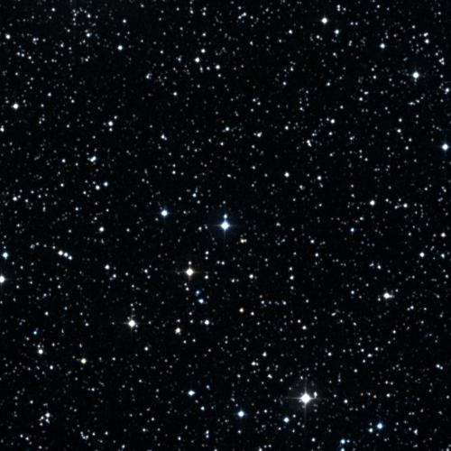
🔭 **[View in Aladin Sky Atlas (DSS2 Optical)](https://aladin.u-strasbg.fr/AladinLite/?target=291.4181+38.6723&fov=0.5&survey=P/DSS2/color)**
*Multi-wavelength: [DSS2 Optical](https://aladin.u-strasbg.fr/AladinLite/?target=291.4181+38.6723&fov=0.5&survey=P/DSS2/color) · [2MASS NIR](https://aladin.u-strasbg.fr/AladinLite/?target=291.4181+38.6723&fov=0.5&survey=P/2MASS/color)*

- **Position:** RA=291.4181°, Dec=38.6723°
- **Frequency:** 8660.18 MHz
- **SNR:** 49.9
- **Bandwidth:** 0.04484 MHz
- **Drift rate:** -0.0888 Hz/s
- **Detection method(s):** zscore

**Cross-check evidence:**

  - Exoplanet system nearby: Kepler-93 b, Kepler-93 b, Kepler-93 b
  - Doppler drift rate 0.0888 Hz/s consistent with technological origin
  - High SNR: 49.9

### Tau Ceti — Score 85/100

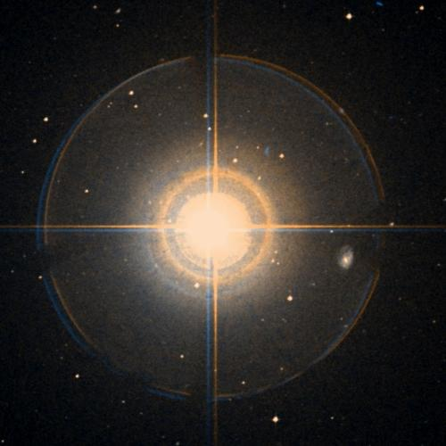
🔭 **[View in Aladin Sky Atlas (DSS2 Optical)](https://aladin.u-strasbg.fr/AladinLite/?target=26.0170+-15.9375&fov=0.5&survey=P/DSS2/color)**
*Multi-wavelength: [DSS2 Optical](https://aladin.u-strasbg.fr/AladinLite/?target=26.0170+-15.9375&fov=0.5&survey=P/DSS2/color) · [2MASS NIR](https://aladin.u-strasbg.fr/AladinLite/?target=26.0170+-15.9375&fov=0.5&survey=P/2MASS/color)*

- **Position:** RA=26.0170°, Dec=-15.9375°
- **Frequency:** 5814.08 MHz
- **SNR:** 39.1
- **Bandwidth:** 0.00280278 MHz
- **Drift rate:** 0.3868 Hz/s
- **Detection method(s):** zscore

**Cross-check evidence:**

  - Known SETI priority target: Tau Ceti
  - Frequency in known RFI band: WiFi 5.8 GHz / ISM
  - Exoplanet system nearby: tau Cet g, tau Cet h, tau Cet f
  - Doppler drift rate 0.3868 Hz/s consistent with technological origin
  - High SNR: 39.1
  - Multi-channel confirmation: 2 independent data sources detect this target

### Gliese 667C — Score 100/100

🔭 **[View in Aladin Sky Atlas (DSS2 Optical)](https://aladin.u-strasbg.fr/AladinLite/?target=259.7488+-34.9977&fov=0.5&survey=P/DSS2/color)**
*Multi-wavelength: [DSS2 Optical](https://aladin.u-strasbg.fr/AladinLite/?target=259.7488+-34.9977&fov=0.5&survey=P/DSS2/color) · [2MASS NIR](https://aladin.u-strasbg.fr/AladinLite/?target=259.7488+-34.9977&fov=0.5&survey=P/2MASS/color)*

- **Position:** RA=259.7488°, Dec=-34.9977°
- **Frequency:** 6509.99 MHz
- **SNR:** 30.9
- **Bandwidth:** 0.006425 MHz
- **Drift rate:** -0.1871 Hz/s
- **Detection method(s):** zscore

**Cross-check evidence:**

  - Known SETI priority target: Gliese 667C
  - Exoplanet system nearby: GJ 667 C f, GJ 667 C b, GJ 667 C c
  - Doppler drift rate 0.1871 Hz/s consistent with technological origin
  - High SNR: 30.9

### 55 Cnc — Score 80/100

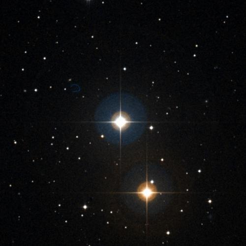
🔭 **[View in Aladin Sky Atlas (DSS2 Optical)](https://aladin.u-strasbg.fr/AladinLite/?target=133.1468+28.3298&fov=0.5&survey=P/DSS2/color)**
*Multi-wavelength: [DSS2 Optical](https://aladin.u-strasbg.fr/AladinLite/?target=133.1468+28.3298&fov=0.5&survey=P/DSS2/color) · [2MASS NIR](https://aladin.u-strasbg.fr/AladinLite/?target=133.1468+28.3298&fov=0.5&survey=P/2MASS/color)*

- **Position:** RA=133.1468°, Dec=28.3298°
- **Frequency:** 4949.91 MHz
- **SNR:** 4.4
- **Bandwidth:** 443.4392 MHz
- **Drift rate:** -0.1951 Hz/s
- **Detection method(s):** doppler_drift

**Cross-check evidence:**

  - Exoplanet system nearby: 55 Cnc b, 55 Cnc d, 55 Cnc e
  - Doppler drift rate 0.1951 Hz/s consistent with technological origin

### HD 136352 — Score 80/100

🔭 **[View in Aladin Sky Atlas (DSS2 Optical)](https://aladin.u-strasbg.fr/AladinLite/?target=230.4401+-48.3188&fov=0.5&survey=P/DSS2/color)**
*Multi-wavelength: [DSS2 Optical](https://aladin.u-strasbg.fr/AladinLite/?target=230.4401+-48.3188&fov=0.5&survey=P/DSS2/color) · [2MASS NIR](https://aladin.u-strasbg.fr/AladinLite/?target=230.4401+-48.3188&fov=0.5&survey=P/2MASS/color)*

- **Position:** RA=230.4401°, Dec=-48.3188°
- **Frequency:** 7850.26 MHz
- **SNR:** 2.7
- **Bandwidth:** 414.4257 MHz
- **Drift rate:** -0.0853 Hz/s
- **Detection method(s):** doppler_drift

**Cross-check evidence:**

  - Exoplanet system nearby: HD 136352 d, HD 136352 d, HD 136352 b
  - Doppler drift rate 0.0853 Hz/s consistent with technological origin

### HD 136352 — Score 80/100

🔭 **[View in Aladin Sky Atlas (DSS2 Optical)](https://aladin.u-strasbg.fr/AladinLite/?target=230.4401+-48.3188&fov=0.5&survey=P/DSS2/color)**
*Multi-wavelength: [DSS2 Optical](https://aladin.u-strasbg.fr/AladinLite/?target=230.4401+-48.3188&fov=0.5&survey=P/DSS2/color) · [2MASS NIR](https://aladin.u-strasbg.fr/AladinLite/?target=230.4401+-48.3188&fov=0.5&survey=P/2MASS/color)*

- **Position:** RA=230.4401°, Dec=-48.3188°
- **Frequency:** 4337.18 MHz
- **SNR:** 2.8
- **Bandwidth:** 470.706 MHz
- **Drift rate:** 0.1127 Hz/s
- **Detection method(s):** doppler_drift

**Cross-check evidence:**

  - Exoplanet system nearby: HD 136352 d, HD 136352 d, HD 136352 b
  - Doppler drift rate 0.1127 Hz/s consistent with technological origin

### HD 136352 — Score 80/100

🔭 **[View in Aladin Sky Atlas (DSS2 Optical)](https://aladin.u-strasbg.fr/AladinLite/?target=230.4401+-48.3188&fov=0.5&survey=P/DSS2/color)**
*Multi-wavelength: [DSS2 Optical](https://aladin.u-strasbg.fr/AladinLite/?target=230.4401+-48.3188&fov=0.5&survey=P/DSS2/color) · [2MASS NIR](https://aladin.u-strasbg.fr/AladinLite/?target=230.4401+-48.3188&fov=0.5&survey=P/2MASS/color)*

- **Position:** RA=230.4401°, Dec=-48.3188°
- **Frequency:** 3045.15 MHz
- **SNR:** 1.7
- **Bandwidth:** 321.8339 MHz
- **Drift rate:** 0.0878 Hz/s
- **Detection method(s):** doppler_drift

**Cross-check evidence:**

  - Exoplanet system nearby: HD 136352 d, HD 136352 d, HD 136352 b
  - Doppler drift rate 0.0878 Hz/s consistent with technological origin

### HD 136352 — Score 80/100

🔭 **[View in Aladin Sky Atlas (DSS2 Optical)](https://aladin.u-strasbg.fr/AladinLite/?target=230.4401+-48.3188&fov=0.5&survey=P/DSS2/color)**
*Multi-wavelength: [DSS2 Optical](https://aladin.u-strasbg.fr/AladinLite/?target=230.4401+-48.3188&fov=0.5&survey=P/DSS2/color) · [2MASS NIR](https://aladin.u-strasbg.fr/AladinLite/?target=230.4401+-48.3188&fov=0.5&survey=P/2MASS/color)*

- **Position:** RA=230.4401°, Dec=-48.3188°
- **Frequency:** 7822.79 MHz
- **SNR:** 5.0
- **Bandwidth:** 241.8104 MHz
- **Drift rate:** -0.0155 Hz/s
- **Detection method(s):** doppler_drift

**Cross-check evidence:**

  - Exoplanet system nearby: HD 136352 d, HD 136352 d, HD 136352 b
  - Doppler drift rate 0.0155 Hz/s consistent with technological origin

### TOI-1468 — Score 80/100

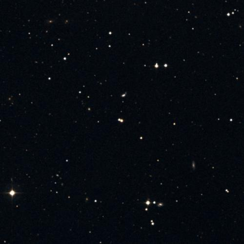
🔭 **[View in Aladin Sky Atlas (DSS2 Optical)](https://aladin.u-strasbg.fr/AladinLite/?target=16.6539+19.2249&fov=0.5&survey=P/DSS2/color)**
*Multi-wavelength: [DSS2 Optical](https://aladin.u-strasbg.fr/AladinLite/?target=16.6539+19.2249&fov=0.5&survey=P/DSS2/color) · [2MASS NIR](https://aladin.u-strasbg.fr/AladinLite/?target=16.6539+19.2249&fov=0.5&survey=P/2MASS/color)*

- **Position:** RA=16.6539°, Dec=19.2249°
- **Frequency:** 7147.44 MHz
- **SNR:** 2.2
- **Bandwidth:** 397.9049 MHz
- **Drift rate:** -0.0512 Hz/s
- **Detection method(s):** doppler_drift

**Cross-check evidence:**

  - Exoplanet system nearby: TOI-1468 b, TOI-1468 c, TOI-1468 c
  - Doppler drift rate 0.0512 Hz/s consistent with technological origin

### TOI-1468 — Score 80/100

🔭 **[View in Aladin Sky Atlas (DSS2 Optical)](https://aladin.u-strasbg.fr/AladinLite/?target=16.6539+19.2249&fov=0.5&survey=P/DSS2/color)**
*Multi-wavelength: [DSS2 Optical](https://aladin.u-strasbg.fr/AladinLite/?target=16.6539+19.2249&fov=0.5&survey=P/DSS2/color) · [2MASS NIR](https://aladin.u-strasbg.fr/AladinLite/?target=16.6539+19.2249&fov=0.5&survey=P/2MASS/color)*

- **Position:** RA=16.6539°, Dec=19.2249°
- **Frequency:** 5226.00 MHz
- **SNR:** 2.6
- **Bandwidth:** 175.7885 MHz
- **Drift rate:** -0.0840 Hz/s
- **Detection method(s):** doppler_drift

**Cross-check evidence:**

  - Exoplanet system nearby: TOI-1468 b, TOI-1468 c, TOI-1468 c
  - Doppler drift rate 0.0840 Hz/s consistent with technological origin

### TOI-2018 — Score 80/100

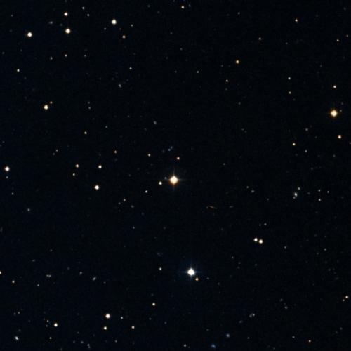
🔭 **[View in Aladin Sky Atlas (DSS2 Optical)](https://aladin.u-strasbg.fr/AladinLite/?target=229.8374+29.2079&fov=0.5&survey=P/DSS2/color)**
*Multi-wavelength: [DSS2 Optical](https://aladin.u-strasbg.fr/AladinLite/?target=229.8374+29.2079&fov=0.5&survey=P/DSS2/color) · [2MASS NIR](https://aladin.u-strasbg.fr/AladinLite/?target=229.8374+29.2079&fov=0.5&survey=P/2MASS/color)*

- **Position:** RA=229.8374°, Dec=29.2079°
- **Frequency:** 7028.33 MHz
- **SNR:** 3.6
- **Bandwidth:** 274.8608 MHz
- **Drift rate:** -0.0666 Hz/s
- **Detection method(s):** doppler_drift

**Cross-check evidence:**

  - Exoplanet system nearby: TOI-2018 b, TOI-2018 b
  - Doppler drift rate 0.0666 Hz/s consistent with technological origin

### TOI-2427 — Score 80/100

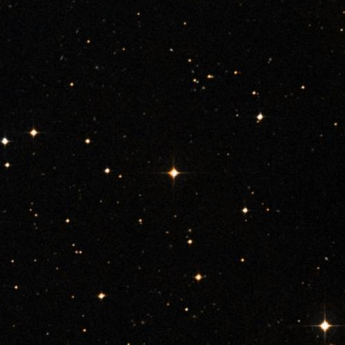
🔭 **[View in Aladin Sky Atlas (DSS2 Optical)](https://aladin.u-strasbg.fr/AladinLite/?target=52.2917+-31.3629&fov=0.5&survey=P/DSS2/color)**
*Multi-wavelength: [DSS2 Optical](https://aladin.u-strasbg.fr/AladinLite/?target=52.2917+-31.3629&fov=0.5&survey=P/DSS2/color) · [2MASS NIR](https://aladin.u-strasbg.fr/AladinLite/?target=52.2917+-31.3629&fov=0.5&survey=P/2MASS/color)*

- **Position:** RA=52.2917°, Dec=-31.3629°
- **Frequency:** 4487.31 MHz
- **SNR:** 4.2
- **Bandwidth:** 215.3312 MHz
- **Drift rate:** 0.0224 Hz/s
- **Detection method(s):** doppler_drift

**Cross-check evidence:**

  - Exoplanet system nearby: TOI-2427 b, TOI-2427 b
  - Doppler drift rate 0.0224 Hz/s consistent with technological origin

### TOI-700 — Score 90/100

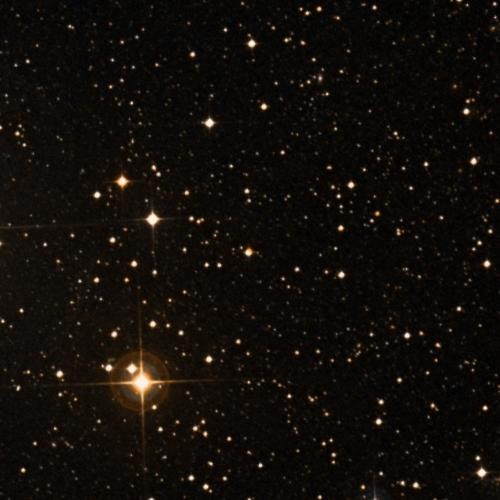
🔭 **[View in Aladin Sky Atlas (DSS2 Optical)](https://aladin.u-strasbg.fr/AladinLite/?target=97.0957+-65.5786&fov=0.5&survey=P/DSS2/color)**
*Multi-wavelength: [DSS2 Optical](https://aladin.u-strasbg.fr/AladinLite/?target=97.0957+-65.5786&fov=0.5&survey=P/DSS2/color) · [2MASS NIR](https://aladin.u-strasbg.fr/AladinLite/?target=97.0957+-65.5786&fov=0.5&survey=P/2MASS/color)*

- **Position:** RA=97.0957°, Dec=-65.5786°
- **Frequency:** 7015.63 MHz
- **SNR:** 1.2
- **Bandwidth:** 288.4385 MHz
- **Drift rate:** -0.0335 Hz/s
- **Detection method(s):** doppler_drift

**Cross-check evidence:**

  - Exoplanet system nearby: TOI-700 c, TOI-700 d, TOI-700 b
  - Doppler drift rate 0.0335 Hz/s consistent with technological origin
  - Multi-channel confirmation: 2 independent data sources detect this target

### TOI-700 — Score 90/100

🔭 **[View in Aladin Sky Atlas (DSS2 Optical)](https://aladin.u-strasbg.fr/AladinLite/?target=97.0957+-65.5786&fov=0.5&survey=P/DSS2/color)**
*Multi-wavelength: [DSS2 Optical](https://aladin.u-strasbg.fr/AladinLite/?target=97.0957+-65.5786&fov=0.5&survey=P/DSS2/color) · [2MASS NIR](https://aladin.u-strasbg.fr/AladinLite/?target=97.0957+-65.5786&fov=0.5&survey=P/2MASS/color)*

- **Position:** RA=97.0957°, Dec=-65.5786°
- **Frequency:** 6712.46 MHz
- **SNR:** 3.9
- **Bandwidth:** 321.4318 MHz
- **Drift rate:** 0.0793 Hz/s
- **Detection method(s):** doppler_drift

**Cross-check evidence:**

  - Exoplanet system nearby: TOI-700 c, TOI-700 d, TOI-700 b
  - Doppler drift rate 0.0793 Hz/s consistent with technological origin
  - Multi-channel confirmation: 2 independent data sources detect this target

### TOI-620 — Score 80/100

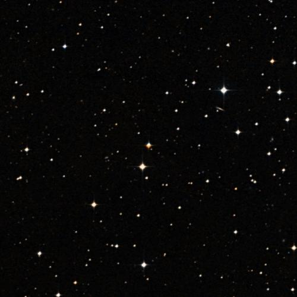
🔭 **[View in Aladin Sky Atlas (DSS2 Optical)](https://aladin.u-strasbg.fr/AladinLite/?target=142.1734+-12.1672&fov=0.5&survey=P/DSS2/color)**
*Multi-wavelength: [DSS2 Optical](https://aladin.u-strasbg.fr/AladinLite/?target=142.1734+-12.1672&fov=0.5&survey=P/DSS2/color) · [2MASS NIR](https://aladin.u-strasbg.fr/AladinLite/?target=142.1734+-12.1672&fov=0.5&survey=P/2MASS/color)*

- **Position:** RA=142.1734°, Dec=-12.1672°
- **Frequency:** 4930.46 MHz
- **SNR:** 2.5
- **Bandwidth:** 185.8339 MHz
- **Drift rate:** -0.1276 Hz/s
- **Detection method(s):** doppler_drift

**Cross-check evidence:**

  - Exoplanet system nearby: TOI-620 b, TOI-620 b
  - Doppler drift rate 0.1276 Hz/s consistent with technological origin

### TOI-2136 — Score 80/100

🔭 **[View in Aladin Sky Atlas (DSS2 Optical)](https://aladin.u-strasbg.fr/AladinLite/?target=281.1763+36.5631&fov=0.5&survey=P/DSS2/color)**
*Multi-wavelength: [DSS2 Optical](https://aladin.u-strasbg.fr/AladinLite/?target=281.1763+36.5631&fov=0.5&survey=P/DSS2/color) · [2MASS NIR](https://aladin.u-strasbg.fr/AladinLite/?target=281.1763+36.5631&fov=0.5&survey=P/2MASS/color)*

- **Position:** RA=281.1763°, Dec=36.5631°
- **Frequency:** 1524.72 MHz
- **SNR:** 2.9
- **Bandwidth:** 212.5536 MHz
- **Drift rate:** 0.0690 Hz/s
- **Detection method(s):** doppler_drift

**Cross-check evidence:**

  - Exoplanet system nearby: TOI-2136 b, TOI-2136 b, TOI-2136 b
  - Doppler drift rate 0.0690 Hz/s consistent with technological origin

### TOI-1266 — Score 80/100

🔭 **[View in Aladin Sky Atlas (DSS2 Optical)](https://aladin.u-strasbg.fr/AladinLite/?target=197.9966+65.8337&fov=0.5&survey=P/DSS2/color)**
*Multi-wavelength: [DSS2 Optical](https://aladin.u-strasbg.fr/AladinLite/?target=197.9966+65.8337&fov=0.5&survey=P/DSS2/color) · [2MASS NIR](https://aladin.u-strasbg.fr/AladinLite/?target=197.9966+65.8337&fov=0.5&survey=P/2MASS/color)*

- **Position:** RA=197.9966°, Dec=65.8337°
- **Frequency:** 5509.40 MHz
- **SNR:** 3.4
- **Bandwidth:** 160.9248 MHz
- **Drift rate:** 0.0665 Hz/s
- **Detection method(s):** doppler_drift

**Cross-check evidence:**

  - Exoplanet system nearby: TOI-1266 b, TOI-1266 c, TOI-1266 c
  - Doppler drift rate 0.0665 Hz/s consistent with technological origin

### TOI-1266 — Score 80/100

🔭 **[View in Aladin Sky Atlas (DSS2 Optical)](https://aladin.u-strasbg.fr/AladinLite/?target=197.9966+65.8337&fov=0.5&survey=P/DSS2/color)**
*Multi-wavelength: [DSS2 Optical](https://aladin.u-strasbg.fr/AladinLite/?target=197.9966+65.8337&fov=0.5&survey=P/DSS2/color) · [2MASS NIR](https://aladin.u-strasbg.fr/AladinLite/?target=197.9966+65.8337&fov=0.5&survey=P/2MASS/color)*

- **Position:** RA=197.9966°, Dec=65.8337°
- **Frequency:** 4429.19 MHz
- **SNR:** 2.6
- **Bandwidth:** 220.6048 MHz
- **Drift rate:** -0.1687 Hz/s
- **Detection method(s):** doppler_drift

**Cross-check evidence:**

  - Exoplanet system nearby: TOI-1266 b, TOI-1266 c, TOI-1266 c
  - Doppler drift rate 0.1687 Hz/s consistent with technological origin

### TOI-1266 — Score 80/100

🔭 **[View in Aladin Sky Atlas (DSS2 Optical)](https://aladin.u-strasbg.fr/AladinLite/?target=197.9966+65.8337&fov=0.5&survey=P/DSS2/color)**
*Multi-wavelength: [DSS2 Optical](https://aladin.u-strasbg.fr/AladinLite/?target=197.9966+65.8337&fov=0.5&survey=P/DSS2/color) · [2MASS NIR](https://aladin.u-strasbg.fr/AladinLite/?target=197.9966+65.8337&fov=0.5&survey=P/2MASS/color)*

- **Position:** RA=197.9966°, Dec=65.8337°
- **Frequency:** 2062.05 MHz
- **SNR:** 3.3
- **Bandwidth:** 484.7591 MHz
- **Drift rate:** -0.0905 Hz/s
- **Detection method(s):** doppler_drift

**Cross-check evidence:**

  - Exoplanet system nearby: TOI-1266 b, TOI-1266 c, TOI-1266 c
  - Doppler drift rate 0.0905 Hz/s consistent with technological origin

### HAT-P-11 — Score 80/100

🔭 **[View in Aladin Sky Atlas (DSS2 Optical)](https://aladin.u-strasbg.fr/AladinLite/?target=297.7102+48.0819&fov=0.5&survey=P/DSS2/color)**
*Multi-wavelength: [DSS2 Optical](https://aladin.u-strasbg.fr/AladinLite/?target=297.7102+48.0819&fov=0.5&survey=P/DSS2/color) · [2MASS NIR](https://aladin.u-strasbg.fr/AladinLite/?target=297.7102+48.0819&fov=0.5&survey=P/2MASS/color)*

- **Position:** RA=297.7102°, Dec=48.0819°
- **Frequency:** 9722.59 MHz
- **SNR:** 3.9
- **Bandwidth:** 411.5004 MHz
- **Drift rate:** -0.0934 Hz/s
- **Detection method(s):** doppler_drift

**Cross-check evidence:**

  - Exoplanet system nearby: HAT-P-11 b, HAT-P-11 b, HAT-P-11 b
  - Doppler drift rate 0.0934 Hz/s consistent with technological origin

### Kepler-42 — Score 80/100

🔭 **[View in Aladin Sky Atlas (DSS2 Optical)](https://aladin.u-strasbg.fr/AladinLite/?target=292.2196+44.6174&fov=0.5&survey=P/DSS2/color)**
*Multi-wavelength: [DSS2 Optical](https://aladin.u-strasbg.fr/AladinLite/?target=292.2196+44.6174&fov=0.5&survey=P/DSS2/color) · [2MASS NIR](https://aladin.u-strasbg.fr/AladinLite/?target=292.2196+44.6174&fov=0.5&survey=P/2MASS/color)*

- **Position:** RA=292.2196°, Dec=44.6174°
- **Frequency:** 3753.61 MHz
- **SNR:** 2.0
- **Bandwidth:** 331.6878 MHz
- **Drift rate:** -0.1446 Hz/s
- **Detection method(s):** doppler_drift

**Cross-check evidence:**

  - Exoplanet system nearby: Kepler-1202 b, Kepler-42 d, Kepler-42 b
  - Doppler drift rate 0.1446 Hz/s consistent with technological origin

### Kepler-42 — Score 80/100

🔭 **[View in Aladin Sky Atlas (DSS2 Optical)](https://aladin.u-strasbg.fr/AladinLite/?target=292.2196+44.6174&fov=0.5&survey=P/DSS2/color)**
*Multi-wavelength: [DSS2 Optical](https://aladin.u-strasbg.fr/AladinLite/?target=292.2196+44.6174&fov=0.5&survey=P/DSS2/color) · [2MASS NIR](https://aladin.u-strasbg.fr/AladinLite/?target=292.2196+44.6174&fov=0.5&survey=P/2MASS/color)*

- **Position:** RA=292.2196°, Dec=44.6174°
- **Frequency:** 7475.17 MHz
- **SNR:** 2.7
- **Bandwidth:** 272.8372 MHz
- **Drift rate:** 0.1602 Hz/s
- **Detection method(s):** doppler_drift

**Cross-check evidence:**

  - Exoplanet system nearby: Kepler-1202 b, Kepler-42 d, Kepler-42 b
  - Doppler drift rate 0.1602 Hz/s consistent with technological origin

### Kepler-42 — Score 80/100

🔭 **[View in Aladin Sky Atlas (DSS2 Optical)](https://aladin.u-strasbg.fr/AladinLite/?target=292.2196+44.6174&fov=0.5&survey=P/DSS2/color)**
*Multi-wavelength: [DSS2 Optical](https://aladin.u-strasbg.fr/AladinLite/?target=292.2196+44.6174&fov=0.5&survey=P/DSS2/color) · [2MASS NIR](https://aladin.u-strasbg.fr/AladinLite/?target=292.2196+44.6174&fov=0.5&survey=P/2MASS/color)*

- **Position:** RA=292.2196°, Dec=44.6174°
- **Frequency:** 3968.75 MHz
- **SNR:** 5.7
- **Bandwidth:** 157.8097 MHz
- **Drift rate:** -0.1189 Hz/s
- **Detection method(s):** doppler_drift

**Cross-check evidence:**

  - Exoplanet system nearby: Kepler-1202 b, Kepler-42 d, Kepler-42 b
  - Doppler drift rate 0.1189 Hz/s consistent with technological origin

### HD 235088 — Score 80/100

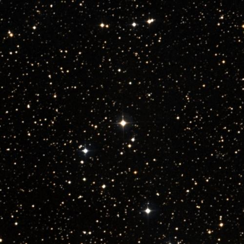
🔭 **[View in Aladin Sky Atlas (DSS2 Optical)](https://aladin.u-strasbg.fr/AladinLite/?target=300.6155+53.3774&fov=0.5&survey=P/DSS2/color)**
*Multi-wavelength: [DSS2 Optical](https://aladin.u-strasbg.fr/AladinLite/?target=300.6155+53.3774&fov=0.5&survey=P/DSS2/color) · [2MASS NIR](https://aladin.u-strasbg.fr/AladinLite/?target=300.6155+53.3774&fov=0.5&survey=P/2MASS/color)*

- **Position:** RA=300.6155°, Dec=53.3774°
- **Frequency:** 9627.03 MHz
- **SNR:** 3.2
- **Bandwidth:** 292.9214 MHz
- **Drift rate:** 0.0838 Hz/s
- **Detection method(s):** doppler_drift

**Cross-check evidence:**

  - Exoplanet system nearby: HD 235088 b, HD 235088 b, HD 235088 b
  - Doppler drift rate 0.0838 Hz/s consistent with technological origin

### TOI-5800 — Score 80/100

🔭 **[View in Aladin Sky Atlas (DSS2 Optical)](https://aladin.u-strasbg.fr/AladinLite/?target=305.0655+-7.4119&fov=0.5&survey=P/DSS2/color)**
*Multi-wavelength: [DSS2 Optical](https://aladin.u-strasbg.fr/AladinLite/?target=305.0655+-7.4119&fov=0.5&survey=P/DSS2/color) · [2MASS NIR](https://aladin.u-strasbg.fr/AladinLite/?target=305.0655+-7.4119&fov=0.5&survey=P/2MASS/color)*

- **Position:** RA=305.0655°, Dec=-7.4119°
- **Frequency:** 5416.36 MHz
- **SNR:** 1.7
- **Bandwidth:** 475.1306 MHz
- **Drift rate:** -0.2132 Hz/s
- **Detection method(s):** doppler_drift

**Cross-check evidence:**

  - Exoplanet system nearby: TOI-5800 b, TOI-5800 b, TOI-5800 b
  - Doppler drift rate 0.2132 Hz/s consistent with technological origin

### TOI-5800 — Score 80/100

🔭 **[View in Aladin Sky Atlas (DSS2 Optical)](https://aladin.u-strasbg.fr/AladinLite/?target=305.0655+-7.4119&fov=0.5&survey=P/DSS2/color)**
*Multi-wavelength: [DSS2 Optical](https://aladin.u-strasbg.fr/AladinLite/?target=305.0655+-7.4119&fov=0.5&survey=P/DSS2/color) · [2MASS NIR](https://aladin.u-strasbg.fr/AladinLite/?target=305.0655+-7.4119&fov=0.5&survey=P/2MASS/color)*

- **Position:** RA=305.0655°, Dec=-7.4119°
- **Frequency:** 3984.12 MHz
- **SNR:** 2.0
- **Bandwidth:** 308.269 MHz
- **Drift rate:** -0.0141 Hz/s
- **Detection method(s):** doppler_drift

**Cross-check evidence:**

  - Exoplanet system nearby: TOI-5800 b, TOI-5800 b, TOI-5800 b
  - Doppler drift rate 0.0141 Hz/s consistent with technological origin

### TOI-3884 — Score 80/100

🔭 **[View in Aladin Sky Atlas (DSS2 Optical)](https://aladin.u-strasbg.fr/AladinLite/?target=181.5718+12.5070&fov=0.5&survey=P/DSS2/color)**
*Multi-wavelength: [DSS2 Optical](https://aladin.u-strasbg.fr/AladinLite/?target=181.5718+12.5070&fov=0.5&survey=P/DSS2/color) · [2MASS NIR](https://aladin.u-strasbg.fr/AladinLite/?target=181.5718+12.5070&fov=0.5&survey=P/2MASS/color)*

- **Position:** RA=181.5718°, Dec=12.5070°
- **Frequency:** 7050.16 MHz
- **SNR:** 3.1
- **Bandwidth:** 212.4935 MHz
- **Drift rate:** 0.1768 Hz/s
- **Detection method(s):** doppler_drift

**Cross-check evidence:**

  - Exoplanet system nearby: TOI-3884 b, TOI-3884 b, TOI-3884 b
  - Doppler drift rate 0.1768 Hz/s consistent with technological origin

### K2-3 — Score 80/100

🔭 **[View in Aladin Sky Atlas (DSS2 Optical)](https://aladin.u-strasbg.fr/AladinLite/?target=172.3354+-1.4551&fov=0.5&survey=P/DSS2/color)**
*Multi-wavelength: [DSS2 Optical](https://aladin.u-strasbg.fr/AladinLite/?target=172.3354+-1.4551&fov=0.5&survey=P/DSS2/color) · [2MASS NIR](https://aladin.u-strasbg.fr/AladinLite/?target=172.3354+-1.4551&fov=0.5&survey=P/2MASS/color)*

- **Position:** RA=172.3354°, Dec=-1.4551°
- **Frequency:** 4338.30 MHz
- **SNR:** 4.1
- **Bandwidth:** 431.9159 MHz
- **Drift rate:** -0.0903 Hz/s
- **Detection method(s):** doppler_drift

**Cross-check evidence:**

  - Exoplanet system nearby: K2-3 d, K2-3 b, K2-3 c
  - Doppler drift rate 0.0903 Hz/s consistent with technological origin

### K2-3 — Score 80/100

🔭 **[View in Aladin Sky Atlas (DSS2 Optical)](https://aladin.u-strasbg.fr/AladinLite/?target=172.3354+-1.4551&fov=0.5&survey=P/DSS2/color)**
*Multi-wavelength: [DSS2 Optical](https://aladin.u-strasbg.fr/AladinLite/?target=172.3354+-1.4551&fov=0.5&survey=P/DSS2/color) · [2MASS NIR](https://aladin.u-strasbg.fr/AladinLite/?target=172.3354+-1.4551&fov=0.5&survey=P/2MASS/color)*

- **Position:** RA=172.3354°, Dec=-1.4551°
- **Frequency:** 7737.47 MHz
- **SNR:** 2.6
- **Bandwidth:** 456.317 MHz
- **Drift rate:** 0.0286 Hz/s
- **Detection method(s):** doppler_drift

**Cross-check evidence:**

  - Exoplanet system nearby: K2-3 d, K2-3 b, K2-3 c
  - Doppler drift rate 0.0286 Hz/s consistent with technological origin

### K2-3 — Score 80/100

🔭 **[View in Aladin Sky Atlas (DSS2 Optical)](https://aladin.u-strasbg.fr/AladinLite/?target=172.3354+-1.4551&fov=0.5&survey=P/DSS2/color)**
*Multi-wavelength: [DSS2 Optical](https://aladin.u-strasbg.fr/AladinLite/?target=172.3354+-1.4551&fov=0.5&survey=P/DSS2/color) · [2MASS NIR](https://aladin.u-strasbg.fr/AladinLite/?target=172.3354+-1.4551&fov=0.5&survey=P/2MASS/color)*

- **Position:** RA=172.3354°, Dec=-1.4551°
- **Frequency:** 3843.36 MHz
- **SNR:** 2.2
- **Bandwidth:** 408.805 MHz
- **Drift rate:** 0.1106 Hz/s
- **Detection method(s):** doppler_drift

**Cross-check evidence:**

  - Exoplanet system nearby: K2-3 d, K2-3 b, K2-3 c
  - Doppler drift rate 0.1106 Hz/s consistent with technological origin

### K2-3 — Score 80/100

🔭 **[View in Aladin Sky Atlas (DSS2 Optical)](https://aladin.u-strasbg.fr/AladinLite/?target=172.3354+-1.4551&fov=0.5&survey=P/DSS2/color)**
*Multi-wavelength: [DSS2 Optical](https://aladin.u-strasbg.fr/AladinLite/?target=172.3354+-1.4551&fov=0.5&survey=P/DSS2/color) · [2MASS NIR](https://aladin.u-strasbg.fr/AladinLite/?target=172.3354+-1.4551&fov=0.5&survey=P/2MASS/color)*

- **Position:** RA=172.3354°, Dec=-1.4551°
- **Frequency:** 7721.11 MHz
- **SNR:** 1.5
- **Bandwidth:** 204.9842 MHz
- **Drift rate:** -0.1368 Hz/s
- **Detection method(s):** doppler_drift

**Cross-check evidence:**

  - Exoplanet system nearby: K2-3 d, K2-3 b, K2-3 c
  - Doppler drift rate 0.1368 Hz/s consistent with technological origin

### K2-3 — Score 80/100

🔭 **[View in Aladin Sky Atlas (DSS2 Optical)](https://aladin.u-strasbg.fr/AladinLite/?target=172.3354+-1.4551&fov=0.5&survey=P/DSS2/color)**
*Multi-wavelength: [DSS2 Optical](https://aladin.u-strasbg.fr/AladinLite/?target=172.3354+-1.4551&fov=0.5&survey=P/DSS2/color) · [2MASS NIR](https://aladin.u-strasbg.fr/AladinLite/?target=172.3354+-1.4551&fov=0.5&survey=P/2MASS/color)*

- **Position:** RA=172.3354°, Dec=-1.4551°
- **Frequency:** 8480.01 MHz
- **SNR:** 2.2
- **Bandwidth:** 161.3137 MHz
- **Drift rate:** 0.1461 Hz/s
- **Detection method(s):** doppler_drift

**Cross-check evidence:**

  - Exoplanet system nearby: K2-3 d, K2-3 b, K2-3 c
  - Doppler drift rate 0.1461 Hz/s consistent with technological origin

### Wolf 503 — Score 80/100

🔭 **[View in Aladin Sky Atlas (DSS2 Optical)](https://aladin.u-strasbg.fr/AladinLite/?target=206.8462+-6.1393&fov=0.5&survey=P/DSS2/color)**
*Multi-wavelength: [DSS2 Optical](https://aladin.u-strasbg.fr/AladinLite/?target=206.8462+-6.1393&fov=0.5&survey=P/DSS2/color) · [2MASS NIR](https://aladin.u-strasbg.fr/AladinLite/?target=206.8462+-6.1393&fov=0.5&survey=P/2MASS/color)*

- **Position:** RA=206.8462°, Dec=-6.1393°
- **Frequency:** 7098.93 MHz
- **SNR:** 2.7
- **Bandwidth:** 148.733 MHz
- **Drift rate:** -0.0843 Hz/s
- **Detection method(s):** doppler_drift

**Cross-check evidence:**

  - Exoplanet system nearby: Wolf 503 b, Wolf 503 b, Wolf 503 b
  - Doppler drift rate 0.0843 Hz/s consistent with technological origin

### TOI-674 — Score 80/100

🔭 **[View in Aladin Sky Atlas (DSS2 Optical)](https://aladin.u-strasbg.fr/AladinLite/?target=164.5866+-36.8581&fov=0.5&survey=P/DSS2/color)**
*Multi-wavelength: [DSS2 Optical](https://aladin.u-strasbg.fr/AladinLite/?target=164.5866+-36.8581&fov=0.5&survey=P/DSS2/color) · [2MASS NIR](https://aladin.u-strasbg.fr/AladinLite/?target=164.5866+-36.8581&fov=0.5&survey=P/2MASS/color)*

- **Position:** RA=164.5866°, Dec=-36.8581°
- **Frequency:** 2113.78 MHz
- **SNR:** 2.1
- **Bandwidth:** 471.025 MHz
- **Drift rate:** -0.0328 Hz/s
- **Detection method(s):** doppler_drift

**Cross-check evidence:**

  - Exoplanet system nearby: TOI-674 b, TOI-674 b, TOI-674 b
  - Doppler drift rate 0.0328 Hz/s consistent with technological origin

### HD 191939 — Score 80/100

🔭 **[View in Aladin Sky Atlas (DSS2 Optical)](https://aladin.u-strasbg.fr/AladinLite/?target=302.0256+66.8503&fov=0.5&survey=P/DSS2/color)**
*Multi-wavelength: [DSS2 Optical](https://aladin.u-strasbg.fr/AladinLite/?target=302.0256+66.8503&fov=0.5&survey=P/DSS2/color) · [2MASS NIR](https://aladin.u-strasbg.fr/AladinLite/?target=302.0256+66.8503&fov=0.5&survey=P/2MASS/color)*

- **Position:** RA=302.0256°, Dec=66.8503°
- **Frequency:** 6965.78 MHz
- **SNR:** 2.5
- **Bandwidth:** 482.2493 MHz
- **Drift rate:** -0.0696 Hz/s
- **Detection method(s):** doppler_drift

**Cross-check evidence:**

  - Exoplanet system nearby: HD 191939 b, HD 191939 c, HD 191939 e
  - Doppler drift rate 0.0696 Hz/s consistent with technological origin

### K2-136 — Score 80/100

🔭 **[View in Aladin Sky Atlas (DSS2 Optical)](https://aladin.u-strasbg.fr/AladinLite/?target=67.4129+22.8826&fov=0.5&survey=P/DSS2/color)**
*Multi-wavelength: [DSS2 Optical](https://aladin.u-strasbg.fr/AladinLite/?target=67.4129+22.8826&fov=0.5&survey=P/DSS2/color) · [2MASS NIR](https://aladin.u-strasbg.fr/AladinLite/?target=67.4129+22.8826&fov=0.5&survey=P/2MASS/color)*

- **Position:** RA=67.4129°, Dec=22.8826°
- **Frequency:** 4772.03 MHz
- **SNR:** 6.9
- **Bandwidth:** 486.4928 MHz
- **Drift rate:** -0.0853 Hz/s
- **Detection method(s):** doppler_drift

**Cross-check evidence:**

  - Exoplanet system nearby: K2-136 c, K2-136 c, K2-136 c
  - Doppler drift rate 0.0853 Hz/s consistent with technological origin

### TOI-757 — Score 80/100

🔭 **[View in Aladin Sky Atlas (DSS2 Optical)](https://aladin.u-strasbg.fr/AladinLite/?target=187.9948+-35.5545&fov=0.5&survey=P/DSS2/color)**
*Multi-wavelength: [DSS2 Optical](https://aladin.u-strasbg.fr/AladinLite/?target=187.9948+-35.5545&fov=0.5&survey=P/DSS2/color) · [2MASS NIR](https://aladin.u-strasbg.fr/AladinLite/?target=187.9948+-35.5545&fov=0.5&survey=P/2MASS/color)*

- **Position:** RA=187.9948°, Dec=-35.5545°
- **Frequency:** 5206.43 MHz
- **SNR:** 3.2
- **Bandwidth:** 413.9054 MHz
- **Drift rate:** 0.1206 Hz/s
- **Detection method(s):** doppler_drift

**Cross-check evidence:**

  - Exoplanet system nearby: TOI-757 b, TOI-757 b
  - Doppler drift rate 0.1206 Hz/s consistent with technological origin

### TOI-757 — Score 80/100

🔭 **[View in Aladin Sky Atlas (DSS2 Optical)](https://aladin.u-strasbg.fr/AladinLite/?target=187.9948+-35.5545&fov=0.5&survey=P/DSS2/color)**
*Multi-wavelength: [DSS2 Optical](https://aladin.u-strasbg.fr/AladinLite/?target=187.9948+-35.5545&fov=0.5&survey=P/DSS2/color) · [2MASS NIR](https://aladin.u-strasbg.fr/AladinLite/?target=187.9948+-35.5545&fov=0.5&survey=P/2MASS/color)*

- **Position:** RA=187.9948°, Dec=-35.5545°
- **Frequency:** 8809.65 MHz
- **SNR:** 2.1
- **Bandwidth:** 341.2429 MHz
- **Drift rate:** -0.0877 Hz/s
- **Detection method(s):** doppler_drift

**Cross-check evidence:**

  - Exoplanet system nearby: TOI-757 b, TOI-757 b
  - Doppler drift rate 0.0877 Hz/s consistent with technological origin

### TOI-757 — Score 80/100

🔭 **[View in Aladin Sky Atlas (DSS2 Optical)](https://aladin.u-strasbg.fr/AladinLite/?target=187.9948+-35.5545&fov=0.5&survey=P/DSS2/color)**
*Multi-wavelength: [DSS2 Optical](https://aladin.u-strasbg.fr/AladinLite/?target=187.9948+-35.5545&fov=0.5&survey=P/DSS2/color) · [2MASS NIR](https://aladin.u-strasbg.fr/AladinLite/?target=187.9948+-35.5545&fov=0.5&survey=P/2MASS/color)*

- **Position:** RA=187.9948°, Dec=-35.5545°
- **Frequency:** 8807.42 MHz
- **SNR:** 7.9
- **Bandwidth:** 281.5588 MHz
- **Drift rate:** -0.1287 Hz/s
- **Detection method(s):** doppler_drift

**Cross-check evidence:**

  - Exoplanet system nearby: TOI-757 b, TOI-757 b
  - Doppler drift rate 0.1287 Hz/s consistent with technological origin

### Kepler-37 — Score 80/100

🔭 **[View in Aladin Sky Atlas (DSS2 Optical)](https://aladin.u-strasbg.fr/AladinLite/?target=284.0593+44.5184&fov=0.5&survey=P/DSS2/color)**
*Multi-wavelength: [DSS2 Optical](https://aladin.u-strasbg.fr/AladinLite/?target=284.0593+44.5184&fov=0.5&survey=P/DSS2/color) · [2MASS NIR](https://aladin.u-strasbg.fr/AladinLite/?target=284.0593+44.5184&fov=0.5&survey=P/2MASS/color)*

- **Position:** RA=284.0593°, Dec=44.5184°
- **Frequency:** 8421.98 MHz
- **SNR:** 2.4
- **Bandwidth:** 224.1339 MHz
- **Drift rate:** 0.0777 Hz/s
- **Detection method(s):** doppler_drift

**Cross-check evidence:**

  - Exoplanet system nearby: Kepler-37 c, Kepler-37 c, Kepler-37 d
  - Doppler drift rate 0.0777 Hz/s consistent with technological origin

### Kepler-37 — Score 80/100

🔭 **[View in Aladin Sky Atlas (DSS2 Optical)](https://aladin.u-strasbg.fr/AladinLite/?target=284.0593+44.5184&fov=0.5&survey=P/DSS2/color)**
*Multi-wavelength: [DSS2 Optical](https://aladin.u-strasbg.fr/AladinLite/?target=284.0593+44.5184&fov=0.5&survey=P/DSS2/color) · [2MASS NIR](https://aladin.u-strasbg.fr/AladinLite/?target=284.0593+44.5184&fov=0.5&survey=P/2MASS/color)*

- **Position:** RA=284.0593°, Dec=44.5184°
- **Frequency:** 2489.79 MHz
- **SNR:** 2.5
- **Bandwidth:** 213.888 MHz
- **Drift rate:** -0.1375 Hz/s
- **Detection method(s):** doppler_drift

**Cross-check evidence:**

  - Exoplanet system nearby: Kepler-37 c, Kepler-37 c, Kepler-37 d
  - Doppler drift rate 0.1375 Hz/s consistent with technological origin

### Kepler-37 — Score 80/100

🔭 **[View in Aladin Sky Atlas (DSS2 Optical)](https://aladin.u-strasbg.fr/AladinLite/?target=284.0593+44.5184&fov=0.5&survey=P/DSS2/color)**
*Multi-wavelength: [DSS2 Optical](https://aladin.u-strasbg.fr/AladinLite/?target=284.0593+44.5184&fov=0.5&survey=P/DSS2/color) · [2MASS NIR](https://aladin.u-strasbg.fr/AladinLite/?target=284.0593+44.5184&fov=0.5&survey=P/2MASS/color)*

- **Position:** RA=284.0593°, Dec=44.5184°
- **Frequency:** 1498.56 MHz
- **SNR:** 2.1
- **Bandwidth:** 169.8566 MHz
- **Drift rate:** 0.0472 Hz/s
- **Detection method(s):** doppler_drift

**Cross-check evidence:**

  - Exoplanet system nearby: Kepler-37 c, Kepler-37 c, Kepler-37 d
  - Doppler drift rate 0.0472 Hz/s consistent with technological origin

### WASP-107 — Score 80/100

🔭 **[View in Aladin Sky Atlas (DSS2 Optical)](https://aladin.u-strasbg.fr/AladinLite/?target=188.3864+-10.1462&fov=0.5&survey=P/DSS2/color)**
*Multi-wavelength: [DSS2 Optical](https://aladin.u-strasbg.fr/AladinLite/?target=188.3864+-10.1462&fov=0.5&survey=P/DSS2/color) · [2MASS NIR](https://aladin.u-strasbg.fr/AladinLite/?target=188.3864+-10.1462&fov=0.5&survey=P/2MASS/color)*

- **Position:** RA=188.3864°, Dec=-10.1462°
- **Frequency:** 1391.28 MHz
- **SNR:** 11.1
- **Bandwidth:** 172.5994 MHz
- **Drift rate:** 0.2093 Hz/s
- **Detection method(s):** doppler_drift

**Cross-check evidence:**

  - Exoplanet system nearby: WASP-107 b, WASP-107 c, WASP-107 b
  - Doppler drift rate 0.2093 Hz/s consistent with technological origin

### Kepler-138 — Score 80/100

🔭 **[View in Aladin Sky Atlas (DSS2 Optical)](https://aladin.u-strasbg.fr/AladinLite/?target=290.3814+43.2931&fov=0.5&survey=P/DSS2/color)**
*Multi-wavelength: [DSS2 Optical](https://aladin.u-strasbg.fr/AladinLite/?target=290.3814+43.2931&fov=0.5&survey=P/DSS2/color) · [2MASS NIR](https://aladin.u-strasbg.fr/AladinLite/?target=290.3814+43.2931&fov=0.5&survey=P/2MASS/color)*

- **Position:** RA=290.3814°, Dec=43.2931°
- **Frequency:** 1467.66 MHz
- **SNR:** 1.1
- **Bandwidth:** 469.9367 MHz
- **Drift rate:** 0.0927 Hz/s
- **Detection method(s):** doppler_drift

**Cross-check evidence:**

  - Exoplanet system nearby: Kepler-716 c, Kepler-138 c, Kepler-138 c
  - Doppler drift rate 0.0927 Hz/s consistent with technological origin

### Kepler-138 — Score 80/100

🔭 **[View in Aladin Sky Atlas (DSS2 Optical)](https://aladin.u-strasbg.fr/AladinLite/?target=290.3814+43.2931&fov=0.5&survey=P/DSS2/color)**
*Multi-wavelength: [DSS2 Optical](https://aladin.u-strasbg.fr/AladinLite/?target=290.3814+43.2931&fov=0.5&survey=P/DSS2/color) · [2MASS NIR](https://aladin.u-strasbg.fr/AladinLite/?target=290.3814+43.2931&fov=0.5&survey=P/2MASS/color)*

- **Position:** RA=290.3814°, Dec=43.2931°
- **Frequency:** 8010.97 MHz
- **SNR:** 2.4
- **Bandwidth:** 153.8209 MHz
- **Drift rate:** 0.0153 Hz/s
- **Detection method(s):** doppler_drift

**Cross-check evidence:**

  - Exoplanet system nearby: Kepler-716 c, Kepler-138 c, Kepler-138 c
  - Doppler drift rate 0.0153 Hz/s consistent with technological origin

### K2-240 — Score 80/100

🔭 **[View in Aladin Sky Atlas (DSS2 Optical)](https://aladin.u-strasbg.fr/AladinLite/?target=227.8494+-17.8754&fov=0.5&survey=P/DSS2/color)**
*Multi-wavelength: [DSS2 Optical](https://aladin.u-strasbg.fr/AladinLite/?target=227.8494+-17.8754&fov=0.5&survey=P/DSS2/color) · [2MASS NIR](https://aladin.u-strasbg.fr/AladinLite/?target=227.8494+-17.8754&fov=0.5&survey=P/2MASS/color)*

- **Position:** RA=227.8494°, Dec=-17.8754°
- **Frequency:** 5165.19 MHz
- **SNR:** 3.0
- **Bandwidth:** 254.0358 MHz
- **Drift rate:** 0.0296 Hz/s
- **Detection method(s):** doppler_drift

**Cross-check evidence:**

  - Exoplanet system nearby: K2-240 b, K2-240 c
  - Doppler drift rate 0.0296 Hz/s consistent with technological origin

### K2-240 — Score 80/100

🔭 **[View in Aladin Sky Atlas (DSS2 Optical)](https://aladin.u-strasbg.fr/AladinLite/?target=227.8494+-17.8754&fov=0.5&survey=P/DSS2/color)**
*Multi-wavelength: [DSS2 Optical](https://aladin.u-strasbg.fr/AladinLite/?target=227.8494+-17.8754&fov=0.5&survey=P/DSS2/color) · [2MASS NIR](https://aladin.u-strasbg.fr/AladinLite/?target=227.8494+-17.8754&fov=0.5&survey=P/2MASS/color)*

- **Position:** RA=227.8494°, Dec=-17.8754°
- **Frequency:** 5300.90 MHz
- **SNR:** 6.4
- **Bandwidth:** 266.7557 MHz
- **Drift rate:** -0.1534 Hz/s
- **Detection method(s):** doppler_drift

**Cross-check evidence:**

  - Exoplanet system nearby: K2-240 b, K2-240 c
  - Doppler drift rate 0.1534 Hz/s consistent with technological origin

### K2-240 — Score 80/100

🔭 **[View in Aladin Sky Atlas (DSS2 Optical)](https://aladin.u-strasbg.fr/AladinLite/?target=227.8494+-17.8754&fov=0.5&survey=P/DSS2/color)**
*Multi-wavelength: [DSS2 Optical](https://aladin.u-strasbg.fr/AladinLite/?target=227.8494+-17.8754&fov=0.5&survey=P/DSS2/color) · [2MASS NIR](https://aladin.u-strasbg.fr/AladinLite/?target=227.8494+-17.8754&fov=0.5&survey=P/2MASS/color)*

- **Position:** RA=227.8494°, Dec=-17.8754°
- **Frequency:** 4297.53 MHz
- **SNR:** 2.6
- **Bandwidth:** 230.9982 MHz
- **Drift rate:** -0.1053 Hz/s
- **Detection method(s):** doppler_drift

**Cross-check evidence:**

  - Exoplanet system nearby: K2-240 b, K2-240 c
  - Doppler drift rate 0.1053 Hz/s consistent with technological origin

### TOI-6000 — Score 80/100

🔭 **[View in Aladin Sky Atlas (DSS2 Optical)](https://aladin.u-strasbg.fr/AladinLite/?target=292.6063+68.1546&fov=0.5&survey=P/DSS2/color)**
*Multi-wavelength: [DSS2 Optical](https://aladin.u-strasbg.fr/AladinLite/?target=292.6063+68.1546&fov=0.5&survey=P/DSS2/color) · [2MASS NIR](https://aladin.u-strasbg.fr/AladinLite/?target=292.6063+68.1546&fov=0.5&survey=P/2MASS/color)*

- **Position:** RA=292.6063°, Dec=68.1546°
- **Frequency:** 9539.72 MHz
- **SNR:** 6.5
- **Bandwidth:** 466.5392 MHz
- **Drift rate:** 0.1177 Hz/s
- **Detection method(s):** doppler_drift

**Cross-check evidence:**

  - Exoplanet system nearby: TOI-6000 b, TOI-6000 b
  - Doppler drift rate 0.1177 Hz/s consistent with technological origin

### TOI-2141 — Score 80/100

🔭 **[View in Aladin Sky Atlas (DSS2 Optical)](https://aladin.u-strasbg.fr/AladinLite/?target=258.7623+18.3403&fov=0.5&survey=P/DSS2/color)**
*Multi-wavelength: [DSS2 Optical](https://aladin.u-strasbg.fr/AladinLite/?target=258.7623+18.3403&fov=0.5&survey=P/DSS2/color) · [2MASS NIR](https://aladin.u-strasbg.fr/AladinLite/?target=258.7623+18.3403&fov=0.5&survey=P/2MASS/color)*

- **Position:** RA=258.7623°, Dec=18.3403°
- **Frequency:** 8637.04 MHz
- **SNR:** 4.1
- **Bandwidth:** 361.0349 MHz
- **Drift rate:** -0.0297 Hz/s
- **Detection method(s):** doppler_drift

**Cross-check evidence:**

  - Exoplanet system nearby: TOI-2141 c, TOI-2141 b, TOI-2141 b
  - Doppler drift rate 0.0297 Hz/s consistent with technological origin

### K2-321 — Score 80/100

🔭 **[View in Aladin Sky Atlas (DSS2 Optical)](https://aladin.u-strasbg.fr/AladinLite/?target=156.4055+2.5139&fov=0.5&survey=P/DSS2/color)**
*Multi-wavelength: [DSS2 Optical](https://aladin.u-strasbg.fr/AladinLite/?target=156.4055+2.5139&fov=0.5&survey=P/DSS2/color) · [2MASS NIR](https://aladin.u-strasbg.fr/AladinLite/?target=156.4055+2.5139&fov=0.5&survey=P/2MASS/color)*

- **Position:** RA=156.4055°, Dec=2.5139°
- **Frequency:** 2188.93 MHz
- **SNR:** 4.0
- **Bandwidth:** 345.7519 MHz
- **Drift rate:** 0.1821 Hz/s
- **Detection method(s):** doppler_drift

**Cross-check evidence:**

  - Exoplanet system nearby: K2-321 b, K2-321 b, K2-321 b
  - Doppler drift rate 0.1821 Hz/s consistent with technological origin

### K2-167 — Score 80/100

🔭 **[View in Aladin Sky Atlas (DSS2 Optical)](https://aladin.u-strasbg.fr/AladinLite/?target=336.5761+-18.0117&fov=0.5&survey=P/DSS2/color)**
*Multi-wavelength: [DSS2 Optical](https://aladin.u-strasbg.fr/AladinLite/?target=336.5761+-18.0117&fov=0.5&survey=P/DSS2/color) · [2MASS NIR](https://aladin.u-strasbg.fr/AladinLite/?target=336.5761+-18.0117&fov=0.5&survey=P/2MASS/color)*

- **Position:** RA=336.5761°, Dec=-18.0117°
- **Frequency:** 5429.38 MHz
- **SNR:** 2.0
- **Bandwidth:** 339.8374 MHz
- **Drift rate:** 0.0591 Hz/s
- **Detection method(s):** doppler_drift

**Cross-check evidence:**

  - Exoplanet system nearby: K2-167 b, K2-167 b, K2-167 b
  - Doppler drift rate 0.0591 Hz/s consistent with technological origin

### K2-167 — Score 80/100

🔭 **[View in Aladin Sky Atlas (DSS2 Optical)](https://aladin.u-strasbg.fr/AladinLite/?target=336.5761+-18.0117&fov=0.5&survey=P/DSS2/color)**
*Multi-wavelength: [DSS2 Optical](https://aladin.u-strasbg.fr/AladinLite/?target=336.5761+-18.0117&fov=0.5&survey=P/DSS2/color) · [2MASS NIR](https://aladin.u-strasbg.fr/AladinLite/?target=336.5761+-18.0117&fov=0.5&survey=P/2MASS/color)*

- **Position:** RA=336.5761°, Dec=-18.0117°
- **Frequency:** 1789.38 MHz
- **SNR:** 4.2
- **Bandwidth:** 363.1453 MHz
- **Drift rate:** -0.0571 Hz/s
- **Detection method(s):** doppler_drift

**Cross-check evidence:**

  - Exoplanet system nearby: K2-167 b, K2-167 b, K2-167 b
  - Doppler drift rate 0.0571 Hz/s consistent with technological origin

### K2-167 — Score 80/100

🔭 **[View in Aladin Sky Atlas (DSS2 Optical)](https://aladin.u-strasbg.fr/AladinLite/?target=336.5761+-18.0117&fov=0.5&survey=P/DSS2/color)**
*Multi-wavelength: [DSS2 Optical](https://aladin.u-strasbg.fr/AladinLite/?target=336.5761+-18.0117&fov=0.5&survey=P/DSS2/color) · [2MASS NIR](https://aladin.u-strasbg.fr/AladinLite/?target=336.5761+-18.0117&fov=0.5&survey=P/2MASS/color)*

- **Position:** RA=336.5761°, Dec=-18.0117°
- **Frequency:** 7041.08 MHz
- **SNR:** 3.1
- **Bandwidth:** 233.4551 MHz
- **Drift rate:** 0.0234 Hz/s
- **Detection method(s):** doppler_drift

**Cross-check evidence:**

  - Exoplanet system nearby: K2-167 b, K2-167 b, K2-167 b
  - Doppler drift rate 0.0234 Hz/s consistent with technological origin

### HAT-P-22 — Score 80/100

🔭 **[View in Aladin Sky Atlas (DSS2 Optical)](https://aladin.u-strasbg.fr/AladinLite/?target=155.6815+50.1287&fov=0.5&survey=P/DSS2/color)**
*Multi-wavelength: [DSS2 Optical](https://aladin.u-strasbg.fr/AladinLite/?target=155.6815+50.1287&fov=0.5&survey=P/DSS2/color) · [2MASS NIR](https://aladin.u-strasbg.fr/AladinLite/?target=155.6815+50.1287&fov=0.5&survey=P/2MASS/color)*

- **Position:** RA=155.6815°, Dec=50.1287°
- **Frequency:** 4277.73 MHz
- **SNR:** 2.5
- **Bandwidth:** 225.776 MHz
- **Drift rate:** 0.0383 Hz/s
- **Detection method(s):** doppler_drift

**Cross-check evidence:**

  - Exoplanet system nearby: HAT-P-22 b, HAT-P-22 b, HAT-P-22 b
  - Doppler drift rate 0.0383 Hz/s consistent with technological origin

### K2-384 — Score 80/100

🔭 **[View in Aladin Sky Atlas (DSS2 Optical)](https://aladin.u-strasbg.fr/AladinLite/?target=20.4998+0.7510&fov=0.5&survey=P/DSS2/color)**
*Multi-wavelength: [DSS2 Optical](https://aladin.u-strasbg.fr/AladinLite/?target=20.4998+0.7510&fov=0.5&survey=P/DSS2/color) · [2MASS NIR](https://aladin.u-strasbg.fr/AladinLite/?target=20.4998+0.7510&fov=0.5&survey=P/2MASS/color)*

- **Position:** RA=20.4998°, Dec=0.7510°
- **Frequency:** 4941.14 MHz
- **SNR:** 5.7
- **Bandwidth:** 253.3279 MHz
- **Drift rate:** -0.0744 Hz/s
- **Detection method(s):** doppler_drift

**Cross-check evidence:**

  - Exoplanet system nearby: K2-384 d, K2-384 f, K2-384 e
  - Doppler drift rate 0.0744 Hz/s consistent with technological origin

### K2-384 — Score 80/100

🔭 **[View in Aladin Sky Atlas (DSS2 Optical)](https://aladin.u-strasbg.fr/AladinLite/?target=20.4998+0.7510&fov=0.5&survey=P/DSS2/color)**
*Multi-wavelength: [DSS2 Optical](https://aladin.u-strasbg.fr/AladinLite/?target=20.4998+0.7510&fov=0.5&survey=P/DSS2/color) · [2MASS NIR](https://aladin.u-strasbg.fr/AladinLite/?target=20.4998+0.7510&fov=0.5&survey=P/2MASS/color)*

- **Position:** RA=20.4998°, Dec=0.7510°
- **Frequency:** 8022.71 MHz
- **SNR:** 2.7
- **Bandwidth:** 291.7478 MHz
- **Drift rate:** 0.1329 Hz/s
- **Detection method(s):** doppler_drift

**Cross-check evidence:**

  - Exoplanet system nearby: K2-384 d, K2-384 f, K2-384 e
  - Doppler drift rate 0.1329 Hz/s consistent with technological origin

### K2-384 — Score 80/100

🔭 **[View in Aladin Sky Atlas (DSS2 Optical)](https://aladin.u-strasbg.fr/AladinLite/?target=20.4998+0.7510&fov=0.5&survey=P/DSS2/color)**
*Multi-wavelength: [DSS2 Optical](https://aladin.u-strasbg.fr/AladinLite/?target=20.4998+0.7510&fov=0.5&survey=P/DSS2/color) · [2MASS NIR](https://aladin.u-strasbg.fr/AladinLite/?target=20.4998+0.7510&fov=0.5&survey=P/2MASS/color)*

- **Position:** RA=20.4998°, Dec=0.7510°
- **Frequency:** 7459.84 MHz
- **SNR:** 3.6
- **Bandwidth:** 480.4779 MHz
- **Drift rate:** 0.2328 Hz/s
- **Detection method(s):** doppler_drift

**Cross-check evidence:**

  - Exoplanet system nearby: K2-384 d, K2-384 f, K2-384 e
  - Doppler drift rate 0.2328 Hz/s consistent with technological origin

### K2-21 — Score 80/100

🔭 **[View in Aladin Sky Atlas (DSS2 Optical)](https://aladin.u-strasbg.fr/AladinLite/?target=340.3038+-14.4893&fov=0.5&survey=P/DSS2/color)**
*Multi-wavelength: [DSS2 Optical](https://aladin.u-strasbg.fr/AladinLite/?target=340.3038+-14.4893&fov=0.5&survey=P/DSS2/color) · [2MASS NIR](https://aladin.u-strasbg.fr/AladinLite/?target=340.3038+-14.4893&fov=0.5&survey=P/2MASS/color)*

- **Position:** RA=340.3038°, Dec=-14.4893°
- **Frequency:** 2097.30 MHz
- **SNR:** 2.2
- **Bandwidth:** 335.3032 MHz
- **Drift rate:** 0.0108 Hz/s
- **Detection method(s):** doppler_drift

**Cross-check evidence:**

  - Exoplanet system nearby: K2-21 c, K2-21 b, K2-21 b
  - Doppler drift rate 0.0108 Hz/s consistent with technological origin

### K2-21 — Score 80/100

🔭 **[View in Aladin Sky Atlas (DSS2 Optical)](https://aladin.u-strasbg.fr/AladinLite/?target=340.3038+-14.4893&fov=0.5&survey=P/DSS2/color)**
*Multi-wavelength: [DSS2 Optical](https://aladin.u-strasbg.fr/AladinLite/?target=340.3038+-14.4893&fov=0.5&survey=P/DSS2/color) · [2MASS NIR](https://aladin.u-strasbg.fr/AladinLite/?target=340.3038+-14.4893&fov=0.5&survey=P/2MASS/color)*

- **Position:** RA=340.3038°, Dec=-14.4893°
- **Frequency:** 8428.60 MHz
- **SNR:** 1.2
- **Bandwidth:** 218.1436 MHz
- **Drift rate:** -0.0794 Hz/s
- **Detection method(s):** doppler_drift

**Cross-check evidence:**

  - Exoplanet system nearby: K2-21 c, K2-21 b, K2-21 b
  - Doppler drift rate 0.0794 Hz/s consistent with technological origin

### WASP-8 — Score 80/100

🔭 **[View in Aladin Sky Atlas (DSS2 Optical)](https://aladin.u-strasbg.fr/AladinLite/?target=359.9009+-35.0313&fov=0.5&survey=P/DSS2/color)**
*Multi-wavelength: [DSS2 Optical](https://aladin.u-strasbg.fr/AladinLite/?target=359.9009+-35.0313&fov=0.5&survey=P/DSS2/color) · [2MASS NIR](https://aladin.u-strasbg.fr/AladinLite/?target=359.9009+-35.0313&fov=0.5&survey=P/2MASS/color)*

- **Position:** RA=359.9009°, Dec=-35.0313°
- **Frequency:** 7990.91 MHz
- **SNR:** 2.2
- **Bandwidth:** 179.2817 MHz
- **Drift rate:** 0.0521 Hz/s
- **Detection method(s):** doppler_drift

**Cross-check evidence:**

  - Exoplanet system nearby: WASP-8 c, WASP-8 b, WASP-8 b
  - Doppler drift rate 0.0521 Hz/s consistent with technological origin

### TOI-1174 — Score 80/100

🔭 **[View in Aladin Sky Atlas (DSS2 Optical)](https://aladin.u-strasbg.fr/AladinLite/?target=209.2172+68.6182&fov=0.5&survey=P/DSS2/color)**
*Multi-wavelength: [DSS2 Optical](https://aladin.u-strasbg.fr/AladinLite/?target=209.2172+68.6182&fov=0.5&survey=P/DSS2/color) · [2MASS NIR](https://aladin.u-strasbg.fr/AladinLite/?target=209.2172+68.6182&fov=0.5&survey=P/2MASS/color)*

- **Position:** RA=209.2172°, Dec=68.6182°
- **Frequency:** 8644.68 MHz
- **SNR:** 4.0
- **Bandwidth:** 122.8928 MHz
- **Drift rate:** -0.0285 Hz/s
- **Detection method(s):** doppler_drift

**Cross-check evidence:**

  - Exoplanet system nearby: TOI-1174 b, TOI-1174 b, TOI-1174 b
  - Doppler drift rate 0.0285 Hz/s consistent with technological origin

### Kepler-93 — Score 80/100

🔭 **[View in Aladin Sky Atlas (DSS2 Optical)](https://aladin.u-strasbg.fr/AladinLite/?target=291.4181+38.6723&fov=0.5&survey=P/DSS2/color)**
*Multi-wavelength: [DSS2 Optical](https://aladin.u-strasbg.fr/AladinLite/?target=291.4181+38.6723&fov=0.5&survey=P/DSS2/color) · [2MASS NIR](https://aladin.u-strasbg.fr/AladinLite/?target=291.4181+38.6723&fov=0.5&survey=P/2MASS/color)*

- **Position:** RA=291.4181°, Dec=38.6723°
- **Frequency:** 7283.09 MHz
- **SNR:** 2.6
- **Bandwidth:** 435.1921 MHz
- **Drift rate:** 0.1354 Hz/s
- **Detection method(s):** doppler_drift

**Cross-check evidence:**

  - Exoplanet system nearby: Kepler-93 b, Kepler-93 b, Kepler-93 b
  - Doppler drift rate 0.1354 Hz/s consistent with technological origin

### Kepler-93 — Score 80/100

🔭 **[View in Aladin Sky Atlas (DSS2 Optical)](https://aladin.u-strasbg.fr/AladinLite/?target=291.4181+38.6723&fov=0.5&survey=P/DSS2/color)**
*Multi-wavelength: [DSS2 Optical](https://aladin.u-strasbg.fr/AladinLite/?target=291.4181+38.6723&fov=0.5&survey=P/DSS2/color) · [2MASS NIR](https://aladin.u-strasbg.fr/AladinLite/?target=291.4181+38.6723&fov=0.5&survey=P/2MASS/color)*

- **Position:** RA=291.4181°, Dec=38.6723°
- **Frequency:** 6546.78 MHz
- **SNR:** 2.5
- **Bandwidth:** 116.9402 MHz
- **Drift rate:** -0.1831 Hz/s
- **Detection method(s):** doppler_drift

**Cross-check evidence:**

  - Exoplanet system nearby: Kepler-93 b, Kepler-93 b, Kepler-93 b
  - Doppler drift rate 0.1831 Hz/s consistent with technological origin

### Kepler-446 — Score 80/100

🔭 **[View in Aladin Sky Atlas (DSS2 Optical)](https://aladin.u-strasbg.fr/AladinLite/?target=282.2501+44.9210&fov=0.5&survey=P/DSS2/color)**
*Multi-wavelength: [DSS2 Optical](https://aladin.u-strasbg.fr/AladinLite/?target=282.2501+44.9210&fov=0.5&survey=P/DSS2/color) · [2MASS NIR](https://aladin.u-strasbg.fr/AladinLite/?target=282.2501+44.9210&fov=0.5&survey=P/2MASS/color)*

- **Position:** RA=282.2501°, Dec=44.9210°
- **Frequency:** 1825.49 MHz
- **SNR:** 1.6
- **Bandwidth:** 173.4133 MHz
- **Drift rate:** -0.0654 Hz/s
- **Detection method(s):** doppler_drift

**Cross-check evidence:**

  - Exoplanet system nearby: Kepler-446 d, Kepler-446 c, Kepler-446 d
  - Doppler drift rate 0.0654 Hz/s consistent with technological origin

### Kepler-446 — Score 80/100

🔭 **[View in Aladin Sky Atlas (DSS2 Optical)](https://aladin.u-strasbg.fr/AladinLite/?target=282.2501+44.9210&fov=0.5&survey=P/DSS2/color)**
*Multi-wavelength: [DSS2 Optical](https://aladin.u-strasbg.fr/AladinLite/?target=282.2501+44.9210&fov=0.5&survey=P/DSS2/color) · [2MASS NIR](https://aladin.u-strasbg.fr/AladinLite/?target=282.2501+44.9210&fov=0.5&survey=P/2MASS/color)*

- **Position:** RA=282.2501°, Dec=44.9210°
- **Frequency:** 6727.68 MHz
- **SNR:** 3.3
- **Bandwidth:** 328.9653 MHz
- **Drift rate:** 0.1321 Hz/s
- **Detection method(s):** doppler_drift

**Cross-check evidence:**

  - Exoplanet system nearby: Kepler-446 d, Kepler-446 c, Kepler-446 d
  - Doppler drift rate 0.1321 Hz/s consistent with technological origin

### Kepler-446 — Score 80/100

🔭 **[View in Aladin Sky Atlas (DSS2 Optical)](https://aladin.u-strasbg.fr/AladinLite/?target=282.2501+44.9210&fov=0.5&survey=P/DSS2/color)**
*Multi-wavelength: [DSS2 Optical](https://aladin.u-strasbg.fr/AladinLite/?target=282.2501+44.9210&fov=0.5&survey=P/DSS2/color) · [2MASS NIR](https://aladin.u-strasbg.fr/AladinLite/?target=282.2501+44.9210&fov=0.5&survey=P/2MASS/color)*

- **Position:** RA=282.2501°, Dec=44.9210°
- **Frequency:** 2335.95 MHz
- **SNR:** 3.2
- **Bandwidth:** 303.3411 MHz
- **Drift rate:** 0.1951 Hz/s
- **Detection method(s):** doppler_drift

**Cross-check evidence:**

  - Exoplanet system nearby: Kepler-446 d, Kepler-446 c, Kepler-446 d
  - Doppler drift rate 0.1951 Hz/s consistent with technological origin

### tau Cet — Score 80/100

- **Position:** RA=26.0093°, Dec=-15.9338°
- **Frequency:** 6711.66 MHz
- **SNR:** 1.8
- **Bandwidth:** 264.7244 MHz
- **Drift rate:** -0.1590 Hz/s
- **Detection method(s):** doppler_drift

**Cross-check evidence:**

  - Exoplanet system nearby: tau Cet g, tau Cet h, tau Cet f
  - Doppler drift rate 0.1590 Hz/s consistent with technological origin

### tau Cet — Score 80/100

- **Position:** RA=26.0093°, Dec=-15.9338°
- **Frequency:** 3853.37 MHz
- **SNR:** 2.3
- **Bandwidth:** 114.4239 MHz
- **Drift rate:** 0.1937 Hz/s
- **Detection method(s):** doppler_drift

**Cross-check evidence:**

  - Exoplanet system nearby: tau Cet g, tau Cet h, tau Cet f
  - Doppler drift rate 0.1937 Hz/s consistent with technological origin

### eps Ind A — Score 80/100

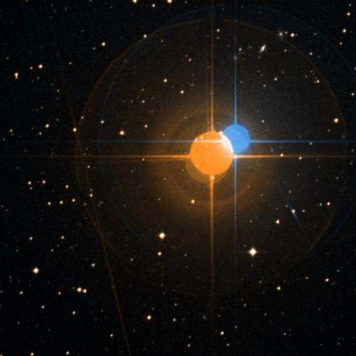
🔭 **[View in Aladin Sky Atlas (DSS2 Optical)](https://aladin.u-strasbg.fr/AladinLite/?target=330.8714+-56.7969&fov=0.5&survey=P/DSS2/color)**
*Multi-wavelength: [DSS2 Optical](https://aladin.u-strasbg.fr/AladinLite/?target=330.8714+-56.7969&fov=0.5&survey=P/DSS2/color) · [2MASS NIR](https://aladin.u-strasbg.fr/AladinLite/?target=330.8714+-56.7969&fov=0.5&survey=P/2MASS/color)*

- **Position:** RA=330.8714°, Dec=-56.7969°
- **Frequency:** 3845.93 MHz
- **SNR:** 4.6
- **Bandwidth:** 414.9729 MHz
- **Drift rate:** -0.1142 Hz/s
- **Detection method(s):** doppler_drift

**Cross-check evidence:**

  - Exoplanet system nearby: eps Ind A b, eps Ind A b, eps Ind A b
  - Doppler drift rate 0.1142 Hz/s consistent with technological origin

### eps Ind A — Score 80/100

🔭 **[View in Aladin Sky Atlas (DSS2 Optical)](https://aladin.u-strasbg.fr/AladinLite/?target=330.8714+-56.7969&fov=0.5&survey=P/DSS2/color)**
*Multi-wavelength: [DSS2 Optical](https://aladin.u-strasbg.fr/AladinLite/?target=330.8714+-56.7969&fov=0.5&survey=P/DSS2/color) · [2MASS NIR](https://aladin.u-strasbg.fr/AladinLite/?target=330.8714+-56.7969&fov=0.5&survey=P/2MASS/color)*

- **Position:** RA=330.8714°, Dec=-56.7969°
- **Frequency:** 6634.11 MHz
- **SNR:** 3.0
- **Bandwidth:** 244.2629 MHz
- **Drift rate:** 0.1433 Hz/s
- **Detection method(s):** doppler_drift

**Cross-check evidence:**

  - Exoplanet system nearby: eps Ind A b, eps Ind A b, eps Ind A b
  - Doppler drift rate 0.1433 Hz/s consistent with technological origin

### eps Ind A — Score 90/100

🔭 **[View in Aladin Sky Atlas (DSS2 Optical)](https://aladin.u-strasbg.fr/AladinLite/?target=330.8714+-56.7969&fov=0.5&survey=P/DSS2/color)**
*Multi-wavelength: [DSS2 Optical](https://aladin.u-strasbg.fr/AladinLite/?target=330.8714+-56.7969&fov=0.5&survey=P/DSS2/color) · [2MASS NIR](https://aladin.u-strasbg.fr/AladinLite/?target=330.8714+-56.7969&fov=0.5&survey=P/2MASS/color)*

- **Position:** RA=330.8714°, Dec=-56.7969°
- **Frequency:** 8536.44 MHz
- **SNR:** 16.1
- **Bandwidth:** 0.00118793 MHz
- **Drift rate:** 0.5832 Hz/s
- **Detection method(s):** doppler_drift

**Cross-check evidence:**

  - Exoplanet system nearby: eps Ind A b, eps Ind A b, eps Ind A b
  - Doppler drift rate 0.5832 Hz/s consistent with technological origin
  - High SNR: 16.1

### eps Ind A — Score 80/100

🔭 **[View in Aladin Sky Atlas (DSS2 Optical)](https://aladin.u-strasbg.fr/AladinLite/?target=330.8714+-56.7969&fov=0.5&survey=P/DSS2/color)**
*Multi-wavelength: [DSS2 Optical](https://aladin.u-strasbg.fr/AladinLite/?target=330.8714+-56.7969&fov=0.5&survey=P/DSS2/color) · [2MASS NIR](https://aladin.u-strasbg.fr/AladinLite/?target=330.8714+-56.7969&fov=0.5&survey=P/2MASS/color)*

- **Position:** RA=330.8714°, Dec=-56.7969°
- **Frequency:** 8577.94 MHz
- **SNR:** 2.4
- **Bandwidth:** 122.2272 MHz
- **Drift rate:** 0.0454 Hz/s
- **Detection method(s):** doppler_drift

**Cross-check evidence:**

  - Exoplanet system nearby: eps Ind A b, eps Ind A b, eps Ind A b
  - Doppler drift rate 0.0454 Hz/s consistent with technological origin

### eps Ind A — Score 80/100

🔭 **[View in Aladin Sky Atlas (DSS2 Optical)](https://aladin.u-strasbg.fr/AladinLite/?target=330.8714+-56.7969&fov=0.5&survey=P/DSS2/color)**
*Multi-wavelength: [DSS2 Optical](https://aladin.u-strasbg.fr/AladinLite/?target=330.8714+-56.7969&fov=0.5&survey=P/DSS2/color) · [2MASS NIR](https://aladin.u-strasbg.fr/AladinLite/?target=330.8714+-56.7969&fov=0.5&survey=P/2MASS/color)*

- **Position:** RA=330.8714°, Dec=-56.7969°
- **Frequency:** 3825.04 MHz
- **SNR:** 2.3
- **Bandwidth:** 397.077 MHz
- **Drift rate:** -0.1991 Hz/s
- **Detection method(s):** doppler_drift

**Cross-check evidence:**

  - Exoplanet system nearby: eps Ind A b, eps Ind A b, eps Ind A b
  - Doppler drift rate 0.1991 Hz/s consistent with technological origin

### HD 20794 — Score 80/100

🔭 **[View in Aladin Sky Atlas (DSS2 Optical)](https://aladin.u-strasbg.fr/AladinLite/?target=49.9998+-43.0667&fov=0.5&survey=P/DSS2/color)**
*Multi-wavelength: [DSS2 Optical](https://aladin.u-strasbg.fr/AladinLite/?target=49.9998+-43.0667&fov=0.5&survey=P/DSS2/color) · [2MASS NIR](https://aladin.u-strasbg.fr/AladinLite/?target=49.9998+-43.0667&fov=0.5&survey=P/2MASS/color)*

- **Position:** RA=49.9998°, Dec=-43.0667°
- **Frequency:** 4350.35 MHz
- **SNR:** 1.9
- **Bandwidth:** 161.4452 MHz
- **Drift rate:** -0.1502 Hz/s
- **Detection method(s):** doppler_drift

**Cross-check evidence:**

  - Exoplanet system nearby: HD 20794 e, HD 20794 b, HD 20794 b
  - Doppler drift rate 0.1502 Hz/s consistent with technological origin

### HD 20794 — Score 80/100

🔭 **[View in Aladin Sky Atlas (DSS2 Optical)](https://aladin.u-strasbg.fr/AladinLite/?target=49.9998+-43.0667&fov=0.5&survey=P/DSS2/color)**
*Multi-wavelength: [DSS2 Optical](https://aladin.u-strasbg.fr/AladinLite/?target=49.9998+-43.0667&fov=0.5&survey=P/DSS2/color) · [2MASS NIR](https://aladin.u-strasbg.fr/AladinLite/?target=49.9998+-43.0667&fov=0.5&survey=P/2MASS/color)*

- **Position:** RA=49.9998°, Dec=-43.0667°
- **Frequency:** 9625.86 MHz
- **SNR:** 3.4
- **Bandwidth:** 498.1858 MHz
- **Drift rate:** -0.0560 Hz/s
- **Detection method(s):** doppler_drift

**Cross-check evidence:**

  - Exoplanet system nearby: HD 20794 e, HD 20794 b, HD 20794 b
  - Doppler drift rate 0.0560 Hz/s consistent with technological origin

### 61 Vir — Score 80/100

🔭 **[View in Aladin Sky Atlas (DSS2 Optical)](https://aladin.u-strasbg.fr/AladinLite/?target=199.5965+-18.3158&fov=0.5&survey=P/DSS2/color)**
*Multi-wavelength: [DSS2 Optical](https://aladin.u-strasbg.fr/AladinLite/?target=199.5965+-18.3158&fov=0.5&survey=P/DSS2/color) · [2MASS NIR](https://aladin.u-strasbg.fr/AladinLite/?target=199.5965+-18.3158&fov=0.5&survey=P/2MASS/color)*

- **Position:** RA=199.5965°, Dec=-18.3158°
- **Frequency:** 9902.20 MHz
- **SNR:** 1.7
- **Bandwidth:** 322.3878 MHz
- **Drift rate:** 0.1336 Hz/s
- **Detection method(s):** doppler_drift

**Cross-check evidence:**

  - Exoplanet system nearby: 61 Vir d, 61 Vir c, 61 Vir b
  - Doppler drift rate 0.1336 Hz/s consistent with technological origin

### 61 Vir — Score 80/100

🔭 **[View in Aladin Sky Atlas (DSS2 Optical)](https://aladin.u-strasbg.fr/AladinLite/?target=199.5965+-18.3158&fov=0.5&survey=P/DSS2/color)**
*Multi-wavelength: [DSS2 Optical](https://aladin.u-strasbg.fr/AladinLite/?target=199.5965+-18.3158&fov=0.5&survey=P/DSS2/color) · [2MASS NIR](https://aladin.u-strasbg.fr/AladinLite/?target=199.5965+-18.3158&fov=0.5&survey=P/2MASS/color)*

- **Position:** RA=199.5965°, Dec=-18.3158°
- **Frequency:** 5034.21 MHz
- **SNR:** 5.6
- **Bandwidth:** 257.0291 MHz
- **Drift rate:** 0.0131 Hz/s
- **Detection method(s):** doppler_drift

**Cross-check evidence:**

  - Exoplanet system nearby: 61 Vir d, 61 Vir c, 61 Vir b
  - Doppler drift rate 0.0131 Hz/s consistent with technological origin

### 61 Vir — Score 80/100

🔭 **[View in Aladin Sky Atlas (DSS2 Optical)](https://aladin.u-strasbg.fr/AladinLite/?target=199.5965+-18.3158&fov=0.5&survey=P/DSS2/color)**
*Multi-wavelength: [DSS2 Optical](https://aladin.u-strasbg.fr/AladinLite/?target=199.5965+-18.3158&fov=0.5&survey=P/DSS2/color) · [2MASS NIR](https://aladin.u-strasbg.fr/AladinLite/?target=199.5965+-18.3158&fov=0.5&survey=P/2MASS/color)*

- **Position:** RA=199.5965°, Dec=-18.3158°
- **Frequency:** 4904.01 MHz
- **SNR:** 2.3
- **Bandwidth:** 287.7308 MHz
- **Drift rate:** -0.0941 Hz/s
- **Detection method(s):** doppler_drift

**Cross-check evidence:**

  - Exoplanet system nearby: 61 Vir d, 61 Vir c, 61 Vir b
  - Doppler drift rate 0.0941 Hz/s consistent with technological origin

### 55 Cnc — Score 80/100

🔭 **[View in Aladin Sky Atlas (DSS2 Optical)](https://aladin.u-strasbg.fr/AladinLite/?target=133.1468+28.3298&fov=0.5&survey=P/DSS2/color)**
*Multi-wavelength: [DSS2 Optical](https://aladin.u-strasbg.fr/AladinLite/?target=133.1468+28.3298&fov=0.5&survey=P/DSS2/color) · [2MASS NIR](https://aladin.u-strasbg.fr/AladinLite/?target=133.1468+28.3298&fov=0.5&survey=P/2MASS/color)*

- **Position:** RA=133.1468°, Dec=28.3298°
- **Frequency:** 1401.84 MHz
- **SNR:** 3.7
- **Bandwidth:** 193.1409 MHz
- **Drift rate:** -0.0539 Hz/s
- **Detection method(s):** doppler_drift

**Cross-check evidence:**

  - Exoplanet system nearby: 55 Cnc b, 55 Cnc d, 55 Cnc e
  - Doppler drift rate 0.0539 Hz/s consistent with technological origin

### 55 Cnc — Score 80/100

🔭 **[View in Aladin Sky Atlas (DSS2 Optical)](https://aladin.u-strasbg.fr/AladinLite/?target=133.1468+28.3298&fov=0.5&survey=P/DSS2/color)**
*Multi-wavelength: [DSS2 Optical](https://aladin.u-strasbg.fr/AladinLite/?target=133.1468+28.3298&fov=0.5&survey=P/DSS2/color) · [2MASS NIR](https://aladin.u-strasbg.fr/AladinLite/?target=133.1468+28.3298&fov=0.5&survey=P/2MASS/color)*

- **Position:** RA=133.1468°, Dec=28.3298°
- **Frequency:** 5439.61 MHz
- **SNR:** 1.2
- **Bandwidth:** 133.6461 MHz
- **Drift rate:** -0.0826 Hz/s
- **Detection method(s):** doppler_drift

**Cross-check evidence:**

  - Exoplanet system nearby: 55 Cnc b, 55 Cnc d, 55 Cnc e
  - Doppler drift rate 0.0826 Hz/s consistent with technological origin

### 55 Cnc — Score 80/100

🔭 **[View in Aladin Sky Atlas (DSS2 Optical)](https://aladin.u-strasbg.fr/AladinLite/?target=133.1468+28.3298&fov=0.5&survey=P/DSS2/color)**
*Multi-wavelength: [DSS2 Optical](https://aladin.u-strasbg.fr/AladinLite/?target=133.1468+28.3298&fov=0.5&survey=P/DSS2/color) · [2MASS NIR](https://aladin.u-strasbg.fr/AladinLite/?target=133.1468+28.3298&fov=0.5&survey=P/2MASS/color)*

- **Position:** RA=133.1468°, Dec=28.3298°
- **Frequency:** 6738.30 MHz
- **SNR:** 2.4
- **Bandwidth:** 359.6596 MHz
- **Drift rate:** -0.0159 Hz/s
- **Detection method(s):** doppler_drift

**Cross-check evidence:**

  - Exoplanet system nearby: 55 Cnc b, 55 Cnc d, 55 Cnc e
  - Doppler drift rate 0.0159 Hz/s consistent with technological origin

### 55 Cnc — Score 80/100

🔭 **[View in Aladin Sky Atlas (DSS2 Optical)](https://aladin.u-strasbg.fr/AladinLite/?target=133.1468+28.3298&fov=0.5&survey=P/DSS2/color)**
*Multi-wavelength: [DSS2 Optical](https://aladin.u-strasbg.fr/AladinLite/?target=133.1468+28.3298&fov=0.5&survey=P/DSS2/color) · [2MASS NIR](https://aladin.u-strasbg.fr/AladinLite/?target=133.1468+28.3298&fov=0.5&survey=P/2MASS/color)*

- **Position:** RA=133.1468°, Dec=28.3298°
- **Frequency:** 4299.48 MHz
- **SNR:** 3.8
- **Bandwidth:** 315.811 MHz
- **Drift rate:** 0.0385 Hz/s
- **Detection method(s):** doppler_drift

**Cross-check evidence:**

  - Exoplanet system nearby: 55 Cnc b, 55 Cnc d, 55 Cnc e
  - Doppler drift rate 0.0385 Hz/s consistent with technological origin

### 55 Cnc — Score 80/100

🔭 **[View in Aladin Sky Atlas (DSS2 Optical)](https://aladin.u-strasbg.fr/AladinLite/?target=133.1468+28.3298&fov=0.5&survey=P/DSS2/color)**
*Multi-wavelength: [DSS2 Optical](https://aladin.u-strasbg.fr/AladinLite/?target=133.1468+28.3298&fov=0.5&survey=P/DSS2/color) · [2MASS NIR](https://aladin.u-strasbg.fr/AladinLite/?target=133.1468+28.3298&fov=0.5&survey=P/2MASS/color)*

- **Position:** RA=133.1468°, Dec=28.3298°
- **Frequency:** 7917.65 MHz
- **SNR:** 2.6
- **Bandwidth:** 440.8062 MHz
- **Drift rate:** -0.0307 Hz/s
- **Detection method(s):** doppler_drift

**Cross-check evidence:**

  - Exoplanet system nearby: 55 Cnc b, 55 Cnc d, 55 Cnc e
  - Doppler drift rate 0.0307 Hz/s consistent with technological origin

### ups And — Score 80/100

🔭 **[View in Aladin Sky Atlas (DSS2 Optical)](https://aladin.u-strasbg.fr/AladinLite/?target=24.1984+41.4038&fov=0.5&survey=P/DSS2/color)**
*Multi-wavelength: [DSS2 Optical](https://aladin.u-strasbg.fr/AladinLite/?target=24.1984+41.4038&fov=0.5&survey=P/DSS2/color) · [2MASS NIR](https://aladin.u-strasbg.fr/AladinLite/?target=24.1984+41.4038&fov=0.5&survey=P/2MASS/color)*

- **Position:** RA=24.1984°, Dec=41.4038°
- **Frequency:** 6677.49 MHz
- **SNR:** 4.3
- **Bandwidth:** 171.0026 MHz
- **Drift rate:** 0.0739 Hz/s
- **Detection method(s):** doppler_drift

**Cross-check evidence:**

  - Exoplanet system nearby: ups And c, ups And d, ups And d
  - Doppler drift rate 0.0739 Hz/s consistent with technological origin

### HD 136352 — Score 80/100

🔭 **[View in Aladin Sky Atlas (DSS2 Optical)](https://aladin.u-strasbg.fr/AladinLite/?target=230.4401+-48.3188&fov=0.5&survey=P/DSS2/color)**
*Multi-wavelength: [DSS2 Optical](https://aladin.u-strasbg.fr/AladinLite/?target=230.4401+-48.3188&fov=0.5&survey=P/DSS2/color) · [2MASS NIR](https://aladin.u-strasbg.fr/AladinLite/?target=230.4401+-48.3188&fov=0.5&survey=P/2MASS/color)*

- **Position:** RA=230.4401°, Dec=-48.3188°
- **Frequency:** 6583.22 MHz
- **SNR:** 2.4
- **Bandwidth:** 291.0023 MHz
- **Drift rate:** 0.0363 Hz/s
- **Detection method(s):** doppler_drift

**Cross-check evidence:**

  - Exoplanet system nearby: HD 136352 d, HD 136352 d, HD 136352 b
  - Doppler drift rate 0.0363 Hz/s consistent with technological origin

### HD 136352 — Score 80/100

🔭 **[View in Aladin Sky Atlas (DSS2 Optical)](https://aladin.u-strasbg.fr/AladinLite/?target=230.4401+-48.3188&fov=0.5&survey=P/DSS2/color)**
*Multi-wavelength: [DSS2 Optical](https://aladin.u-strasbg.fr/AladinLite/?target=230.4401+-48.3188&fov=0.5&survey=P/DSS2/color) · [2MASS NIR](https://aladin.u-strasbg.fr/AladinLite/?target=230.4401+-48.3188&fov=0.5&survey=P/2MASS/color)*

- **Position:** RA=230.4401°, Dec=-48.3188°
- **Frequency:** 7486.26 MHz
- **SNR:** 2.3
- **Bandwidth:** 485.2845 MHz
- **Drift rate:** -0.1072 Hz/s
- **Detection method(s):** doppler_drift

**Cross-check evidence:**

  - Exoplanet system nearby: HD 136352 d, HD 136352 d, HD 136352 b
  - Doppler drift rate 0.1072 Hz/s consistent with technological origin

### HD 136352 — Score 80/100

🔭 **[View in Aladin Sky Atlas (DSS2 Optical)](https://aladin.u-strasbg.fr/AladinLite/?target=230.4401+-48.3188&fov=0.5&survey=P/DSS2/color)**
*Multi-wavelength: [DSS2 Optical](https://aladin.u-strasbg.fr/AladinLite/?target=230.4401+-48.3188&fov=0.5&survey=P/DSS2/color) · [2MASS NIR](https://aladin.u-strasbg.fr/AladinLite/?target=230.4401+-48.3188&fov=0.5&survey=P/2MASS/color)*

- **Position:** RA=230.4401°, Dec=-48.3188°
- **Frequency:** 7591.72 MHz
- **SNR:** 1.8
- **Bandwidth:** 276.0355 MHz
- **Drift rate:** 0.0235 Hz/s
- **Detection method(s):** doppler_drift

**Cross-check evidence:**

  - Exoplanet system nearby: HD 136352 d, HD 136352 d, HD 136352 b
  - Doppler drift rate 0.0235 Hz/s consistent with technological origin

### HD 136352 — Score 80/100

🔭 **[View in Aladin Sky Atlas (DSS2 Optical)](https://aladin.u-strasbg.fr/AladinLite/?target=230.4401+-48.3188&fov=0.5&survey=P/DSS2/color)**
*Multi-wavelength: [DSS2 Optical](https://aladin.u-strasbg.fr/AladinLite/?target=230.4401+-48.3188&fov=0.5&survey=P/DSS2/color) · [2MASS NIR](https://aladin.u-strasbg.fr/AladinLite/?target=230.4401+-48.3188&fov=0.5&survey=P/2MASS/color)*

- **Position:** RA=230.4401°, Dec=-48.3188°
- **Frequency:** 9861.20 MHz
- **SNR:** 6.8
- **Bandwidth:** 215.2913 MHz
- **Drift rate:** -0.1652 Hz/s
- **Detection method(s):** doppler_drift

**Cross-check evidence:**

  - Exoplanet system nearby: HD 136352 d, HD 136352 d, HD 136352 b
  - Doppler drift rate 0.1652 Hz/s consistent with technological origin

### HD 136352 — Score 80/100

🔭 **[View in Aladin Sky Atlas (DSS2 Optical)](https://aladin.u-strasbg.fr/AladinLite/?target=230.4401+-48.3188&fov=0.5&survey=P/DSS2/color)**
*Multi-wavelength: [DSS2 Optical](https://aladin.u-strasbg.fr/AladinLite/?target=230.4401+-48.3188&fov=0.5&survey=P/DSS2/color) · [2MASS NIR](https://aladin.u-strasbg.fr/AladinLite/?target=230.4401+-48.3188&fov=0.5&survey=P/2MASS/color)*

- **Position:** RA=230.4401°, Dec=-48.3188°
- **Frequency:** 1368.52 MHz
- **SNR:** 2.1
- **Bandwidth:** 410.9373 MHz
- **Drift rate:** 0.0813 Hz/s
- **Detection method(s):** doppler_drift

**Cross-check evidence:**

  - Exoplanet system nearby: HD 136352 d, HD 136352 d, HD 136352 b
  - Doppler drift rate 0.0813 Hz/s consistent with technological origin

### HD 136352 — Score 80/100

🔭 **[View in Aladin Sky Atlas (DSS2 Optical)](https://aladin.u-strasbg.fr/AladinLite/?target=230.4401+-48.3188&fov=0.5&survey=P/DSS2/color)**
*Multi-wavelength: [DSS2 Optical](https://aladin.u-strasbg.fr/AladinLite/?target=230.4401+-48.3188&fov=0.5&survey=P/DSS2/color) · [2MASS NIR](https://aladin.u-strasbg.fr/AladinLite/?target=230.4401+-48.3188&fov=0.5&survey=P/2MASS/color)*

- **Position:** RA=230.4401°, Dec=-48.3188°
- **Frequency:** 9801.25 MHz
- **SNR:** 2.0
- **Bandwidth:** 264.6304 MHz
- **Drift rate:** 0.1274 Hz/s
- **Detection method(s):** doppler_drift

**Cross-check evidence:**

  - Exoplanet system nearby: HD 136352 d, HD 136352 d, HD 136352 b
  - Doppler drift rate 0.1274 Hz/s consistent with technological origin

### HD 136352 — Score 90/100

🔭 **[View in Aladin Sky Atlas (DSS2 Optical)](https://aladin.u-strasbg.fr/AladinLite/?target=230.4401+-48.3188&fov=0.5&survey=P/DSS2/color)**
*Multi-wavelength: [DSS2 Optical](https://aladin.u-strasbg.fr/AladinLite/?target=230.4401+-48.3188&fov=0.5&survey=P/DSS2/color) · [2MASS NIR](https://aladin.u-strasbg.fr/AladinLite/?target=230.4401+-48.3188&fov=0.5&survey=P/2MASS/color)*

- **Position:** RA=230.4401°, Dec=-48.3188°
- **Frequency:** 1438.29 MHz
- **SNR:** 20.4
- **Bandwidth:** 143.7129 MHz
- **Drift rate:** -1.2093 Hz/s
- **Detection method(s):** doppler_drift

**Cross-check evidence:**

  - Exoplanet system nearby: HD 136352 d, HD 136352 d, HD 136352 b
  - Doppler drift rate 1.2093 Hz/s consistent with technological origin
  - High SNR: 20.4

### HD 160691 — Score 80/100

🔭 **[View in Aladin Sky Atlas (DSS2 Optical)](https://aladin.u-strasbg.fr/AladinLite/?target=266.0362+-51.8349&fov=0.5&survey=P/DSS2/color)**
*Multi-wavelength: [DSS2 Optical](https://aladin.u-strasbg.fr/AladinLite/?target=266.0362+-51.8349&fov=0.5&survey=P/DSS2/color) · [2MASS NIR](https://aladin.u-strasbg.fr/AladinLite/?target=266.0362+-51.8349&fov=0.5&survey=P/2MASS/color)*

- **Position:** RA=266.0362°, Dec=-51.8349°
- **Frequency:** 8789.11 MHz
- **SNR:** 3.9
- **Bandwidth:** 395.7726 MHz
- **Drift rate:** 0.0242 Hz/s
- **Detection method(s):** doppler_drift

**Cross-check evidence:**

  - Exoplanet system nearby: HD 160691 b, HD 160691 b, HD 160691 b
  - Doppler drift rate 0.0242 Hz/s consistent with technological origin

### HR 810 — Score 80/100

🔭 **[View in Aladin Sky Atlas (DSS2 Optical)](https://aladin.u-strasbg.fr/AladinLite/?target=40.6417+-50.7993&fov=0.5&survey=P/DSS2/color)**
*Multi-wavelength: [DSS2 Optical](https://aladin.u-strasbg.fr/AladinLite/?target=40.6417+-50.7993&fov=0.5&survey=P/DSS2/color) · [2MASS NIR](https://aladin.u-strasbg.fr/AladinLite/?target=40.6417+-50.7993&fov=0.5&survey=P/2MASS/color)*

- **Position:** RA=40.6417°, Dec=-50.7993°
- **Frequency:** 7095.59 MHz
- **SNR:** 2.1
- **Bandwidth:** 111.8429 MHz
- **Drift rate:** -0.0412 Hz/s
- **Detection method(s):** doppler_drift

**Cross-check evidence:**

  - Exoplanet system nearby: HR 810 b, HR 810 b, HR 810 b
  - Doppler drift rate 0.0412 Hz/s consistent with technological origin

### HR 810 — Score 80/100

🔭 **[View in Aladin Sky Atlas (DSS2 Optical)](https://aladin.u-strasbg.fr/AladinLite/?target=40.6417+-50.7993&fov=0.5&survey=P/DSS2/color)**
*Multi-wavelength: [DSS2 Optical](https://aladin.u-strasbg.fr/AladinLite/?target=40.6417+-50.7993&fov=0.5&survey=P/DSS2/color) · [2MASS NIR](https://aladin.u-strasbg.fr/AladinLite/?target=40.6417+-50.7993&fov=0.5&survey=P/2MASS/color)*

- **Position:** RA=40.6417°, Dec=-50.7993°
- **Frequency:** 3138.93 MHz
- **SNR:** 6.1
- **Bandwidth:** 441.1125 MHz
- **Drift rate:** 0.2549 Hz/s
- **Detection method(s):** doppler_drift

**Cross-check evidence:**

  - Exoplanet system nearby: HR 810 b, HR 810 b, HR 810 b
  - Doppler drift rate 0.2549 Hz/s consistent with technological origin

### HD 10647 — Score 80/100

🔭 **[View in Aladin Sky Atlas (DSS2 Optical)](https://aladin.u-strasbg.fr/AladinLite/?target=25.6234+-53.7413&fov=0.5&survey=P/DSS2/color)**
*Multi-wavelength: [DSS2 Optical](https://aladin.u-strasbg.fr/AladinLite/?target=25.6234+-53.7413&fov=0.5&survey=P/DSS2/color) · [2MASS NIR](https://aladin.u-strasbg.fr/AladinLite/?target=25.6234+-53.7413&fov=0.5&survey=P/2MASS/color)*

- **Position:** RA=25.6234°, Dec=-53.7413°
- **Frequency:** 9988.69 MHz
- **SNR:** 2.3
- **Bandwidth:** 218.5448 MHz
- **Drift rate:** -0.0142 Hz/s
- **Detection method(s):** doppler_drift

**Cross-check evidence:**

  - Exoplanet system nearby: HD 10647 b, HD 10647 b, HD 10647 b
  - Doppler drift rate 0.0142 Hz/s consistent with technological origin

### rho CrB — Score 80/100

🔭 **[View in Aladin Sky Atlas (DSS2 Optical)](https://aladin.u-strasbg.fr/AladinLite/?target=240.2601+33.3002&fov=0.5&survey=P/DSS2/color)**
*Multi-wavelength: [DSS2 Optical](https://aladin.u-strasbg.fr/AladinLite/?target=240.2601+33.3002&fov=0.5&survey=P/DSS2/color) · [2MASS NIR](https://aladin.u-strasbg.fr/AladinLite/?target=240.2601+33.3002&fov=0.5&survey=P/2MASS/color)*

- **Position:** RA=240.2601°, Dec=33.3002°
- **Frequency:** 9978.22 MHz
- **SNR:** 1.1
- **Bandwidth:** 380.3524 MHz
- **Drift rate:** 0.0164 Hz/s
- **Detection method(s):** doppler_drift

**Cross-check evidence:**

  - Exoplanet system nearby: rho CrB c, rho CrB c, rho CrB e
  - Doppler drift rate 0.0164 Hz/s consistent with technological origin

### rho CrB — Score 80/100

🔭 **[View in Aladin Sky Atlas (DSS2 Optical)](https://aladin.u-strasbg.fr/AladinLite/?target=240.2601+33.3002&fov=0.5&survey=P/DSS2/color)**
*Multi-wavelength: [DSS2 Optical](https://aladin.u-strasbg.fr/AladinLite/?target=240.2601+33.3002&fov=0.5&survey=P/DSS2/color) · [2MASS NIR](https://aladin.u-strasbg.fr/AladinLite/?target=240.2601+33.3002&fov=0.5&survey=P/2MASS/color)*

- **Position:** RA=240.2601°, Dec=33.3002°
- **Frequency:** 5472.25 MHz
- **SNR:** 6.3
- **Bandwidth:** 153.7468 MHz
- **Drift rate:** -0.1104 Hz/s
- **Detection method(s):** doppler_drift

**Cross-check evidence:**

  - Exoplanet system nearby: rho CrB c, rho CrB c, rho CrB e
  - Doppler drift rate 0.1104 Hz/s consistent with technological origin

### rho CrB — Score 80/100

🔭 **[View in Aladin Sky Atlas (DSS2 Optical)](https://aladin.u-strasbg.fr/AladinLite/?target=240.2601+33.3002&fov=0.5&survey=P/DSS2/color)**
*Multi-wavelength: [DSS2 Optical](https://aladin.u-strasbg.fr/AladinLite/?target=240.2601+33.3002&fov=0.5&survey=P/DSS2/color) · [2MASS NIR](https://aladin.u-strasbg.fr/AladinLite/?target=240.2601+33.3002&fov=0.5&survey=P/2MASS/color)*

- **Position:** RA=240.2601°, Dec=33.3002°
- **Frequency:** 4783.44 MHz
- **SNR:** 2.7
- **Bandwidth:** 483.6837 MHz
- **Drift rate:** -0.0902 Hz/s
- **Detection method(s):** doppler_drift

**Cross-check evidence:**

  - Exoplanet system nearby: rho CrB c, rho CrB c, rho CrB e
  - Doppler drift rate 0.0902 Hz/s consistent with technological origin

### rho CrB — Score 80/100

🔭 **[View in Aladin Sky Atlas (DSS2 Optical)](https://aladin.u-strasbg.fr/AladinLite/?target=240.2601+33.3002&fov=0.5&survey=P/DSS2/color)**
*Multi-wavelength: [DSS2 Optical](https://aladin.u-strasbg.fr/AladinLite/?target=240.2601+33.3002&fov=0.5&survey=P/DSS2/color) · [2MASS NIR](https://aladin.u-strasbg.fr/AladinLite/?target=240.2601+33.3002&fov=0.5&survey=P/2MASS/color)*

- **Position:** RA=240.2601°, Dec=33.3002°
- **Frequency:** 7680.86 MHz
- **SNR:** 3.1
- **Bandwidth:** 336.2979 MHz
- **Drift rate:** -0.0714 Hz/s
- **Detection method(s):** doppler_drift

**Cross-check evidence:**

  - Exoplanet system nearby: rho CrB c, rho CrB c, rho CrB e
  - Doppler drift rate 0.0714 Hz/s consistent with technological origin

### HD 189567 — Score 80/100

🔭 **[View in Aladin Sky Atlas (DSS2 Optical)](https://aladin.u-strasbg.fr/AladinLite/?target=301.3960+-67.3238&fov=0.5&survey=P/DSS2/color)**
*Multi-wavelength: [DSS2 Optical](https://aladin.u-strasbg.fr/AladinLite/?target=301.3960+-67.3238&fov=0.5&survey=P/DSS2/color) · [2MASS NIR](https://aladin.u-strasbg.fr/AladinLite/?target=301.3960+-67.3238&fov=0.5&survey=P/2MASS/color)*

- **Position:** RA=301.3960°, Dec=-67.3238°
- **Frequency:** 3902.43 MHz
- **SNR:** 8.9
- **Bandwidth:** 162.1766 MHz
- **Drift rate:** 0.0420 Hz/s
- **Detection method(s):** doppler_drift

**Cross-check evidence:**

  - Exoplanet system nearby: HD 189567 b, HD 189567 c, HD 189567 b
  - Doppler drift rate 0.0420 Hz/s consistent with technological origin

### HD 189567 — Score 80/100

🔭 **[View in Aladin Sky Atlas (DSS2 Optical)](https://aladin.u-strasbg.fr/AladinLite/?target=301.3960+-67.3238&fov=0.5&survey=P/DSS2/color)**
*Multi-wavelength: [DSS2 Optical](https://aladin.u-strasbg.fr/AladinLite/?target=301.3960+-67.3238&fov=0.5&survey=P/DSS2/color) · [2MASS NIR](https://aladin.u-strasbg.fr/AladinLite/?target=301.3960+-67.3238&fov=0.5&survey=P/2MASS/color)*

- **Position:** RA=301.3960°, Dec=-67.3238°
- **Frequency:** 7071.38 MHz
- **SNR:** 2.1
- **Bandwidth:** 425.8554 MHz
- **Drift rate:** -0.0435 Hz/s
- **Detection method(s):** doppler_drift

**Cross-check evidence:**

  - Exoplanet system nearby: HD 189567 b, HD 189567 c, HD 189567 b
  - Doppler drift rate 0.0435 Hz/s consistent with technological origin

### HD 99492 — Score 80/100

🔭 **[View in Aladin Sky Atlas (DSS2 Optical)](https://aladin.u-strasbg.fr/AladinLite/?target=171.6897+3.0071&fov=0.5&survey=P/DSS2/color)**
*Multi-wavelength: [DSS2 Optical](https://aladin.u-strasbg.fr/AladinLite/?target=171.6897+3.0071&fov=0.5&survey=P/DSS2/color) · [2MASS NIR](https://aladin.u-strasbg.fr/AladinLite/?target=171.6897+3.0071&fov=0.5&survey=P/2MASS/color)*

- **Position:** RA=171.6897°, Dec=3.0071°
- **Frequency:** 5614.59 MHz
- **SNR:** 4.4
- **Bandwidth:** 273.189 MHz
- **Drift rate:** -0.2252 Hz/s
- **Detection method(s):** doppler_drift

**Cross-check evidence:**

  - Exoplanet system nearby: HD 99492 b, HD 99492 b, HD 99492 b
  - Doppler drift rate 0.2252 Hz/s consistent with technological origin

### GJ 3222 — Score 80/100

🔭 **[View in Aladin Sky Atlas (DSS2 Optical)](https://aladin.u-strasbg.fr/AladinLite/?target=50.8972+-40.0762&fov=0.5&survey=P/DSS2/color)**
*Multi-wavelength: [DSS2 Optical](https://aladin.u-strasbg.fr/AladinLite/?target=50.8972+-40.0762&fov=0.5&survey=P/DSS2/color) · [2MASS NIR](https://aladin.u-strasbg.fr/AladinLite/?target=50.8972+-40.0762&fov=0.5&survey=P/2MASS/color)*

- **Position:** RA=50.8972°, Dec=-40.0762°
- **Frequency:** 1369.71 MHz
- **SNR:** 1.7
- **Bandwidth:** 198.4266 MHz
- **Drift rate:** -0.0915 Hz/s
- **Detection method(s):** doppler_drift

**Cross-check evidence:**

  - Exoplanet system nearby: GJ 3222 b
  - Doppler drift rate 0.0915 Hz/s consistent with technological origin

### HD 154345 — Score 80/100

🔭 **[View in Aladin Sky Atlas (DSS2 Optical)](https://aladin.u-strasbg.fr/AladinLite/?target=255.6525+47.0856&fov=0.5&survey=P/DSS2/color)**
*Multi-wavelength: [DSS2 Optical](https://aladin.u-strasbg.fr/AladinLite/?target=255.6525+47.0856&fov=0.5&survey=P/DSS2/color) · [2MASS NIR](https://aladin.u-strasbg.fr/AladinLite/?target=255.6525+47.0856&fov=0.5&survey=P/2MASS/color)*

- **Position:** RA=255.6525°, Dec=47.0856°
- **Frequency:** 7283.71 MHz
- **SNR:** 3.6
- **Bandwidth:** 182.8082 MHz
- **Drift rate:** -0.0222 Hz/s
- **Detection method(s):** doppler_drift

**Cross-check evidence:**

  - Exoplanet system nearby: HD 154345 b, HD 154345 b, HD 154345 b
  - Doppler drift rate 0.0222 Hz/s consistent with technological origin

### HD 189733 — Score 80/100

🔭 **[View in Aladin Sky Atlas (DSS2 Optical)](https://aladin.u-strasbg.fr/AladinLite/?target=300.1821+22.7098&fov=0.5&survey=P/DSS2/color)**
*Multi-wavelength: [DSS2 Optical](https://aladin.u-strasbg.fr/AladinLite/?target=300.1821+22.7098&fov=0.5&survey=P/DSS2/color) · [2MASS NIR](https://aladin.u-strasbg.fr/AladinLite/?target=300.1821+22.7098&fov=0.5&survey=P/2MASS/color)*

- **Position:** RA=300.1821°, Dec=22.7098°
- **Frequency:** 5405.52 MHz
- **SNR:** 3.8
- **Bandwidth:** 233.2377 MHz
- **Drift rate:** -0.0351 Hz/s
- **Detection method(s):** doppler_drift

**Cross-check evidence:**

  - Exoplanet system nearby: HD 189733 b, HD 189733 b, HD 189733 b
  - Doppler drift rate 0.0351 Hz/s consistent with technological origin

### HD 189733 — Score 80/100

🔭 **[View in Aladin Sky Atlas (DSS2 Optical)](https://aladin.u-strasbg.fr/AladinLite/?target=300.1821+22.7098&fov=0.5&survey=P/DSS2/color)**
*Multi-wavelength: [DSS2 Optical](https://aladin.u-strasbg.fr/AladinLite/?target=300.1821+22.7098&fov=0.5&survey=P/DSS2/color) · [2MASS NIR](https://aladin.u-strasbg.fr/AladinLite/?target=300.1821+22.7098&fov=0.5&survey=P/2MASS/color)*

- **Position:** RA=300.1821°, Dec=22.7098°
- **Frequency:** 3343.14 MHz
- **SNR:** 0.9
- **Bandwidth:** 228.9962 MHz
- **Drift rate:** -0.1497 Hz/s
- **Detection method(s):** doppler_drift

**Cross-check evidence:**

  - Exoplanet system nearby: HD 189733 b, HD 189733 b, HD 189733 b
  - Doppler drift rate 0.1497 Hz/s consistent with technological origin

### HD 189733 — Score 80/100

🔭 **[View in Aladin Sky Atlas (DSS2 Optical)](https://aladin.u-strasbg.fr/AladinLite/?target=300.1821+22.7098&fov=0.5&survey=P/DSS2/color)**
*Multi-wavelength: [DSS2 Optical](https://aladin.u-strasbg.fr/AladinLite/?target=300.1821+22.7098&fov=0.5&survey=P/DSS2/color) · [2MASS NIR](https://aladin.u-strasbg.fr/AladinLite/?target=300.1821+22.7098&fov=0.5&survey=P/2MASS/color)*

- **Position:** RA=300.1821°, Dec=22.7098°
- **Frequency:** 7149.33 MHz
- **SNR:** 3.1
- **Bandwidth:** 191.3012 MHz
- **Drift rate:** 0.0767 Hz/s
- **Detection method(s):** doppler_drift

**Cross-check evidence:**

  - Exoplanet system nearby: HD 189733 b, HD 189733 b, HD 189733 b
  - Doppler drift rate 0.0767 Hz/s consistent with technological origin

### HD 189733 — Score 80/100

🔭 **[View in Aladin Sky Atlas (DSS2 Optical)](https://aladin.u-strasbg.fr/AladinLite/?target=300.1821+22.7098&fov=0.5&survey=P/DSS2/color)**
*Multi-wavelength: [DSS2 Optical](https://aladin.u-strasbg.fr/AladinLite/?target=300.1821+22.7098&fov=0.5&survey=P/DSS2/color) · [2MASS NIR](https://aladin.u-strasbg.fr/AladinLite/?target=300.1821+22.7098&fov=0.5&survey=P/2MASS/color)*

- **Position:** RA=300.1821°, Dec=22.7098°
- **Frequency:** 5146.93 MHz
- **SNR:** 2.8
- **Bandwidth:** 384.6232 MHz
- **Drift rate:** 0.0549 Hz/s
- **Detection method(s):** doppler_drift

**Cross-check evidence:**

  - Exoplanet system nearby: HD 189733 b, HD 189733 b, HD 189733 b
  - Doppler drift rate 0.0549 Hz/s consistent with technological origin

### HD 114783 — Score 80/100

🔭 **[View in Aladin Sky Atlas (DSS2 Optical)](https://aladin.u-strasbg.fr/AladinLite/?target=198.1818+-2.2650&fov=0.5&survey=P/DSS2/color)**
*Multi-wavelength: [DSS2 Optical](https://aladin.u-strasbg.fr/AladinLite/?target=198.1818+-2.2650&fov=0.5&survey=P/DSS2/color) · [2MASS NIR](https://aladin.u-strasbg.fr/AladinLite/?target=198.1818+-2.2650&fov=0.5&survey=P/2MASS/color)*

- **Position:** RA=198.1818°, Dec=-2.2650°
- **Frequency:** 6581.34 MHz
- **SNR:** 4.9
- **Bandwidth:** 196.6556 MHz
- **Drift rate:** -0.1021 Hz/s
- **Detection method(s):** doppler_drift

**Cross-check evidence:**

  - Exoplanet system nearby: HD 114783 b, HD 114783 c, HD 114783 c
  - Doppler drift rate 0.1021 Hz/s consistent with technological origin

### HD 114783 — Score 80/100

🔭 **[View in Aladin Sky Atlas (DSS2 Optical)](https://aladin.u-strasbg.fr/AladinLite/?target=198.1818+-2.2650&fov=0.5&survey=P/DSS2/color)**
*Multi-wavelength: [DSS2 Optical](https://aladin.u-strasbg.fr/AladinLite/?target=198.1818+-2.2650&fov=0.5&survey=P/DSS2/color) · [2MASS NIR](https://aladin.u-strasbg.fr/AladinLite/?target=198.1818+-2.2650&fov=0.5&survey=P/2MASS/color)*

- **Position:** RA=198.1818°, Dec=-2.2650°
- **Frequency:** 8699.42 MHz
- **SNR:** 2.3
- **Bandwidth:** 201.7054 MHz
- **Drift rate:** -0.1015 Hz/s
- **Detection method(s):** doppler_drift

**Cross-check evidence:**

  - Exoplanet system nearby: HD 114783 b, HD 114783 c, HD 114783 c
  - Doppler drift rate 0.1015 Hz/s consistent with technological origin

### HD 114783 — Score 80/100

🔭 **[View in Aladin Sky Atlas (DSS2 Optical)](https://aladin.u-strasbg.fr/AladinLite/?target=198.1818+-2.2650&fov=0.5&survey=P/DSS2/color)**
*Multi-wavelength: [DSS2 Optical](https://aladin.u-strasbg.fr/AladinLite/?target=198.1818+-2.2650&fov=0.5&survey=P/DSS2/color) · [2MASS NIR](https://aladin.u-strasbg.fr/AladinLite/?target=198.1818+-2.2650&fov=0.5&survey=P/2MASS/color)*

- **Position:** RA=198.1818°, Dec=-2.2650°
- **Frequency:** 6430.82 MHz
- **SNR:** 4.8
- **Bandwidth:** 493.8598 MHz
- **Drift rate:** -0.0921 Hz/s
- **Detection method(s):** doppler_drift

**Cross-check evidence:**

  - Exoplanet system nearby: HD 114783 b, HD 114783 c, HD 114783 c
  - Doppler drift rate 0.0921 Hz/s consistent with technological origin

### psi1 Dra B — Score 80/100

🔭 **[View in Aladin Sky Atlas (DSS2 Optical)](https://aladin.u-strasbg.fr/AladinLite/?target=265.4926+72.1557&fov=0.5&survey=P/DSS2/color)**
*Multi-wavelength: [DSS2 Optical](https://aladin.u-strasbg.fr/AladinLite/?target=265.4926+72.1557&fov=0.5&survey=P/DSS2/color) · [2MASS NIR](https://aladin.u-strasbg.fr/AladinLite/?target=265.4926+72.1557&fov=0.5&survey=P/2MASS/color)*

- **Position:** RA=265.4926°, Dec=72.1557°
- **Frequency:** 7526.65 MHz
- **SNR:** 6.5
- **Bandwidth:** 383.2365 MHz
- **Drift rate:** 0.1359 Hz/s
- **Detection method(s):** doppler_drift

**Cross-check evidence:**

  - Exoplanet system nearby: psi1 Dra B b
  - Doppler drift rate 0.1359 Hz/s consistent with technological origin

### DMPP-4 — Score 80/100

🔭 **[View in Aladin Sky Atlas (DSS2 Optical)](https://aladin.u-strasbg.fr/AladinLite/?target=293.5827+51.2358&fov=0.5&survey=P/DSS2/color)**
*Multi-wavelength: [DSS2 Optical](https://aladin.u-strasbg.fr/AladinLite/?target=293.5827+51.2358&fov=0.5&survey=P/DSS2/color) · [2MASS NIR](https://aladin.u-strasbg.fr/AladinLite/?target=293.5827+51.2358&fov=0.5&survey=P/2MASS/color)*

- **Position:** RA=293.5827°, Dec=51.2358°
- **Frequency:** 9937.76 MHz
- **SNR:** 2.7
- **Bandwidth:** 333.8555 MHz
- **Drift rate:** 0.0249 Hz/s
- **Detection method(s):** doppler_drift

**Cross-check evidence:**

  - Exoplanet system nearby: DMPP-4 b
  - Doppler drift rate 0.0249 Hz/s consistent with technological origin

### HD 60532 — Score 80/100

🔭 **[View in Aladin Sky Atlas (DSS2 Optical)](https://aladin.u-strasbg.fr/AladinLite/?target=113.5131+-22.2959&fov=0.5&survey=P/DSS2/color)**
*Multi-wavelength: [DSS2 Optical](https://aladin.u-strasbg.fr/AladinLite/?target=113.5131+-22.2959&fov=0.5&survey=P/DSS2/color) · [2MASS NIR](https://aladin.u-strasbg.fr/AladinLite/?target=113.5131+-22.2959&fov=0.5&survey=P/2MASS/color)*

- **Position:** RA=113.5131°, Dec=-22.2959°
- **Frequency:** 7825.80 MHz
- **SNR:** 2.3
- **Bandwidth:** 493.3668 MHz
- **Drift rate:** 0.0217 Hz/s
- **Detection method(s):** doppler_drift

**Cross-check evidence:**

  - Exoplanet system nearby: HD 60532 c, HD 60532 b, HD 60532 b
  - Doppler drift rate 0.0217 Hz/s consistent with technological origin

### HD 134606 — Score 80/100

🔭 **[View in Aladin Sky Atlas (DSS2 Optical)](https://aladin.u-strasbg.fr/AladinLite/?target=228.8104+-70.5203&fov=0.5&survey=P/DSS2/color)**
*Multi-wavelength: [DSS2 Optical](https://aladin.u-strasbg.fr/AladinLite/?target=228.8104+-70.5203&fov=0.5&survey=P/DSS2/color) · [2MASS NIR](https://aladin.u-strasbg.fr/AladinLite/?target=228.8104+-70.5203&fov=0.5&survey=P/2MASS/color)*

- **Position:** RA=228.8104°, Dec=-70.5203°
- **Frequency:** 8905.29 MHz
- **SNR:** 2.6
- **Bandwidth:** 251.6211 MHz
- **Drift rate:** 0.1214 Hz/s
- **Detection method(s):** doppler_drift

**Cross-check evidence:**

  - Exoplanet system nearby: HD 134606 f, HD 134606 d, HD 134606 c
  - Doppler drift rate 0.1214 Hz/s consistent with technological origin

### HD 134606 — Score 80/100

🔭 **[View in Aladin Sky Atlas (DSS2 Optical)](https://aladin.u-strasbg.fr/AladinLite/?target=228.8104+-70.5203&fov=0.5&survey=P/DSS2/color)**
*Multi-wavelength: [DSS2 Optical](https://aladin.u-strasbg.fr/AladinLite/?target=228.8104+-70.5203&fov=0.5&survey=P/DSS2/color) · [2MASS NIR](https://aladin.u-strasbg.fr/AladinLite/?target=228.8104+-70.5203&fov=0.5&survey=P/2MASS/color)*

- **Position:** RA=228.8104°, Dec=-70.5203°
- **Frequency:** 7580.22 MHz
- **SNR:** 5.9
- **Bandwidth:** 413.1841 MHz
- **Drift rate:** -0.1128 Hz/s
- **Detection method(s):** doppler_drift

**Cross-check evidence:**

  - Exoplanet system nearby: HD 134606 f, HD 134606 d, HD 134606 c
  - Doppler drift rate 0.1128 Hz/s consistent with technological origin

### HD 134606 — Score 80/100

🔭 **[View in Aladin Sky Atlas (DSS2 Optical)](https://aladin.u-strasbg.fr/AladinLite/?target=228.8104+-70.5203&fov=0.5&survey=P/DSS2/color)**
*Multi-wavelength: [DSS2 Optical](https://aladin.u-strasbg.fr/AladinLite/?target=228.8104+-70.5203&fov=0.5&survey=P/DSS2/color) · [2MASS NIR](https://aladin.u-strasbg.fr/AladinLite/?target=228.8104+-70.5203&fov=0.5&survey=P/2MASS/color)*

- **Position:** RA=228.8104°, Dec=-70.5203°
- **Frequency:** 8790.15 MHz
- **SNR:** 2.3
- **Bandwidth:** 419.239 MHz
- **Drift rate:** 0.1427 Hz/s
- **Detection method(s):** doppler_drift

**Cross-check evidence:**

  - Exoplanet system nearby: HD 134606 f, HD 134606 d, HD 134606 c
  - Doppler drift rate 0.1427 Hz/s consistent with technological origin

### HD 134606 — Score 80/100

🔭 **[View in Aladin Sky Atlas (DSS2 Optical)](https://aladin.u-strasbg.fr/AladinLite/?target=228.8104+-70.5203&fov=0.5&survey=P/DSS2/color)**
*Multi-wavelength: [DSS2 Optical](https://aladin.u-strasbg.fr/AladinLite/?target=228.8104+-70.5203&fov=0.5&survey=P/DSS2/color) · [2MASS NIR](https://aladin.u-strasbg.fr/AladinLite/?target=228.8104+-70.5203&fov=0.5&survey=P/2MASS/color)*

- **Position:** RA=228.8104°, Dec=-70.5203°
- **Frequency:** 8988.14 MHz
- **SNR:** 3.3
- **Bandwidth:** 257.852 MHz
- **Drift rate:** 0.3179 Hz/s
- **Detection method(s):** doppler_drift

**Cross-check evidence:**

  - Exoplanet system nearby: HD 134606 f, HD 134606 d, HD 134606 c
  - Doppler drift rate 0.3179 Hz/s consistent with technological origin

### HD 158259 — Score 80/100

🔭 **[View in Aladin Sky Atlas (DSS2 Optical)](https://aladin.u-strasbg.fr/AladinLite/?target=261.3496+52.7905&fov=0.5&survey=P/DSS2/color)**
*Multi-wavelength: [DSS2 Optical](https://aladin.u-strasbg.fr/AladinLite/?target=261.3496+52.7905&fov=0.5&survey=P/DSS2/color) · [2MASS NIR](https://aladin.u-strasbg.fr/AladinLite/?target=261.3496+52.7905&fov=0.5&survey=P/2MASS/color)*

- **Position:** RA=261.3496°, Dec=52.7905°
- **Frequency:** 4682.26 MHz
- **SNR:** 2.3
- **Bandwidth:** 340.7099 MHz
- **Drift rate:** -0.0490 Hz/s
- **Detection method(s):** doppler_drift

**Cross-check evidence:**

  - Exoplanet system nearby: HD 158259 e, HD 158259 f, HD 158259 b
  - Doppler drift rate 0.0490 Hz/s consistent with technological origin

### HD 158259 — Score 80/100

🔭 **[View in Aladin Sky Atlas (DSS2 Optical)](https://aladin.u-strasbg.fr/AladinLite/?target=261.3496+52.7905&fov=0.5&survey=P/DSS2/color)**
*Multi-wavelength: [DSS2 Optical](https://aladin.u-strasbg.fr/AladinLite/?target=261.3496+52.7905&fov=0.5&survey=P/DSS2/color) · [2MASS NIR](https://aladin.u-strasbg.fr/AladinLite/?target=261.3496+52.7905&fov=0.5&survey=P/2MASS/color)*

- **Position:** RA=261.3496°, Dec=52.7905°
- **Frequency:** 4394.85 MHz
- **SNR:** 2.7
- **Bandwidth:** 257.6428 MHz
- **Drift rate:** 0.0337 Hz/s
- **Detection method(s):** doppler_drift

**Cross-check evidence:**

  - Exoplanet system nearby: HD 158259 e, HD 158259 f, HD 158259 b
  - Doppler drift rate 0.0337 Hz/s consistent with technological origin

### HD 114386 — Score 80/100

🔭 **[View in Aladin Sky Atlas (DSS2 Optical)](https://aladin.u-strasbg.fr/AladinLite/?target=197.6652+-35.0562&fov=0.5&survey=P/DSS2/color)**
*Multi-wavelength: [DSS2 Optical](https://aladin.u-strasbg.fr/AladinLite/?target=197.6652+-35.0562&fov=0.5&survey=P/DSS2/color) · [2MASS NIR](https://aladin.u-strasbg.fr/AladinLite/?target=197.6652+-35.0562&fov=0.5&survey=P/2MASS/color)*

- **Position:** RA=197.6652°, Dec=-35.0562°
- **Frequency:** 4055.30 MHz
- **SNR:** 1.7
- **Bandwidth:** 481.9594 MHz
- **Drift rate:** -0.1442 Hz/s
- **Detection method(s):** doppler_drift

**Cross-check evidence:**

  - Exoplanet system nearby: HD 114386 b, HD 114386 b, HD 114386 c
  - Doppler drift rate 0.1442 Hz/s consistent with technological origin

### HD 114386 — Score 80/100

🔭 **[View in Aladin Sky Atlas (DSS2 Optical)](https://aladin.u-strasbg.fr/AladinLite/?target=197.6652+-35.0562&fov=0.5&survey=P/DSS2/color)**
*Multi-wavelength: [DSS2 Optical](https://aladin.u-strasbg.fr/AladinLite/?target=197.6652+-35.0562&fov=0.5&survey=P/DSS2/color) · [2MASS NIR](https://aladin.u-strasbg.fr/AladinLite/?target=197.6652+-35.0562&fov=0.5&survey=P/2MASS/color)*

- **Position:** RA=197.6652°, Dec=-35.0562°
- **Frequency:** 8929.32 MHz
- **SNR:** 4.1
- **Bandwidth:** 211.2453 MHz
- **Drift rate:** -0.1342 Hz/s
- **Detection method(s):** doppler_drift

**Cross-check evidence:**

  - Exoplanet system nearby: HD 114386 b, HD 114386 b, HD 114386 c
  - Doppler drift rate 0.1342 Hz/s consistent with technological origin

### HD 114386 — Score 80/100

🔭 **[View in Aladin Sky Atlas (DSS2 Optical)](https://aladin.u-strasbg.fr/AladinLite/?target=197.6652+-35.0562&fov=0.5&survey=P/DSS2/color)**
*Multi-wavelength: [DSS2 Optical](https://aladin.u-strasbg.fr/AladinLite/?target=197.6652+-35.0562&fov=0.5&survey=P/DSS2/color) · [2MASS NIR](https://aladin.u-strasbg.fr/AladinLite/?target=197.6652+-35.0562&fov=0.5&survey=P/2MASS/color)*

- **Position:** RA=197.6652°, Dec=-35.0562°
- **Frequency:** 5698.11 MHz
- **SNR:** 2.7
- **Bandwidth:** 287.3667 MHz
- **Drift rate:** 0.0279 Hz/s
- **Detection method(s):** doppler_drift

**Cross-check evidence:**

  - Exoplanet system nearby: HD 114386 b, HD 114386 b, HD 114386 c
  - Doppler drift rate 0.0279 Hz/s consistent with technological origin

### HD 114386 — Score 80/100

🔭 **[View in Aladin Sky Atlas (DSS2 Optical)](https://aladin.u-strasbg.fr/AladinLite/?target=197.6652+-35.0562&fov=0.5&survey=P/DSS2/color)**
*Multi-wavelength: [DSS2 Optical](https://aladin.u-strasbg.fr/AladinLite/?target=197.6652+-35.0562&fov=0.5&survey=P/DSS2/color) · [2MASS NIR](https://aladin.u-strasbg.fr/AladinLite/?target=197.6652+-35.0562&fov=0.5&survey=P/2MASS/color)*

- **Position:** RA=197.6652°, Dec=-35.0562°
- **Frequency:** 9633.99 MHz
- **SNR:** 1.1
- **Bandwidth:** 361.0077 MHz
- **Drift rate:** -0.1959 Hz/s
- **Detection method(s):** doppler_drift

**Cross-check evidence:**

  - Exoplanet system nearby: HD 114386 b, HD 114386 b, HD 114386 c
  - Doppler drift rate 0.1959 Hz/s consistent with technological origin

### HD 114386 — Score 80/100

🔭 **[View in Aladin Sky Atlas (DSS2 Optical)](https://aladin.u-strasbg.fr/AladinLite/?target=197.6652+-35.0562&fov=0.5&survey=P/DSS2/color)**
*Multi-wavelength: [DSS2 Optical](https://aladin.u-strasbg.fr/AladinLite/?target=197.6652+-35.0562&fov=0.5&survey=P/DSS2/color) · [2MASS NIR](https://aladin.u-strasbg.fr/AladinLite/?target=197.6652+-35.0562&fov=0.5&survey=P/2MASS/color)*

- **Position:** RA=197.6652°, Dec=-35.0562°
- **Frequency:** 9841.30 MHz
- **SNR:** 1.6
- **Bandwidth:** 481.1997 MHz
- **Drift rate:** 0.0289 Hz/s
- **Detection method(s):** doppler_drift

**Cross-check evidence:**

  - Exoplanet system nearby: HD 114386 b, HD 114386 b, HD 114386 c
  - Doppler drift rate 0.0289 Hz/s consistent with technological origin

### HD 13808 — Score 80/100

🔭 **[View in Aladin Sky Atlas (DSS2 Optical)](https://aladin.u-strasbg.fr/AladinLite/?target=33.1781+-53.7438&fov=0.5&survey=P/DSS2/color)**
*Multi-wavelength: [DSS2 Optical](https://aladin.u-strasbg.fr/AladinLite/?target=33.1781+-53.7438&fov=0.5&survey=P/DSS2/color) · [2MASS NIR](https://aladin.u-strasbg.fr/AladinLite/?target=33.1781+-53.7438&fov=0.5&survey=P/2MASS/color)*

- **Position:** RA=33.1781°, Dec=-53.7438°
- **Frequency:** 7840.13 MHz
- **SNR:** 6.0
- **Bandwidth:** 408.9412 MHz
- **Drift rate:** -0.0622 Hz/s
- **Detection method(s):** doppler_drift

**Cross-check evidence:**

  - Exoplanet system nearby: HD 13808 b, HD 13808 c
  - Doppler drift rate 0.0622 Hz/s consistent with technological origin

### kap CrB — Score 80/100

🔭 **[View in Aladin Sky Atlas (DSS2 Optical)](https://aladin.u-strasbg.fr/AladinLite/?target=237.8080+35.6559&fov=0.5&survey=P/DSS2/color)**
*Multi-wavelength: [DSS2 Optical](https://aladin.u-strasbg.fr/AladinLite/?target=237.8080+35.6559&fov=0.5&survey=P/DSS2/color) · [2MASS NIR](https://aladin.u-strasbg.fr/AladinLite/?target=237.8080+35.6559&fov=0.5&survey=P/2MASS/color)*

- **Position:** RA=237.8080°, Dec=35.6559°
- **Frequency:** 8662.01 MHz
- **SNR:** 1.7
- **Bandwidth:** 449.8301 MHz
- **Drift rate:** 0.0529 Hz/s
- **Detection method(s):** doppler_drift

**Cross-check evidence:**

  - Exoplanet system nearby: kap CrB b, kap CrB b, kap CrB b
  - Doppler drift rate 0.0529 Hz/s consistent with technological origin

### kap CrB — Score 80/100

🔭 **[View in Aladin Sky Atlas (DSS2 Optical)](https://aladin.u-strasbg.fr/AladinLite/?target=237.8080+35.6559&fov=0.5&survey=P/DSS2/color)**
*Multi-wavelength: [DSS2 Optical](https://aladin.u-strasbg.fr/AladinLite/?target=237.8080+35.6559&fov=0.5&survey=P/DSS2/color) · [2MASS NIR](https://aladin.u-strasbg.fr/AladinLite/?target=237.8080+35.6559&fov=0.5&survey=P/2MASS/color)*

- **Position:** RA=237.8080°, Dec=35.6559°
- **Frequency:** 3235.66 MHz
- **SNR:** 2.3
- **Bandwidth:** 197.9186 MHz
- **Drift rate:** -0.0867 Hz/s
- **Detection method(s):** doppler_drift

**Cross-check evidence:**

  - Exoplanet system nearby: kap CrB b, kap CrB b, kap CrB b
  - Doppler drift rate 0.0867 Hz/s consistent with technological origin

### kap CrB — Score 80/100

🔭 **[View in Aladin Sky Atlas (DSS2 Optical)](https://aladin.u-strasbg.fr/AladinLite/?target=237.8080+35.6559&fov=0.5&survey=P/DSS2/color)**
*Multi-wavelength: [DSS2 Optical](https://aladin.u-strasbg.fr/AladinLite/?target=237.8080+35.6559&fov=0.5&survey=P/DSS2/color) · [2MASS NIR](https://aladin.u-strasbg.fr/AladinLite/?target=237.8080+35.6559&fov=0.5&survey=P/2MASS/color)*

- **Position:** RA=237.8080°, Dec=35.6559°
- **Frequency:** 7996.23 MHz
- **SNR:** 7.0
- **Bandwidth:** 307.0646 MHz
- **Drift rate:** -0.0170 Hz/s
- **Detection method(s):** doppler_drift

**Cross-check evidence:**

  - Exoplanet system nearby: kap CrB b, kap CrB b, kap CrB b
  - Doppler drift rate 0.0170 Hz/s consistent with technological origin

### kap CrB — Score 80/100

🔭 **[View in Aladin Sky Atlas (DSS2 Optical)](https://aladin.u-strasbg.fr/AladinLite/?target=237.8080+35.6559&fov=0.5&survey=P/DSS2/color)**
*Multi-wavelength: [DSS2 Optical](https://aladin.u-strasbg.fr/AladinLite/?target=237.8080+35.6559&fov=0.5&survey=P/DSS2/color) · [2MASS NIR](https://aladin.u-strasbg.fr/AladinLite/?target=237.8080+35.6559&fov=0.5&survey=P/2MASS/color)*

- **Position:** RA=237.8080°, Dec=35.6559°
- **Frequency:** 4911.07 MHz
- **SNR:** 2.7
- **Bandwidth:** 152.7019 MHz
- **Drift rate:** 0.0448 Hz/s
- **Detection method(s):** doppler_drift

**Cross-check evidence:**

  - Exoplanet system nearby: kap CrB b, kap CrB b, kap CrB b
  - Doppler drift rate 0.0448 Hz/s consistent with technological origin

### kap CrB — Score 80/100

🔭 **[View in Aladin Sky Atlas (DSS2 Optical)](https://aladin.u-strasbg.fr/AladinLite/?target=237.8080+35.6559&fov=0.5&survey=P/DSS2/color)**
*Multi-wavelength: [DSS2 Optical](https://aladin.u-strasbg.fr/AladinLite/?target=237.8080+35.6559&fov=0.5&survey=P/DSS2/color) · [2MASS NIR](https://aladin.u-strasbg.fr/AladinLite/?target=237.8080+35.6559&fov=0.5&survey=P/2MASS/color)*

- **Position:** RA=237.8080°, Dec=35.6559°
- **Frequency:** 5338.28 MHz
- **SNR:** 3.2
- **Bandwidth:** 481.2822 MHz
- **Drift rate:** 0.0590 Hz/s
- **Detection method(s):** doppler_drift

**Cross-check evidence:**

  - Exoplanet system nearby: kap CrB b, kap CrB b, kap CrB b
  - Doppler drift rate 0.0590 Hz/s consistent with technological origin

### HD 73583 — Score 90/100

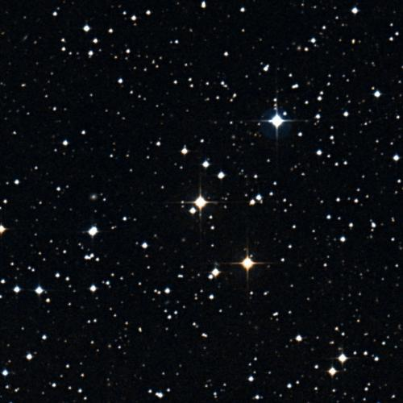
🔭 **[View in Aladin Sky Atlas (DSS2 Optical)](https://aladin.u-strasbg.fr/AladinLite/?target=129.6883+-13.2565&fov=0.5&survey=P/DSS2/color)**
*Multi-wavelength: [DSS2 Optical](https://aladin.u-strasbg.fr/AladinLite/?target=129.6883+-13.2565&fov=0.5&survey=P/DSS2/color) · [2MASS NIR](https://aladin.u-strasbg.fr/AladinLite/?target=129.6883+-13.2565&fov=0.5&survey=P/2MASS/color)*

- **Position:** RA=129.6883°, Dec=-13.2565°
- **Frequency:** 3278.66 MHz
- **SNR:** 20.0
- **Bandwidth:** 0.00140969 MHz
- **Drift rate:** 0.7475 Hz/s
- **Detection method(s):** doppler_drift

**Cross-check evidence:**

  - Exoplanet system nearby: HD 73583 b, HD 73583 b, HD 73583 b
  - Doppler drift rate 0.7475 Hz/s consistent with technological origin
  - High SNR: 20.0

### HD 110067 — Score 80/100

🔭 **[View in Aladin Sky Atlas (DSS2 Optical)](https://aladin.u-strasbg.fr/AladinLite/?target=189.8392+20.0273&fov=0.5&survey=P/DSS2/color)**
*Multi-wavelength: [DSS2 Optical](https://aladin.u-strasbg.fr/AladinLite/?target=189.8392+20.0273&fov=0.5&survey=P/DSS2/color) · [2MASS NIR](https://aladin.u-strasbg.fr/AladinLite/?target=189.8392+20.0273&fov=0.5&survey=P/2MASS/color)*

- **Position:** RA=189.8392°, Dec=20.0273°
- **Frequency:** 6473.16 MHz
- **SNR:** 3.1
- **Bandwidth:** 286.0057 MHz
- **Drift rate:** -0.0356 Hz/s
- **Detection method(s):** doppler_drift

**Cross-check evidence:**

  - Exoplanet system nearby: HD 110067 c, HD 110067 f, HD 110067 d
  - Doppler drift rate 0.0356 Hz/s consistent with technological origin

### TOI-5734 — Score 80/100

🔭 **[View in Aladin Sky Atlas (DSS2 Optical)](https://aladin.u-strasbg.fr/AladinLite/?target=111.2558+37.2311&fov=0.5&survey=P/DSS2/color)**
*Multi-wavelength: [DSS2 Optical](https://aladin.u-strasbg.fr/AladinLite/?target=111.2558+37.2311&fov=0.5&survey=P/DSS2/color) · [2MASS NIR](https://aladin.u-strasbg.fr/AladinLite/?target=111.2558+37.2311&fov=0.5&survey=P/2MASS/color)*

- **Position:** RA=111.2558°, Dec=37.2311°
- **Frequency:** 9897.44 MHz
- **SNR:** 0.4
- **Bandwidth:** 427.3231 MHz
- **Drift rate:** -0.1723 Hz/s
- **Detection method(s):** doppler_drift

**Cross-check evidence:**

  - Exoplanet system nearby: TOI-5734 b, TOI-5734 b, TOI-5734 b
  - Doppler drift rate 0.1723 Hz/s consistent with technological origin

### TOI-431 — Score 90/100

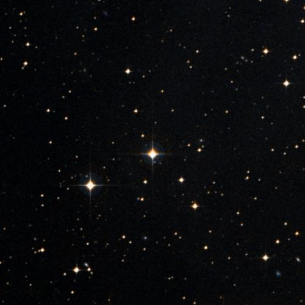
🔭 **[View in Aladin Sky Atlas (DSS2 Optical)](https://aladin.u-strasbg.fr/AladinLite/?target=83.2693+-26.7239&fov=0.5&survey=P/DSS2/color)**
*Multi-wavelength: [DSS2 Optical](https://aladin.u-strasbg.fr/AladinLite/?target=83.2693+-26.7239&fov=0.5&survey=P/DSS2/color) · [2MASS NIR](https://aladin.u-strasbg.fr/AladinLite/?target=83.2693+-26.7239&fov=0.5&survey=P/2MASS/color)*

- **Position:** RA=83.2693°, Dec=-26.7239°
- **Frequency:** 6604.38 MHz
- **SNR:** 19.5
- **Bandwidth:** 400.3354 MHz
- **Drift rate:** 0.2010 Hz/s
- **Detection method(s):** doppler_drift

**Cross-check evidence:**

  - Exoplanet system nearby: TOI-431 d, TOI-431 d, TOI-431 b
  - Doppler drift rate 0.2010 Hz/s consistent with technological origin
  - High SNR: 19.5

### TOI-431 — Score 80/100

🔭 **[View in Aladin Sky Atlas (DSS2 Optical)](https://aladin.u-strasbg.fr/AladinLite/?target=83.2693+-26.7239&fov=0.5&survey=P/DSS2/color)**
*Multi-wavelength: [DSS2 Optical](https://aladin.u-strasbg.fr/AladinLite/?target=83.2693+-26.7239&fov=0.5&survey=P/DSS2/color) · [2MASS NIR](https://aladin.u-strasbg.fr/AladinLite/?target=83.2693+-26.7239&fov=0.5&survey=P/2MASS/color)*

- **Position:** RA=83.2693°, Dec=-26.7239°
- **Frequency:** 4941.91 MHz
- **SNR:** 2.7
- **Bandwidth:** 355.6055 MHz
- **Drift rate:** -0.1365 Hz/s
- **Detection method(s):** doppler_drift

**Cross-check evidence:**

  - Exoplanet system nearby: TOI-431 d, TOI-431 d, TOI-431 b
  - Doppler drift rate 0.1365 Hz/s consistent with technological origin

### HD 111998 — Score 80/100

🔭 **[View in Aladin Sky Atlas (DSS2 Optical)](https://aladin.u-strasbg.fr/AladinLite/?target=193.2954+-3.5531&fov=0.5&survey=P/DSS2/color)**
*Multi-wavelength: [DSS2 Optical](https://aladin.u-strasbg.fr/AladinLite/?target=193.2954+-3.5531&fov=0.5&survey=P/DSS2/color) · [2MASS NIR](https://aladin.u-strasbg.fr/AladinLite/?target=193.2954+-3.5531&fov=0.5&survey=P/2MASS/color)*

- **Position:** RA=193.2954°, Dec=-3.5531°
- **Frequency:** 6690.55 MHz
- **SNR:** 3.7
- **Bandwidth:** 257.171 MHz
- **Drift rate:** -0.1000 Hz/s
- **Detection method(s):** doppler_drift

**Cross-check evidence:**

  - Exoplanet system nearby: HD 111998 b, HD 111998 b
  - Doppler drift rate 0.1000 Hz/s consistent with technological origin

### HD 23079 — Score 80/100

🔭 **[View in Aladin Sky Atlas (DSS2 Optical)](https://aladin.u-strasbg.fr/AladinLite/?target=54.9282+-52.9162&fov=0.5&survey=P/DSS2/color)**
*Multi-wavelength: [DSS2 Optical](https://aladin.u-strasbg.fr/AladinLite/?target=54.9282+-52.9162&fov=0.5&survey=P/DSS2/color) · [2MASS NIR](https://aladin.u-strasbg.fr/AladinLite/?target=54.9282+-52.9162&fov=0.5&survey=P/2MASS/color)*

- **Position:** RA=54.9282°, Dec=-52.9162°
- **Frequency:** 5149.89 MHz
- **SNR:** 1.3
- **Bandwidth:** 363.9805 MHz
- **Drift rate:** 0.0444 Hz/s
- **Detection method(s):** doppler_drift

**Cross-check evidence:**

  - Exoplanet system nearby: HD 23079 b, HD 23079 b, HD 23079 b
  - Doppler drift rate 0.0444 Hz/s consistent with technological origin

### HD 23079 — Score 80/100

🔭 **[View in Aladin Sky Atlas (DSS2 Optical)](https://aladin.u-strasbg.fr/AladinLite/?target=54.9282+-52.9162&fov=0.5&survey=P/DSS2/color)**
*Multi-wavelength: [DSS2 Optical](https://aladin.u-strasbg.fr/AladinLite/?target=54.9282+-52.9162&fov=0.5&survey=P/DSS2/color) · [2MASS NIR](https://aladin.u-strasbg.fr/AladinLite/?target=54.9282+-52.9162&fov=0.5&survey=P/2MASS/color)*

- **Position:** RA=54.9282°, Dec=-52.9162°
- **Frequency:** 4084.42 MHz
- **SNR:** 3.9
- **Bandwidth:** 170.8942 MHz
- **Drift rate:** 0.0374 Hz/s
- **Detection method(s):** doppler_drift

**Cross-check evidence:**

  - Exoplanet system nearby: HD 23079 b, HD 23079 b, HD 23079 b
  - Doppler drift rate 0.0374 Hz/s consistent with technological origin

### HD 23079 — Score 80/100

🔭 **[View in Aladin Sky Atlas (DSS2 Optical)](https://aladin.u-strasbg.fr/AladinLite/?target=54.9282+-52.9162&fov=0.5&survey=P/DSS2/color)**
*Multi-wavelength: [DSS2 Optical](https://aladin.u-strasbg.fr/AladinLite/?target=54.9282+-52.9162&fov=0.5&survey=P/DSS2/color) · [2MASS NIR](https://aladin.u-strasbg.fr/AladinLite/?target=54.9282+-52.9162&fov=0.5&survey=P/2MASS/color)*

- **Position:** RA=54.9282°, Dec=-52.9162°
- **Frequency:** 1362.28 MHz
- **SNR:** 3.2
- **Bandwidth:** 279.8531 MHz
- **Drift rate:** -0.0303 Hz/s
- **Detection method(s):** doppler_drift

**Cross-check evidence:**

  - Exoplanet system nearby: HD 23079 b, HD 23079 b, HD 23079 b
  - Doppler drift rate 0.0303 Hz/s consistent with technological origin

### HR 2562 — Score 80/100

🔭 **[View in Aladin Sky Atlas (DSS2 Optical)](https://aladin.u-strasbg.fr/AladinLite/?target=102.5043+-60.2487&fov=0.5&survey=P/DSS2/color)**
*Multi-wavelength: [DSS2 Optical](https://aladin.u-strasbg.fr/AladinLite/?target=102.5043+-60.2487&fov=0.5&survey=P/DSS2/color) · [2MASS NIR](https://aladin.u-strasbg.fr/AladinLite/?target=102.5043+-60.2487&fov=0.5&survey=P/2MASS/color)*

- **Position:** RA=102.5043°, Dec=-60.2487°
- **Frequency:** 3722.32 MHz
- **SNR:** 6.7
- **Bandwidth:** 479.0142 MHz
- **Drift rate:** 0.1315 Hz/s
- **Detection method(s):** doppler_drift

**Cross-check evidence:**

  - Exoplanet system nearby: HR 2562 b, HR 2562 b, HR 2562 b
  - Doppler drift rate 0.1315 Hz/s consistent with technological origin

### HD 73344 — Score 80/100

🔭 **[View in Aladin Sky Atlas (DSS2 Optical)](https://aladin.u-strasbg.fr/AladinLite/?target=129.6894+23.6853&fov=0.5&survey=P/DSS2/color)**
*Multi-wavelength: [DSS2 Optical](https://aladin.u-strasbg.fr/AladinLite/?target=129.6894+23.6853&fov=0.5&survey=P/DSS2/color) · [2MASS NIR](https://aladin.u-strasbg.fr/AladinLite/?target=129.6894+23.6853&fov=0.5&survey=P/2MASS/color)*

- **Position:** RA=129.6894°, Dec=23.6853°
- **Frequency:** 6823.65 MHz
- **SNR:** 2.2
- **Bandwidth:** 236.945 MHz
- **Drift rate:** 0.0634 Hz/s
- **Detection method(s):** doppler_drift

**Cross-check evidence:**

  - Exoplanet system nearby: HD 73344 c, HD 73344 b, HD 73344 d
  - Doppler drift rate 0.0634 Hz/s consistent with technological origin

### HD 156279 — Score 80/100

🔭 **[View in Aladin Sky Atlas (DSS2 Optical)](https://aladin.u-strasbg.fr/AladinLite/?target=258.0967+63.3528&fov=0.5&survey=P/DSS2/color)**
*Multi-wavelength: [DSS2 Optical](https://aladin.u-strasbg.fr/AladinLite/?target=258.0967+63.3528&fov=0.5&survey=P/DSS2/color) · [2MASS NIR](https://aladin.u-strasbg.fr/AladinLite/?target=258.0967+63.3528&fov=0.5&survey=P/2MASS/color)*

- **Position:** RA=258.0967°, Dec=63.3528°
- **Frequency:** 1825.51 MHz
- **SNR:** 2.3
- **Bandwidth:** 366.996 MHz
- **Drift rate:** 0.0756 Hz/s
- **Detection method(s):** doppler_drift

**Cross-check evidence:**

  - Exoplanet system nearby: HD 156279 b, HD 156279 c, HD 156279 c
  - Doppler drift rate 0.0756 Hz/s consistent with technological origin

### Kepler-444 — Score 80/100

🔭 **[View in Aladin Sky Atlas (DSS2 Optical)](https://aladin.u-strasbg.fr/AladinLite/?target=289.7528+41.6319&fov=0.5&survey=P/DSS2/color)**
*Multi-wavelength: [DSS2 Optical](https://aladin.u-strasbg.fr/AladinLite/?target=289.7528+41.6319&fov=0.5&survey=P/DSS2/color) · [2MASS NIR](https://aladin.u-strasbg.fr/AladinLite/?target=289.7528+41.6319&fov=0.5&survey=P/2MASS/color)*

- **Position:** RA=289.7528°, Dec=41.6319°
- **Frequency:** 3938.92 MHz
- **SNR:** 2.1
- **Bandwidth:** 179.1239 MHz
- **Drift rate:** -0.1655 Hz/s
- **Detection method(s):** doppler_drift

**Cross-check evidence:**

  - Exoplanet system nearby: Kepler-444 b, Kepler-444 c, Kepler-444 e
  - Doppler drift rate 0.1655 Hz/s consistent with technological origin

### TOI-2128 — Score 80/100

🔭 **[View in Aladin Sky Atlas (DSS2 Optical)](https://aladin.u-strasbg.fr/AladinLite/?target=256.9818+32.1053&fov=0.5&survey=P/DSS2/color)**
*Multi-wavelength: [DSS2 Optical](https://aladin.u-strasbg.fr/AladinLite/?target=256.9818+32.1053&fov=0.5&survey=P/DSS2/color) · [2MASS NIR](https://aladin.u-strasbg.fr/AladinLite/?target=256.9818+32.1053&fov=0.5&survey=P/2MASS/color)*

- **Position:** RA=256.9818°, Dec=32.1053°
- **Frequency:** 7010.64 MHz
- **SNR:** 2.4
- **Bandwidth:** 151.7451 MHz
- **Drift rate:** -0.0337 Hz/s
- **Detection method(s):** doppler_drift

**Cross-check evidence:**

  - Exoplanet system nearby: TOI-2128 b, TOI-2128 b
  - Doppler drift rate 0.0337 Hz/s consistent with technological origin

### HD 95338 — Score 80/100

🔭 **[View in Aladin Sky Atlas (DSS2 Optical)](https://aladin.u-strasbg.fr/AladinLite/?target=164.8563+-56.6236&fov=0.5&survey=P/DSS2/color)**
*Multi-wavelength: [DSS2 Optical](https://aladin.u-strasbg.fr/AladinLite/?target=164.8563+-56.6236&fov=0.5&survey=P/DSS2/color) · [2MASS NIR](https://aladin.u-strasbg.fr/AladinLite/?target=164.8563+-56.6236&fov=0.5&survey=P/2MASS/color)*

- **Position:** RA=164.8563°, Dec=-56.6236°
- **Frequency:** 3884.42 MHz
- **SNR:** 3.0
- **Bandwidth:** 490.4514 MHz
- **Drift rate:** -0.0500 Hz/s
- **Detection method(s):** doppler_drift

**Cross-check evidence:**

  - Exoplanet system nearby: HD 95338 b, HD 95338 b, HD 95338 b
  - Doppler drift rate 0.0500 Hz/s consistent with technological origin

### HD 95338 — Score 80/100

🔭 **[View in Aladin Sky Atlas (DSS2 Optical)](https://aladin.u-strasbg.fr/AladinLite/?target=164.8563+-56.6236&fov=0.5&survey=P/DSS2/color)**
*Multi-wavelength: [DSS2 Optical](https://aladin.u-strasbg.fr/AladinLite/?target=164.8563+-56.6236&fov=0.5&survey=P/DSS2/color) · [2MASS NIR](https://aladin.u-strasbg.fr/AladinLite/?target=164.8563+-56.6236&fov=0.5&survey=P/2MASS/color)*

- **Position:** RA=164.8563°, Dec=-56.6236°
- **Frequency:** 4600.55 MHz
- **SNR:** 4.5
- **Bandwidth:** 450.043 MHz
- **Drift rate:** -0.0558 Hz/s
- **Detection method(s):** doppler_drift

**Cross-check evidence:**

  - Exoplanet system nearby: HD 95338 b, HD 95338 b, HD 95338 b
  - Doppler drift rate 0.0558 Hz/s consistent with technological origin

### HD 169830 — Score 80/100

🔭 **[View in Aladin Sky Atlas (DSS2 Optical)](https://aladin.u-strasbg.fr/AladinLite/?target=276.9562+-29.8168&fov=0.5&survey=P/DSS2/color)**
*Multi-wavelength: [DSS2 Optical](https://aladin.u-strasbg.fr/AladinLite/?target=276.9562+-29.8168&fov=0.5&survey=P/DSS2/color) · [2MASS NIR](https://aladin.u-strasbg.fr/AladinLite/?target=276.9562+-29.8168&fov=0.5&survey=P/2MASS/color)*

- **Position:** RA=276.9562°, Dec=-29.8168°
- **Frequency:** 6689.82 MHz
- **SNR:** 1.8
- **Bandwidth:** 233.6445 MHz
- **Drift rate:** -0.0538 Hz/s
- **Detection method(s):** doppler_drift

**Cross-check evidence:**

  - Exoplanet system nearby: HD 169830 c, HD 169830 b, HD 169830 c
  - Doppler drift rate 0.0538 Hz/s consistent with technological origin

### HD 169830 — Score 80/100

🔭 **[View in Aladin Sky Atlas (DSS2 Optical)](https://aladin.u-strasbg.fr/AladinLite/?target=276.9562+-29.8168&fov=0.5&survey=P/DSS2/color)**
*Multi-wavelength: [DSS2 Optical](https://aladin.u-strasbg.fr/AladinLite/?target=276.9562+-29.8168&fov=0.5&survey=P/DSS2/color) · [2MASS NIR](https://aladin.u-strasbg.fr/AladinLite/?target=276.9562+-29.8168&fov=0.5&survey=P/2MASS/color)*

- **Position:** RA=276.9562°, Dec=-29.8168°
- **Frequency:** 8589.91 MHz
- **SNR:** 1.5
- **Bandwidth:** 491.2818 MHz
- **Drift rate:** -0.0204 Hz/s
- **Detection method(s):** doppler_drift

**Cross-check evidence:**

  - Exoplanet system nearby: HD 169830 c, HD 169830 b, HD 169830 c
  - Doppler drift rate 0.0204 Hz/s consistent with technological origin

### HD 12661 — Score 80/100

🔭 **[View in Aladin Sky Atlas (DSS2 Optical)](https://aladin.u-strasbg.fr/AladinLite/?target=31.1424+25.4136&fov=0.5&survey=P/DSS2/color)**
*Multi-wavelength: [DSS2 Optical](https://aladin.u-strasbg.fr/AladinLite/?target=31.1424+25.4136&fov=0.5&survey=P/DSS2/color) · [2MASS NIR](https://aladin.u-strasbg.fr/AladinLite/?target=31.1424+25.4136&fov=0.5&survey=P/2MASS/color)*

- **Position:** RA=31.1424°, Dec=25.4136°
- **Frequency:** 5325.47 MHz
- **SNR:** 5.7
- **Bandwidth:** 282.5809 MHz
- **Drift rate:** 0.0150 Hz/s
- **Detection method(s):** doppler_drift

**Cross-check evidence:**

  - Exoplanet system nearby: HD 12661 b, HD 12661 b, HD 12661 b
  - Doppler drift rate 0.0150 Hz/s consistent with technological origin

### HD 38283 — Score 80/100

🔭 **[View in Aladin Sky Atlas (DSS2 Optical)](https://aladin.u-strasbg.fr/AladinLite/?target=84.2605+-73.6998&fov=0.5&survey=P/DSS2/color)**
*Multi-wavelength: [DSS2 Optical](https://aladin.u-strasbg.fr/AladinLite/?target=84.2605+-73.6998&fov=0.5&survey=P/DSS2/color) · [2MASS NIR](https://aladin.u-strasbg.fr/AladinLite/?target=84.2605+-73.6998&fov=0.5&survey=P/2MASS/color)*

- **Position:** RA=84.2605°, Dec=-73.6998°
- **Frequency:** 3320.28 MHz
- **SNR:** 2.5
- **Bandwidth:** 334.3845 MHz
- **Drift rate:** 0.1454 Hz/s
- **Detection method(s):** doppler_drift

**Cross-check evidence:**

  - Exoplanet system nearby: HD 38283 b, HD 38283 b
  - Doppler drift rate 0.1454 Hz/s consistent with technological origin

### HD 23472 — Score 80/100

🔭 **[View in Aladin Sky Atlas (DSS2 Optical)](https://aladin.u-strasbg.fr/AladinLite/?target=55.4590+-62.7673&fov=0.5&survey=P/DSS2/color)**
*Multi-wavelength: [DSS2 Optical](https://aladin.u-strasbg.fr/AladinLite/?target=55.4590+-62.7673&fov=0.5&survey=P/DSS2/color) · [2MASS NIR](https://aladin.u-strasbg.fr/AladinLite/?target=55.4590+-62.7673&fov=0.5&survey=P/2MASS/color)*

- **Position:** RA=55.4590°, Dec=-62.7673°
- **Frequency:** 4510.56 MHz
- **SNR:** 1.7
- **Bandwidth:** 499.4438 MHz
- **Drift rate:** 0.0227 Hz/s
- **Detection method(s):** doppler_drift

**Cross-check evidence:**

  - Exoplanet system nearby: HD 23472 e, HD 23472 b, HD 23472 e
  - Doppler drift rate 0.0227 Hz/s consistent with technological origin

### HD 28185 — Score 80/100

🔭 **[View in Aladin Sky Atlas (DSS2 Optical)](https://aladin.u-strasbg.fr/AladinLite/?target=66.6100+-10.5511&fov=0.5&survey=P/DSS2/color)**
*Multi-wavelength: [DSS2 Optical](https://aladin.u-strasbg.fr/AladinLite/?target=66.6100+-10.5511&fov=0.5&survey=P/DSS2/color) · [2MASS NIR](https://aladin.u-strasbg.fr/AladinLite/?target=66.6100+-10.5511&fov=0.5&survey=P/2MASS/color)*

- **Position:** RA=66.6100°, Dec=-10.5511°
- **Frequency:** 6577.02 MHz
- **SNR:** 5.6
- **Bandwidth:** 473.1603 MHz
- **Drift rate:** 0.0244 Hz/s
- **Detection method(s):** doppler_drift

**Cross-check evidence:**

  - Exoplanet system nearby: HD 28185 c, HD 28185 b, HD 28185 b
  - Doppler drift rate 0.0244 Hz/s consistent with technological origin

### HD 168443 — Score 80/100

🔭 **[View in Aladin Sky Atlas (DSS2 Optical)](https://aladin.u-strasbg.fr/AladinLite/?target=275.0160+-9.5967&fov=0.5&survey=P/DSS2/color)**
*Multi-wavelength: [DSS2 Optical](https://aladin.u-strasbg.fr/AladinLite/?target=275.0160+-9.5967&fov=0.5&survey=P/DSS2/color) · [2MASS NIR](https://aladin.u-strasbg.fr/AladinLite/?target=275.0160+-9.5967&fov=0.5&survey=P/2MASS/color)*

- **Position:** RA=275.0160°, Dec=-9.5967°
- **Frequency:** 2006.60 MHz
- **SNR:** 3.8
- **Bandwidth:** 433.0117 MHz
- **Drift rate:** -0.0277 Hz/s
- **Detection method(s):** doppler_drift

**Cross-check evidence:**

  - Exoplanet system nearby: HD 168443 c, HD 168443 b, HD 168443 c
  - Doppler drift rate 0.0277 Hz/s consistent with technological origin

### HD 168443 — Score 80/100

🔭 **[View in Aladin Sky Atlas (DSS2 Optical)](https://aladin.u-strasbg.fr/AladinLite/?target=275.0160+-9.5967&fov=0.5&survey=P/DSS2/color)**
*Multi-wavelength: [DSS2 Optical](https://aladin.u-strasbg.fr/AladinLite/?target=275.0160+-9.5967&fov=0.5&survey=P/DSS2/color) · [2MASS NIR](https://aladin.u-strasbg.fr/AladinLite/?target=275.0160+-9.5967&fov=0.5&survey=P/2MASS/color)*

- **Position:** RA=275.0160°, Dec=-9.5967°
- **Frequency:** 5506.90 MHz
- **SNR:** 3.0
- **Bandwidth:** 374.4652 MHz
- **Drift rate:** -0.0656 Hz/s
- **Detection method(s):** doppler_drift

**Cross-check evidence:**

  - Exoplanet system nearby: HD 168443 c, HD 168443 b, HD 168443 c
  - Doppler drift rate 0.0656 Hz/s consistent with technological origin

### HD 168443 — Score 80/100

🔭 **[View in Aladin Sky Atlas (DSS2 Optical)](https://aladin.u-strasbg.fr/AladinLite/?target=275.0160+-9.5967&fov=0.5&survey=P/DSS2/color)**
*Multi-wavelength: [DSS2 Optical](https://aladin.u-strasbg.fr/AladinLite/?target=275.0160+-9.5967&fov=0.5&survey=P/DSS2/color) · [2MASS NIR](https://aladin.u-strasbg.fr/AladinLite/?target=275.0160+-9.5967&fov=0.5&survey=P/2MASS/color)*

- **Position:** RA=275.0160°, Dec=-9.5967°
- **Frequency:** 5648.13 MHz
- **SNR:** 3.5
- **Bandwidth:** 138.0796 MHz
- **Drift rate:** 0.0974 Hz/s
- **Detection method(s):** doppler_drift

**Cross-check evidence:**

  - Exoplanet system nearby: HD 168443 c, HD 168443 b, HD 168443 c
  - Doppler drift rate 0.0974 Hz/s consistent with technological origin

### HD 196067 — Score 80/100

🔭 **[View in Aladin Sky Atlas (DSS2 Optical)](https://aladin.u-strasbg.fr/AladinLite/?target=310.4364+-75.3515&fov=0.5&survey=P/DSS2/color)**
*Multi-wavelength: [DSS2 Optical](https://aladin.u-strasbg.fr/AladinLite/?target=310.4364+-75.3515&fov=0.5&survey=P/DSS2/color) · [2MASS NIR](https://aladin.u-strasbg.fr/AladinLite/?target=310.4364+-75.3515&fov=0.5&survey=P/2MASS/color)*

- **Position:** RA=310.4364°, Dec=-75.3515°
- **Frequency:** 5150.88 MHz
- **SNR:** 3.7
- **Bandwidth:** 269.9108 MHz
- **Drift rate:** 0.0520 Hz/s
- **Detection method(s):** doppler_drift

**Cross-check evidence:**

  - Exoplanet system nearby: HD 196067 c, HD 196067 b, HD 196067 b
  - Doppler drift rate 0.0520 Hz/s consistent with technological origin

### HD 235088 — Score 80/100

🔭 **[View in Aladin Sky Atlas (DSS2 Optical)](https://aladin.u-strasbg.fr/AladinLite/?target=300.6155+53.3774&fov=0.5&survey=P/DSS2/color)**
*Multi-wavelength: [DSS2 Optical](https://aladin.u-strasbg.fr/AladinLite/?target=300.6155+53.3774&fov=0.5&survey=P/DSS2/color) · [2MASS NIR](https://aladin.u-strasbg.fr/AladinLite/?target=300.6155+53.3774&fov=0.5&survey=P/2MASS/color)*

- **Position:** RA=300.6155°, Dec=53.3774°
- **Frequency:** 3893.91 MHz
- **SNR:** 2.4
- **Bandwidth:** 399.5283 MHz
- **Drift rate:** -0.1152 Hz/s
- **Detection method(s):** doppler_drift

**Cross-check evidence:**

  - Exoplanet system nearby: HD 235088 b, HD 235088 b, HD 235088 b
  - Doppler drift rate 0.1152 Hz/s consistent with technological origin

### HD 235088 — Score 80/100

🔭 **[View in Aladin Sky Atlas (DSS2 Optical)](https://aladin.u-strasbg.fr/AladinLite/?target=300.6155+53.3774&fov=0.5&survey=P/DSS2/color)**
*Multi-wavelength: [DSS2 Optical](https://aladin.u-strasbg.fr/AladinLite/?target=300.6155+53.3774&fov=0.5&survey=P/DSS2/color) · [2MASS NIR](https://aladin.u-strasbg.fr/AladinLite/?target=300.6155+53.3774&fov=0.5&survey=P/2MASS/color)*

- **Position:** RA=300.6155°, Dec=53.3774°
- **Frequency:** 2295.18 MHz
- **SNR:** 4.8
- **Bandwidth:** 451.6275 MHz
- **Drift rate:** -0.0361 Hz/s
- **Detection method(s):** doppler_drift

**Cross-check evidence:**

  - Exoplanet system nearby: HD 235088 b, HD 235088 b, HD 235088 b
  - Doppler drift rate 0.0361 Hz/s consistent with technological origin

### TOI-1807 — Score 80/100

🔭 **[View in Aladin Sky Atlas (DSS2 Optical)](https://aladin.u-strasbg.fr/AladinLite/?target=201.2826+38.9224&fov=0.5&survey=P/DSS2/color)**
*Multi-wavelength: [DSS2 Optical](https://aladin.u-strasbg.fr/AladinLite/?target=201.2826+38.9224&fov=0.5&survey=P/DSS2/color) · [2MASS NIR](https://aladin.u-strasbg.fr/AladinLite/?target=201.2826+38.9224&fov=0.5&survey=P/2MASS/color)*

- **Position:** RA=201.2826°, Dec=38.9224°
- **Frequency:** 2321.77 MHz
- **SNR:** 1.7
- **Bandwidth:** 444.3204 MHz
- **Drift rate:** -0.0263 Hz/s
- **Detection method(s):** doppler_drift

**Cross-check evidence:**

  - Exoplanet system nearby: TOI-1807 b, TOI-1807 b, TOI-1807 b
  - Doppler drift rate 0.0263 Hz/s consistent with technological origin

### HD 28471 — Score 80/100

🔭 **[View in Aladin Sky Atlas (DSS2 Optical)](https://aladin.u-strasbg.fr/AladinLite/?target=66.2875+-64.0787&fov=0.5&survey=P/DSS2/color)**
*Multi-wavelength: [DSS2 Optical](https://aladin.u-strasbg.fr/AladinLite/?target=66.2875+-64.0787&fov=0.5&survey=P/DSS2/color) · [2MASS NIR](https://aladin.u-strasbg.fr/AladinLite/?target=66.2875+-64.0787&fov=0.5&survey=P/2MASS/color)*

- **Position:** RA=66.2875°, Dec=-64.0787°
- **Frequency:** 5537.61 MHz
- **SNR:** 6.4
- **Bandwidth:** 400.1064 MHz
- **Drift rate:** -0.2320 Hz/s
- **Detection method(s):** doppler_drift

**Cross-check evidence:**

  - Exoplanet system nearby: HD 28471 b, HD 28471 c, HD 28471 d
  - Doppler drift rate 0.2320 Hz/s consistent with technological origin

### DS Tuc A — Score 80/100

🔭 **[View in Aladin Sky Atlas (DSS2 Optical)](https://aladin.u-strasbg.fr/AladinLite/?target=354.9155+-69.1960&fov=0.5&survey=P/DSS2/color)**
*Multi-wavelength: [DSS2 Optical](https://aladin.u-strasbg.fr/AladinLite/?target=354.9155+-69.1960&fov=0.5&survey=P/DSS2/color) · [2MASS NIR](https://aladin.u-strasbg.fr/AladinLite/?target=354.9155+-69.1960&fov=0.5&survey=P/2MASS/color)*

- **Position:** RA=354.9155°, Dec=-69.1960°
- **Frequency:** 2234.90 MHz
- **SNR:** 3.9
- **Bandwidth:** 361.4159 MHz
- **Drift rate:** 0.0111 Hz/s
- **Detection method(s):** doppler_drift

**Cross-check evidence:**

  - Exoplanet system nearby: DS Tuc A b, DS Tuc A b, DS Tuc A b
  - Doppler drift rate 0.0111 Hz/s consistent with technological origin

### DS Tuc A — Score 80/100

🔭 **[View in Aladin Sky Atlas (DSS2 Optical)](https://aladin.u-strasbg.fr/AladinLite/?target=354.9155+-69.1960&fov=0.5&survey=P/DSS2/color)**
*Multi-wavelength: [DSS2 Optical](https://aladin.u-strasbg.fr/AladinLite/?target=354.9155+-69.1960&fov=0.5&survey=P/DSS2/color) · [2MASS NIR](https://aladin.u-strasbg.fr/AladinLite/?target=354.9155+-69.1960&fov=0.5&survey=P/2MASS/color)*

- **Position:** RA=354.9155°, Dec=-69.1960°
- **Frequency:** 9780.36 MHz
- **SNR:** 1.3
- **Bandwidth:** 449.1436 MHz
- **Drift rate:** -0.1187 Hz/s
- **Detection method(s):** doppler_drift

**Cross-check evidence:**

  - Exoplanet system nearby: DS Tuc A b, DS Tuc A b, DS Tuc A b
  - Doppler drift rate 0.1187 Hz/s consistent with technological origin

### DS Tuc A — Score 80/100

🔭 **[View in Aladin Sky Atlas (DSS2 Optical)](https://aladin.u-strasbg.fr/AladinLite/?target=354.9155+-69.1960&fov=0.5&survey=P/DSS2/color)**
*Multi-wavelength: [DSS2 Optical](https://aladin.u-strasbg.fr/AladinLite/?target=354.9155+-69.1960&fov=0.5&survey=P/DSS2/color) · [2MASS NIR](https://aladin.u-strasbg.fr/AladinLite/?target=354.9155+-69.1960&fov=0.5&survey=P/2MASS/color)*

- **Position:** RA=354.9155°, Dec=-69.1960°
- **Frequency:** 6904.66 MHz
- **SNR:** 1.3
- **Bandwidth:** 215.6334 MHz
- **Drift rate:** -0.0985 Hz/s
- **Detection method(s):** doppler_drift

**Cross-check evidence:**

  - Exoplanet system nearby: DS Tuc A b, DS Tuc A b, DS Tuc A b
  - Doppler drift rate 0.0985 Hz/s consistent with technological origin

### DS Tuc A — Score 80/100

🔭 **[View in Aladin Sky Atlas (DSS2 Optical)](https://aladin.u-strasbg.fr/AladinLite/?target=354.9155+-69.1960&fov=0.5&survey=P/DSS2/color)**
*Multi-wavelength: [DSS2 Optical](https://aladin.u-strasbg.fr/AladinLite/?target=354.9155+-69.1960&fov=0.5&survey=P/DSS2/color) · [2MASS NIR](https://aladin.u-strasbg.fr/AladinLite/?target=354.9155+-69.1960&fov=0.5&survey=P/2MASS/color)*

- **Position:** RA=354.9155°, Dec=-69.1960°
- **Frequency:** 8456.92 MHz
- **SNR:** 2.2
- **Bandwidth:** 384.2131 MHz
- **Drift rate:** -0.0364 Hz/s
- **Detection method(s):** doppler_drift

**Cross-check evidence:**

  - Exoplanet system nearby: DS Tuc A b, DS Tuc A b, DS Tuc A b
  - Doppler drift rate 0.0364 Hz/s consistent with technological origin

### HD 208487 — Score 80/100

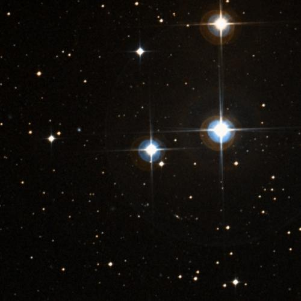
🔭 **[View in Aladin Sky Atlas (DSS2 Optical)](https://aladin.u-strasbg.fr/AladinLite/?target=329.3332+-37.7641&fov=0.5&survey=P/DSS2/color)**
*Multi-wavelength: [DSS2 Optical](https://aladin.u-strasbg.fr/AladinLite/?target=329.3332+-37.7641&fov=0.5&survey=P/DSS2/color) · [2MASS NIR](https://aladin.u-strasbg.fr/AladinLite/?target=329.3332+-37.7641&fov=0.5&survey=P/2MASS/color)*

- **Position:** RA=329.3332°, Dec=-37.7641°
- **Frequency:** 5284.83 MHz
- **SNR:** 4.0
- **Bandwidth:** 474.2168 MHz
- **Drift rate:** 0.1934 Hz/s
- **Detection method(s):** doppler_drift

**Cross-check evidence:**

  - Exoplanet system nearby: HD 208487 b, HD 208487 b, HD 208487 b
  - Doppler drift rate 0.1934 Hz/s consistent with technological origin

### HD 86226 — Score 80/100

🔭 **[View in Aladin Sky Atlas (DSS2 Optical)](https://aladin.u-strasbg.fr/AladinLite/?target=149.1235+-24.0992&fov=0.5&survey=P/DSS2/color)**
*Multi-wavelength: [DSS2 Optical](https://aladin.u-strasbg.fr/AladinLite/?target=149.1235+-24.0992&fov=0.5&survey=P/DSS2/color) · [2MASS NIR](https://aladin.u-strasbg.fr/AladinLite/?target=149.1235+-24.0992&fov=0.5&survey=P/2MASS/color)*

- **Position:** RA=149.1235°, Dec=-24.0992°
- **Frequency:** 3883.57 MHz
- **SNR:** 1.8
- **Bandwidth:** 244.3035 MHz
- **Drift rate:** 0.2282 Hz/s
- **Detection method(s):** doppler_drift

**Cross-check evidence:**

  - Exoplanet system nearby: HD 86226 b, HD 86226 b, HD 86226 b
  - Doppler drift rate 0.2282 Hz/s consistent with technological origin

### HD 86226 — Score 80/100

🔭 **[View in Aladin Sky Atlas (DSS2 Optical)](https://aladin.u-strasbg.fr/AladinLite/?target=149.1235+-24.0992&fov=0.5&survey=P/DSS2/color)**
*Multi-wavelength: [DSS2 Optical](https://aladin.u-strasbg.fr/AladinLite/?target=149.1235+-24.0992&fov=0.5&survey=P/DSS2/color) · [2MASS NIR](https://aladin.u-strasbg.fr/AladinLite/?target=149.1235+-24.0992&fov=0.5&survey=P/2MASS/color)*

- **Position:** RA=149.1235°, Dec=-24.0992°
- **Frequency:** 6494.37 MHz
- **SNR:** 2.5
- **Bandwidth:** 182.1561 MHz
- **Drift rate:** -0.0714 Hz/s
- **Detection method(s):** doppler_drift

**Cross-check evidence:**

  - Exoplanet system nearby: HD 86226 b, HD 86226 b, HD 86226 b
  - Doppler drift rate 0.0714 Hz/s consistent with technological origin

### HD 86226 — Score 80/100

🔭 **[View in Aladin Sky Atlas (DSS2 Optical)](https://aladin.u-strasbg.fr/AladinLite/?target=149.1235+-24.0992&fov=0.5&survey=P/DSS2/color)**
*Multi-wavelength: [DSS2 Optical](https://aladin.u-strasbg.fr/AladinLite/?target=149.1235+-24.0992&fov=0.5&survey=P/DSS2/color) · [2MASS NIR](https://aladin.u-strasbg.fr/AladinLite/?target=149.1235+-24.0992&fov=0.5&survey=P/2MASS/color)*

- **Position:** RA=149.1235°, Dec=-24.0992°
- **Frequency:** 8671.44 MHz
- **SNR:** 5.2
- **Bandwidth:** 401.7086 MHz
- **Drift rate:** 0.0411 Hz/s
- **Detection method(s):** doppler_drift

**Cross-check evidence:**

  - Exoplanet system nearby: HD 86226 b, HD 86226 b, HD 86226 b
  - Doppler drift rate 0.0411 Hz/s consistent with technological origin

### HD 77338 — Score 80/100

🔭 **[View in Aladin Sky Atlas (DSS2 Optical)](https://aladin.u-strasbg.fr/AladinLite/?target=135.3022+-25.5282&fov=0.5&survey=P/DSS2/color)**
*Multi-wavelength: [DSS2 Optical](https://aladin.u-strasbg.fr/AladinLite/?target=135.3022+-25.5282&fov=0.5&survey=P/DSS2/color) · [2MASS NIR](https://aladin.u-strasbg.fr/AladinLite/?target=135.3022+-25.5282&fov=0.5&survey=P/2MASS/color)*

- **Position:** RA=135.3022°, Dec=-25.5282°
- **Frequency:** 1397.58 MHz
- **SNR:** 3.9
- **Bandwidth:** 260.506 MHz
- **Drift rate:** -0.0577 Hz/s
- **Detection method(s):** doppler_drift

**Cross-check evidence:**

  - Exoplanet system nearby: HD 77338 b, HD 77338 b
  - Doppler drift rate 0.0577 Hz/s consistent with technological origin

### HD 77338 — Score 80/100

🔭 **[View in Aladin Sky Atlas (DSS2 Optical)](https://aladin.u-strasbg.fr/AladinLite/?target=135.3022+-25.5282&fov=0.5&survey=P/DSS2/color)**
*Multi-wavelength: [DSS2 Optical](https://aladin.u-strasbg.fr/AladinLite/?target=135.3022+-25.5282&fov=0.5&survey=P/DSS2/color) · [2MASS NIR](https://aladin.u-strasbg.fr/AladinLite/?target=135.3022+-25.5282&fov=0.5&survey=P/2MASS/color)*

- **Position:** RA=135.3022°, Dec=-25.5282°
- **Frequency:** 5443.05 MHz
- **SNR:** 2.8
- **Bandwidth:** 488.3539 MHz
- **Drift rate:** 0.0327 Hz/s
- **Detection method(s):** doppler_drift

**Cross-check evidence:**

  - Exoplanet system nearby: HD 77338 b, HD 77338 b
  - Doppler drift rate 0.0327 Hz/s consistent with technological origin

### HIP 113103 — Score 80/100

🔭 **[View in Aladin Sky Atlas (DSS2 Optical)](https://aladin.u-strasbg.fr/AladinLite/?target=343.5724+-43.0102&fov=0.5&survey=P/DSS2/color)**
*Multi-wavelength: [DSS2 Optical](https://aladin.u-strasbg.fr/AladinLite/?target=343.5724+-43.0102&fov=0.5&survey=P/DSS2/color) · [2MASS NIR](https://aladin.u-strasbg.fr/AladinLite/?target=343.5724+-43.0102&fov=0.5&survey=P/2MASS/color)*

- **Position:** RA=343.5724°, Dec=-43.0102°
- **Frequency:** 2152.47 MHz
- **SNR:** 3.7
- **Bandwidth:** 228.4343 MHz
- **Drift rate:** 0.1552 Hz/s
- **Detection method(s):** doppler_drift

**Cross-check evidence:**

  - Exoplanet system nearby: HIP 113103 c, HIP 113103 b, HIP 113103 c
  - Doppler drift rate 0.1552 Hz/s consistent with technological origin

### HIP 18606 — Score 80/100

🔭 **[View in Aladin Sky Atlas (DSS2 Optical)](https://aladin.u-strasbg.fr/AladinLite/?target=59.7181+-5.4707&fov=0.5&survey=P/DSS2/color)**
*Multi-wavelength: [DSS2 Optical](https://aladin.u-strasbg.fr/AladinLite/?target=59.7181+-5.4707&fov=0.5&survey=P/DSS2/color) · [2MASS NIR](https://aladin.u-strasbg.fr/AladinLite/?target=59.7181+-5.4707&fov=0.5&survey=P/2MASS/color)*

- **Position:** RA=59.7181°, Dec=-5.4707°
- **Frequency:** 5059.42 MHz
- **SNR:** 1.8
- **Bandwidth:** 327.1737 MHz
- **Drift rate:** 0.0302 Hz/s
- **Detection method(s):** doppler_drift

**Cross-check evidence:**

  - Exoplanet system nearby: HIP 18606 b
  - Doppler drift rate 0.0302 Hz/s consistent with technological origin

### HIP 18606 — Score 80/100

🔭 **[View in Aladin Sky Atlas (DSS2 Optical)](https://aladin.u-strasbg.fr/AladinLite/?target=59.7181+-5.4707&fov=0.5&survey=P/DSS2/color)**
*Multi-wavelength: [DSS2 Optical](https://aladin.u-strasbg.fr/AladinLite/?target=59.7181+-5.4707&fov=0.5&survey=P/DSS2/color) · [2MASS NIR](https://aladin.u-strasbg.fr/AladinLite/?target=59.7181+-5.4707&fov=0.5&survey=P/2MASS/color)*

- **Position:** RA=59.7181°, Dec=-5.4707°
- **Frequency:** 3886.44 MHz
- **SNR:** 2.7
- **Bandwidth:** 238.2923 MHz
- **Drift rate:** 0.1740 Hz/s
- **Detection method(s):** doppler_drift

**Cross-check evidence:**

  - Exoplanet system nearby: HIP 18606 b
  - Doppler drift rate 0.1740 Hz/s consistent with technological origin

### HD 3167 — Score 80/100

🔭 **[View in Aladin Sky Atlas (DSS2 Optical)](https://aladin.u-strasbg.fr/AladinLite/?target=8.7401+4.3807&fov=0.5&survey=P/DSS2/color)**
*Multi-wavelength: [DSS2 Optical](https://aladin.u-strasbg.fr/AladinLite/?target=8.7401+4.3807&fov=0.5&survey=P/DSS2/color) · [2MASS NIR](https://aladin.u-strasbg.fr/AladinLite/?target=8.7401+4.3807&fov=0.5&survey=P/2MASS/color)*

- **Position:** RA=8.7401°, Dec=4.3807°
- **Frequency:** 7508.02 MHz
- **SNR:** 4.0
- **Bandwidth:** 255.6387 MHz
- **Drift rate:** -0.0447 Hz/s
- **Detection method(s):** doppler_drift

**Cross-check evidence:**

  - Exoplanet system nearby: HD 3167 d, HD 3167 c, HD 3167 b
  - Doppler drift rate 0.0447 Hz/s consistent with technological origin

### TOI-500 — Score 80/100

🔭 **[View in Aladin Sky Atlas (DSS2 Optical)](https://aladin.u-strasbg.fr/AladinLite/?target=106.5591+-47.5878&fov=0.5&survey=P/DSS2/color)**
*Multi-wavelength: [DSS2 Optical](https://aladin.u-strasbg.fr/AladinLite/?target=106.5591+-47.5878&fov=0.5&survey=P/DSS2/color) · [2MASS NIR](https://aladin.u-strasbg.fr/AladinLite/?target=106.5591+-47.5878&fov=0.5&survey=P/2MASS/color)*

- **Position:** RA=106.5591°, Dec=-47.5878°
- **Frequency:** 3316.80 MHz
- **SNR:** 3.8
- **Bandwidth:** 430.716 MHz
- **Drift rate:** 0.0650 Hz/s
- **Detection method(s):** doppler_drift

**Cross-check evidence:**

  - Exoplanet system nearby: TOI-500 b, TOI-500 d, TOI-500 e
  - Doppler drift rate 0.0650 Hz/s consistent with technological origin

### TOI-500 — Score 80/100

🔭 **[View in Aladin Sky Atlas (DSS2 Optical)](https://aladin.u-strasbg.fr/AladinLite/?target=106.5591+-47.5878&fov=0.5&survey=P/DSS2/color)**
*Multi-wavelength: [DSS2 Optical](https://aladin.u-strasbg.fr/AladinLite/?target=106.5591+-47.5878&fov=0.5&survey=P/DSS2/color) · [2MASS NIR](https://aladin.u-strasbg.fr/AladinLite/?target=106.5591+-47.5878&fov=0.5&survey=P/2MASS/color)*

- **Position:** RA=106.5591°, Dec=-47.5878°
- **Frequency:** 7020.53 MHz
- **SNR:** 5.6
- **Bandwidth:** 121.0304 MHz
- **Drift rate:** -0.0375 Hz/s
- **Detection method(s):** doppler_drift

**Cross-check evidence:**

  - Exoplanet system nearby: TOI-500 b, TOI-500 d, TOI-500 e
  - Doppler drift rate 0.0375 Hz/s consistent with technological origin

### HD 13931 — Score 80/100

🔭 **[View in Aladin Sky Atlas (DSS2 Optical)](https://aladin.u-strasbg.fr/AladinLite/?target=34.1980+43.7722&fov=0.5&survey=P/DSS2/color)**
*Multi-wavelength: [DSS2 Optical](https://aladin.u-strasbg.fr/AladinLite/?target=34.1980+43.7722&fov=0.5&survey=P/DSS2/color) · [2MASS NIR](https://aladin.u-strasbg.fr/AladinLite/?target=34.1980+43.7722&fov=0.5&survey=P/2MASS/color)*

- **Position:** RA=34.1980°, Dec=43.7722°
- **Frequency:** 5191.82 MHz
- **SNR:** 3.1
- **Bandwidth:** 102.1892 MHz
- **Drift rate:** -0.1326 Hz/s
- **Detection method(s):** doppler_drift

**Cross-check evidence:**

  - Exoplanet system nearby: HD 13931 b, HD 13931 b, HD 13931 b
  - Doppler drift rate 0.1326 Hz/s consistent with technological origin

### HD 13931 — Score 80/100

🔭 **[View in Aladin Sky Atlas (DSS2 Optical)](https://aladin.u-strasbg.fr/AladinLite/?target=34.1980+43.7722&fov=0.5&survey=P/DSS2/color)**
*Multi-wavelength: [DSS2 Optical](https://aladin.u-strasbg.fr/AladinLite/?target=34.1980+43.7722&fov=0.5&survey=P/DSS2/color) · [2MASS NIR](https://aladin.u-strasbg.fr/AladinLite/?target=34.1980+43.7722&fov=0.5&survey=P/2MASS/color)*

- **Position:** RA=34.1980°, Dec=43.7722°
- **Frequency:** 4357.55 MHz
- **SNR:** 3.0
- **Bandwidth:** 326.0312 MHz
- **Drift rate:** -0.0439 Hz/s
- **Detection method(s):** doppler_drift

**Cross-check evidence:**

  - Exoplanet system nearby: HD 13931 b, HD 13931 b, HD 13931 b
  - Doppler drift rate 0.0439 Hz/s consistent with technological origin

### gam Lib — Score 80/100

🔭 **[View in Aladin Sky Atlas (DSS2 Optical)](https://aladin.u-strasbg.fr/AladinLite/?target=233.8819+-14.7895&fov=0.5&survey=P/DSS2/color)**
*Multi-wavelength: [DSS2 Optical](https://aladin.u-strasbg.fr/AladinLite/?target=233.8819+-14.7895&fov=0.5&survey=P/DSS2/color) · [2MASS NIR](https://aladin.u-strasbg.fr/AladinLite/?target=233.8819+-14.7895&fov=0.5&survey=P/2MASS/color)*

- **Position:** RA=233.8819°, Dec=-14.7895°
- **Frequency:** 5469.31 MHz
- **SNR:** 4.1
- **Bandwidth:** 314.5952 MHz
- **Drift rate:** -0.1576 Hz/s
- **Detection method(s):** doppler_drift

**Cross-check evidence:**

  - Exoplanet system nearby: gam Lib c, gam Lib b, gam Lib b
  - Doppler drift rate 0.1576 Hz/s consistent with technological origin

### HD 213885 — Score 80/100

🔭 **[View in Aladin Sky Atlas (DSS2 Optical)](https://aladin.u-strasbg.fr/AladinLite/?target=338.9837+-59.8648&fov=0.5&survey=P/DSS2/color)**
*Multi-wavelength: [DSS2 Optical](https://aladin.u-strasbg.fr/AladinLite/?target=338.9837+-59.8648&fov=0.5&survey=P/DSS2/color) · [2MASS NIR](https://aladin.u-strasbg.fr/AladinLite/?target=338.9837+-59.8648&fov=0.5&survey=P/2MASS/color)*

- **Position:** RA=338.9837°, Dec=-59.8648°
- **Frequency:** 6464.90 MHz
- **SNR:** 0.7
- **Bandwidth:** 269.9918 MHz
- **Drift rate:** -0.0348 Hz/s
- **Detection method(s):** doppler_drift

**Cross-check evidence:**

  - Exoplanet system nearby: HD 213885 c, HD 213885 b, HD 213885 b
  - Doppler drift rate 0.0348 Hz/s consistent with technological origin

### HD 209458 — Score 80/100

- **Position:** RA=330.7950°, Dec=18.8842°
- **Frequency:** 5155.54 MHz
- **SNR:** 1.2
- **Bandwidth:** 308.9004 MHz
- **Drift rate:** -0.0124 Hz/s
- **Detection method(s):** doppler_drift

**Cross-check evidence:**

  - Exoplanet system nearby: HD 209458 b, HD 209458 b, HD 209458 b
  - Doppler drift rate 0.0124 Hz/s consistent with technological origin

### HD 167042 — Score 80/100

🔭 **[View in Aladin Sky Atlas (DSS2 Optical)](https://aladin.u-strasbg.fr/AladinLite/?target=272.6326+54.2876&fov=0.5&survey=P/DSS2/color)**
*Multi-wavelength: [DSS2 Optical](https://aladin.u-strasbg.fr/AladinLite/?target=272.6326+54.2876&fov=0.5&survey=P/DSS2/color) · [2MASS NIR](https://aladin.u-strasbg.fr/AladinLite/?target=272.6326+54.2876&fov=0.5&survey=P/2MASS/color)*

- **Position:** RA=272.6326°, Dec=54.2876°
- **Frequency:** 4097.27 MHz
- **SNR:** 13.0
- **Bandwidth:** 0.00423984 MHz
- **Drift rate:** 1.7715 Hz/s
- **Detection method(s):** doppler_drift

**Cross-check evidence:**

  - Exoplanet system nearby: HD 167042 b, HD 167042 b, HD 167042 b
  - Doppler drift rate 1.7715 Hz/s consistent with technological origin

### Proxima Centauri — Score 100/100

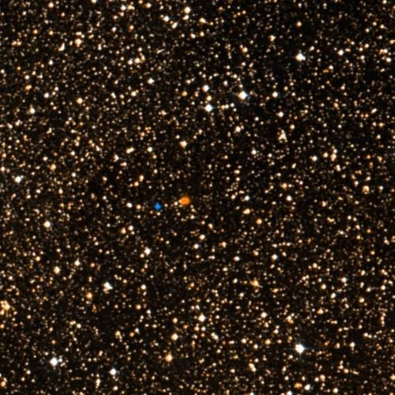
🔭 **[View in Aladin Sky Atlas (DSS2 Optical)](https://aladin.u-strasbg.fr/AladinLite/?target=217.4288+-62.6793&fov=0.5&survey=P/DSS2/color)**
*Multi-wavelength: [DSS2 Optical](https://aladin.u-strasbg.fr/AladinLite/?target=217.4288+-62.6793&fov=0.5&survey=P/DSS2/color) · [2MASS NIR](https://aladin.u-strasbg.fr/AladinLite/?target=217.4288+-62.6793&fov=0.5&survey=P/2MASS/color)*

- **Position:** RA=217.4288°, Dec=-62.6793°
- **Frequency:** 6708.11 MHz
- **SNR:** 3.4
- **Bandwidth:** 271.6104 MHz
- **Drift rate:** 0.0439 Hz/s
- **Detection method(s):** doppler_drift

**Cross-check evidence:**

  - Known SETI priority target: Proxima Centauri
  - Exoplanet system nearby: Proxima Cen b, Proxima Cen b, Proxima Cen d
  - Doppler drift rate 0.0439 Hz/s consistent with technological origin
  - Multi-channel confirmation: 2 independent data sources detect this target

### Proxima Centauri — Score 100/100

🔭 **[View in Aladin Sky Atlas (DSS2 Optical)](https://aladin.u-strasbg.fr/AladinLite/?target=217.4288+-62.6793&fov=0.5&survey=P/DSS2/color)**
*Multi-wavelength: [DSS2 Optical](https://aladin.u-strasbg.fr/AladinLite/?target=217.4288+-62.6793&fov=0.5&survey=P/DSS2/color) · [2MASS NIR](https://aladin.u-strasbg.fr/AladinLite/?target=217.4288+-62.6793&fov=0.5&survey=P/2MASS/color)*

- **Position:** RA=217.4288°, Dec=-62.6793°
- **Frequency:** 9628.37 MHz
- **SNR:** 1.9
- **Bandwidth:** 116.1597 MHz
- **Drift rate:** 0.0916 Hz/s
- **Detection method(s):** doppler_drift

**Cross-check evidence:**

  - Known SETI priority target: Proxima Centauri
  - Exoplanet system nearby: Proxima Cen b, Proxima Cen b, Proxima Cen d
  - Doppler drift rate 0.0916 Hz/s consistent with technological origin
  - Multi-channel confirmation: 2 independent data sources detect this target

### Proxima Centauri — Score 100/100

🔭 **[View in Aladin Sky Atlas (DSS2 Optical)](https://aladin.u-strasbg.fr/AladinLite/?target=217.4288+-62.6793&fov=0.5&survey=P/DSS2/color)**
*Multi-wavelength: [DSS2 Optical](https://aladin.u-strasbg.fr/AladinLite/?target=217.4288+-62.6793&fov=0.5&survey=P/DSS2/color) · [2MASS NIR](https://aladin.u-strasbg.fr/AladinLite/?target=217.4288+-62.6793&fov=0.5&survey=P/2MASS/color)*

- **Position:** RA=217.4288°, Dec=-62.6793°
- **Frequency:** 1406.03 MHz
- **SNR:** 1.4
- **Bandwidth:** 474.3496 MHz
- **Drift rate:** 0.0353 Hz/s
- **Detection method(s):** doppler_drift

**Cross-check evidence:**

  - Known SETI priority target: Proxima Centauri
  - Exoplanet system nearby: Proxima Cen b, Proxima Cen b, Proxima Cen d
  - Doppler drift rate 0.0353 Hz/s consistent with technological origin
  - Multi-channel confirmation: 2 independent data sources detect this target

### Tau Ceti — Score 75/100

🔭 **[View in Aladin Sky Atlas (DSS2 Optical)](https://aladin.u-strasbg.fr/AladinLite/?target=26.0170+-15.9375&fov=0.5&survey=P/DSS2/color)**
*Multi-wavelength: [DSS2 Optical](https://aladin.u-strasbg.fr/AladinLite/?target=26.0170+-15.9375&fov=0.5&survey=P/DSS2/color) · [2MASS NIR](https://aladin.u-strasbg.fr/AladinLite/?target=26.0170+-15.9375&fov=0.5&survey=P/2MASS/color)*

- **Position:** RA=26.0170°, Dec=-15.9375°
- **Frequency:** 3574.43 MHz
- **SNR:** 5.3
- **Bandwidth:** 485.7493 MHz
- **Drift rate:** 0.1246 Hz/s
- **Detection method(s):** doppler_drift

**Cross-check evidence:**

  - Known SETI priority target: Tau Ceti
  - Frequency in known RFI band: C-band downlink satellite
  - Exoplanet system nearby: tau Cet g, tau Cet h, tau Cet f
  - Doppler drift rate 0.1246 Hz/s consistent with technological origin
  - Multi-channel confirmation: 2 independent data sources detect this target

### Tau Ceti — Score 100/100

🔭 **[View in Aladin Sky Atlas (DSS2 Optical)](https://aladin.u-strasbg.fr/AladinLite/?target=26.0170+-15.9375&fov=0.5&survey=P/DSS2/color)**
*Multi-wavelength: [DSS2 Optical](https://aladin.u-strasbg.fr/AladinLite/?target=26.0170+-15.9375&fov=0.5&survey=P/DSS2/color) · [2MASS NIR](https://aladin.u-strasbg.fr/AladinLite/?target=26.0170+-15.9375&fov=0.5&survey=P/2MASS/color)*

- **Position:** RA=26.0170°, Dec=-15.9375°
- **Frequency:** 8470.17 MHz
- **SNR:** 3.3
- **Bandwidth:** 490.359 MHz
- **Drift rate:** -0.1605 Hz/s
- **Detection method(s):** doppler_drift

**Cross-check evidence:**

  - Known SETI priority target: Tau Ceti
  - Exoplanet system nearby: tau Cet g, tau Cet h, tau Cet f
  - Doppler drift rate 0.1605 Hz/s consistent with technological origin
  - Multi-channel confirmation: 2 independent data sources detect this target

### Epsilon Eridani — Score 75/100

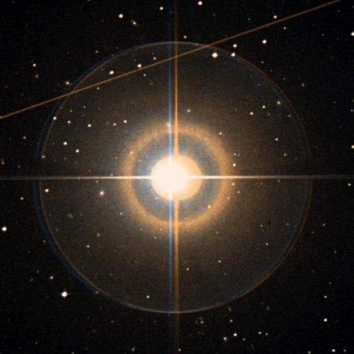
🔭 **[View in Aladin Sky Atlas (DSS2 Optical)](https://aladin.u-strasbg.fr/AladinLite/?target=53.2327+-9.4582&fov=0.5&survey=P/DSS2/color)**
*Multi-wavelength: [DSS2 Optical](https://aladin.u-strasbg.fr/AladinLite/?target=53.2327+-9.4582&fov=0.5&survey=P/DSS2/color) · [GALEX UV](https://aladin.u-strasbg.fr/AladinLite/?target=53.2327+-9.4582&fov=0.5&survey=P/GALEX/color)*

- **Position:** RA=53.2327°, Dec=-9.4582°
- **Frequency:** 5911.08 MHz
- **SNR:** 3.1
- **Bandwidth:** 317.3982 MHz
- **Drift rate:** 0.1474 Hz/s
- **Detection method(s):** doppler_drift

**Cross-check evidence:**

  - Known SETI priority target: Epsilon Eridani
  - Frequency in known RFI band: C-band uplink satellite
  - Exoplanet system nearby: eps Eri b, eps Eri b, eps Eri b
  - Doppler drift rate 0.1474 Hz/s consistent with technological origin
  - Multi-channel confirmation: 2 independent data sources detect this target

### Gliese 667C — Score 95/100

🔭 **[View in Aladin Sky Atlas (DSS2 Optical)](https://aladin.u-strasbg.fr/AladinLite/?target=259.7488+-34.9977&fov=0.5&survey=P/DSS2/color)**
*Multi-wavelength: [DSS2 Optical](https://aladin.u-strasbg.fr/AladinLite/?target=259.7488+-34.9977&fov=0.5&survey=P/DSS2/color) · [2MASS NIR](https://aladin.u-strasbg.fr/AladinLite/?target=259.7488+-34.9977&fov=0.5&survey=P/2MASS/color)*

- **Position:** RA=259.7488°, Dec=-34.9977°
- **Frequency:** 1696.92 MHz
- **SNR:** 1.7
- **Bandwidth:** 411.9479 MHz
- **Drift rate:** -0.0672 Hz/s
- **Detection method(s):** doppler_drift

**Cross-check evidence:**

  - Known SETI priority target: Gliese 667C
  - Exoplanet system nearby: GJ 667 C f, GJ 667 C b, GJ 667 C c
  - Doppler drift rate 0.0672 Hz/s consistent with technological origin

### 61 Cygni A — Score 90/100

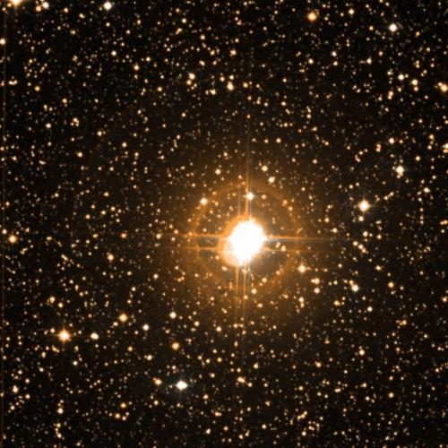
🔭 **[View in Aladin Sky Atlas (DSS2 Optical)](https://aladin.u-strasbg.fr/AladinLite/?target=316.7282+38.7488&fov=0.5&survey=P/DSS2/color)**
*Multi-wavelength: [DSS2 Optical](https://aladin.u-strasbg.fr/AladinLite/?target=316.7282+38.7488&fov=0.5&survey=P/DSS2/color) · [GALEX UV](https://aladin.u-strasbg.fr/AladinLite/?target=316.7282+38.7488&fov=0.5&survey=P/GALEX/color)*

- **Position:** RA=316.7282°, Dec=38.7488°
- **Frequency:** 1815.21 MHz
- **SNR:** 4.5
- **Bandwidth:** 190.3716 MHz
- **Drift rate:** 0.0971 Hz/s
- **Detection method(s):** doppler_drift

**Cross-check evidence:**

  - Known SETI priority target: 61 Cygni A
  - Doppler drift rate 0.0971 Hz/s consistent with technological origin
  - Multi-channel confirmation: 2 independent data sources detect this target

### Epsilon Indi A — Score 80/100

- **Position:** RA=330.8400°, Dec=-56.7867°
- **Frequency:** 3057.81 MHz
- **SNR:** 3.9
- **Bandwidth:** 388.7627 MHz
- **Drift rate:** -0.0271 Hz/s
- **Detection method(s):** doppler_drift

**Cross-check evidence:**

  - Exoplanet system nearby: eps Ind A b, eps Ind A b, eps Ind A b
  - Doppler drift rate 0.0271 Hz/s consistent with technological origin

### Ross 128 — Score 100/100

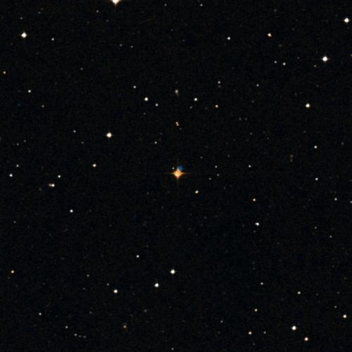
🔭 **[View in Aladin Sky Atlas (DSS2 Optical)](https://aladin.u-strasbg.fr/AladinLite/?target=176.9351+0.8048&fov=0.5&survey=P/DSS2/color)**
*Multi-wavelength: [DSS2 Optical](https://aladin.u-strasbg.fr/AladinLite/?target=176.9351+0.8048&fov=0.5&survey=P/DSS2/color) · [2MASS NIR](https://aladin.u-strasbg.fr/AladinLite/?target=176.9351+0.8048&fov=0.5&survey=P/2MASS/color)*

- **Position:** RA=176.9351°, Dec=0.8048°
- **Frequency:** 5221.05 MHz
- **SNR:** 2.0
- **Bandwidth:** 458.7021 MHz
- **Drift rate:** -0.0326 Hz/s
- **Detection method(s):** doppler_drift

**Cross-check evidence:**

  - Known SETI priority target: Ross 128
  - Exoplanet system nearby: Ross 128 b
  - Doppler drift rate 0.0326 Hz/s consistent with technological origin
  - Multi-channel confirmation: 2 independent data sources detect this target

### Ross 128 — Score 100/100

🔭 **[View in Aladin Sky Atlas (DSS2 Optical)](https://aladin.u-strasbg.fr/AladinLite/?target=176.9351+0.8048&fov=0.5&survey=P/DSS2/color)**
*Multi-wavelength: [DSS2 Optical](https://aladin.u-strasbg.fr/AladinLite/?target=176.9351+0.8048&fov=0.5&survey=P/DSS2/color) · [2MASS NIR](https://aladin.u-strasbg.fr/AladinLite/?target=176.9351+0.8048&fov=0.5&survey=P/2MASS/color)*

- **Position:** RA=176.9351°, Dec=0.8048°
- **Frequency:** 6833.65 MHz
- **SNR:** 5.7
- **Bandwidth:** 412.7028 MHz
- **Drift rate:** -0.0114 Hz/s
- **Detection method(s):** doppler_drift

**Cross-check evidence:**

  - Known SETI priority target: Ross 128
  - Exoplanet system nearby: Ross 128 b
  - Doppler drift rate 0.0114 Hz/s consistent with technological origin
  - Multi-channel confirmation: 2 independent data sources detect this target

### Proxima Centauri — Score 100/100

🔭 **[View in Aladin Sky Atlas (DSS2 Optical)](https://aladin.u-strasbg.fr/AladinLite/?target=217.4288+-62.6793&fov=0.5&survey=P/DSS2/color)**
*Multi-wavelength: [DSS2 Optical](https://aladin.u-strasbg.fr/AladinLite/?target=217.4288+-62.6793&fov=0.5&survey=P/DSS2/color) · [2MASS NIR](https://aladin.u-strasbg.fr/AladinLite/?target=217.4288+-62.6793&fov=0.5&survey=P/2MASS/color)*

- **Position:** RA=217.4288°, Dec=-62.6793°
- **Frequency:** 0.00 MHz
- **SNR:** 5.7
- **Bandwidth:** 0.0 MHz
- **Drift rate:** 0.0000 Hz/s
- **Detection method(s):** optical_laser_pulse

**Cross-check evidence:**

  - Known SETI priority target: Proxima Centauri
  - Exoplanet system nearby: Proxima Cen b, Proxima Cen b, Proxima Cen d
  - Ultra-narrowband signal (< 10 Hz) — unlikely natural
  - Multi-channel confirmation: 2 independent data sources detect this target

### Tau Ceti — Score 100/100

🔭 **[View in Aladin Sky Atlas (DSS2 Optical)](https://aladin.u-strasbg.fr/AladinLite/?target=26.0170+-15.9375&fov=0.5&survey=P/DSS2/color)**
*Multi-wavelength: [DSS2 Optical](https://aladin.u-strasbg.fr/AladinLite/?target=26.0170+-15.9375&fov=0.5&survey=P/DSS2/color) · [2MASS NIR](https://aladin.u-strasbg.fr/AladinLite/?target=26.0170+-15.9375&fov=0.5&survey=P/2MASS/color)*

- **Position:** RA=26.0170°, Dec=-15.9375°
- **Frequency:** 0.00 MHz
- **SNR:** 24.7
- **Bandwidth:** 0.0 MHz
- **Drift rate:** 0.0000 Hz/s
- **Detection method(s):** optical_laser_pulse

**Cross-check evidence:**

  - Known SETI priority target: Tau Ceti
  - Exoplanet system nearby: tau Cet g, tau Cet h, tau Cet f
  - Ultra-narrowband signal (< 10 Hz) — unlikely natural
  - High SNR: 24.7
  - Multi-channel confirmation: 2 independent data sources detect this target

### Epsilon Eridani — Score 100/100

🔭 **[View in Aladin Sky Atlas (DSS2 Optical)](https://aladin.u-strasbg.fr/AladinLite/?target=53.2327+-9.4582&fov=0.5&survey=P/DSS2/color)**
*Multi-wavelength: [DSS2 Optical](https://aladin.u-strasbg.fr/AladinLite/?target=53.2327+-9.4582&fov=0.5&survey=P/DSS2/color) · [GALEX UV](https://aladin.u-strasbg.fr/AladinLite/?target=53.2327+-9.4582&fov=0.5&survey=P/GALEX/color)*

- **Position:** RA=53.2327°, Dec=-9.4582°
- **Frequency:** 0.00 MHz
- **SNR:** 41.2
- **Bandwidth:** 0.0 MHz
- **Drift rate:** 0.0000 Hz/s
- **Detection method(s):** optical_laser_pulse

**Cross-check evidence:**

  - Known SETI priority target: Epsilon Eridani
  - Exoplanet system nearby: eps Eri b, eps Eri b, eps Eri b
  - Ultra-narrowband signal (< 10 Hz) — unlikely natural
  - High SNR: 41.2
  - Multi-channel confirmation: 2 independent data sources detect this target

### Vega — Score 80/100

🔭 **[View in Aladin Sky Atlas (DSS2 Optical)](https://aladin.u-strasbg.fr/AladinLite/?target=279.2347+38.7837&fov=0.5&survey=P/DSS2/color)**
*Multi-wavelength: [DSS2 Optical](https://aladin.u-strasbg.fr/AladinLite/?target=279.2347+38.7837&fov=0.5&survey=P/DSS2/color) · [GALEX UV](https://aladin.u-strasbg.fr/AladinLite/?target=279.2347+38.7837&fov=0.5&survey=P/GALEX/color)*

- **Position:** RA=279.2347°, Dec=38.7837°
- **Frequency:** 0.00 MHz
- **SNR:** 6.2
- **Bandwidth:** 0.0 MHz
- **Drift rate:** 0.0000 Hz/s
- **Detection method(s):** optical_laser_pulse

**Cross-check evidence:**

  - Ultra-narrowband signal (< 10 Hz) — unlikely natural
  - Multi-channel confirmation: 2 independent data sources detect this target

### 61 Cygni A — Score 95/100

🔭 **[View in Aladin Sky Atlas (DSS2 Optical)](https://aladin.u-strasbg.fr/AladinLite/?target=316.7282+38.7488&fov=0.5&survey=P/DSS2/color)**
*Multi-wavelength: [DSS2 Optical](https://aladin.u-strasbg.fr/AladinLite/?target=316.7282+38.7488&fov=0.5&survey=P/DSS2/color) · [GALEX UV](https://aladin.u-strasbg.fr/AladinLite/?target=316.7282+38.7488&fov=0.5&survey=P/GALEX/color)*

- **Position:** RA=316.7282°, Dec=38.7488°
- **Frequency:** 0.00 MHz
- **SNR:** 5.5
- **Bandwidth:** 0.0 MHz
- **Drift rate:** 0.0000 Hz/s
- **Detection method(s):** optical_laser_pulse

**Cross-check evidence:**

  - Known SETI priority target: 61 Cygni A
  - Ultra-narrowband signal (< 10 Hz) — unlikely natural
  - Multi-channel confirmation: 2 independent data sources detect this target

### Ross 128 — Score 100/100

🔭 **[View in Aladin Sky Atlas (DSS2 Optical)](https://aladin.u-strasbg.fr/AladinLite/?target=176.9351+0.8048&fov=0.5&survey=P/DSS2/color)**
*Multi-wavelength: [DSS2 Optical](https://aladin.u-strasbg.fr/AladinLite/?target=176.9351+0.8048&fov=0.5&survey=P/DSS2/color) · [2MASS NIR](https://aladin.u-strasbg.fr/AladinLite/?target=176.9351+0.8048&fov=0.5&survey=P/2MASS/color)*

- **Position:** RA=176.9351°, Dec=0.8048°
- **Frequency:** 0.00 MHz
- **SNR:** 6.1
- **Bandwidth:** 0.0 MHz
- **Drift rate:** 0.0000 Hz/s
- **Detection method(s):** optical_laser_pulse

**Cross-check evidence:**

  - Known SETI priority target: Ross 128
  - Exoplanet system nearby: Ross 128 b
  - Ultra-narrowband signal (< 10 Hz) — unlikely natural
  - Multi-channel confirmation: 2 independent data sources detect this target

### TOI-700 — Score 75/100

🔭 **[View in Aladin Sky Atlas (DSS2 Optical)](https://aladin.u-strasbg.fr/AladinLite/?target=97.0957+-65.5786&fov=0.5&survey=P/DSS2/color)**
*Multi-wavelength: [DSS2 Optical](https://aladin.u-strasbg.fr/AladinLite/?target=97.0957+-65.5786&fov=0.5&survey=P/DSS2/color) · [2MASS NIR](https://aladin.u-strasbg.fr/AladinLite/?target=97.0957+-65.5786&fov=0.5&survey=P/2MASS/color)*

- **Position:** RA=35.1611°, Dec=-56.7867°
- **Frequency:** 0.00 MHz
- **SNR:** 10.0
- **Bandwidth:** 0.0 MHz
- **Drift rate:** 0.0000 Hz/s
- **Detection method(s):** lightcurve_anomaly

**Cross-check evidence:**

  - Ultra-narrowband signal (< 10 Hz) — unlikely natural
  - Multi-channel confirmation: 2 independent data sources detect this target

### LHS 1140b — Score 75/100

🔭 **[View in Aladin Sky Atlas (2MASS NIR)](https://aladin.u-strasbg.fr/AladinLite/?target=18.0018+-15.2670&fov=0.5&survey=P/2MASS/color)**
*Multi-wavelength: [2MASS NIR](https://aladin.u-strasbg.fr/AladinLite/?target=18.0018+-15.2670&fov=0.5&survey=P/2MASS/color) · [WISE 22µm](https://aladin.u-strasbg.fr/AladinLite/?target=18.0018+-15.2670&fov=0.5&survey=P/WISE/W4)*

- **Position:** RA=18.0018°, Dec=-15.2670°
- **Frequency:** 0.00 MHz
- **SNR:** 3.0
- **Bandwidth:** 0.0 MHz
- **Drift rate:** 0.0000 Hz/s
- **Detection method(s):** atmospheric_biosignature

**Cross-check evidence:**

  - Ultra-narrowband signal (< 10 Hz) — unlikely natural

### HD 209458b — Score 90/100

🔭 **[View in Aladin Sky Atlas (2MASS NIR)](https://aladin.u-strasbg.fr/AladinLite/?target=330.7950+18.8840&fov=0.5&survey=P/2MASS/color)**
*Multi-wavelength: [2MASS NIR](https://aladin.u-strasbg.fr/AladinLite/?target=330.7950+18.8840&fov=0.5&survey=P/2MASS/color) · [WISE 22µm](https://aladin.u-strasbg.fr/AladinLite/?target=330.7950+18.8840&fov=0.5&survey=P/WISE/W4)*

- **Position:** RA=330.7950°, Dec=18.8840°
- **Frequency:** 0.00 MHz
- **SNR:** 2.5
- **Bandwidth:** 0.0 MHz
- **Drift rate:** 0.0000 Hz/s
- **Detection method(s):** atmospheric_biosignature

**Cross-check evidence:**

  - Exoplanet system nearby: HD 209458 b, HD 209458 b, HD 209458 b
  - Ultra-narrowband signal (< 10 Hz) — unlikely natural

### TOI-SIM-0001 — Score 75/100

🔭 **[View in Aladin Sky Atlas (2MASS NIR)](https://aladin.u-strasbg.fr/AladinLite/?target=77.3791+-13.7011&fov=0.5&survey=P/2MASS/color)**
*Multi-wavelength: [2MASS NIR](https://aladin.u-strasbg.fr/AladinLite/?target=77.3791+-13.7011&fov=0.5&survey=P/2MASS/color) · [WISE 22µm](https://aladin.u-strasbg.fr/AladinLite/?target=77.3791+-13.7011&fov=0.5&survey=P/WISE/W4)*

- **Position:** RA=77.3791°, Dec=-13.7011°
- **Frequency:** 0.00 MHz
- **SNR:** 3.0
- **Bandwidth:** 0.0 MHz
- **Drift rate:** 0.0000 Hz/s
- **Detection method(s):** atmospheric_biosignature

**Cross-check evidence:**

  - Ultra-narrowband signal (< 10 Hz) — unlikely natural

### 1I/ʻOumuamua — Score 75/100

🔭 **[View in Aladin Sky Atlas (DSS2 Optical)](https://aladin.u-strasbg.fr/AladinLite/?target=23.4578+26.8011&fov=0.5&survey=P/DSS2/color)**
*Multi-wavelength: [DSS2 Optical](https://aladin.u-strasbg.fr/AladinLite/?target=23.4578+26.8011&fov=0.5&survey=P/DSS2/color) · [2MASS NIR](https://aladin.u-strasbg.fr/AladinLite/?target=23.4578+26.8011&fov=0.5&survey=P/2MASS/color)*

- **Position:** RA=23.4578°, Dec=26.8011°
- **Frequency:** 0.00 MHz
- **SNR:** 0.0
- **Bandwidth:** 0.0 MHz
- **Drift rate:** 0.0000 Hz/s
- **Detection method(s):** interstellar_trajectory

**Cross-check evidence:**

  - Ultra-narrowband signal (< 10 Hz) — unlikely natural

### SIM_ISO_0001 — Score 75/100

🔭 **[View in Aladin Sky Atlas (DSS2 Optical)](https://aladin.u-strasbg.fr/AladinLite/?target=65.5670+50.5077&fov=0.5&survey=P/DSS2/color)**
*Multi-wavelength: [DSS2 Optical](https://aladin.u-strasbg.fr/AladinLite/?target=65.5670+50.5077&fov=0.5&survey=P/DSS2/color) · [2MASS NIR](https://aladin.u-strasbg.fr/AladinLite/?target=65.5670+50.5077&fov=0.5&survey=P/2MASS/color)*

- **Position:** RA=65.5670°, Dec=50.5077°
- **Frequency:** 0.00 MHz
- **SNR:** 0.0
- **Bandwidth:** 0.0 MHz
- **Drift rate:** 0.0000 Hz/s
- **Detection method(s):** interstellar_trajectory

**Cross-check evidence:**

  - Ultra-narrowband signal (< 10 Hz) — unlikely natural

### SIM_ISO_0002 — Score 75/100

🔭 **[View in Aladin Sky Atlas (DSS2 Optical)](https://aladin.u-strasbg.fr/AladinLite/?target=7.3274+33.9141&fov=0.5&survey=P/DSS2/color)**
*Multi-wavelength: [DSS2 Optical](https://aladin.u-strasbg.fr/AladinLite/?target=7.3274+33.9141&fov=0.5&survey=P/DSS2/color) · [2MASS NIR](https://aladin.u-strasbg.fr/AladinLite/?target=7.3274+33.9141&fov=0.5&survey=P/2MASS/color)*

- **Position:** RA=7.3274°, Dec=33.9141°
- **Frequency:** 0.00 MHz
- **SNR:** 0.0
- **Bandwidth:** 0.0 MHz
- **Drift rate:** 0.0000 Hz/s
- **Detection method(s):** interstellar_trajectory

**Cross-check evidence:**

  - Ultra-narrowband signal (< 10 Hz) — unlikely natural

### SIM_ISO_0004 — Score 75/100

🔭 **[View in Aladin Sky Atlas (DSS2 Optical)](https://aladin.u-strasbg.fr/AladinLite/?target=219.6372+2.1438&fov=0.5&survey=P/DSS2/color)**
*Multi-wavelength: [DSS2 Optical](https://aladin.u-strasbg.fr/AladinLite/?target=219.6372+2.1438&fov=0.5&survey=P/DSS2/color) · [2MASS NIR](https://aladin.u-strasbg.fr/AladinLite/?target=219.6372+2.1438&fov=0.5&survey=P/2MASS/color)*

- **Position:** RA=219.6372°, Dec=2.1438°
- **Frequency:** 0.00 MHz
- **SNR:** 0.0
- **Bandwidth:** 0.0 MHz
- **Drift rate:** 0.0000 Hz/s
- **Detection method(s):** interstellar_trajectory

**Cross-check evidence:**

  - Ultra-narrowband signal (< 10 Hz) — unlikely natural

## Tier 2 — Moderate Interest

### HD 235088 — Score 60/100

🔭 **[View in Aladin Sky Atlas (DSS2 Optical)](https://aladin.u-strasbg.fr/AladinLite/?target=300.6155+53.3774&fov=0.5&survey=P/DSS2/color)**
*Multi-wavelength: [DSS2 Optical](https://aladin.u-strasbg.fr/AladinLite/?target=300.6155+53.3774&fov=0.5&survey=P/DSS2/color) · [2MASS NIR](https://aladin.u-strasbg.fr/AladinLite/?target=300.6155+53.3774&fov=0.5&survey=P/2MASS/color)*

- **Position:** RA=300.6155°, Dec=53.3774°
- **Frequency:** 8087.17 MHz
- **SNR:** 20.7
- **Bandwidth:** 0.00105793 MHz
- **Drift rate:** 0.4372 Hz/s
- **Detection method(s):** zscore

**Cross-check evidence:**

  - Frequency in known RFI band: X-band satellite TT&C
  - Exoplanet system nearby: HD 235088 b, HD 235088 b, HD 235088 b
  - Doppler drift rate 0.4372 Hz/s consistent with technological origin
  - High SNR: 20.7

### HD 208487 — Score 60/100

🔭 **[View in Aladin Sky Atlas (DSS2 Optical)](https://aladin.u-strasbg.fr/AladinLite/?target=329.3332+-37.7641&fov=0.5&survey=P/DSS2/color)**
*Multi-wavelength: [DSS2 Optical](https://aladin.u-strasbg.fr/AladinLite/?target=329.3332+-37.7641&fov=0.5&survey=P/DSS2/color) · [2MASS NIR](https://aladin.u-strasbg.fr/AladinLite/?target=329.3332+-37.7641&fov=0.5&survey=P/2MASS/color)*

- **Position:** RA=329.3332°, Dec=-37.7641°
- **Frequency:** 2862.87 MHz
- **SNR:** 31.1
- **Bandwidth:** 269.0936 MHz
- **Drift rate:** -1.1380 Hz/s
- **Detection method(s):** zscore

**Cross-check evidence:**

  - Frequency in known RFI band: S-band weather radar
  - Exoplanet system nearby: HD 208487 b, HD 208487 b, HD 208487 b
  - Doppler drift rate 1.1380 Hz/s consistent with technological origin
  - High SNR: 31.1

### TOI-1468 — Score 50/100

🔭 **[View in Aladin Sky Atlas (DSS2 Optical)](https://aladin.u-strasbg.fr/AladinLite/?target=16.6539+19.2249&fov=0.5&survey=P/DSS2/color)**
*Multi-wavelength: [DSS2 Optical](https://aladin.u-strasbg.fr/AladinLite/?target=16.6539+19.2249&fov=0.5&survey=P/DSS2/color) · [2MASS NIR](https://aladin.u-strasbg.fr/AladinLite/?target=16.6539+19.2249&fov=0.5&survey=P/2MASS/color)*

- **Position:** RA=16.6539°, Dec=19.2249°
- **Frequency:** 2751.75 MHz
- **SNR:** 3.3
- **Bandwidth:** 286.6884 MHz
- **Drift rate:** 0.0413 Hz/s
- **Detection method(s):** doppler_drift

**Cross-check evidence:**

  - Frequency in known RFI band: S-band weather radar
  - Exoplanet system nearby: TOI-1468 b, TOI-1468 c, TOI-1468 c
  - Doppler drift rate 0.0413 Hz/s consistent with technological origin

### TOI-2427 — Score 50/100

🔭 **[View in Aladin Sky Atlas (DSS2 Optical)](https://aladin.u-strasbg.fr/AladinLite/?target=52.2917+-31.3629&fov=0.5&survey=P/DSS2/color)**
*Multi-wavelength: [DSS2 Optical](https://aladin.u-strasbg.fr/AladinLite/?target=52.2917+-31.3629&fov=0.5&survey=P/DSS2/color) · [2MASS NIR](https://aladin.u-strasbg.fr/AladinLite/?target=52.2917+-31.3629&fov=0.5&survey=P/2MASS/color)*

- **Position:** RA=52.2917°, Dec=-31.3629°
- **Frequency:** 2799.17 MHz
- **SNR:** 3.1
- **Bandwidth:** 102.9449 MHz
- **Drift rate:** 0.0631 Hz/s
- **Detection method(s):** doppler_drift

**Cross-check evidence:**

  - Frequency in known RFI band: S-band weather radar
  - Exoplanet system nearby: TOI-2427 b, TOI-2427 b
  - Doppler drift rate 0.0631 Hz/s consistent with technological origin

### TOI-700 — Score 60/100

🔭 **[View in Aladin Sky Atlas (DSS2 Optical)](https://aladin.u-strasbg.fr/AladinLite/?target=97.0957+-65.5786&fov=0.5&survey=P/DSS2/color)**
*Multi-wavelength: [DSS2 Optical](https://aladin.u-strasbg.fr/AladinLite/?target=97.0957+-65.5786&fov=0.5&survey=P/DSS2/color) · [2MASS NIR](https://aladin.u-strasbg.fr/AladinLite/?target=97.0957+-65.5786&fov=0.5&survey=P/2MASS/color)*

- **Position:** RA=97.0957°, Dec=-65.5786°
- **Frequency:** 8026.56 MHz
- **SNR:** 2.0
- **Bandwidth:** 283.5663 MHz
- **Drift rate:** -0.0275 Hz/s
- **Detection method(s):** doppler_drift

**Cross-check evidence:**

  - Frequency in known RFI band: X-band satellite TT&C
  - Exoplanet system nearby: TOI-700 c, TOI-700 d, TOI-700 b
  - Doppler drift rate 0.0275 Hz/s consistent with technological origin
  - Multi-channel confirmation: 2 independent data sources detect this target

### TOI-5720 — Score 50/100

🔭 **[View in Aladin Sky Atlas (DSS2 Optical)](https://aladin.u-strasbg.fr/AladinLite/?target=170.3136+25.2733&fov=0.5&survey=P/DSS2/color)**
*Multi-wavelength: [DSS2 Optical](https://aladin.u-strasbg.fr/AladinLite/?target=170.3136+25.2733&fov=0.5&survey=P/DSS2/color) · [2MASS NIR](https://aladin.u-strasbg.fr/AladinLite/?target=170.3136+25.2733&fov=0.5&survey=P/2MASS/color)*

- **Position:** RA=170.3136°, Dec=25.2733°
- **Frequency:** 8055.08 MHz
- **SNR:** 2.3
- **Bandwidth:** 365.7254 MHz
- **Drift rate:** 0.0457 Hz/s
- **Detection method(s):** doppler_drift

**Cross-check evidence:**

  - Frequency in known RFI band: X-band satellite TT&C
  - Exoplanet system nearby: TOI-5720 b, TOI-5720 b
  - Doppler drift rate 0.0457 Hz/s consistent with technological origin

### TOI-5720 — Score 50/100

🔭 **[View in Aladin Sky Atlas (DSS2 Optical)](https://aladin.u-strasbg.fr/AladinLite/?target=170.3136+25.2733&fov=0.5&survey=P/DSS2/color)**
*Multi-wavelength: [DSS2 Optical](https://aladin.u-strasbg.fr/AladinLite/?target=170.3136+25.2733&fov=0.5&survey=P/DSS2/color) · [2MASS NIR](https://aladin.u-strasbg.fr/AladinLite/?target=170.3136+25.2733&fov=0.5&survey=P/2MASS/color)*

- **Position:** RA=170.3136°, Dec=25.2733°
- **Frequency:** 1204.41 MHz
- **SNR:** 1.5
- **Bandwidth:** 136.0191 MHz
- **Drift rate:** 0.0487 Hz/s
- **Detection method(s):** doppler_drift

**Cross-check evidence:**

  - Frequency in known RFI band: DME/TACAN aeronautical navigation
  - Exoplanet system nearby: TOI-5720 b, TOI-5720 b
  - Doppler drift rate 0.0487 Hz/s consistent with technological origin

### HAT-P-11 — Score 50/100

🔭 **[View in Aladin Sky Atlas (DSS2 Optical)](https://aladin.u-strasbg.fr/AladinLite/?target=297.7102+48.0819&fov=0.5&survey=P/DSS2/color)**
*Multi-wavelength: [DSS2 Optical](https://aladin.u-strasbg.fr/AladinLite/?target=297.7102+48.0819&fov=0.5&survey=P/DSS2/color) · [2MASS NIR](https://aladin.u-strasbg.fr/AladinLite/?target=297.7102+48.0819&fov=0.5&survey=P/2MASS/color)*

- **Position:** RA=297.7102°, Dec=48.0819°
- **Frequency:** 3450.17 MHz
- **SNR:** 2.3
- **Bandwidth:** 138.5564 MHz
- **Drift rate:** 0.0840 Hz/s
- **Detection method(s):** doppler_drift

**Cross-check evidence:**

  - Frequency in known RFI band: C-band downlink satellite
  - Exoplanet system nearby: HAT-P-11 b, HAT-P-11 b, HAT-P-11 b
  - Doppler drift rate 0.0840 Hz/s consistent with technological origin

### Kepler-42 — Score 50/100

🔭 **[View in Aladin Sky Atlas (DSS2 Optical)](https://aladin.u-strasbg.fr/AladinLite/?target=292.2196+44.6174&fov=0.5&survey=P/DSS2/color)**
*Multi-wavelength: [DSS2 Optical](https://aladin.u-strasbg.fr/AladinLite/?target=292.2196+44.6174&fov=0.5&survey=P/DSS2/color) · [2MASS NIR](https://aladin.u-strasbg.fr/AladinLite/?target=292.2196+44.6174&fov=0.5&survey=P/2MASS/color)*

- **Position:** RA=292.2196°, Dec=44.6174°
- **Frequency:** 1760.00 MHz
- **SNR:** 3.0
- **Bandwidth:** 266.323 MHz
- **Drift rate:** 0.1359 Hz/s
- **Detection method(s):** doppler_drift

**Cross-check evidence:**

  - Frequency in known RFI band: 4G LTE 1800 MHz
  - Exoplanet system nearby: Kepler-1202 b, Kepler-42 d, Kepler-42 b
  - Doppler drift rate 0.1359 Hz/s consistent with technological origin

### TOI-544 — Score 50/100

🔭 **[View in Aladin Sky Atlas (DSS2 Optical)](https://aladin.u-strasbg.fr/AladinLite/?target=82.2901+-0.3429&fov=0.5&survey=P/DSS2/color)**
*Multi-wavelength: [DSS2 Optical](https://aladin.u-strasbg.fr/AladinLite/?target=82.2901+-0.3429&fov=0.5&survey=P/DSS2/color) · [2MASS NIR](https://aladin.u-strasbg.fr/AladinLite/?target=82.2901+-0.3429&fov=0.5&survey=P/2MASS/color)*

- **Position:** RA=82.2901°, Dec=-0.3429°
- **Frequency:** 9326.08 MHz
- **SNR:** 1.4
- **Bandwidth:** 332.4245 MHz
- **Drift rate:** 0.0635 Hz/s
- **Detection method(s):** doppler_drift

**Cross-check evidence:**

  - Frequency in known RFI band: X-band marine/aviation radar
  - Exoplanet system nearby: TOI-544 b, TOI-544 b, TOI-544 b
  - Doppler drift rate 0.0635 Hz/s consistent with technological origin

### TOI-3884 — Score 50/100

🔭 **[View in Aladin Sky Atlas (DSS2 Optical)](https://aladin.u-strasbg.fr/AladinLite/?target=181.5718+12.5070&fov=0.5&survey=P/DSS2/color)**
*Multi-wavelength: [DSS2 Optical](https://aladin.u-strasbg.fr/AladinLite/?target=181.5718+12.5070&fov=0.5&survey=P/DSS2/color) · [2MASS NIR](https://aladin.u-strasbg.fr/AladinLite/?target=181.5718+12.5070&fov=0.5&survey=P/2MASS/color)*

- **Position:** RA=181.5718°, Dec=12.5070°
- **Frequency:** 9065.45 MHz
- **SNR:** 1.6
- **Bandwidth:** 156.0996 MHz
- **Drift rate:** -0.1675 Hz/s
- **Detection method(s):** doppler_drift

**Cross-check evidence:**

  - Frequency in known RFI band: X-band marine/aviation radar
  - Exoplanet system nearby: TOI-3884 b, TOI-3884 b, TOI-3884 b
  - Doppler drift rate 0.1675 Hz/s consistent with technological origin

### K2-3 — Score 50/100

🔭 **[View in Aladin Sky Atlas (DSS2 Optical)](https://aladin.u-strasbg.fr/AladinLite/?target=172.3354+-1.4551&fov=0.5&survey=P/DSS2/color)**
*Multi-wavelength: [DSS2 Optical](https://aladin.u-strasbg.fr/AladinLite/?target=172.3354+-1.4551&fov=0.5&survey=P/DSS2/color) · [2MASS NIR](https://aladin.u-strasbg.fr/AladinLite/?target=172.3354+-1.4551&fov=0.5&survey=P/2MASS/color)*

- **Position:** RA=172.3354°, Dec=-1.4551°
- **Frequency:** 1969.67 MHz
- **SNR:** 1.5
- **Bandwidth:** 466.4047 MHz
- **Drift rate:** -0.0965 Hz/s
- **Detection method(s):** doppler_drift

**Cross-check evidence:**

  - Frequency in known RFI band: WCDMA / UMTS uplink
  - Exoplanet system nearby: K2-3 d, K2-3 b, K2-3 c
  - Doppler drift rate 0.0965 Hz/s consistent with technological origin

### K2-3 — Score 50/100

🔭 **[View in Aladin Sky Atlas (DSS2 Optical)](https://aladin.u-strasbg.fr/AladinLite/?target=172.3354+-1.4551&fov=0.5&survey=P/DSS2/color)**
*Multi-wavelength: [DSS2 Optical](https://aladin.u-strasbg.fr/AladinLite/?target=172.3354+-1.4551&fov=0.5&survey=P/DSS2/color) · [2MASS NIR](https://aladin.u-strasbg.fr/AladinLite/?target=172.3354+-1.4551&fov=0.5&survey=P/2MASS/color)*

- **Position:** RA=172.3354°, Dec=-1.4551°
- **Frequency:** 2481.47 MHz
- **SNR:** 1.5
- **Bandwidth:** 117.9642 MHz
- **Drift rate:** -0.1278 Hz/s
- **Detection method(s):** doppler_drift

**Cross-check evidence:**

  - Frequency in known RFI band: WiFi 2.4 GHz / ISM
  - Exoplanet system nearby: K2-3 d, K2-3 b, K2-3 c
  - Doppler drift rate 0.1278 Hz/s consistent with technological origin

### Wolf 503 — Score 50/100

🔭 **[View in Aladin Sky Atlas (DSS2 Optical)](https://aladin.u-strasbg.fr/AladinLite/?target=206.8462+-6.1393&fov=0.5&survey=P/DSS2/color)**
*Multi-wavelength: [DSS2 Optical](https://aladin.u-strasbg.fr/AladinLite/?target=206.8462+-6.1393&fov=0.5&survey=P/DSS2/color) · [2MASS NIR](https://aladin.u-strasbg.fr/AladinLite/?target=206.8462+-6.1393&fov=0.5&survey=P/2MASS/color)*

- **Position:** RA=206.8462°, Dec=-6.1393°
- **Frequency:** 2767.91 MHz
- **SNR:** 3.7
- **Bandwidth:** 224.1295 MHz
- **Drift rate:** -0.0395 Hz/s
- **Detection method(s):** doppler_drift

**Cross-check evidence:**

  - Frequency in known RFI band: S-band weather radar
  - Exoplanet system nearby: Wolf 503 b, Wolf 503 b, Wolf 503 b
  - Doppler drift rate 0.0395 Hz/s consistent with technological origin

### TOI-674 — Score 50/100

🔭 **[View in Aladin Sky Atlas (DSS2 Optical)](https://aladin.u-strasbg.fr/AladinLite/?target=164.5866+-36.8581&fov=0.5&survey=P/DSS2/color)**
*Multi-wavelength: [DSS2 Optical](https://aladin.u-strasbg.fr/AladinLite/?target=164.5866+-36.8581&fov=0.5&survey=P/DSS2/color) · [2MASS NIR](https://aladin.u-strasbg.fr/AladinLite/?target=164.5866+-36.8581&fov=0.5&survey=P/2MASS/color)*

- **Position:** RA=164.5866°, Dec=-36.8581°
- **Frequency:** 2797.98 MHz
- **SNR:** 4.3
- **Bandwidth:** 421.6498 MHz
- **Drift rate:** -0.1326 Hz/s
- **Detection method(s):** doppler_drift

**Cross-check evidence:**

  - Frequency in known RFI band: S-band weather radar
  - Exoplanet system nearby: TOI-674 b, TOI-674 b, TOI-674 b
  - Doppler drift rate 0.1326 Hz/s consistent with technological origin

### TOI-757 — Score 50/100

🔭 **[View in Aladin Sky Atlas (DSS2 Optical)](https://aladin.u-strasbg.fr/AladinLite/?target=187.9948+-35.5545&fov=0.5&survey=P/DSS2/color)**
*Multi-wavelength: [DSS2 Optical](https://aladin.u-strasbg.fr/AladinLite/?target=187.9948+-35.5545&fov=0.5&survey=P/DSS2/color) · [2MASS NIR](https://aladin.u-strasbg.fr/AladinLite/?target=187.9948+-35.5545&fov=0.5&survey=P/2MASS/color)*

- **Position:** RA=187.9948°, Dec=-35.5545°
- **Frequency:** 8171.35 MHz
- **SNR:** 2.5
- **Bandwidth:** 193.0563 MHz
- **Drift rate:** -0.1062 Hz/s
- **Detection method(s):** doppler_drift

**Cross-check evidence:**

  - Frequency in known RFI band: X-band satellite TT&C
  - Exoplanet system nearby: TOI-757 b, TOI-757 b
  - Doppler drift rate 0.1062 Hz/s consistent with technological origin

### TOI-757 — Score 50/100

🔭 **[View in Aladin Sky Atlas (DSS2 Optical)](https://aladin.u-strasbg.fr/AladinLite/?target=187.9948+-35.5545&fov=0.5&survey=P/DSS2/color)**
*Multi-wavelength: [DSS2 Optical](https://aladin.u-strasbg.fr/AladinLite/?target=187.9948+-35.5545&fov=0.5&survey=P/DSS2/color) · [2MASS NIR](https://aladin.u-strasbg.fr/AladinLite/?target=187.9948+-35.5545&fov=0.5&survey=P/2MASS/color)*

- **Position:** RA=187.9948°, Dec=-35.5545°
- **Frequency:** 8349.12 MHz
- **SNR:** 1.5
- **Bandwidth:** 142.1112 MHz
- **Drift rate:** -0.0368 Hz/s
- **Detection method(s):** doppler_drift

**Cross-check evidence:**

  - Frequency in known RFI band: X-band satellite TT&C
  - Exoplanet system nearby: TOI-757 b, TOI-757 b
  - Doppler drift rate 0.0368 Hz/s consistent with technological origin

### WASP-107 — Score 50/100

🔭 **[View in Aladin Sky Atlas (DSS2 Optical)](https://aladin.u-strasbg.fr/AladinLite/?target=188.3864+-10.1462&fov=0.5&survey=P/DSS2/color)**
*Multi-wavelength: [DSS2 Optical](https://aladin.u-strasbg.fr/AladinLite/?target=188.3864+-10.1462&fov=0.5&survey=P/DSS2/color) · [2MASS NIR](https://aladin.u-strasbg.fr/AladinLite/?target=188.3864+-10.1462&fov=0.5&survey=P/2MASS/color)*

- **Position:** RA=188.3864°, Dec=-10.1462°
- **Frequency:** 6141.09 MHz
- **SNR:** 1.9
- **Bandwidth:** 266.505 MHz
- **Drift rate:** -0.1112 Hz/s
- **Detection method(s):** doppler_drift

**Cross-check evidence:**

  - Frequency in known RFI band: C-band uplink satellite
  - Exoplanet system nearby: WASP-107 b, WASP-107 c, WASP-107 b
  - Doppler drift rate 0.1112 Hz/s consistent with technological origin

### TOI-2141 — Score 50/100

🔭 **[View in Aladin Sky Atlas (DSS2 Optical)](https://aladin.u-strasbg.fr/AladinLite/?target=258.7623+18.3403&fov=0.5&survey=P/DSS2/color)**
*Multi-wavelength: [DSS2 Optical](https://aladin.u-strasbg.fr/AladinLite/?target=258.7623+18.3403&fov=0.5&survey=P/DSS2/color) · [2MASS NIR](https://aladin.u-strasbg.fr/AladinLite/?target=258.7623+18.3403&fov=0.5&survey=P/2MASS/color)*

- **Position:** RA=258.7623°, Dec=18.3403°
- **Frequency:** 3593.40 MHz
- **SNR:** 1.5
- **Bandwidth:** 393.9573 MHz
- **Drift rate:** 0.0782 Hz/s
- **Detection method(s):** doppler_drift

**Cross-check evidence:**

  - Frequency in known RFI band: C-band downlink satellite
  - Exoplanet system nearby: TOI-2141 c, TOI-2141 b, TOI-2141 b
  - Doppler drift rate 0.0782 Hz/s consistent with technological origin

### K2-321 — Score 50/100

🔭 **[View in Aladin Sky Atlas (DSS2 Optical)](https://aladin.u-strasbg.fr/AladinLite/?target=156.4055+2.5139&fov=0.5&survey=P/DSS2/color)**
*Multi-wavelength: [DSS2 Optical](https://aladin.u-strasbg.fr/AladinLite/?target=156.4055+2.5139&fov=0.5&survey=P/DSS2/color) · [2MASS NIR](https://aladin.u-strasbg.fr/AladinLite/?target=156.4055+2.5139&fov=0.5&survey=P/2MASS/color)*

- **Position:** RA=156.4055°, Dec=2.5139°
- **Frequency:** 1760.44 MHz
- **SNR:** 2.6
- **Bandwidth:** 474.3759 MHz
- **Drift rate:** -0.1172 Hz/s
- **Detection method(s):** doppler_drift

**Cross-check evidence:**

  - Frequency in known RFI band: 4G LTE 1800 MHz
  - Exoplanet system nearby: K2-321 b, K2-321 b, K2-321 b
  - Doppler drift rate 0.1172 Hz/s consistent with technological origin

### K2-167 — Score 50/100

🔭 **[View in Aladin Sky Atlas (DSS2 Optical)](https://aladin.u-strasbg.fr/AladinLite/?target=336.5761+-18.0117&fov=0.5&survey=P/DSS2/color)**
*Multi-wavelength: [DSS2 Optical](https://aladin.u-strasbg.fr/AladinLite/?target=336.5761+-18.0117&fov=0.5&survey=P/DSS2/color) · [2MASS NIR](https://aladin.u-strasbg.fr/AladinLite/?target=336.5761+-18.0117&fov=0.5&survey=P/2MASS/color)*

- **Position:** RA=336.5761°, Dec=-18.0117°
- **Frequency:** 6343.14 MHz
- **SNR:** 1.9
- **Bandwidth:** 413.0496 MHz
- **Drift rate:** -0.1014 Hz/s
- **Detection method(s):** doppler_drift

**Cross-check evidence:**

  - Frequency in known RFI band: C-band uplink satellite
  - Exoplanet system nearby: K2-167 b, K2-167 b, K2-167 b
  - Doppler drift rate 0.1014 Hz/s consistent with technological origin

### K2-167 — Score 50/100

🔭 **[View in Aladin Sky Atlas (DSS2 Optical)](https://aladin.u-strasbg.fr/AladinLite/?target=336.5761+-18.0117&fov=0.5&survey=P/DSS2/color)**
*Multi-wavelength: [DSS2 Optical](https://aladin.u-strasbg.fr/AladinLite/?target=336.5761+-18.0117&fov=0.5&survey=P/DSS2/color) · [2MASS NIR](https://aladin.u-strasbg.fr/AladinLite/?target=336.5761+-18.0117&fov=0.5&survey=P/2MASS/color)*

- **Position:** RA=336.5761°, Dec=-18.0117°
- **Frequency:** 6310.68 MHz
- **SNR:** 3.2
- **Bandwidth:** 138.0197 MHz
- **Drift rate:** 0.1155 Hz/s
- **Detection method(s):** doppler_drift

**Cross-check evidence:**

  - Frequency in known RFI band: C-band uplink satellite
  - Exoplanet system nearby: K2-167 b, K2-167 b, K2-167 b
  - Doppler drift rate 0.1155 Hz/s consistent with technological origin

### TOI-1136 — Score 50/100

🔭 **[View in Aladin Sky Atlas (DSS2 Optical)](https://aladin.u-strasbg.fr/AladinLite/?target=192.1849+64.8553&fov=0.5&survey=P/DSS2/color)**
*Multi-wavelength: [DSS2 Optical](https://aladin.u-strasbg.fr/AladinLite/?target=192.1849+64.8553&fov=0.5&survey=P/DSS2/color) · [2MASS NIR](https://aladin.u-strasbg.fr/AladinLite/?target=192.1849+64.8553&fov=0.5&survey=P/2MASS/color)*

- **Position:** RA=192.1849°, Dec=64.8553°
- **Frequency:** 9265.98 MHz
- **SNR:** 1.3
- **Bandwidth:** 412.5176 MHz
- **Drift rate:** -0.2310 Hz/s
- **Detection method(s):** doppler_drift

**Cross-check evidence:**

  - Frequency in known RFI band: X-band marine/aviation radar
  - Exoplanet system nearby: TOI-1136 f, TOI-1136 d, TOI-1136 c
  - Doppler drift rate 0.2310 Hz/s consistent with technological origin

### TOI-4641 — Score 50/100

🔭 **[View in Aladin Sky Atlas (DSS2 Optical)](https://aladin.u-strasbg.fr/AladinLite/?target=42.5582+25.3335&fov=0.5&survey=P/DSS2/color)**
*Multi-wavelength: [DSS2 Optical](https://aladin.u-strasbg.fr/AladinLite/?target=42.5582+25.3335&fov=0.5&survey=P/DSS2/color) · [2MASS NIR](https://aladin.u-strasbg.fr/AladinLite/?target=42.5582+25.3335&fov=0.5&survey=P/2MASS/color)*

- **Position:** RA=42.5582°, Dec=25.3335°
- **Frequency:** 3555.18 MHz
- **SNR:** 3.9
- **Bandwidth:** 434.7586 MHz
- **Drift rate:** 0.0138 Hz/s
- **Detection method(s):** doppler_drift

**Cross-check evidence:**

  - Frequency in known RFI band: C-band downlink satellite
  - Exoplanet system nearby: TOI-4641 b, TOI-4641 b
  - Doppler drift rate 0.0138 Hz/s consistent with technological origin

### WASP-8 — Score 50/100

🔭 **[View in Aladin Sky Atlas (DSS2 Optical)](https://aladin.u-strasbg.fr/AladinLite/?target=359.9009+-35.0313&fov=0.5&survey=P/DSS2/color)**
*Multi-wavelength: [DSS2 Optical](https://aladin.u-strasbg.fr/AladinLite/?target=359.9009+-35.0313&fov=0.5&survey=P/DSS2/color) · [2MASS NIR](https://aladin.u-strasbg.fr/AladinLite/?target=359.9009+-35.0313&fov=0.5&survey=P/2MASS/color)*

- **Position:** RA=359.9009°, Dec=-35.0313°
- **Frequency:** 9073.30 MHz
- **SNR:** 1.9
- **Bandwidth:** 111.5998 MHz
- **Drift rate:** -0.0180 Hz/s
- **Detection method(s):** doppler_drift

**Cross-check evidence:**

  - Frequency in known RFI band: X-band marine/aviation radar
  - Exoplanet system nearby: WASP-8 c, WASP-8 b, WASP-8 b
  - Doppler drift rate 0.0180 Hz/s consistent with technological origin

### HD 118203 — Score 50/100

🔭 **[View in Aladin Sky Atlas (DSS2 Optical)](https://aladin.u-strasbg.fr/AladinLite/?target=203.5100+53.7282&fov=0.5&survey=P/DSS2/color)**
*Multi-wavelength: [DSS2 Optical](https://aladin.u-strasbg.fr/AladinLite/?target=203.5100+53.7282&fov=0.5&survey=P/DSS2/color) · [2MASS NIR](https://aladin.u-strasbg.fr/AladinLite/?target=203.5100+53.7282&fov=0.5&survey=P/2MASS/color)*

- **Position:** RA=203.5100°, Dec=53.7282°
- **Frequency:** 1048.87 MHz
- **SNR:** 1.0
- **Bandwidth:** 120.6632 MHz
- **Drift rate:** -0.1296 Hz/s
- **Detection method(s):** doppler_drift

**Cross-check evidence:**

  - Frequency in known RFI band: DME/TACAN aeronautical navigation
  - Exoplanet system nearby: HD 118203 b, HD 118203 b, HD 118203 b
  - Doppler drift rate 0.1296 Hz/s consistent with technological origin

### Kepler-93 — Score 50/100

🔭 **[View in Aladin Sky Atlas (DSS2 Optical)](https://aladin.u-strasbg.fr/AladinLite/?target=291.4181+38.6723&fov=0.5&survey=P/DSS2/color)**
*Multi-wavelength: [DSS2 Optical](https://aladin.u-strasbg.fr/AladinLite/?target=291.4181+38.6723&fov=0.5&survey=P/DSS2/color) · [2MASS NIR](https://aladin.u-strasbg.fr/AladinLite/?target=291.4181+38.6723&fov=0.5&survey=P/2MASS/color)*

- **Position:** RA=291.4181°, Dec=38.6723°
- **Frequency:** 3436.83 MHz
- **SNR:** 6.4
- **Bandwidth:** 383.9619 MHz
- **Drift rate:** -0.1382 Hz/s
- **Detection method(s):** doppler_drift

**Cross-check evidence:**

  - Frequency in known RFI band: C-band downlink satellite
  - Exoplanet system nearby: Kepler-93 b, Kepler-93 b, Kepler-93 b
  - Doppler drift rate 0.1382 Hz/s consistent with technological origin

### Kepler-446 — Score 50/100

🔭 **[View in Aladin Sky Atlas (DSS2 Optical)](https://aladin.u-strasbg.fr/AladinLite/?target=282.2501+44.9210&fov=0.5&survey=P/DSS2/color)**
*Multi-wavelength: [DSS2 Optical](https://aladin.u-strasbg.fr/AladinLite/?target=282.2501+44.9210&fov=0.5&survey=P/DSS2/color) · [2MASS NIR](https://aladin.u-strasbg.fr/AladinLite/?target=282.2501+44.9210&fov=0.5&survey=P/2MASS/color)*

- **Position:** RA=282.2501°, Dec=44.9210°
- **Frequency:** 6202.15 MHz
- **SNR:** 2.3
- **Bandwidth:** 379.9104 MHz
- **Drift rate:** 0.1115 Hz/s
- **Detection method(s):** doppler_drift

**Cross-check evidence:**

  - Frequency in known RFI band: C-band uplink satellite
  - Exoplanet system nearby: Kepler-446 d, Kepler-446 c, Kepler-446 d
  - Doppler drift rate 0.1115 Hz/s consistent with technological origin

### alf Cen B — Score 65/100

🔭 **[View in Aladin Sky Atlas (DSS2 Optical)](https://aladin.u-strasbg.fr/AladinLite/?target=219.9141+-60.8395&fov=0.5&survey=P/DSS2/color)**
*Multi-wavelength: [DSS2 Optical](https://aladin.u-strasbg.fr/AladinLite/?target=219.9141+-60.8395&fov=0.5&survey=P/DSS2/color) · [2MASS NIR](https://aladin.u-strasbg.fr/AladinLite/?target=219.9141+-60.8395&fov=0.5&survey=P/2MASS/color)*

- **Position:** RA=219.9141°, Dec=-60.8395°
- **Frequency:** 2206.85 MHz
- **SNR:** 4.7
- **Bandwidth:** 211.2302 MHz
- **Drift rate:** -0.0846 Hz/s
- **Detection method(s):** doppler_drift

**Cross-check evidence:**

  - Doppler drift rate 0.0846 Hz/s consistent with technological origin

### tau Cet — Score 50/100

- **Position:** RA=26.0093°, Dec=-15.9338°
- **Frequency:** 6152.12 MHz
- **SNR:** 2.2
- **Bandwidth:** 326.3088 MHz
- **Drift rate:** -0.0284 Hz/s
- **Detection method(s):** doppler_drift

**Cross-check evidence:**

  - Frequency in known RFI band: C-band uplink satellite
  - Exoplanet system nearby: tau Cet g, tau Cet h, tau Cet f
  - Doppler drift rate 0.0284 Hz/s consistent with technological origin

### eps Ind A — Score 50/100

🔭 **[View in Aladin Sky Atlas (DSS2 Optical)](https://aladin.u-strasbg.fr/AladinLite/?target=330.8714+-56.7969&fov=0.5&survey=P/DSS2/color)**
*Multi-wavelength: [DSS2 Optical](https://aladin.u-strasbg.fr/AladinLite/?target=330.8714+-56.7969&fov=0.5&survey=P/DSS2/color) · [2MASS NIR](https://aladin.u-strasbg.fr/AladinLite/?target=330.8714+-56.7969&fov=0.5&survey=P/2MASS/color)*

- **Position:** RA=330.8714°, Dec=-56.7969°
- **Frequency:** 9289.51 MHz
- **SNR:** 2.5
- **Bandwidth:** 301.4532 MHz
- **Drift rate:** -0.0779 Hz/s
- **Detection method(s):** doppler_drift

**Cross-check evidence:**

  - Frequency in known RFI band: X-band marine/aviation radar
  - Exoplanet system nearby: eps Ind A b, eps Ind A b, eps Ind A b
  - Doppler drift rate 0.0779 Hz/s consistent with technological origin

### HD 20794 — Score 50/100

🔭 **[View in Aladin Sky Atlas (DSS2 Optical)](https://aladin.u-strasbg.fr/AladinLite/?target=49.9998+-43.0667&fov=0.5&survey=P/DSS2/color)**
*Multi-wavelength: [DSS2 Optical](https://aladin.u-strasbg.fr/AladinLite/?target=49.9998+-43.0667&fov=0.5&survey=P/DSS2/color) · [2MASS NIR](https://aladin.u-strasbg.fr/AladinLite/?target=49.9998+-43.0667&fov=0.5&survey=P/2MASS/color)*

- **Position:** RA=49.9998°, Dec=-43.0667°
- **Frequency:** 2881.52 MHz
- **SNR:** 3.8
- **Bandwidth:** 310.0353 MHz
- **Drift rate:** -0.0688 Hz/s
- **Detection method(s):** doppler_drift

**Cross-check evidence:**

  - Frequency in known RFI band: S-band weather radar
  - Exoplanet system nearby: HD 20794 e, HD 20794 b, HD 20794 b
  - Doppler drift rate 0.0688 Hz/s consistent with technological origin

### ups And — Score 50/100

🔭 **[View in Aladin Sky Atlas (DSS2 Optical)](https://aladin.u-strasbg.fr/AladinLite/?target=24.1984+41.4038&fov=0.5&survey=P/DSS2/color)**
*Multi-wavelength: [DSS2 Optical](https://aladin.u-strasbg.fr/AladinLite/?target=24.1984+41.4038&fov=0.5&survey=P/DSS2/color) · [2MASS NIR](https://aladin.u-strasbg.fr/AladinLite/?target=24.1984+41.4038&fov=0.5&survey=P/2MASS/color)*

- **Position:** RA=24.1984°, Dec=41.4038°
- **Frequency:** 1223.41 MHz
- **SNR:** 3.6
- **Bandwidth:** 470.9842 MHz
- **Drift rate:** 0.0188 Hz/s
- **Detection method(s):** doppler_drift

**Cross-check evidence:**

  - Frequency in known RFI band: L-band satellite / GPS L2
  - Exoplanet system nearby: ups And c, ups And d, ups And d
  - Doppler drift rate 0.0188 Hz/s consistent with technological origin

### ups And — Score 50/100

🔭 **[View in Aladin Sky Atlas (DSS2 Optical)](https://aladin.u-strasbg.fr/AladinLite/?target=24.1984+41.4038&fov=0.5&survey=P/DSS2/color)**
*Multi-wavelength: [DSS2 Optical](https://aladin.u-strasbg.fr/AladinLite/?target=24.1984+41.4038&fov=0.5&survey=P/DSS2/color) · [2MASS NIR](https://aladin.u-strasbg.fr/AladinLite/?target=24.1984+41.4038&fov=0.5&survey=P/2MASS/color)*

- **Position:** RA=24.1984°, Dec=41.4038°
- **Frequency:** 1065.83 MHz
- **SNR:** 1.7
- **Bandwidth:** 211.2088 MHz
- **Drift rate:** 0.0190 Hz/s
- **Detection method(s):** doppler_drift

**Cross-check evidence:**

  - Frequency in known RFI band: DME/TACAN aeronautical navigation
  - Exoplanet system nearby: ups And c, ups And d, ups And d
  - Doppler drift rate 0.0190 Hz/s consistent with technological origin

### HD 136352 — Score 50/100

🔭 **[View in Aladin Sky Atlas (DSS2 Optical)](https://aladin.u-strasbg.fr/AladinLite/?target=230.4401+-48.3188&fov=0.5&survey=P/DSS2/color)**
*Multi-wavelength: [DSS2 Optical](https://aladin.u-strasbg.fr/AladinLite/?target=230.4401+-48.3188&fov=0.5&survey=P/DSS2/color) · [2MASS NIR](https://aladin.u-strasbg.fr/AladinLite/?target=230.4401+-48.3188&fov=0.5&survey=P/2MASS/color)*

- **Position:** RA=230.4401°, Dec=-48.3188°
- **Frequency:** 8218.54 MHz
- **SNR:** 4.0
- **Bandwidth:** 469.8807 MHz
- **Drift rate:** 0.0448 Hz/s
- **Detection method(s):** doppler_drift

**Cross-check evidence:**

  - Frequency in known RFI band: X-band satellite TT&C
  - Exoplanet system nearby: HD 136352 d, HD 136352 d, HD 136352 b
  - Doppler drift rate 0.0448 Hz/s consistent with technological origin

### HD 10647 — Score 50/100

🔭 **[View in Aladin Sky Atlas (DSS2 Optical)](https://aladin.u-strasbg.fr/AladinLite/?target=25.6234+-53.7413&fov=0.5&survey=P/DSS2/color)**
*Multi-wavelength: [DSS2 Optical](https://aladin.u-strasbg.fr/AladinLite/?target=25.6234+-53.7413&fov=0.5&survey=P/DSS2/color) · [2MASS NIR](https://aladin.u-strasbg.fr/AladinLite/?target=25.6234+-53.7413&fov=0.5&survey=P/2MASS/color)*

- **Position:** RA=25.6234°, Dec=-53.7413°
- **Frequency:** 6312.88 MHz
- **SNR:** 2.4
- **Bandwidth:** 258.776 MHz
- **Drift rate:** -0.0190 Hz/s
- **Detection method(s):** doppler_drift

**Cross-check evidence:**

  - Frequency in known RFI band: C-band uplink satellite
  - Exoplanet system nearby: HD 10647 b, HD 10647 b, HD 10647 b
  - Doppler drift rate 0.0190 Hz/s consistent with technological origin

### HD 10647 — Score 50/100

🔭 **[View in Aladin Sky Atlas (DSS2 Optical)](https://aladin.u-strasbg.fr/AladinLite/?target=25.6234+-53.7413&fov=0.5&survey=P/DSS2/color)**
*Multi-wavelength: [DSS2 Optical](https://aladin.u-strasbg.fr/AladinLite/?target=25.6234+-53.7413&fov=0.5&survey=P/DSS2/color) · [2MASS NIR](https://aladin.u-strasbg.fr/AladinLite/?target=25.6234+-53.7413&fov=0.5&survey=P/2MASS/color)*

- **Position:** RA=25.6234°, Dec=-53.7413°
- **Frequency:** 2688.34 MHz
- **SNR:** 3.5
- **Bandwidth:** 133.9246 MHz
- **Drift rate:** -0.1494 Hz/s
- **Detection method(s):** doppler_drift

**Cross-check evidence:**

  - Frequency in known RFI band: LTE Band 41 / WiMAX 2.5 GHz
  - Exoplanet system nearby: HD 10647 b, HD 10647 b, HD 10647 b
  - Doppler drift rate 0.1494 Hz/s consistent with technological origin

### rho CrB — Score 50/100

🔭 **[View in Aladin Sky Atlas (DSS2 Optical)](https://aladin.u-strasbg.fr/AladinLite/?target=240.2601+33.3002&fov=0.5&survey=P/DSS2/color)**
*Multi-wavelength: [DSS2 Optical](https://aladin.u-strasbg.fr/AladinLite/?target=240.2601+33.3002&fov=0.5&survey=P/DSS2/color) · [2MASS NIR](https://aladin.u-strasbg.fr/AladinLite/?target=240.2601+33.3002&fov=0.5&survey=P/2MASS/color)*

- **Position:** RA=240.2601°, Dec=33.3002°
- **Frequency:** 2817.81 MHz
- **SNR:** 1.8
- **Bandwidth:** 107.0675 MHz
- **Drift rate:** 0.0177 Hz/s
- **Detection method(s):** doppler_drift

**Cross-check evidence:**

  - Frequency in known RFI band: S-band weather radar
  - Exoplanet system nearby: rho CrB c, rho CrB c, rho CrB e
  - Doppler drift rate 0.0177 Hz/s consistent with technological origin

### rho CrB — Score 50/100

🔭 **[View in Aladin Sky Atlas (DSS2 Optical)](https://aladin.u-strasbg.fr/AladinLite/?target=240.2601+33.3002&fov=0.5&survey=P/DSS2/color)**
*Multi-wavelength: [DSS2 Optical](https://aladin.u-strasbg.fr/AladinLite/?target=240.2601+33.3002&fov=0.5&survey=P/DSS2/color) · [2MASS NIR](https://aladin.u-strasbg.fr/AladinLite/?target=240.2601+33.3002&fov=0.5&survey=P/2MASS/color)*

- **Position:** RA=240.2601°, Dec=33.3002°
- **Frequency:** 9072.97 MHz
- **SNR:** 1.2
- **Bandwidth:** 194.0388 MHz
- **Drift rate:** 0.0482 Hz/s
- **Detection method(s):** doppler_drift

**Cross-check evidence:**

  - Frequency in known RFI band: X-band marine/aviation radar
  - Exoplanet system nearby: rho CrB c, rho CrB c, rho CrB e
  - Doppler drift rate 0.0482 Hz/s consistent with technological origin

### HD 189567 — Score 50/100

🔭 **[View in Aladin Sky Atlas (DSS2 Optical)](https://aladin.u-strasbg.fr/AladinLite/?target=301.3960+-67.3238&fov=0.5&survey=P/DSS2/color)**
*Multi-wavelength: [DSS2 Optical](https://aladin.u-strasbg.fr/AladinLite/?target=301.3960+-67.3238&fov=0.5&survey=P/DSS2/color) · [2MASS NIR](https://aladin.u-strasbg.fr/AladinLite/?target=301.3960+-67.3238&fov=0.5&survey=P/2MASS/color)*

- **Position:** RA=301.3960°, Dec=-67.3238°
- **Frequency:** 8127.77 MHz
- **SNR:** 4.1
- **Bandwidth:** 413.5296 MHz
- **Drift rate:** 0.0625 Hz/s
- **Detection method(s):** doppler_drift

**Cross-check evidence:**

  - Frequency in known RFI band: X-band satellite TT&C
  - Exoplanet system nearby: HD 189567 b, HD 189567 c, HD 189567 b
  - Doppler drift rate 0.0625 Hz/s consistent with technological origin

### HD 99492 — Score 50/100

🔭 **[View in Aladin Sky Atlas (DSS2 Optical)](https://aladin.u-strasbg.fr/AladinLite/?target=171.6897+3.0071&fov=0.5&survey=P/DSS2/color)**
*Multi-wavelength: [DSS2 Optical](https://aladin.u-strasbg.fr/AladinLite/?target=171.6897+3.0071&fov=0.5&survey=P/DSS2/color) · [2MASS NIR](https://aladin.u-strasbg.fr/AladinLite/?target=171.6897+3.0071&fov=0.5&survey=P/2MASS/color)*

- **Position:** RA=171.6897°, Dec=3.0071°
- **Frequency:** 6059.54 MHz
- **SNR:** 2.2
- **Bandwidth:** 140.7577 MHz
- **Drift rate:** -0.0425 Hz/s
- **Detection method(s):** doppler_drift

**Cross-check evidence:**

  - Frequency in known RFI band: C-band uplink satellite
  - Exoplanet system nearby: HD 99492 b, HD 99492 b, HD 99492 b
  - Doppler drift rate 0.0425 Hz/s consistent with technological origin

### HD 217107 — Score 50/100

🔭 **[View in Aladin Sky Atlas (DSS2 Optical)](https://aladin.u-strasbg.fr/AladinLite/?target=344.5647+-2.3954&fov=0.5&survey=P/DSS2/color)**
*Multi-wavelength: [DSS2 Optical](https://aladin.u-strasbg.fr/AladinLite/?target=344.5647+-2.3954&fov=0.5&survey=P/DSS2/color) · [2MASS NIR](https://aladin.u-strasbg.fr/AladinLite/?target=344.5647+-2.3954&fov=0.5&survey=P/2MASS/color)*

- **Position:** RA=344.5647°, Dec=-2.3954°
- **Frequency:** 9269.41 MHz
- **SNR:** 4.0
- **Bandwidth:** 103.7039 MHz
- **Drift rate:** 0.0807 Hz/s
- **Detection method(s):** doppler_drift

**Cross-check evidence:**

  - Frequency in known RFI band: X-band marine/aviation radar
  - Exoplanet system nearby: HD 217107 b, HD 217107 c, HD 217107 c
  - Doppler drift rate 0.0807 Hz/s consistent with technological origin

### HD 114783 — Score 50/100

🔭 **[View in Aladin Sky Atlas (DSS2 Optical)](https://aladin.u-strasbg.fr/AladinLite/?target=198.1818+-2.2650&fov=0.5&survey=P/DSS2/color)**
*Multi-wavelength: [DSS2 Optical](https://aladin.u-strasbg.fr/AladinLite/?target=198.1818+-2.2650&fov=0.5&survey=P/DSS2/color) · [2MASS NIR](https://aladin.u-strasbg.fr/AladinLite/?target=198.1818+-2.2650&fov=0.5&survey=P/2MASS/color)*

- **Position:** RA=198.1818°, Dec=-2.2650°
- **Frequency:** 1042.67 MHz
- **SNR:** 6.7
- **Bandwidth:** 441.3478 MHz
- **Drift rate:** 0.0516 Hz/s
- **Detection method(s):** doppler_drift

**Cross-check evidence:**

  - Frequency in known RFI band: DME/TACAN aeronautical navigation
  - Exoplanet system nearby: HD 114783 b, HD 114783 c, HD 114783 c
  - Doppler drift rate 0.0516 Hz/s consistent with technological origin

### HD 63433 — Score 50/100

🔭 **[View in Aladin Sky Atlas (DSS2 Optical)](https://aladin.u-strasbg.fr/AladinLite/?target=117.4794+27.3631&fov=0.5&survey=P/DSS2/color)**
*Multi-wavelength: [DSS2 Optical](https://aladin.u-strasbg.fr/AladinLite/?target=117.4794+27.3631&fov=0.5&survey=P/DSS2/color) · [2MASS NIR](https://aladin.u-strasbg.fr/AladinLite/?target=117.4794+27.3631&fov=0.5&survey=P/2MASS/color)*

- **Position:** RA=117.4794°, Dec=27.3631°
- **Frequency:** 8192.92 MHz
- **SNR:** 5.1
- **Bandwidth:** 340.2936 MHz
- **Drift rate:** 0.0635 Hz/s
- **Detection method(s):** doppler_drift

**Cross-check evidence:**

  - Frequency in known RFI band: X-band satellite TT&C
  - Exoplanet system nearby: HD 63433 c, HD 63433 c, HD 63433 b
  - Doppler drift rate 0.0635 Hz/s consistent with technological origin

### DMPP-4 — Score 50/100

🔭 **[View in Aladin Sky Atlas (DSS2 Optical)](https://aladin.u-strasbg.fr/AladinLite/?target=293.5827+51.2358&fov=0.5&survey=P/DSS2/color)**
*Multi-wavelength: [DSS2 Optical](https://aladin.u-strasbg.fr/AladinLite/?target=293.5827+51.2358&fov=0.5&survey=P/DSS2/color) · [2MASS NIR](https://aladin.u-strasbg.fr/AladinLite/?target=293.5827+51.2358&fov=0.5&survey=P/2MASS/color)*

- **Position:** RA=293.5827°, Dec=51.2358°
- **Frequency:** 6344.47 MHz
- **SNR:** 3.0
- **Bandwidth:** 150.4105 MHz
- **Drift rate:** -0.1093 Hz/s
- **Detection method(s):** doppler_drift

**Cross-check evidence:**

  - Frequency in known RFI band: C-band uplink satellite
  - Exoplanet system nearby: DMPP-4 b
  - Doppler drift rate 0.1093 Hz/s consistent with technological origin

### DMPP-4 — Score 50/100

🔭 **[View in Aladin Sky Atlas (DSS2 Optical)](https://aladin.u-strasbg.fr/AladinLite/?target=293.5827+51.2358&fov=0.5&survey=P/DSS2/color)**
*Multi-wavelength: [DSS2 Optical](https://aladin.u-strasbg.fr/AladinLite/?target=293.5827+51.2358&fov=0.5&survey=P/DSS2/color) · [2MASS NIR](https://aladin.u-strasbg.fr/AladinLite/?target=293.5827+51.2358&fov=0.5&survey=P/2MASS/color)*

- **Position:** RA=293.5827°, Dec=51.2358°
- **Frequency:** 5825.80 MHz
- **SNR:** 2.5
- **Bandwidth:** 348.7168 MHz
- **Drift rate:** -0.0746 Hz/s
- **Detection method(s):** doppler_drift

**Cross-check evidence:**

  - Frequency in known RFI band: WiFi 5.8 GHz / ISM
  - Exoplanet system nearby: DMPP-4 b
  - Doppler drift rate 0.0746 Hz/s consistent with technological origin

### DMPP-4 — Score 50/100

🔭 **[View in Aladin Sky Atlas (DSS2 Optical)](https://aladin.u-strasbg.fr/AladinLite/?target=293.5827+51.2358&fov=0.5&survey=P/DSS2/color)**
*Multi-wavelength: [DSS2 Optical](https://aladin.u-strasbg.fr/AladinLite/?target=293.5827+51.2358&fov=0.5&survey=P/DSS2/color) · [2MASS NIR](https://aladin.u-strasbg.fr/AladinLite/?target=293.5827+51.2358&fov=0.5&survey=P/2MASS/color)*

- **Position:** RA=293.5827°, Dec=51.2358°
- **Frequency:** 3652.80 MHz
- **SNR:** 1.1
- **Bandwidth:** 365.4484 MHz
- **Drift rate:** -0.0123 Hz/s
- **Detection method(s):** doppler_drift

**Cross-check evidence:**

  - Frequency in known RFI band: C-band downlink satellite
  - Exoplanet system nearby: DMPP-4 b
  - Doppler drift rate 0.0123 Hz/s consistent with technological origin

### HD 60532 — Score 50/100

🔭 **[View in Aladin Sky Atlas (DSS2 Optical)](https://aladin.u-strasbg.fr/AladinLite/?target=113.5131+-22.2959&fov=0.5&survey=P/DSS2/color)**
*Multi-wavelength: [DSS2 Optical](https://aladin.u-strasbg.fr/AladinLite/?target=113.5131+-22.2959&fov=0.5&survey=P/DSS2/color) · [2MASS NIR](https://aladin.u-strasbg.fr/AladinLite/?target=113.5131+-22.2959&fov=0.5&survey=P/2MASS/color)*

- **Position:** RA=113.5131°, Dec=-22.2959°
- **Frequency:** 5981.87 MHz
- **SNR:** 3.3
- **Bandwidth:** 258.4666 MHz
- **Drift rate:** 0.1287 Hz/s
- **Detection method(s):** doppler_drift

**Cross-check evidence:**

  - Frequency in known RFI band: C-band uplink satellite
  - Exoplanet system nearby: HD 60532 c, HD 60532 b, HD 60532 b
  - Doppler drift rate 0.1287 Hz/s consistent with technological origin

### HD 216437 — Score 50/100

🔭 **[View in Aladin Sky Atlas (DSS2 Optical)](https://aladin.u-strasbg.fr/AladinLite/?target=343.6640+-70.0734&fov=0.5&survey=P/DSS2/color)**
*Multi-wavelength: [DSS2 Optical](https://aladin.u-strasbg.fr/AladinLite/?target=343.6640+-70.0734&fov=0.5&survey=P/DSS2/color) · [2MASS NIR](https://aladin.u-strasbg.fr/AladinLite/?target=343.6640+-70.0734&fov=0.5&survey=P/2MASS/color)*

- **Position:** RA=343.6640°, Dec=-70.0734°
- **Frequency:** 8164.26 MHz
- **SNR:** 2.1
- **Bandwidth:** 308.092 MHz
- **Drift rate:** -0.0628 Hz/s
- **Detection method(s):** doppler_drift

**Cross-check evidence:**

  - Frequency in known RFI band: X-band satellite TT&C
  - Exoplanet system nearby: HD 216437 b, HD 216437 b, HD 216437 b
  - Doppler drift rate 0.0628 Hz/s consistent with technological origin

### HD 216437 — Score 50/100

🔭 **[View in Aladin Sky Atlas (DSS2 Optical)](https://aladin.u-strasbg.fr/AladinLite/?target=343.6640+-70.0734&fov=0.5&survey=P/DSS2/color)**
*Multi-wavelength: [DSS2 Optical](https://aladin.u-strasbg.fr/AladinLite/?target=343.6640+-70.0734&fov=0.5&survey=P/DSS2/color) · [2MASS NIR](https://aladin.u-strasbg.fr/AladinLite/?target=343.6640+-70.0734&fov=0.5&survey=P/2MASS/color)*

- **Position:** RA=343.6640°, Dec=-70.0734°
- **Frequency:** 9006.91 MHz
- **SNR:** 3.1
- **Bandwidth:** 258.0029 MHz
- **Drift rate:** 0.0273 Hz/s
- **Detection method(s):** doppler_drift

**Cross-check evidence:**

  - Frequency in known RFI band: X-band marine/aviation radar
  - Exoplanet system nearby: HD 216437 b, HD 216437 b, HD 216437 b
  - Doppler drift rate 0.0273 Hz/s consistent with technological origin

### HD 216437 — Score 50/100

🔭 **[View in Aladin Sky Atlas (DSS2 Optical)](https://aladin.u-strasbg.fr/AladinLite/?target=343.6640+-70.0734&fov=0.5&survey=P/DSS2/color)**
*Multi-wavelength: [DSS2 Optical](https://aladin.u-strasbg.fr/AladinLite/?target=343.6640+-70.0734&fov=0.5&survey=P/DSS2/color) · [2MASS NIR](https://aladin.u-strasbg.fr/AladinLite/?target=343.6640+-70.0734&fov=0.5&survey=P/2MASS/color)*

- **Position:** RA=343.6640°, Dec=-70.0734°
- **Frequency:** 2605.98 MHz
- **SNR:** 1.5
- **Bandwidth:** 179.8168 MHz
- **Drift rate:** -0.2117 Hz/s
- **Detection method(s):** doppler_drift

**Cross-check evidence:**

  - Frequency in known RFI band: LTE Band 41 / WiMAX 2.5 GHz
  - Exoplanet system nearby: HD 216437 b, HD 216437 b, HD 216437 b
  - Doppler drift rate 0.2117 Hz/s consistent with technological origin

### HD 134606 — Score 50/100

🔭 **[View in Aladin Sky Atlas (DSS2 Optical)](https://aladin.u-strasbg.fr/AladinLite/?target=228.8104+-70.5203&fov=0.5&survey=P/DSS2/color)**
*Multi-wavelength: [DSS2 Optical](https://aladin.u-strasbg.fr/AladinLite/?target=228.8104+-70.5203&fov=0.5&survey=P/DSS2/color) · [2MASS NIR](https://aladin.u-strasbg.fr/AladinLite/?target=228.8104+-70.5203&fov=0.5&survey=P/2MASS/color)*

- **Position:** RA=228.8104°, Dec=-70.5203°
- **Frequency:** 1208.26 MHz
- **SNR:** 2.8
- **Bandwidth:** 491.6899 MHz
- **Drift rate:** 0.1754 Hz/s
- **Detection method(s):** doppler_drift

**Cross-check evidence:**

  - Frequency in known RFI band: DME/TACAN aeronautical navigation
  - Exoplanet system nearby: HD 134606 f, HD 134606 d, HD 134606 c
  - Doppler drift rate 0.1754 Hz/s consistent with technological origin

### HD 114386 — Score 50/100

🔭 **[View in Aladin Sky Atlas (DSS2 Optical)](https://aladin.u-strasbg.fr/AladinLite/?target=197.6652+-35.0562&fov=0.5&survey=P/DSS2/color)**
*Multi-wavelength: [DSS2 Optical](https://aladin.u-strasbg.fr/AladinLite/?target=197.6652+-35.0562&fov=0.5&survey=P/DSS2/color) · [2MASS NIR](https://aladin.u-strasbg.fr/AladinLite/?target=197.6652+-35.0562&fov=0.5&survey=P/2MASS/color)*

- **Position:** RA=197.6652°, Dec=-35.0562°
- **Frequency:** 3652.97 MHz
- **SNR:** 2.7
- **Bandwidth:** 405.9214 MHz
- **Drift rate:** 0.0226 Hz/s
- **Detection method(s):** doppler_drift

**Cross-check evidence:**

  - Frequency in known RFI band: C-band downlink satellite
  - Exoplanet system nearby: HD 114386 b, HD 114386 b, HD 114386 c
  - Doppler drift rate 0.0226 Hz/s consistent with technological origin

### HD 13808 — Score 50/100

🔭 **[View in Aladin Sky Atlas (DSS2 Optical)](https://aladin.u-strasbg.fr/AladinLite/?target=33.1781+-53.7438&fov=0.5&survey=P/DSS2/color)**
*Multi-wavelength: [DSS2 Optical](https://aladin.u-strasbg.fr/AladinLite/?target=33.1781+-53.7438&fov=0.5&survey=P/DSS2/color) · [2MASS NIR](https://aladin.u-strasbg.fr/AladinLite/?target=33.1781+-53.7438&fov=0.5&survey=P/2MASS/color)*

- **Position:** RA=33.1781°, Dec=-53.7438°
- **Frequency:** 5976.08 MHz
- **SNR:** 1.2
- **Bandwidth:** 138.7912 MHz
- **Drift rate:** -0.0833 Hz/s
- **Detection method(s):** doppler_drift

**Cross-check evidence:**

  - Frequency in known RFI band: C-band uplink satellite
  - Exoplanet system nearby: HD 13808 b, HD 13808 c
  - Doppler drift rate 0.0833 Hz/s consistent with technological origin

### HD 13808 — Score 50/100

🔭 **[View in Aladin Sky Atlas (DSS2 Optical)](https://aladin.u-strasbg.fr/AladinLite/?target=33.1781+-53.7438&fov=0.5&survey=P/DSS2/color)**
*Multi-wavelength: [DSS2 Optical](https://aladin.u-strasbg.fr/AladinLite/?target=33.1781+-53.7438&fov=0.5&survey=P/DSS2/color) · [2MASS NIR](https://aladin.u-strasbg.fr/AladinLite/?target=33.1781+-53.7438&fov=0.5&survey=P/2MASS/color)*

- **Position:** RA=33.1781°, Dec=-53.7438°
- **Frequency:** 5881.28 MHz
- **SNR:** 2.8
- **Bandwidth:** 166.1245 MHz
- **Drift rate:** -0.0312 Hz/s
- **Detection method(s):** doppler_drift

**Cross-check evidence:**

  - Frequency in known RFI band: C-band uplink satellite
  - Exoplanet system nearby: HD 13808 b, HD 13808 c
  - Doppler drift rate 0.0312 Hz/s consistent with technological origin

### HD 13808 — Score 50/100

🔭 **[View in Aladin Sky Atlas (DSS2 Optical)](https://aladin.u-strasbg.fr/AladinLite/?target=33.1781+-53.7438&fov=0.5&survey=P/DSS2/color)**
*Multi-wavelength: [DSS2 Optical](https://aladin.u-strasbg.fr/AladinLite/?target=33.1781+-53.7438&fov=0.5&survey=P/DSS2/color) · [2MASS NIR](https://aladin.u-strasbg.fr/AladinLite/?target=33.1781+-53.7438&fov=0.5&survey=P/2MASS/color)*

- **Position:** RA=33.1781°, Dec=-53.7438°
- **Frequency:** 6258.05 MHz
- **SNR:** 3.5
- **Bandwidth:** 394.0518 MHz
- **Drift rate:** -0.1536 Hz/s
- **Detection method(s):** doppler_drift

**Cross-check evidence:**

  - Frequency in known RFI band: C-band uplink satellite
  - Exoplanet system nearby: HD 13808 b, HD 13808 c
  - Doppler drift rate 0.1536 Hz/s consistent with technological origin

### HD 13808 — Score 50/100

🔭 **[View in Aladin Sky Atlas (DSS2 Optical)](https://aladin.u-strasbg.fr/AladinLite/?target=33.1781+-53.7438&fov=0.5&survey=P/DSS2/color)**
*Multi-wavelength: [DSS2 Optical](https://aladin.u-strasbg.fr/AladinLite/?target=33.1781+-53.7438&fov=0.5&survey=P/DSS2/color) · [2MASS NIR](https://aladin.u-strasbg.fr/AladinLite/?target=33.1781+-53.7438&fov=0.5&survey=P/2MASS/color)*

- **Position:** RA=33.1781°, Dec=-53.7438°
- **Frequency:** 2615.43 MHz
- **SNR:** 3.6
- **Bandwidth:** 265.4272 MHz
- **Drift rate:** -0.0622 Hz/s
- **Detection method(s):** doppler_drift

**Cross-check evidence:**

  - Frequency in known RFI band: LTE Band 41 / WiMAX 2.5 GHz
  - Exoplanet system nearby: HD 13808 b, HD 13808 c
  - Doppler drift rate 0.0622 Hz/s consistent with technological origin

### TOI-5734 — Score 50/100

🔭 **[View in Aladin Sky Atlas (DSS2 Optical)](https://aladin.u-strasbg.fr/AladinLite/?target=111.2558+37.2311&fov=0.5&survey=P/DSS2/color)**
*Multi-wavelength: [DSS2 Optical](https://aladin.u-strasbg.fr/AladinLite/?target=111.2558+37.2311&fov=0.5&survey=P/DSS2/color) · [2MASS NIR](https://aladin.u-strasbg.fr/AladinLite/?target=111.2558+37.2311&fov=0.5&survey=P/2MASS/color)*

- **Position:** RA=111.2558°, Dec=37.2311°
- **Frequency:** 9285.99 MHz
- **SNR:** 1.9
- **Bandwidth:** 236.5548 MHz
- **Drift rate:** 0.1371 Hz/s
- **Detection method(s):** doppler_drift

**Cross-check evidence:**

  - Frequency in known RFI band: X-band marine/aviation radar
  - Exoplanet system nearby: TOI-5734 b, TOI-5734 b, TOI-5734 b
  - Doppler drift rate 0.1371 Hz/s consistent with technological origin

### HR 2562 — Score 50/100

🔭 **[View in Aladin Sky Atlas (DSS2 Optical)](https://aladin.u-strasbg.fr/AladinLite/?target=102.5043+-60.2487&fov=0.5&survey=P/DSS2/color)**
*Multi-wavelength: [DSS2 Optical](https://aladin.u-strasbg.fr/AladinLite/?target=102.5043+-60.2487&fov=0.5&survey=P/DSS2/color) · [2MASS NIR](https://aladin.u-strasbg.fr/AladinLite/?target=102.5043+-60.2487&fov=0.5&survey=P/2MASS/color)*

- **Position:** RA=102.5043°, Dec=-60.2487°
- **Frequency:** 6056.37 MHz
- **SNR:** 2.9
- **Bandwidth:** 387.913 MHz
- **Drift rate:** 0.0131 Hz/s
- **Detection method(s):** doppler_drift

**Cross-check evidence:**

  - Frequency in known RFI band: C-band uplink satellite
  - Exoplanet system nearby: HR 2562 b, HR 2562 b, HR 2562 b
  - Doppler drift rate 0.0131 Hz/s consistent with technological origin

### TOI-2128 — Score 50/100

🔭 **[View in Aladin Sky Atlas (DSS2 Optical)](https://aladin.u-strasbg.fr/AladinLite/?target=256.9818+32.1053&fov=0.5&survey=P/DSS2/color)**
*Multi-wavelength: [DSS2 Optical](https://aladin.u-strasbg.fr/AladinLite/?target=256.9818+32.1053&fov=0.5&survey=P/DSS2/color) · [2MASS NIR](https://aladin.u-strasbg.fr/AladinLite/?target=256.9818+32.1053&fov=0.5&survey=P/2MASS/color)*

- **Position:** RA=256.9818°, Dec=32.1053°
- **Frequency:** 3551.69 MHz
- **SNR:** 3.2
- **Bandwidth:** 369.8946 MHz
- **Drift rate:** 0.0410 Hz/s
- **Detection method(s):** doppler_drift

**Cross-check evidence:**

  - Frequency in known RFI band: C-band downlink satellite
  - Exoplanet system nearby: TOI-2128 b, TOI-2128 b
  - Doppler drift rate 0.0410 Hz/s consistent with technological origin

### HD 95338 — Score 50/100

🔭 **[View in Aladin Sky Atlas (DSS2 Optical)](https://aladin.u-strasbg.fr/AladinLite/?target=164.8563+-56.6236&fov=0.5&survey=P/DSS2/color)**
*Multi-wavelength: [DSS2 Optical](https://aladin.u-strasbg.fr/AladinLite/?target=164.8563+-56.6236&fov=0.5&survey=P/DSS2/color) · [2MASS NIR](https://aladin.u-strasbg.fr/AladinLite/?target=164.8563+-56.6236&fov=0.5&survey=P/2MASS/color)*

- **Position:** RA=164.8563°, Dec=-56.6236°
- **Frequency:** 9423.44 MHz
- **SNR:** 1.7
- **Bandwidth:** 441.5938 MHz
- **Drift rate:** 0.0974 Hz/s
- **Detection method(s):** doppler_drift

**Cross-check evidence:**

  - Frequency in known RFI band: X-band marine/aviation radar
  - Exoplanet system nearby: HD 95338 b, HD 95338 b, HD 95338 b
  - Doppler drift rate 0.0974 Hz/s consistent with technological origin

### HD 23472 — Score 50/100

🔭 **[View in Aladin Sky Atlas (DSS2 Optical)](https://aladin.u-strasbg.fr/AladinLite/?target=55.4590+-62.7673&fov=0.5&survey=P/DSS2/color)**
*Multi-wavelength: [DSS2 Optical](https://aladin.u-strasbg.fr/AladinLite/?target=55.4590+-62.7673&fov=0.5&survey=P/DSS2/color) · [2MASS NIR](https://aladin.u-strasbg.fr/AladinLite/?target=55.4590+-62.7673&fov=0.5&survey=P/2MASS/color)*

- **Position:** RA=55.4590°, Dec=-62.7673°
- **Frequency:** 8177.60 MHz
- **SNR:** 2.6
- **Bandwidth:** 435.6695 MHz
- **Drift rate:** -0.0197 Hz/s
- **Detection method(s):** doppler_drift

**Cross-check evidence:**

  - Frequency in known RFI band: X-band satellite TT&C
  - Exoplanet system nearby: HD 23472 e, HD 23472 b, HD 23472 e
  - Doppler drift rate 0.0197 Hz/s consistent with technological origin

### HD 168443 — Score 50/100

🔭 **[View in Aladin Sky Atlas (DSS2 Optical)](https://aladin.u-strasbg.fr/AladinLite/?target=275.0160+-9.5967&fov=0.5&survey=P/DSS2/color)**
*Multi-wavelength: [DSS2 Optical](https://aladin.u-strasbg.fr/AladinLite/?target=275.0160+-9.5967&fov=0.5&survey=P/DSS2/color) · [2MASS NIR](https://aladin.u-strasbg.fr/AladinLite/?target=275.0160+-9.5967&fov=0.5&survey=P/2MASS/color)*

- **Position:** RA=275.0160°, Dec=-9.5967°
- **Frequency:** 8116.64 MHz
- **SNR:** 2.9
- **Bandwidth:** 208.2529 MHz
- **Drift rate:** -0.0408 Hz/s
- **Detection method(s):** doppler_drift

**Cross-check evidence:**

  - Frequency in known RFI band: X-band satellite TT&C
  - Exoplanet system nearby: HD 168443 c, HD 168443 b, HD 168443 c
  - Doppler drift rate 0.0408 Hz/s consistent with technological origin

### TOI-2076 — Score 50/100

🔭 **[View in Aladin Sky Atlas (DSS2 Optical)](https://aladin.u-strasbg.fr/AladinLite/?target=217.3920+39.7904&fov=0.5&survey=P/DSS2/color)**
*Multi-wavelength: [DSS2 Optical](https://aladin.u-strasbg.fr/AladinLite/?target=217.3920+39.7904&fov=0.5&survey=P/DSS2/color) · [2MASS NIR](https://aladin.u-strasbg.fr/AladinLite/?target=217.3920+39.7904&fov=0.5&survey=P/2MASS/color)*

- **Position:** RA=217.3920°, Dec=39.7904°
- **Frequency:** 1607.67 MHz
- **SNR:** 2.7
- **Bandwidth:** 121.1228 MHz
- **Drift rate:** -0.0750 Hz/s
- **Detection method(s):** doppler_drift

**Cross-check evidence:**

  - Frequency in known RFI band: GNSS full band
  - Exoplanet system nearby: TOI-2076 d, TOI-2076 b, TOI-2076 c
  - Doppler drift rate 0.0750 Hz/s consistent with technological origin

### TOI-262 — Score 50/100

🔭 **[View in Aladin Sky Atlas (DSS2 Optical)](https://aladin.u-strasbg.fr/AladinLite/?target=32.5347+-31.0706&fov=0.5&survey=P/DSS2/color)**
*Multi-wavelength: [DSS2 Optical](https://aladin.u-strasbg.fr/AladinLite/?target=32.5347+-31.0706&fov=0.5&survey=P/DSS2/color) · [2MASS NIR](https://aladin.u-strasbg.fr/AladinLite/?target=32.5347+-31.0706&fov=0.5&survey=P/2MASS/color)*

- **Position:** RA=32.5347°, Dec=-31.0706°
- **Frequency:** 2875.41 MHz
- **SNR:** 3.8
- **Bandwidth:** 400.5963 MHz
- **Drift rate:** 0.0473 Hz/s
- **Detection method(s):** doppler_drift

**Cross-check evidence:**

  - Frequency in known RFI band: S-band weather radar
  - Exoplanet system nearby: TOI-262 b, TOI-262 b
  - Doppler drift rate 0.0473 Hz/s consistent with technological origin

### TOI-262 — Score 50/100

🔭 **[View in Aladin Sky Atlas (DSS2 Optical)](https://aladin.u-strasbg.fr/AladinLite/?target=32.5347+-31.0706&fov=0.5&survey=P/DSS2/color)**
*Multi-wavelength: [DSS2 Optical](https://aladin.u-strasbg.fr/AladinLite/?target=32.5347+-31.0706&fov=0.5&survey=P/DSS2/color) · [2MASS NIR](https://aladin.u-strasbg.fr/AladinLite/?target=32.5347+-31.0706&fov=0.5&survey=P/2MASS/color)*

- **Position:** RA=32.5347°, Dec=-31.0706°
- **Frequency:** 2586.62 MHz
- **SNR:** 4.5
- **Bandwidth:** 170.1386 MHz
- **Drift rate:** 0.0184 Hz/s
- **Detection method(s):** doppler_drift

**Cross-check evidence:**

  - Frequency in known RFI band: LTE Band 41 / WiMAX 2.5 GHz
  - Exoplanet system nearby: TOI-262 b, TOI-262 b
  - Doppler drift rate 0.0184 Hz/s consistent with technological origin

### Wolf 503 — Score 50/100

🔭 **[View in Aladin Sky Atlas (DSS2 Optical)](https://aladin.u-strasbg.fr/AladinLite/?target=206.8462+-6.1393&fov=0.5&survey=P/DSS2/color)**
*Multi-wavelength: [DSS2 Optical](https://aladin.u-strasbg.fr/AladinLite/?target=206.8462+-6.1393&fov=0.5&survey=P/DSS2/color) · [2MASS NIR](https://aladin.u-strasbg.fr/AladinLite/?target=206.8462+-6.1393&fov=0.5&survey=P/2MASS/color)*

- **Position:** RA=206.8462°, Dec=-6.1393°
- **Frequency:** 6051.01 MHz
- **SNR:** 3.3
- **Bandwidth:** 254.1478 MHz
- **Drift rate:** 0.0417 Hz/s
- **Detection method(s):** doppler_drift

**Cross-check evidence:**

  - Frequency in known RFI band: C-band uplink satellite
  - Exoplanet system nearby: Wolf 503 b, Wolf 503 b, Wolf 503 b
  - Doppler drift rate 0.0417 Hz/s consistent with technological origin

### BD+60 1417 — Score 50/100

🔭 **[View in Aladin Sky Atlas (DSS2 Optical)](https://aladin.u-strasbg.fr/AladinLite/?target=190.8875+60.0144&fov=0.5&survey=P/DSS2/color)**
*Multi-wavelength: [DSS2 Optical](https://aladin.u-strasbg.fr/AladinLite/?target=190.8875+60.0144&fov=0.5&survey=P/DSS2/color) · [2MASS NIR](https://aladin.u-strasbg.fr/AladinLite/?target=190.8875+60.0144&fov=0.5&survey=P/2MASS/color)*

- **Position:** RA=190.8875°, Dec=60.0144°
- **Frequency:** 9050.60 MHz
- **SNR:** 3.7
- **Bandwidth:** 358.5163 MHz
- **Drift rate:** -0.0141 Hz/s
- **Detection method(s):** doppler_drift

**Cross-check evidence:**

  - Frequency in known RFI band: X-band marine/aviation radar
  - Exoplanet system nearby: BD+60 1417 b
  - Doppler drift rate 0.0141 Hz/s consistent with technological origin

### HD 208487 — Score 50/100

🔭 **[View in Aladin Sky Atlas (DSS2 Optical)](https://aladin.u-strasbg.fr/AladinLite/?target=329.3332+-37.7641&fov=0.5&survey=P/DSS2/color)**
*Multi-wavelength: [DSS2 Optical](https://aladin.u-strasbg.fr/AladinLite/?target=329.3332+-37.7641&fov=0.5&survey=P/DSS2/color) · [2MASS NIR](https://aladin.u-strasbg.fr/AladinLite/?target=329.3332+-37.7641&fov=0.5&survey=P/2MASS/color)*

- **Position:** RA=329.3332°, Dec=-37.7641°
- **Frequency:** 2759.38 MHz
- **SNR:** 5.7
- **Bandwidth:** 371.8108 MHz
- **Drift rate:** -0.1058 Hz/s
- **Detection method(s):** doppler_drift

**Cross-check evidence:**

  - Frequency in known RFI band: S-band weather radar
  - Exoplanet system nearby: HD 208487 b, HD 208487 b, HD 208487 b
  - Doppler drift rate 0.1058 Hz/s consistent with technological origin

### HD 86226 — Score 50/100

🔭 **[View in Aladin Sky Atlas (DSS2 Optical)](https://aladin.u-strasbg.fr/AladinLite/?target=149.1235+-24.0992&fov=0.5&survey=P/DSS2/color)**
*Multi-wavelength: [DSS2 Optical](https://aladin.u-strasbg.fr/AladinLite/?target=149.1235+-24.0992&fov=0.5&survey=P/DSS2/color) · [2MASS NIR](https://aladin.u-strasbg.fr/AladinLite/?target=149.1235+-24.0992&fov=0.5&survey=P/2MASS/color)*

- **Position:** RA=149.1235°, Dec=-24.0992°
- **Frequency:** 1898.48 MHz
- **SNR:** 1.1
- **Bandwidth:** 142.9612 MHz
- **Drift rate:** -0.2250 Hz/s
- **Detection method(s):** doppler_drift

**Cross-check evidence:**

  - Frequency in known RFI band: PCS cellular 1900 MHz
  - Exoplanet system nearby: HD 86226 b, HD 86226 b, HD 86226 b
  - Doppler drift rate 0.2250 Hz/s consistent with technological origin

### HD 77338 — Score 50/100

🔭 **[View in Aladin Sky Atlas (DSS2 Optical)](https://aladin.u-strasbg.fr/AladinLite/?target=135.3022+-25.5282&fov=0.5&survey=P/DSS2/color)**
*Multi-wavelength: [DSS2 Optical](https://aladin.u-strasbg.fr/AladinLite/?target=135.3022+-25.5282&fov=0.5&survey=P/DSS2/color) · [2MASS NIR](https://aladin.u-strasbg.fr/AladinLite/?target=135.3022+-25.5282&fov=0.5&survey=P/2MASS/color)*

- **Position:** RA=135.3022°, Dec=-25.5282°
- **Frequency:** 8255.72 MHz
- **SNR:** 1.6
- **Bandwidth:** 168.1365 MHz
- **Drift rate:** -0.1184 Hz/s
- **Detection method(s):** doppler_drift

**Cross-check evidence:**

  - Frequency in known RFI band: X-band satellite TT&C
  - Exoplanet system nearby: HD 77338 b, HD 77338 b
  - Doppler drift rate 0.1184 Hz/s consistent with technological origin

### HIP 113103 — Score 50/100

🔭 **[View in Aladin Sky Atlas (DSS2 Optical)](https://aladin.u-strasbg.fr/AladinLite/?target=343.5724+-43.0102&fov=0.5&survey=P/DSS2/color)**
*Multi-wavelength: [DSS2 Optical](https://aladin.u-strasbg.fr/AladinLite/?target=343.5724+-43.0102&fov=0.5&survey=P/DSS2/color) · [2MASS NIR](https://aladin.u-strasbg.fr/AladinLite/?target=343.5724+-43.0102&fov=0.5&survey=P/2MASS/color)*

- **Position:** RA=343.5724°, Dec=-43.0102°
- **Frequency:** 6303.98 MHz
- **SNR:** 2.1
- **Bandwidth:** 243.4691 MHz
- **Drift rate:** 0.1045 Hz/s
- **Detection method(s):** doppler_drift

**Cross-check evidence:**

  - Frequency in known RFI band: C-band uplink satellite
  - Exoplanet system nearby: HIP 113103 c, HIP 113103 b, HIP 113103 c
  - Doppler drift rate 0.1045 Hz/s consistent with technological origin

### HIP 18606 — Score 50/100

🔭 **[View in Aladin Sky Atlas (DSS2 Optical)](https://aladin.u-strasbg.fr/AladinLite/?target=59.7181+-5.4707&fov=0.5&survey=P/DSS2/color)**
*Multi-wavelength: [DSS2 Optical](https://aladin.u-strasbg.fr/AladinLite/?target=59.7181+-5.4707&fov=0.5&survey=P/DSS2/color) · [2MASS NIR](https://aladin.u-strasbg.fr/AladinLite/?target=59.7181+-5.4707&fov=0.5&survey=P/2MASS/color)*

- **Position:** RA=59.7181°, Dec=-5.4707°
- **Frequency:** 9340.92 MHz
- **SNR:** 2.5
- **Bandwidth:** 473.1118 MHz
- **Drift rate:** -0.1559 Hz/s
- **Detection method(s):** doppler_drift

**Cross-check evidence:**

  - Frequency in known RFI band: X-band marine/aviation radar
  - Exoplanet system nearby: HIP 18606 b
  - Doppler drift rate 0.1559 Hz/s consistent with technological origin

### TOI-500 — Score 50/100

🔭 **[View in Aladin Sky Atlas (DSS2 Optical)](https://aladin.u-strasbg.fr/AladinLite/?target=106.5591+-47.5878&fov=0.5&survey=P/DSS2/color)**
*Multi-wavelength: [DSS2 Optical](https://aladin.u-strasbg.fr/AladinLite/?target=106.5591+-47.5878&fov=0.5&survey=P/DSS2/color) · [2MASS NIR](https://aladin.u-strasbg.fr/AladinLite/?target=106.5591+-47.5878&fov=0.5&survey=P/2MASS/color)*

- **Position:** RA=106.5591°, Dec=-47.5878°
- **Frequency:** 6210.80 MHz
- **SNR:** 2.0
- **Bandwidth:** 101.8475 MHz
- **Drift rate:** 0.1620 Hz/s
- **Detection method(s):** doppler_drift

**Cross-check evidence:**

  - Frequency in known RFI band: C-band uplink satellite
  - Exoplanet system nearby: TOI-500 b, TOI-500 d, TOI-500 e
  - Doppler drift rate 0.1620 Hz/s consistent with technological origin

### HD 13931 — Score 50/100

🔭 **[View in Aladin Sky Atlas (DSS2 Optical)](https://aladin.u-strasbg.fr/AladinLite/?target=34.1980+43.7722&fov=0.5&survey=P/DSS2/color)**
*Multi-wavelength: [DSS2 Optical](https://aladin.u-strasbg.fr/AladinLite/?target=34.1980+43.7722&fov=0.5&survey=P/DSS2/color) · [2MASS NIR](https://aladin.u-strasbg.fr/AladinLite/?target=34.1980+43.7722&fov=0.5&survey=P/2MASS/color)*

- **Position:** RA=34.1980°, Dec=43.7722°
- **Frequency:** 1238.79 MHz
- **SNR:** 0.9
- **Bandwidth:** 397.384 MHz
- **Drift rate:** -0.2014 Hz/s
- **Detection method(s):** doppler_drift

**Cross-check evidence:**

  - Frequency in known RFI band: L-band satellite / GPS L2
  - Exoplanet system nearby: HD 13931 b, HD 13931 b, HD 13931 b
  - Doppler drift rate 0.2014 Hz/s consistent with technological origin

### HD 213885 — Score 50/100

🔭 **[View in Aladin Sky Atlas (DSS2 Optical)](https://aladin.u-strasbg.fr/AladinLite/?target=338.9837+-59.8648&fov=0.5&survey=P/DSS2/color)**
*Multi-wavelength: [DSS2 Optical](https://aladin.u-strasbg.fr/AladinLite/?target=338.9837+-59.8648&fov=0.5&survey=P/DSS2/color) · [2MASS NIR](https://aladin.u-strasbg.fr/AladinLite/?target=338.9837+-59.8648&fov=0.5&survey=P/2MASS/color)*

- **Position:** RA=338.9837°, Dec=-59.8648°
- **Frequency:** 1909.96 MHz
- **SNR:** 4.0
- **Bandwidth:** 424.3852 MHz
- **Drift rate:** -0.0251 Hz/s
- **Detection method(s):** doppler_drift

**Cross-check evidence:**

  - Frequency in known RFI band: PCS cellular 1900 MHz
  - Exoplanet system nearby: HD 213885 c, HD 213885 b, HD 213885 b
  - Doppler drift rate 0.0251 Hz/s consistent with technological origin

### HD 209458 — Score 50/100

- **Position:** RA=330.7950°, Dec=18.8842°
- **Frequency:** 8152.76 MHz
- **SNR:** 3.3
- **Bandwidth:** 435.0867 MHz
- **Drift rate:** 0.0565 Hz/s
- **Detection method(s):** doppler_drift

**Cross-check evidence:**

  - Frequency in known RFI band: X-band satellite TT&C
  - Exoplanet system nearby: HD 209458 b, HD 209458 b, HD 209458 b
  - Doppler drift rate 0.0565 Hz/s consistent with technological origin

### HD 209458 — Score 50/100

- **Position:** RA=330.7950°, Dec=18.8842°
- **Frequency:** 1215.73 MHz
- **SNR:** 1.3
- **Bandwidth:** 308.183 MHz
- **Drift rate:** 0.1190 Hz/s
- **Detection method(s):** doppler_drift

**Cross-check evidence:**

  - Frequency in known RFI band: L-band satellite / GPS L2
  - Exoplanet system nearby: HD 209458 b, HD 209458 b, HD 209458 b
  - Doppler drift rate 0.1190 Hz/s consistent with technological origin

### HD 209458 — Score 50/100

- **Position:** RA=330.7950°, Dec=18.8842°
- **Frequency:** 2470.53 MHz
- **SNR:** 2.7
- **Bandwidth:** 367.3323 MHz
- **Drift rate:** -0.1563 Hz/s
- **Detection method(s):** doppler_drift

**Cross-check evidence:**

  - Frequency in known RFI band: WiFi 2.4 GHz / ISM
  - Exoplanet system nearby: HD 209458 b, HD 209458 b, HD 209458 b
  - Doppler drift rate 0.1563 Hz/s consistent with technological origin

### HD 167042 — Score 50/100

🔭 **[View in Aladin Sky Atlas (DSS2 Optical)](https://aladin.u-strasbg.fr/AladinLite/?target=272.6326+54.2876&fov=0.5&survey=P/DSS2/color)**
*Multi-wavelength: [DSS2 Optical](https://aladin.u-strasbg.fr/AladinLite/?target=272.6326+54.2876&fov=0.5&survey=P/DSS2/color) · [2MASS NIR](https://aladin.u-strasbg.fr/AladinLite/?target=272.6326+54.2876&fov=0.5&survey=P/2MASS/color)*

- **Position:** RA=272.6326°, Dec=54.2876°
- **Frequency:** 8280.73 MHz
- **SNR:** 3.4
- **Bandwidth:** 489.7668 MHz
- **Drift rate:** 0.0658 Hz/s
- **Detection method(s):** doppler_drift

**Cross-check evidence:**

  - Frequency in known RFI band: X-band satellite TT&C
  - Exoplanet system nearby: HD 167042 b, HD 167042 b, HD 167042 b
  - Doppler drift rate 0.0658 Hz/s consistent with technological origin

### HD 40307 — Score 65/100

🔭 **[View in Aladin Sky Atlas (DSS2 Optical)](https://aladin.u-strasbg.fr/AladinLite/?target=89.3360+-60.0161&fov=0.5&survey=P/DSS2/color)**
*Multi-wavelength: [DSS2 Optical](https://aladin.u-strasbg.fr/AladinLite/?target=89.3360+-60.0161&fov=0.5&survey=P/DSS2/color) · [2MASS NIR](https://aladin.u-strasbg.fr/AladinLite/?target=89.3360+-60.0161&fov=0.5&survey=P/2MASS/color)*

- **Position:** RA=89.3360°, Dec=-60.0161°
- **Frequency:** 1442.06 MHz
- **SNR:** 2.1
- **Bandwidth:** 161.4407 MHz
- **Drift rate:** -0.0581 Hz/s
- **Detection method(s):** doppler_drift

**Cross-check evidence:**

  - Doppler drift rate 0.0581 Hz/s consistent with technological origin

### 61 Cygni A — Score 60/100

🔭 **[View in Aladin Sky Atlas (DSS2 Optical)](https://aladin.u-strasbg.fr/AladinLite/?target=316.7282+38.7488&fov=0.5&survey=P/DSS2/color)**
*Multi-wavelength: [DSS2 Optical](https://aladin.u-strasbg.fr/AladinLite/?target=316.7282+38.7488&fov=0.5&survey=P/DSS2/color) · [GALEX UV](https://aladin.u-strasbg.fr/AladinLite/?target=316.7282+38.7488&fov=0.5&survey=P/GALEX/color)*

- **Position:** RA=316.7282°, Dec=38.7488°
- **Frequency:** 5864.29 MHz
- **SNR:** 5.5
- **Bandwidth:** 173.1235 MHz
- **Drift rate:** 0.0181 Hz/s
- **Detection method(s):** doppler_drift

**Cross-check evidence:**

  - Known SETI priority target: 61 Cygni A
  - Frequency in known RFI band: WiFi 5.8 GHz / ISM
  - Doppler drift rate 0.0181 Hz/s consistent with technological origin
  - Multi-channel confirmation: 2 independent data sources detect this target

### Fomalhaut — Score 65/100

🔭 **[View in Aladin Sky Atlas (DSS2 Optical)](https://aladin.u-strasbg.fr/AladinLite/?target=344.4127+-29.6223&fov=0.5&survey=P/DSS2/color)**
*Multi-wavelength: [DSS2 Optical](https://aladin.u-strasbg.fr/AladinLite/?target=344.4127+-29.6223&fov=0.5&survey=P/DSS2/color) · [2MASS NIR](https://aladin.u-strasbg.fr/AladinLite/?target=344.4127+-29.6223&fov=0.5&survey=P/2MASS/color)*

- **Position:** RA=344.4127°, Dec=-29.6223°
- **Frequency:** 5478.83 MHz
- **SNR:** 2.6
- **Bandwidth:** 307.8198 MHz
- **Drift rate:** -0.0440 Hz/s
- **Detection method(s):** doppler_drift

**Cross-check evidence:**

  - Doppler drift rate 0.0440 Hz/s consistent with technological origin

### Fomalhaut — Score 65/100

🔭 **[View in Aladin Sky Atlas (DSS2 Optical)](https://aladin.u-strasbg.fr/AladinLite/?target=344.4127+-29.6223&fov=0.5&survey=P/DSS2/color)**
*Multi-wavelength: [DSS2 Optical](https://aladin.u-strasbg.fr/AladinLite/?target=344.4127+-29.6223&fov=0.5&survey=P/DSS2/color) · [2MASS NIR](https://aladin.u-strasbg.fr/AladinLite/?target=344.4127+-29.6223&fov=0.5&survey=P/2MASS/color)*

- **Position:** RA=344.4127°, Dec=-29.6223°
- **Frequency:** 9953.33 MHz
- **SNR:** 4.8
- **Bandwidth:** 294.5122 MHz
- **Drift rate:** -0.0665 Hz/s
- **Detection method(s):** doppler_drift

**Cross-check evidence:**

  - Doppler drift rate 0.0665 Hz/s consistent with technological origin

### TOI-216 — Score 65/100

🔭 **[View in Aladin Sky Atlas (2MASS NIR)](https://aladin.u-strasbg.fr/AladinLite/?target=271.2716+-27.6274&fov=0.5&survey=P/2MASS/color)**
*Multi-wavelength: [2MASS NIR](https://aladin.u-strasbg.fr/AladinLite/?target=271.2716+-27.6274&fov=0.5&survey=P/2MASS/color) · [DSS2 Optical](https://aladin.u-strasbg.fr/AladinLite/?target=271.2716+-27.6274&fov=0.5&survey=P/DSS2/color)*

- **Position:** RA=271.2716°, Dec=-27.6274°
- **Frequency:** 0.00 MHz
- **SNR:** 10.0
- **Bandwidth:** 0.0 MHz
- **Drift rate:** 0.0000 Hz/s
- **Detection method(s):** lightcurve_anomaly

**Cross-check evidence:**

  - Ultra-narrowband signal (< 10 Hz) — unlikely natural

### SIM_STAR_0000 — Score 65/100

🔭 **[View in Aladin Sky Atlas (2MASS NIR)](https://aladin.u-strasbg.fr/AladinLite/?target=311.3271+42.6363&fov=0.5&survey=P/2MASS/color)**
*Multi-wavelength: [2MASS NIR](https://aladin.u-strasbg.fr/AladinLite/?target=311.3271+42.6363&fov=0.5&survey=P/2MASS/color) · [DSS2 Optical](https://aladin.u-strasbg.fr/AladinLite/?target=311.3271+42.6363&fov=0.5&survey=P/DSS2/color)*

- **Position:** RA=311.3271°, Dec=42.6363°
- **Frequency:** 0.00 MHz
- **SNR:** 10.0
- **Bandwidth:** 0.0 MHz
- **Drift rate:** 0.0000 Hz/s
- **Detection method(s):** lightcurve_anomaly

**Cross-check evidence:**

  - Ultra-narrowband signal (< 10 Hz) — unlikely natural

### SIM_STAR_0001 — Score 65/100

🔭 **[View in Aladin Sky Atlas (2MASS NIR)](https://aladin.u-strasbg.fr/AladinLite/?target=94.1207+-50.7361&fov=0.5&survey=P/2MASS/color)**
*Multi-wavelength: [2MASS NIR](https://aladin.u-strasbg.fr/AladinLite/?target=94.1207+-50.7361&fov=0.5&survey=P/2MASS/color) · [DSS2 Optical](https://aladin.u-strasbg.fr/AladinLite/?target=94.1207+-50.7361&fov=0.5&survey=P/DSS2/color)*

- **Position:** RA=94.1207°, Dec=-50.7361°
- **Frequency:** 0.00 MHz
- **SNR:** 10.0
- **Bandwidth:** 0.0 MHz
- **Drift rate:** 0.0000 Hz/s
- **Detection method(s):** lightcurve_anomaly

**Cross-check evidence:**

  - Ultra-narrowband signal (< 10 Hz) — unlikely natural

### SIM_STAR_0002 — Score 65/100

🔭 **[View in Aladin Sky Atlas (2MASS NIR)](https://aladin.u-strasbg.fr/AladinLite/?target=220.9650+-59.6843&fov=0.5&survey=P/2MASS/color)**
*Multi-wavelength: [2MASS NIR](https://aladin.u-strasbg.fr/AladinLite/?target=220.9650+-59.6843&fov=0.5&survey=P/2MASS/color) · [DSS2 Optical](https://aladin.u-strasbg.fr/AladinLite/?target=220.9650+-59.6843&fov=0.5&survey=P/DSS2/color)*

- **Position:** RA=220.9650°, Dec=-59.6843°
- **Frequency:** 0.00 MHz
- **SNR:** 10.0
- **Bandwidth:** 0.0 MHz
- **Drift rate:** 0.0000 Hz/s
- **Detection method(s):** lightcurve_anomaly

**Cross-check evidence:**

  - Ultra-narrowband signal (< 10 Hz) — unlikely natural

### SIM_STAR_0003 — Score 65/100

🔭 **[View in Aladin Sky Atlas (2MASS NIR)](https://aladin.u-strasbg.fr/AladinLite/?target=354.5293+-25.6444&fov=0.5&survey=P/2MASS/color)**
*Multi-wavelength: [2MASS NIR](https://aladin.u-strasbg.fr/AladinLite/?target=354.5293+-25.6444&fov=0.5&survey=P/2MASS/color) · [DSS2 Optical](https://aladin.u-strasbg.fr/AladinLite/?target=354.5293+-25.6444&fov=0.5&survey=P/DSS2/color)*

- **Position:** RA=354.5293°, Dec=-25.6444°
- **Frequency:** 0.00 MHz
- **SNR:** 10.0
- **Bandwidth:** 0.0 MHz
- **Drift rate:** 0.0000 Hz/s
- **Detection method(s):** lightcurve_anomaly

**Cross-check evidence:**

  - Ultra-narrowband signal (< 10 Hz) — unlikely natural

### SIM_STAR_0006 — Score 65/100

🔭 **[View in Aladin Sky Atlas (2MASS NIR)](https://aladin.u-strasbg.fr/AladinLite/?target=293.0423+-0.2559&fov=0.5&survey=P/2MASS/color)**
*Multi-wavelength: [2MASS NIR](https://aladin.u-strasbg.fr/AladinLite/?target=293.0423+-0.2559&fov=0.5&survey=P/2MASS/color) · [DSS2 Optical](https://aladin.u-strasbg.fr/AladinLite/?target=293.0423+-0.2559&fov=0.5&survey=P/DSS2/color)*

- **Position:** RA=293.0423°, Dec=-0.2559°
- **Frequency:** 0.00 MHz
- **SNR:** 10.0
- **Bandwidth:** 0.0 MHz
- **Drift rate:** 0.0000 Hz/s
- **Detection method(s):** lightcurve_anomaly

**Cross-check evidence:**

  - Ultra-narrowband signal (< 10 Hz) — unlikely natural

### SIM_STAR_0007 — Score 65/100

🔭 **[View in Aladin Sky Atlas (2MASS NIR)](https://aladin.u-strasbg.fr/AladinLite/?target=279.6070+57.5074&fov=0.5&survey=P/2MASS/color)**
*Multi-wavelength: [2MASS NIR](https://aladin.u-strasbg.fr/AladinLite/?target=279.6070+57.5074&fov=0.5&survey=P/2MASS/color) · [DSS2 Optical](https://aladin.u-strasbg.fr/AladinLite/?target=279.6070+57.5074&fov=0.5&survey=P/DSS2/color)*

- **Position:** RA=279.6070°, Dec=57.5074°
- **Frequency:** 0.00 MHz
- **SNR:** 10.0
- **Bandwidth:** 0.0 MHz
- **Drift rate:** 0.0000 Hz/s
- **Detection method(s):** lightcurve_anomaly

**Cross-check evidence:**

  - Ultra-narrowband signal (< 10 Hz) — unlikely natural

### J0251.6+0628 — Score 55/100

🔭 **[View in Aladin Sky Atlas (Fermi γ-ray)](https://aladin.u-strasbg.fr/AladinLite/?target=42.9005+6.4710&fov=0.5&survey=P/Fermi/color)**
*Multi-wavelength: [Fermi γ-ray](https://aladin.u-strasbg.fr/AladinLite/?target=42.9005+6.4710&fov=0.5&survey=P/Fermi/color) · [DSS2 Optical](https://aladin.u-strasbg.fr/AladinLite/?target=42.9005+6.4710&fov=0.5&survey=P/DSS2/color)*

- **Position:** RA=42.9005°, Dec=6.4710°
- **Frequency:** 0.00 MHz
- **SNR:** 0.0
- **Bandwidth:** 0.0 MHz
- **Drift rate:** 0.0000 Hz/s
- **Detection method(s):** gamma_unidentified

**Cross-check evidence:**

  - Ultra-narrowband signal (< 10 Hz) — unlikely natural

### J0259.0+0552 — Score 55/100

🔭 **[View in Aladin Sky Atlas (Fermi γ-ray)](https://aladin.u-strasbg.fr/AladinLite/?target=44.7519+5.8780&fov=0.5&survey=P/Fermi/color)**
*Multi-wavelength: [Fermi γ-ray](https://aladin.u-strasbg.fr/AladinLite/?target=44.7519+5.8780&fov=0.5&survey=P/Fermi/color) · [DSS2 Optical](https://aladin.u-strasbg.fr/AladinLite/?target=44.7519+5.8780&fov=0.5&survey=P/DSS2/color)*

- **Position:** RA=44.7519°, Dec=5.8780°
- **Frequency:** 0.00 MHz
- **SNR:** 0.0
- **Bandwidth:** 0.0 MHz
- **Drift rate:** 0.0000 Hz/s
- **Detection method(s):** gamma_unidentified

**Cross-check evidence:**

  - Ultra-narrowband signal (< 10 Hz) — unlikely natural

### J0412.6+2253c — Score 55/100

🔭 **[View in Aladin Sky Atlas (Fermi γ-ray)](https://aladin.u-strasbg.fr/AladinLite/?target=63.1542+22.8932&fov=0.5&survey=P/Fermi/color)**
*Multi-wavelength: [Fermi γ-ray](https://aladin.u-strasbg.fr/AladinLite/?target=63.1542+22.8932&fov=0.5&survey=P/Fermi/color) · [DSS2 Optical](https://aladin.u-strasbg.fr/AladinLite/?target=63.1542+22.8932&fov=0.5&survey=P/DSS2/color)*

- **Position:** RA=63.1542°, Dec=22.8932°
- **Frequency:** 0.00 MHz
- **SNR:** 0.0
- **Bandwidth:** 0.0 MHz
- **Drift rate:** 0.0000 Hz/s
- **Detection method(s):** gamma_unidentified

**Cross-check evidence:**

  - Ultra-narrowband signal (< 10 Hz) — unlikely natural

### J0337.5+2423c — Score 55/100

🔭 **[View in Aladin Sky Atlas (Fermi γ-ray)](https://aladin.u-strasbg.fr/AladinLite/?target=54.3941+24.3836&fov=0.5&survey=P/Fermi/color)**
*Multi-wavelength: [Fermi γ-ray](https://aladin.u-strasbg.fr/AladinLite/?target=54.3941+24.3836&fov=0.5&survey=P/Fermi/color) · [DSS2 Optical](https://aladin.u-strasbg.fr/AladinLite/?target=54.3941+24.3836&fov=0.5&survey=P/DSS2/color)*

- **Position:** RA=54.3941°, Dec=24.3836°
- **Frequency:** 0.00 MHz
- **SNR:** 0.0
- **Bandwidth:** 0.0 MHz
- **Drift rate:** 0.0000 Hz/s
- **Detection method(s):** gamma_unidentified

**Cross-check evidence:**

  - Ultra-narrowband signal (< 10 Hz) — unlikely natural

### J0327.3+2355c — Score 55/100

🔭 **[View in Aladin Sky Atlas (Fermi γ-ray)](https://aladin.u-strasbg.fr/AladinLite/?target=51.8496+23.9263&fov=0.5&survey=P/Fermi/color)**
*Multi-wavelength: [Fermi γ-ray](https://aladin.u-strasbg.fr/AladinLite/?target=51.8496+23.9263&fov=0.5&survey=P/Fermi/color) · [DSS2 Optical](https://aladin.u-strasbg.fr/AladinLite/?target=51.8496+23.9263&fov=0.5&survey=P/DSS2/color)*

- **Position:** RA=51.8496°, Dec=23.9263°
- **Frequency:** 0.00 MHz
- **SNR:** 0.0
- **Bandwidth:** 0.0 MHz
- **Drift rate:** 0.0000 Hz/s
- **Detection method(s):** gamma_unidentified

**Cross-check evidence:**

  - Ultra-narrowband signal (< 10 Hz) — unlikely natural

### J0230.3+1713 — Score 55/100

🔭 **[View in Aladin Sky Atlas (Fermi γ-ray)](https://aladin.u-strasbg.fr/AladinLite/?target=37.5976+17.2224&fov=0.5&survey=P/Fermi/color)**
*Multi-wavelength: [Fermi γ-ray](https://aladin.u-strasbg.fr/AladinLite/?target=37.5976+17.2224&fov=0.5&survey=P/Fermi/color) · [DSS2 Optical](https://aladin.u-strasbg.fr/AladinLite/?target=37.5976+17.2224&fov=0.5&survey=P/DSS2/color)*

- **Position:** RA=37.5976°, Dec=17.2224°
- **Frequency:** 0.00 MHz
- **SNR:** 0.0
- **Bandwidth:** 0.0 MHz
- **Drift rate:** 0.0000 Hz/s
- **Detection method(s):** gamma_unidentified

**Cross-check evidence:**

  - Ultra-narrowband signal (< 10 Hz) — unlikely natural

### J0209.8+2626 — Score 55/100

🔭 **[View in Aladin Sky Atlas (Fermi γ-ray)](https://aladin.u-strasbg.fr/AladinLite/?target=32.4640+26.4335&fov=0.5&survey=P/Fermi/color)**
*Multi-wavelength: [Fermi γ-ray](https://aladin.u-strasbg.fr/AladinLite/?target=32.4640+26.4335&fov=0.5&survey=P/Fermi/color) · [DSS2 Optical](https://aladin.u-strasbg.fr/AladinLite/?target=32.4640+26.4335&fov=0.5&survey=P/DSS2/color)*

- **Position:** RA=32.4640°, Dec=26.4335°
- **Frequency:** 0.00 MHz
- **SNR:** 0.0
- **Bandwidth:** 0.0 MHz
- **Drift rate:** 0.0000 Hz/s
- **Detection method(s):** gamma_unidentified

**Cross-check evidence:**

  - Ultra-narrowband signal (< 10 Hz) — unlikely natural

### J0314.2+2419 — Score 55/100

🔭 **[View in Aladin Sky Atlas (Fermi γ-ray)](https://aladin.u-strasbg.fr/AladinLite/?target=48.5640+24.3249&fov=0.5&survey=P/Fermi/color)**
*Multi-wavelength: [Fermi γ-ray](https://aladin.u-strasbg.fr/AladinLite/?target=48.5640+24.3249&fov=0.5&survey=P/Fermi/color) · [DSS2 Optical](https://aladin.u-strasbg.fr/AladinLite/?target=48.5640+24.3249&fov=0.5&survey=P/DSS2/color)*

- **Position:** RA=48.5640°, Dec=24.3249°
- **Frequency:** 0.00 MHz
- **SNR:** 0.0
- **Bandwidth:** 0.0 MHz
- **Drift rate:** 0.0000 Hz/s
- **Detection method(s):** gamma_unidentified

**Cross-check evidence:**

  - Ultra-narrowband signal (< 10 Hz) — unlikely natural

### J0314.1+2827 — Score 55/100

🔭 **[View in Aladin Sky Atlas (Fermi γ-ray)](https://aladin.u-strasbg.fr/AladinLite/?target=48.5469+28.4522&fov=0.5&survey=P/Fermi/color)**
*Multi-wavelength: [Fermi γ-ray](https://aladin.u-strasbg.fr/AladinLite/?target=48.5469+28.4522&fov=0.5&survey=P/Fermi/color) · [DSS2 Optical](https://aladin.u-strasbg.fr/AladinLite/?target=48.5469+28.4522&fov=0.5&survey=P/DSS2/color)*

- **Position:** RA=48.5469°, Dec=28.4522°
- **Frequency:** 0.00 MHz
- **SNR:** 0.0
- **Bandwidth:** 0.0 MHz
- **Drift rate:** 0.0000 Hz/s
- **Detection method(s):** gamma_unidentified

**Cross-check evidence:**

  - Ultra-narrowband signal (< 10 Hz) — unlikely natural

### J0311.3+2940 — Score 55/100

🔭 **[View in Aladin Sky Atlas (Fermi γ-ray)](https://aladin.u-strasbg.fr/AladinLite/?target=47.8296+29.6762&fov=0.5&survey=P/Fermi/color)**
*Multi-wavelength: [Fermi γ-ray](https://aladin.u-strasbg.fr/AladinLite/?target=47.8296+29.6762&fov=0.5&survey=P/Fermi/color) · [DSS2 Optical](https://aladin.u-strasbg.fr/AladinLite/?target=47.8296+29.6762&fov=0.5&survey=P/DSS2/color)*

- **Position:** RA=47.8296°, Dec=29.6762°
- **Frequency:** 0.00 MHz
- **SNR:** 0.0
- **Bandwidth:** 0.0 MHz
- **Drift rate:** 0.0000 Hz/s
- **Detection method(s):** gamma_unidentified

**Cross-check evidence:**

  - Ultra-narrowband signal (< 10 Hz) — unlikely natural

### J0224.8+2937 — Score 55/100

🔭 **[View in Aladin Sky Atlas (Fermi γ-ray)](https://aladin.u-strasbg.fr/AladinLite/?target=36.2141+29.6292&fov=0.5&survey=P/Fermi/color)**
*Multi-wavelength: [Fermi γ-ray](https://aladin.u-strasbg.fr/AladinLite/?target=36.2141+29.6292&fov=0.5&survey=P/Fermi/color) · [DSS2 Optical](https://aladin.u-strasbg.fr/AladinLite/?target=36.2141+29.6292&fov=0.5&survey=P/DSS2/color)*

- **Position:** RA=36.2141°, Dec=29.6292°
- **Frequency:** 0.00 MHz
- **SNR:** 0.0
- **Bandwidth:** 0.0 MHz
- **Drift rate:** 0.0000 Hz/s
- **Detection method(s):** gamma_unidentified

**Cross-check evidence:**

  - Ultra-narrowband signal (< 10 Hz) — unlikely natural

### J0300.4+3450 — Score 55/100

🔭 **[View in Aladin Sky Atlas (Fermi γ-ray)](https://aladin.u-strasbg.fr/AladinLite/?target=45.1176+34.8442&fov=0.5&survey=P/Fermi/color)**
*Multi-wavelength: [Fermi γ-ray](https://aladin.u-strasbg.fr/AladinLite/?target=45.1176+34.8442&fov=0.5&survey=P/Fermi/color) · [DSS2 Optical](https://aladin.u-strasbg.fr/AladinLite/?target=45.1176+34.8442&fov=0.5&survey=P/DSS2/color)*

- **Position:** RA=45.1176°, Dec=34.8442°
- **Frequency:** 0.00 MHz
- **SNR:** 0.0
- **Bandwidth:** 0.0 MHz
- **Drift rate:** 0.0000 Hz/s
- **Detection method(s):** gamma_unidentified

**Cross-check evidence:**

  - Ultra-narrowband signal (< 10 Hz) — unlikely natural

### J0447.2+2446 — Score 55/100

🔭 **[View in Aladin Sky Atlas (Fermi γ-ray)](https://aladin.u-strasbg.fr/AladinLite/?target=71.8014+24.7701&fov=0.5&survey=P/Fermi/color)**
*Multi-wavelength: [Fermi γ-ray](https://aladin.u-strasbg.fr/AladinLite/?target=71.8014+24.7701&fov=0.5&survey=P/Fermi/color) · [DSS2 Optical](https://aladin.u-strasbg.fr/AladinLite/?target=71.8014+24.7701&fov=0.5&survey=P/DSS2/color)*

- **Position:** RA=71.8014°, Dec=24.7701°
- **Frequency:** 0.00 MHz
- **SNR:** 0.0
- **Bandwidth:** 0.0 MHz
- **Drift rate:** 0.0000 Hz/s
- **Detection method(s):** gamma_unidentified

**Cross-check evidence:**

  - Ultra-narrowband signal (< 10 Hz) — unlikely natural

### J0441.8+2600c — Score 55/100

🔭 **[View in Aladin Sky Atlas (Fermi γ-ray)](https://aladin.u-strasbg.fr/AladinLite/?target=70.4747+26.0148&fov=0.5&survey=P/Fermi/color)**
*Multi-wavelength: [Fermi γ-ray](https://aladin.u-strasbg.fr/AladinLite/?target=70.4747+26.0148&fov=0.5&survey=P/Fermi/color) · [DSS2 Optical](https://aladin.u-strasbg.fr/AladinLite/?target=70.4747+26.0148&fov=0.5&survey=P/DSS2/color)*

- **Position:** RA=70.4747°, Dec=26.0148°
- **Frequency:** 0.00 MHz
- **SNR:** 0.0
- **Bandwidth:** 0.0 MHz
- **Drift rate:** 0.0000 Hz/s
- **Detection method(s):** gamma_unidentified

**Cross-check evidence:**

  - Ultra-narrowband signal (< 10 Hz) — unlikely natural

### J0448.3+2743 — Score 55/100

🔭 **[View in Aladin Sky Atlas (Fermi γ-ray)](https://aladin.u-strasbg.fr/AladinLite/?target=72.0863+27.7267&fov=0.5&survey=P/Fermi/color)**
*Multi-wavelength: [Fermi γ-ray](https://aladin.u-strasbg.fr/AladinLite/?target=72.0863+27.7267&fov=0.5&survey=P/Fermi/color) · [DSS2 Optical](https://aladin.u-strasbg.fr/AladinLite/?target=72.0863+27.7267&fov=0.5&survey=P/DSS2/color)*

- **Position:** RA=72.0863°, Dec=27.7267°
- **Frequency:** 0.00 MHz
- **SNR:** 0.0
- **Bandwidth:** 0.0 MHz
- **Drift rate:** 0.0000 Hz/s
- **Detection method(s):** gamma_unidentified

**Cross-check evidence:**

  - Ultra-narrowband signal (< 10 Hz) — unlikely natural

### J0453.3+2843 — Score 55/100

🔭 **[View in Aladin Sky Atlas (Fermi γ-ray)](https://aladin.u-strasbg.fr/AladinLite/?target=73.3340+28.7304&fov=0.5&survey=P/Fermi/color)**
*Multi-wavelength: [Fermi γ-ray](https://aladin.u-strasbg.fr/AladinLite/?target=73.3340+28.7304&fov=0.5&survey=P/Fermi/color) · [DSS2 Optical](https://aladin.u-strasbg.fr/AladinLite/?target=73.3340+28.7304&fov=0.5&survey=P/DSS2/color)*

- **Position:** RA=73.3340°, Dec=28.7304°
- **Frequency:** 0.00 MHz
- **SNR:** 0.0
- **Bandwidth:** 0.0 MHz
- **Drift rate:** 0.0000 Hz/s
- **Detection method(s):** gamma_unidentified

**Cross-check evidence:**

  - Ultra-narrowband signal (< 10 Hz) — unlikely natural

### J0443.9+2921 — Score 55/100

🔭 **[View in Aladin Sky Atlas (Fermi γ-ray)](https://aladin.u-strasbg.fr/AladinLite/?target=70.9833+29.3642&fov=0.5&survey=P/Fermi/color)**
*Multi-wavelength: [Fermi γ-ray](https://aladin.u-strasbg.fr/AladinLite/?target=70.9833+29.3642&fov=0.5&survey=P/Fermi/color) · [DSS2 Optical](https://aladin.u-strasbg.fr/AladinLite/?target=70.9833+29.3642&fov=0.5&survey=P/DSS2/color)*

- **Position:** RA=70.9833°, Dec=29.3642°
- **Frequency:** 0.00 MHz
- **SNR:** 0.0
- **Bandwidth:** 0.0 MHz
- **Drift rate:** 0.0000 Hz/s
- **Detection method(s):** gamma_unidentified

**Cross-check evidence:**

  - Ultra-narrowband signal (< 10 Hz) — unlikely natural

### J0436.9+2915 — Score 55/100

🔭 **[View in Aladin Sky Atlas (Fermi γ-ray)](https://aladin.u-strasbg.fr/AladinLite/?target=69.2464+29.2565&fov=0.5&survey=P/Fermi/color)**
*Multi-wavelength: [Fermi γ-ray](https://aladin.u-strasbg.fr/AladinLite/?target=69.2464+29.2565&fov=0.5&survey=P/Fermi/color) · [DSS2 Optical](https://aladin.u-strasbg.fr/AladinLite/?target=69.2464+29.2565&fov=0.5&survey=P/DSS2/color)*

- **Position:** RA=69.2464°, Dec=29.2565°
- **Frequency:** 0.00 MHz
- **SNR:** 0.0
- **Bandwidth:** 0.0 MHz
- **Drift rate:** 0.0000 Hz/s
- **Detection method(s):** gamma_unidentified

**Cross-check evidence:**

  - Ultra-narrowband signal (< 10 Hz) — unlikely natural

### J0409.2+2542 — Score 55/100

🔭 **[View in Aladin Sky Atlas (Fermi γ-ray)](https://aladin.u-strasbg.fr/AladinLite/?target=62.3144+25.7022&fov=0.5&survey=P/Fermi/color)**
*Multi-wavelength: [Fermi γ-ray](https://aladin.u-strasbg.fr/AladinLite/?target=62.3144+25.7022&fov=0.5&survey=P/Fermi/color) · [DSS2 Optical](https://aladin.u-strasbg.fr/AladinLite/?target=62.3144+25.7022&fov=0.5&survey=P/DSS2/color)*

- **Position:** RA=62.3144°, Dec=25.7022°
- **Frequency:** 0.00 MHz
- **SNR:** 0.0
- **Bandwidth:** 0.0 MHz
- **Drift rate:** 0.0000 Hz/s
- **Detection method(s):** gamma_unidentified

**Cross-check evidence:**

  - Ultra-narrowband signal (< 10 Hz) — unlikely natural

### J0356.9+3013c — Score 55/100

🔭 **[View in Aladin Sky Atlas (Fermi γ-ray)](https://aladin.u-strasbg.fr/AladinLite/?target=59.2279+30.2240&fov=0.5&survey=P/Fermi/color)**
*Multi-wavelength: [Fermi γ-ray](https://aladin.u-strasbg.fr/AladinLite/?target=59.2279+30.2240&fov=0.5&survey=P/Fermi/color) · [DSS2 Optical](https://aladin.u-strasbg.fr/AladinLite/?target=59.2279+30.2240&fov=0.5&survey=P/DSS2/color)*

- **Position:** RA=59.2279°, Dec=30.2240°
- **Frequency:** 0.00 MHz
- **SNR:** 0.0
- **Bandwidth:** 0.0 MHz
- **Drift rate:** 0.0000 Hz/s
- **Detection method(s):** gamma_unidentified

**Cross-check evidence:**

  - Ultra-narrowband signal (< 10 Hz) — unlikely natural

### J0424.8+3117 — Score 55/100

🔭 **[View in Aladin Sky Atlas (Fermi γ-ray)](https://aladin.u-strasbg.fr/AladinLite/?target=66.2096+31.2863&fov=0.5&survey=P/Fermi/color)**
*Multi-wavelength: [Fermi γ-ray](https://aladin.u-strasbg.fr/AladinLite/?target=66.2096+31.2863&fov=0.5&survey=P/Fermi/color) · [DSS2 Optical](https://aladin.u-strasbg.fr/AladinLite/?target=66.2096+31.2863&fov=0.5&survey=P/DSS2/color)*

- **Position:** RA=66.2096°, Dec=31.2863°
- **Frequency:** 0.00 MHz
- **SNR:** 0.0
- **Bandwidth:** 0.0 MHz
- **Drift rate:** 0.0000 Hz/s
- **Detection method(s):** gamma_unidentified

**Cross-check evidence:**

  - Ultra-narrowband signal (< 10 Hz) — unlikely natural

### J0435.5+3232 — Score 55/100

🔭 **[View in Aladin Sky Atlas (Fermi γ-ray)](https://aladin.u-strasbg.fr/AladinLite/?target=68.8755+32.5492&fov=0.5&survey=P/Fermi/color)**
*Multi-wavelength: [Fermi γ-ray](https://aladin.u-strasbg.fr/AladinLite/?target=68.8755+32.5492&fov=0.5&survey=P/Fermi/color) · [DSS2 Optical](https://aladin.u-strasbg.fr/AladinLite/?target=68.8755+32.5492&fov=0.5&survey=P/DSS2/color)*

- **Position:** RA=68.8755°, Dec=32.5492°
- **Frequency:** 0.00 MHz
- **SNR:** 0.0
- **Bandwidth:** 0.0 MHz
- **Drift rate:** 0.0000 Hz/s
- **Detection method(s):** gamma_unidentified

**Cross-check evidence:**

  - Ultra-narrowband signal (< 10 Hz) — unlikely natural

### J0431.0+3529c — Score 55/100

🔭 **[View in Aladin Sky Atlas (Fermi γ-ray)](https://aladin.u-strasbg.fr/AladinLite/?target=67.7650+35.4949&fov=0.5&survey=P/Fermi/color)**
*Multi-wavelength: [Fermi γ-ray](https://aladin.u-strasbg.fr/AladinLite/?target=67.7650+35.4949&fov=0.5&survey=P/Fermi/color) · [DSS2 Optical](https://aladin.u-strasbg.fr/AladinLite/?target=67.7650+35.4949&fov=0.5&survey=P/DSS2/color)*

- **Position:** RA=67.7650°, Dec=35.4949°
- **Frequency:** 0.00 MHz
- **SNR:** 0.0
- **Bandwidth:** 0.0 MHz
- **Drift rate:** 0.0000 Hz/s
- **Detection method(s):** gamma_unidentified

**Cross-check evidence:**

  - Ultra-narrowband signal (< 10 Hz) — unlikely natural

### J0442.8+3609 — Score 55/100

🔭 **[View in Aladin Sky Atlas (Fermi γ-ray)](https://aladin.u-strasbg.fr/AladinLite/?target=70.7103+36.1640&fov=0.5&survey=P/Fermi/color)**
*Multi-wavelength: [Fermi γ-ray](https://aladin.u-strasbg.fr/AladinLite/?target=70.7103+36.1640&fov=0.5&survey=P/Fermi/color) · [DSS2 Optical](https://aladin.u-strasbg.fr/AladinLite/?target=70.7103+36.1640&fov=0.5&survey=P/DSS2/color)*

- **Position:** RA=70.7103°, Dec=36.1640°
- **Frequency:** 0.00 MHz
- **SNR:** 0.0
- **Bandwidth:** 0.0 MHz
- **Drift rate:** 0.0000 Hz/s
- **Detection method(s):** gamma_unidentified

**Cross-check evidence:**

  - Ultra-narrowband signal (< 10 Hz) — unlikely natural

### J0427.9+3632c — Score 55/100

🔭 **[View in Aladin Sky Atlas (Fermi γ-ray)](https://aladin.u-strasbg.fr/AladinLite/?target=66.9813+36.5339&fov=0.5&survey=P/Fermi/color)**
*Multi-wavelength: [Fermi γ-ray](https://aladin.u-strasbg.fr/AladinLite/?target=66.9813+36.5339&fov=0.5&survey=P/Fermi/color) · [DSS2 Optical](https://aladin.u-strasbg.fr/AladinLite/?target=66.9813+36.5339&fov=0.5&survey=P/DSS2/color)*

- **Position:** RA=66.9813°, Dec=36.5339°
- **Frequency:** 0.00 MHz
- **SNR:** 0.0
- **Bandwidth:** 0.0 MHz
- **Drift rate:** 0.0000 Hz/s
- **Detection method(s):** gamma_unidentified

**Cross-check evidence:**

  - Ultra-narrowband signal (< 10 Hz) — unlikely natural

### J0535.0+3615c — Score 55/100

🔭 **[View in Aladin Sky Atlas (Fermi γ-ray)](https://aladin.u-strasbg.fr/AladinLite/?target=83.7684+36.2573&fov=0.5&survey=P/Fermi/color)**
*Multi-wavelength: [Fermi γ-ray](https://aladin.u-strasbg.fr/AladinLite/?target=83.7684+36.2573&fov=0.5&survey=P/Fermi/color) · [DSS2 Optical](https://aladin.u-strasbg.fr/AladinLite/?target=83.7684+36.2573&fov=0.5&survey=P/DSS2/color)*

- **Position:** RA=83.7684°, Dec=36.2573°
- **Frequency:** 0.00 MHz
- **SNR:** 0.0
- **Bandwidth:** 0.0 MHz
- **Drift rate:** 0.0000 Hz/s
- **Detection method(s):** gamma_unidentified

**Cross-check evidence:**

  - Ultra-narrowband signal (< 10 Hz) — unlikely natural

### J0534.0+3746c — Score 55/100

🔭 **[View in Aladin Sky Atlas (Fermi γ-ray)](https://aladin.u-strasbg.fr/AladinLite/?target=83.5139+37.7713&fov=0.5&survey=P/Fermi/color)**
*Multi-wavelength: [Fermi γ-ray](https://aladin.u-strasbg.fr/AladinLite/?target=83.5139+37.7713&fov=0.5&survey=P/Fermi/color) · [DSS2 Optical](https://aladin.u-strasbg.fr/AladinLite/?target=83.5139+37.7713&fov=0.5&survey=P/DSS2/color)*

- **Position:** RA=83.5139°, Dec=37.7713°
- **Frequency:** 0.00 MHz
- **SNR:** 0.0
- **Bandwidth:** 0.0 MHz
- **Drift rate:** 0.0000 Hz/s
- **Detection method(s):** gamma_unidentified

**Cross-check evidence:**

  - Ultra-narrowband signal (< 10 Hz) — unlikely natural

### J0501.7+4459 — Score 55/100

🔭 **[View in Aladin Sky Atlas (Fermi γ-ray)](https://aladin.u-strasbg.fr/AladinLite/?target=75.4394+44.9917&fov=0.5&survey=P/Fermi/color)**
*Multi-wavelength: [Fermi γ-ray](https://aladin.u-strasbg.fr/AladinLite/?target=75.4394+44.9917&fov=0.5&survey=P/Fermi/color) · [DSS2 Optical](https://aladin.u-strasbg.fr/AladinLite/?target=75.4394+44.9917&fov=0.5&survey=P/DSS2/color)*

- **Position:** RA=75.4394°, Dec=44.9917°
- **Frequency:** 0.00 MHz
- **SNR:** 0.0
- **Bandwidth:** 0.0 MHz
- **Drift rate:** 0.0000 Hz/s
- **Detection method(s):** gamma_unidentified

**Cross-check evidence:**

  - Ultra-narrowband signal (< 10 Hz) — unlikely natural

### J0553.5+4810 — Score 55/100

🔭 **[View in Aladin Sky Atlas (Fermi γ-ray)](https://aladin.u-strasbg.fr/AladinLite/?target=88.3975+48.1726&fov=0.5&survey=P/Fermi/color)**
*Multi-wavelength: [Fermi γ-ray](https://aladin.u-strasbg.fr/AladinLite/?target=88.3975+48.1726&fov=0.5&survey=P/Fermi/color) · [DSS2 Optical](https://aladin.u-strasbg.fr/AladinLite/?target=88.3975+48.1726&fov=0.5&survey=P/DSS2/color)*

- **Position:** RA=88.3975°, Dec=48.1726°
- **Frequency:** 0.00 MHz
- **SNR:** 0.0
- **Bandwidth:** 0.0 MHz
- **Drift rate:** 0.0000 Hz/s
- **Detection method(s):** gamma_unidentified

**Cross-check evidence:**

  - Ultra-narrowband signal (< 10 Hz) — unlikely natural

### J0540.9+5046 — Score 55/100

🔭 **[View in Aladin Sky Atlas (Fermi γ-ray)](https://aladin.u-strasbg.fr/AladinLite/?target=85.2347+50.7801&fov=0.5&survey=P/Fermi/color)**
*Multi-wavelength: [Fermi γ-ray](https://aladin.u-strasbg.fr/AladinLite/?target=85.2347+50.7801&fov=0.5&survey=P/Fermi/color) · [DSS2 Optical](https://aladin.u-strasbg.fr/AladinLite/?target=85.2347+50.7801&fov=0.5&survey=P/DSS2/color)*

- **Position:** RA=85.2347°, Dec=50.7801°
- **Frequency:** 0.00 MHz
- **SNR:** 0.0
- **Bandwidth:** 0.0 MHz
- **Drift rate:** 0.0000 Hz/s
- **Detection method(s):** gamma_unidentified

**Cross-check evidence:**

  - Ultra-narrowband signal (< 10 Hz) — unlikely natural

### J0342.4+3125c — Score 55/100

🔭 **[View in Aladin Sky Atlas (Fermi γ-ray)](https://aladin.u-strasbg.fr/AladinLite/?target=55.6038+31.4238&fov=0.5&survey=P/Fermi/color)**
*Multi-wavelength: [Fermi γ-ray](https://aladin.u-strasbg.fr/AladinLite/?target=55.6038+31.4238&fov=0.5&survey=P/Fermi/color) · [DSS2 Optical](https://aladin.u-strasbg.fr/AladinLite/?target=55.6038+31.4238&fov=0.5&survey=P/DSS2/color)*

- **Position:** RA=55.6038°, Dec=31.4238°
- **Frequency:** 0.00 MHz
- **SNR:** 0.0
- **Bandwidth:** 0.0 MHz
- **Drift rate:** 0.0000 Hz/s
- **Detection method(s):** gamma_unidentified

**Cross-check evidence:**

  - Ultra-narrowband signal (< 10 Hz) — unlikely natural

### J0341.9+3153c — Score 55/100

🔭 **[View in Aladin Sky Atlas (Fermi γ-ray)](https://aladin.u-strasbg.fr/AladinLite/?target=55.4852+31.8952&fov=0.5&survey=P/Fermi/color)**
*Multi-wavelength: [Fermi γ-ray](https://aladin.u-strasbg.fr/AladinLite/?target=55.4852+31.8952&fov=0.5&survey=P/Fermi/color) · [DSS2 Optical](https://aladin.u-strasbg.fr/AladinLite/?target=55.4852+31.8952&fov=0.5&survey=P/DSS2/color)*

- **Position:** RA=55.4852°, Dec=31.8952°
- **Frequency:** 0.00 MHz
- **SNR:** 0.0
- **Bandwidth:** 0.0 MHz
- **Drift rate:** 0.0000 Hz/s
- **Detection method(s):** gamma_unidentified

**Cross-check evidence:**

  - Ultra-narrowband signal (< 10 Hz) — unlikely natural

### J0346.2+3235c — Score 55/100

🔭 **[View in Aladin Sky Atlas (Fermi γ-ray)](https://aladin.u-strasbg.fr/AladinLite/?target=56.5696+32.5853&fov=0.5&survey=P/Fermi/color)**
*Multi-wavelength: [Fermi γ-ray](https://aladin.u-strasbg.fr/AladinLite/?target=56.5696+32.5853&fov=0.5&survey=P/Fermi/color) · [DSS2 Optical](https://aladin.u-strasbg.fr/AladinLite/?target=56.5696+32.5853&fov=0.5&survey=P/DSS2/color)*

- **Position:** RA=56.5696°, Dec=32.5853°
- **Frequency:** 0.00 MHz
- **SNR:** 0.0
- **Bandwidth:** 0.0 MHz
- **Drift rate:** 0.0000 Hz/s
- **Detection method(s):** gamma_unidentified

**Cross-check evidence:**

  - Ultra-narrowband signal (< 10 Hz) — unlikely natural

### J0359.3+3626 — Score 55/100

🔭 **[View in Aladin Sky Atlas (Fermi γ-ray)](https://aladin.u-strasbg.fr/AladinLite/?target=59.8321+36.4398&fov=0.5&survey=P/Fermi/color)**
*Multi-wavelength: [Fermi γ-ray](https://aladin.u-strasbg.fr/AladinLite/?target=59.8321+36.4398&fov=0.5&survey=P/Fermi/color) · [DSS2 Optical](https://aladin.u-strasbg.fr/AladinLite/?target=59.8321+36.4398&fov=0.5&survey=P/DSS2/color)*

- **Position:** RA=59.8321°, Dec=36.4398°
- **Frequency:** 0.00 MHz
- **SNR:** 0.0
- **Bandwidth:** 0.0 MHz
- **Drift rate:** 0.0000 Hz/s
- **Detection method(s):** gamma_unidentified

**Cross-check evidence:**

  - Ultra-narrowband signal (< 10 Hz) — unlikely natural

### J0349.6+4026 — Score 55/100

🔭 **[View in Aladin Sky Atlas (Fermi γ-ray)](https://aladin.u-strasbg.fr/AladinLite/?target=57.4070+40.4391&fov=0.5&survey=P/Fermi/color)**
*Multi-wavelength: [Fermi γ-ray](https://aladin.u-strasbg.fr/AladinLite/?target=57.4070+40.4391&fov=0.5&survey=P/Fermi/color) · [DSS2 Optical](https://aladin.u-strasbg.fr/AladinLite/?target=57.4070+40.4391&fov=0.5&survey=P/DSS2/color)*

- **Position:** RA=57.4070°, Dec=40.4391°
- **Frequency:** 0.00 MHz
- **SNR:** 0.0
- **Bandwidth:** 0.0 MHz
- **Drift rate:** 0.0000 Hz/s
- **Detection method(s):** gamma_unidentified

**Cross-check evidence:**

  - Ultra-narrowband signal (< 10 Hz) — unlikely natural

### J0409.7+4006c — Score 55/100

🔭 **[View in Aladin Sky Atlas (Fermi γ-ray)](https://aladin.u-strasbg.fr/AladinLite/?target=62.4352+40.1091&fov=0.5&survey=P/Fermi/color)**
*Multi-wavelength: [Fermi γ-ray](https://aladin.u-strasbg.fr/AladinLite/?target=62.4352+40.1091&fov=0.5&survey=P/Fermi/color) · [DSS2 Optical](https://aladin.u-strasbg.fr/AladinLite/?target=62.4352+40.1091&fov=0.5&survey=P/DSS2/color)*

- **Position:** RA=62.4352°, Dec=40.1091°
- **Frequency:** 0.00 MHz
- **SNR:** 0.0
- **Bandwidth:** 0.0 MHz
- **Drift rate:** 0.0000 Hz/s
- **Detection method(s):** gamma_unidentified

**Cross-check evidence:**

  - Ultra-narrowband signal (< 10 Hz) — unlikely natural

### J0334.3+4820 — Score 55/100

🔭 **[View in Aladin Sky Atlas (Fermi γ-ray)](https://aladin.u-strasbg.fr/AladinLite/?target=53.5924+48.3396&fov=0.5&survey=P/Fermi/color)**
*Multi-wavelength: [Fermi γ-ray](https://aladin.u-strasbg.fr/AladinLite/?target=53.5924+48.3396&fov=0.5&survey=P/Fermi/color) · [DSS2 Optical](https://aladin.u-strasbg.fr/AladinLite/?target=53.5924+48.3396&fov=0.5&survey=P/DSS2/color)*

- **Position:** RA=53.5924°, Dec=48.3396°
- **Frequency:** 0.00 MHz
- **SNR:** 0.0
- **Bandwidth:** 0.0 MHz
- **Drift rate:** 0.0000 Hz/s
- **Detection method(s):** gamma_unidentified

**Cross-check evidence:**

  - Ultra-narrowband signal (< 10 Hz) — unlikely natural

### J0540.6+5540 — Score 55/100

🔭 **[View in Aladin Sky Atlas (Fermi γ-ray)](https://aladin.u-strasbg.fr/AladinLite/?target=85.1745+55.6726&fov=0.5&survey=P/Fermi/color)**
*Multi-wavelength: [Fermi γ-ray](https://aladin.u-strasbg.fr/AladinLite/?target=85.1745+55.6726&fov=0.5&survey=P/Fermi/color) · [DSS2 Optical](https://aladin.u-strasbg.fr/AladinLite/?target=85.1745+55.6726&fov=0.5&survey=P/DSS2/color)*

- **Position:** RA=85.1745°, Dec=55.6726°
- **Frequency:** 0.00 MHz
- **SNR:** 0.0
- **Bandwidth:** 0.0 MHz
- **Drift rate:** 0.0000 Hz/s
- **Detection method(s):** gamma_unidentified

**Cross-check evidence:**

  - Ultra-narrowband signal (< 10 Hz) — unlikely natural

### J0426.5+5434 — Score 55/100

🔭 **[View in Aladin Sky Atlas (Fermi γ-ray)](https://aladin.u-strasbg.fr/AladinLite/?target=66.6306+54.5704&fov=0.5&survey=P/Fermi/color)**
*Multi-wavelength: [Fermi γ-ray](https://aladin.u-strasbg.fr/AladinLite/?target=66.6306+54.5704&fov=0.5&survey=P/Fermi/color) · [DSS2 Optical](https://aladin.u-strasbg.fr/AladinLite/?target=66.6306+54.5704&fov=0.5&survey=P/DSS2/color)*

- **Position:** RA=66.6306°, Dec=54.5704°
- **Frequency:** 0.00 MHz
- **SNR:** 0.0
- **Bandwidth:** 0.0 MHz
- **Drift rate:** 0.0000 Hz/s
- **Detection method(s):** gamma_unidentified

**Cross-check evidence:**

  - Ultra-narrowband signal (< 10 Hz) — unlikely natural

### J0545.7+6016 — Score 55/100

🔭 **[View in Aladin Sky Atlas (Fermi γ-ray)](https://aladin.u-strasbg.fr/AladinLite/?target=86.4419+60.2704&fov=0.5&survey=P/Fermi/color)**
*Multi-wavelength: [Fermi γ-ray](https://aladin.u-strasbg.fr/AladinLite/?target=86.4419+60.2704&fov=0.5&survey=P/Fermi/color) · [DSS2 Optical](https://aladin.u-strasbg.fr/AladinLite/?target=86.4419+60.2704&fov=0.5&survey=P/DSS2/color)*

- **Position:** RA=86.4419°, Dec=60.2704°
- **Frequency:** 0.00 MHz
- **SNR:** 0.0
- **Bandwidth:** 0.0 MHz
- **Drift rate:** 0.0000 Hz/s
- **Detection method(s):** gamma_unidentified

**Cross-check evidence:**

  - Ultra-narrowband signal (< 10 Hz) — unlikely natural

### J0533.6+5945 — Score 55/100

🔭 **[View in Aladin Sky Atlas (Fermi γ-ray)](https://aladin.u-strasbg.fr/AladinLite/?target=83.4175+59.7622&fov=0.5&survey=P/Fermi/color)**
*Multi-wavelength: [Fermi γ-ray](https://aladin.u-strasbg.fr/AladinLite/?target=83.4175+59.7622&fov=0.5&survey=P/Fermi/color) · [DSS2 Optical](https://aladin.u-strasbg.fr/AladinLite/?target=83.4175+59.7622&fov=0.5&survey=P/DSS2/color)*

- **Position:** RA=83.4175°, Dec=59.7622°
- **Frequency:** 0.00 MHz
- **SNR:** 0.0
- **Bandwidth:** 0.0 MHz
- **Drift rate:** 0.0000 Hz/s
- **Detection method(s):** gamma_unidentified

**Cross-check evidence:**

  - Ultra-narrowband signal (< 10 Hz) — unlikely natural

### J0454.4+5943 — Score 55/100

🔭 **[View in Aladin Sky Atlas (Fermi γ-ray)](https://aladin.u-strasbg.fr/AladinLite/?target=73.6107+59.7171&fov=0.5&survey=P/Fermi/color)**
*Multi-wavelength: [Fermi γ-ray](https://aladin.u-strasbg.fr/AladinLite/?target=73.6107+59.7171&fov=0.5&survey=P/Fermi/color) · [DSS2 Optical](https://aladin.u-strasbg.fr/AladinLite/?target=73.6107+59.7171&fov=0.5&survey=P/DSS2/color)*

- **Position:** RA=73.6107°, Dec=59.7171°
- **Frequency:** 0.00 MHz
- **SNR:** 0.0
- **Bandwidth:** 0.0 MHz
- **Drift rate:** 0.0000 Hz/s
- **Detection method(s):** gamma_unidentified

**Cross-check evidence:**

  - Ultra-narrowband signal (< 10 Hz) — unlikely natural

### J0126.8+2412 — Score 55/100

🔭 **[View in Aladin Sky Atlas (Fermi γ-ray)](https://aladin.u-strasbg.fr/AladinLite/?target=21.7036+24.2100&fov=0.5&survey=P/Fermi/color)**
*Multi-wavelength: [Fermi γ-ray](https://aladin.u-strasbg.fr/AladinLite/?target=21.7036+24.2100&fov=0.5&survey=P/Fermi/color) · [DSS2 Optical](https://aladin.u-strasbg.fr/AladinLite/?target=21.7036+24.2100&fov=0.5&survey=P/DSS2/color)*

- **Position:** RA=21.7036°, Dec=24.2100°
- **Frequency:** 0.00 MHz
- **SNR:** 0.0
- **Bandwidth:** 0.0 MHz
- **Drift rate:** 0.0000 Hz/s
- **Detection method(s):** gamma_unidentified

**Cross-check evidence:**

  - Ultra-narrowband signal (< 10 Hz) — unlikely natural

### J0128.4+2614 — Score 55/100

🔭 **[View in Aladin Sky Atlas (Fermi γ-ray)](https://aladin.u-strasbg.fr/AladinLite/?target=22.1077+26.2372&fov=0.5&survey=P/Fermi/color)**
*Multi-wavelength: [Fermi γ-ray](https://aladin.u-strasbg.fr/AladinLite/?target=22.1077+26.2372&fov=0.5&survey=P/Fermi/color) · [DSS2 Optical](https://aladin.u-strasbg.fr/AladinLite/?target=22.1077+26.2372&fov=0.5&survey=P/DSS2/color)*

- **Position:** RA=22.1077°, Dec=26.2372°
- **Frequency:** 0.00 MHz
- **SNR:** 0.0
- **Bandwidth:** 0.0 MHz
- **Drift rate:** 0.0000 Hz/s
- **Detection method(s):** gamma_unidentified

**Cross-check evidence:**

  - Ultra-narrowband signal (< 10 Hz) — unlikely natural

### J0159.0+3313 — Score 55/100

🔭 **[View in Aladin Sky Atlas (Fermi γ-ray)](https://aladin.u-strasbg.fr/AladinLite/?target=29.7665+33.2175&fov=0.5&survey=P/Fermi/color)**
*Multi-wavelength: [Fermi γ-ray](https://aladin.u-strasbg.fr/AladinLite/?target=29.7665+33.2175&fov=0.5&survey=P/Fermi/color) · [DSS2 Optical](https://aladin.u-strasbg.fr/AladinLite/?target=29.7665+33.2175&fov=0.5&survey=P/DSS2/color)*

- **Position:** RA=29.7665°, Dec=33.2175°
- **Frequency:** 0.00 MHz
- **SNR:** 0.0
- **Bandwidth:** 0.0 MHz
- **Drift rate:** 0.0000 Hz/s
- **Detection method(s):** gamma_unidentified

**Cross-check evidence:**

  - Ultra-narrowband signal (< 10 Hz) — unlikely natural

### J0124.0+3035 — Score 55/100

🔭 **[View in Aladin Sky Atlas (Fermi γ-ray)](https://aladin.u-strasbg.fr/AladinLite/?target=21.0104+30.5909&fov=0.5&survey=P/Fermi/color)**
*Multi-wavelength: [Fermi γ-ray](https://aladin.u-strasbg.fr/AladinLite/?target=21.0104+30.5909&fov=0.5&survey=P/Fermi/color) · [DSS2 Optical](https://aladin.u-strasbg.fr/AladinLite/?target=21.0104+30.5909&fov=0.5&survey=P/DSS2/color)*

- **Position:** RA=21.0104°, Dec=30.5909°
- **Frequency:** 0.00 MHz
- **SNR:** 0.0
- **Bandwidth:** 0.0 MHz
- **Drift rate:** 0.0000 Hz/s
- **Detection method(s):** gamma_unidentified

**Cross-check evidence:**

  - Ultra-narrowband signal (< 10 Hz) — unlikely natural

### J0004.0+5715 — Score 55/100

🔭 **[View in Aladin Sky Atlas (Fermi γ-ray)](https://aladin.u-strasbg.fr/AladinLite/?target=1.0017+57.2578&fov=0.5&survey=P/Fermi/color)**
*Multi-wavelength: [Fermi γ-ray](https://aladin.u-strasbg.fr/AladinLite/?target=1.0017+57.2578&fov=0.5&survey=P/Fermi/color) · [DSS2 Optical](https://aladin.u-strasbg.fr/AladinLite/?target=1.0017+57.2578&fov=0.5&survey=P/DSS2/color)*

- **Position:** RA=1.0017°, Dec=57.2578°
- **Frequency:** 0.00 MHz
- **SNR:** 0.0
- **Bandwidth:** 0.0 MHz
- **Drift rate:** 0.0000 Hz/s
- **Detection method(s):** gamma_unidentified

**Cross-check evidence:**

  - Ultra-narrowband signal (< 10 Hz) — unlikely natural

### J0039.1+6257 — Score 55/100

🔭 **[View in Aladin Sky Atlas (Fermi γ-ray)](https://aladin.u-strasbg.fr/AladinLite/?target=9.7862+62.9603&fov=0.5&survey=P/Fermi/color)**
*Multi-wavelength: [Fermi γ-ray](https://aladin.u-strasbg.fr/AladinLite/?target=9.7862+62.9603&fov=0.5&survey=P/Fermi/color) · [DSS2 Optical](https://aladin.u-strasbg.fr/AladinLite/?target=9.7862+62.9603&fov=0.5&survey=P/DSS2/color)*

- **Position:** RA=9.7862°, Dec=62.9603°
- **Frequency:** 0.00 MHz
- **SNR:** 0.0
- **Bandwidth:** 0.0 MHz
- **Drift rate:** 0.0000 Hz/s
- **Detection method(s):** gamma_unidentified

**Cross-check evidence:**

  - Ultra-narrowband signal (< 10 Hz) — unlikely natural

### J0017.4+6506 — Score 55/100

🔭 **[View in Aladin Sky Atlas (Fermi γ-ray)](https://aladin.u-strasbg.fr/AladinLite/?target=4.3713+65.1107&fov=0.5&survey=P/Fermi/color)**
*Multi-wavelength: [Fermi γ-ray](https://aladin.u-strasbg.fr/AladinLite/?target=4.3713+65.1107&fov=0.5&survey=P/Fermi/color) · [DSS2 Optical](https://aladin.u-strasbg.fr/AladinLite/?target=4.3713+65.1107&fov=0.5&survey=P/DSS2/color)*

- **Position:** RA=4.3713°, Dec=65.1107°
- **Frequency:** 0.00 MHz
- **SNR:** 0.0
- **Bandwidth:** 0.0 MHz
- **Drift rate:** 0.0000 Hz/s
- **Detection method(s):** gamma_unidentified

**Cross-check evidence:**

  - Ultra-narrowband signal (< 10 Hz) — unlikely natural

### J0314.1+5033 — Score 55/100

🔭 **[View in Aladin Sky Atlas (Fermi γ-ray)](https://aladin.u-strasbg.fr/AladinLite/?target=48.5489+50.5572&fov=0.5&survey=P/Fermi/color)**
*Multi-wavelength: [Fermi γ-ray](https://aladin.u-strasbg.fr/AladinLite/?target=48.5489+50.5572&fov=0.5&survey=P/Fermi/color) · [DSS2 Optical](https://aladin.u-strasbg.fr/AladinLite/?target=48.5489+50.5572&fov=0.5&survey=P/DSS2/color)*

- **Position:** RA=48.5489°, Dec=50.5572°
- **Frequency:** 0.00 MHz
- **SNR:** 0.0
- **Bandwidth:** 0.0 MHz
- **Drift rate:** 0.0000 Hz/s
- **Detection method(s):** gamma_unidentified

**Cross-check evidence:**

  - Ultra-narrowband signal (< 10 Hz) — unlikely natural

### J0303.2+5336 — Score 55/100

🔭 **[View in Aladin Sky Atlas (Fermi γ-ray)](https://aladin.u-strasbg.fr/AladinLite/?target=45.8230+53.6110&fov=0.5&survey=P/Fermi/color)**
*Multi-wavelength: [Fermi γ-ray](https://aladin.u-strasbg.fr/AladinLite/?target=45.8230+53.6110&fov=0.5&survey=P/Fermi/color) · [DSS2 Optical](https://aladin.u-strasbg.fr/AladinLite/?target=45.8230+53.6110&fov=0.5&survey=P/DSS2/color)*

- **Position:** RA=45.8230°, Dec=53.6110°
- **Frequency:** 0.00 MHz
- **SNR:** 0.0
- **Bandwidth:** 0.0 MHz
- **Drift rate:** 0.0000 Hz/s
- **Detection method(s):** gamma_unidentified

**Cross-check evidence:**

  - Ultra-narrowband signal (< 10 Hz) — unlikely natural

### J0340.4+5302 — Score 55/100

🔭 **[View in Aladin Sky Atlas (Fermi γ-ray)](https://aladin.u-strasbg.fr/AladinLite/?target=55.1099+53.0363&fov=0.5&survey=P/Fermi/color)**
*Multi-wavelength: [Fermi γ-ray](https://aladin.u-strasbg.fr/AladinLite/?target=55.1099+53.0363&fov=0.5&survey=P/Fermi/color) · [DSS2 Optical](https://aladin.u-strasbg.fr/AladinLite/?target=55.1099+53.0363&fov=0.5&survey=P/DSS2/color)*

- **Position:** RA=55.1099°, Dec=53.0363°
- **Frequency:** 0.00 MHz
- **SNR:** 0.0
- **Bandwidth:** 0.0 MHz
- **Drift rate:** 0.0000 Hz/s
- **Detection method(s):** gamma_unidentified

**Cross-check evidence:**

  - Ultra-narrowband signal (< 10 Hz) — unlikely natural

### J0330.7+5845 — Score 55/100

🔭 **[View in Aladin Sky Atlas (Fermi γ-ray)](https://aladin.u-strasbg.fr/AladinLite/?target=52.6870+58.7523&fov=0.5&survey=P/Fermi/color)**
*Multi-wavelength: [Fermi γ-ray](https://aladin.u-strasbg.fr/AladinLite/?target=52.6870+58.7523&fov=0.5&survey=P/Fermi/color) · [DSS2 Optical](https://aladin.u-strasbg.fr/AladinLite/?target=52.6870+58.7523&fov=0.5&survey=P/DSS2/color)*

- **Position:** RA=52.6870°, Dec=58.7523°
- **Frequency:** 0.00 MHz
- **SNR:** 0.0
- **Bandwidth:** 0.0 MHz
- **Drift rate:** 0.0000 Hz/s
- **Detection method(s):** gamma_unidentified

**Cross-check evidence:**

  - Ultra-narrowband signal (< 10 Hz) — unlikely natural

### J0237.8+5238 — Score 55/100

🔭 **[View in Aladin Sky Atlas (Fermi γ-ray)](https://aladin.u-strasbg.fr/AladinLite/?target=39.4734+52.6347&fov=0.5&survey=P/Fermi/color)**
*Multi-wavelength: [Fermi γ-ray](https://aladin.u-strasbg.fr/AladinLite/?target=39.4734+52.6347&fov=0.5&survey=P/Fermi/color) · [DSS2 Optical](https://aladin.u-strasbg.fr/AladinLite/?target=39.4734+52.6347&fov=0.5&survey=P/DSS2/color)*

- **Position:** RA=39.4734°, Dec=52.6347°
- **Frequency:** 0.00 MHz
- **SNR:** 0.0
- **Bandwidth:** 0.0 MHz
- **Drift rate:** 0.0000 Hz/s
- **Detection method(s):** gamma_unidentified

**Cross-check evidence:**

  - Ultra-narrowband signal (< 10 Hz) — unlikely natural

### J0235.3+5650 — Score 55/100

🔭 **[View in Aladin Sky Atlas (Fermi γ-ray)](https://aladin.u-strasbg.fr/AladinLite/?target=38.8479+56.8478&fov=0.5&survey=P/Fermi/color)**
*Multi-wavelength: [Fermi γ-ray](https://aladin.u-strasbg.fr/AladinLite/?target=38.8479+56.8478&fov=0.5&survey=P/Fermi/color) · [DSS2 Optical](https://aladin.u-strasbg.fr/AladinLite/?target=38.8479+56.8478&fov=0.5&survey=P/DSS2/color)*

- **Position:** RA=38.8479°, Dec=56.8478°
- **Frequency:** 0.00 MHz
- **SNR:** 0.0
- **Bandwidth:** 0.0 MHz
- **Drift rate:** 0.0000 Hz/s
- **Detection method(s):** gamma_unidentified

**Cross-check evidence:**

  - Ultra-narrowband signal (< 10 Hz) — unlikely natural

### J0302.7+5717 — Score 55/100

🔭 **[View in Aladin Sky Atlas (Fermi γ-ray)](https://aladin.u-strasbg.fr/AladinLite/?target=45.6915+57.2880&fov=0.5&survey=P/Fermi/color)**
*Multi-wavelength: [Fermi γ-ray](https://aladin.u-strasbg.fr/AladinLite/?target=45.6915+57.2880&fov=0.5&survey=P/Fermi/color) · [DSS2 Optical](https://aladin.u-strasbg.fr/AladinLite/?target=45.6915+57.2880&fov=0.5&survey=P/DSS2/color)*

- **Position:** RA=45.6915°, Dec=57.2880°
- **Frequency:** 0.00 MHz
- **SNR:** 0.0
- **Bandwidth:** 0.0 MHz
- **Drift rate:** 0.0000 Hz/s
- **Detection method(s):** gamma_unidentified

**Cross-check evidence:**

  - Ultra-narrowband signal (< 10 Hz) — unlikely natural

### J0328.0+6046 — Score 55/100

🔭 **[View in Aladin Sky Atlas (Fermi γ-ray)](https://aladin.u-strasbg.fr/AladinLite/?target=52.0172+60.7704&fov=0.5&survey=P/Fermi/color)**
*Multi-wavelength: [Fermi γ-ray](https://aladin.u-strasbg.fr/AladinLite/?target=52.0172+60.7704&fov=0.5&survey=P/Fermi/color) · [DSS2 Optical](https://aladin.u-strasbg.fr/AladinLite/?target=52.0172+60.7704&fov=0.5&survey=P/DSS2/color)*

- **Position:** RA=52.0172°, Dec=60.7704°
- **Frequency:** 0.00 MHz
- **SNR:** 0.0
- **Bandwidth:** 0.0 MHz
- **Drift rate:** 0.0000 Hz/s
- **Detection method(s):** gamma_unidentified

**Cross-check evidence:**

  - Ultra-narrowband signal (< 10 Hz) — unlikely natural

### J0305.4+5945c — Score 55/100

🔭 **[View in Aladin Sky Atlas (Fermi γ-ray)](https://aladin.u-strasbg.fr/AladinLite/?target=46.3688+59.7545&fov=0.5&survey=P/Fermi/color)**
*Multi-wavelength: [Fermi γ-ray](https://aladin.u-strasbg.fr/AladinLite/?target=46.3688+59.7545&fov=0.5&survey=P/Fermi/color) · [DSS2 Optical](https://aladin.u-strasbg.fr/AladinLite/?target=46.3688+59.7545&fov=0.5&survey=P/DSS2/color)*

- **Position:** RA=46.3688°, Dec=59.7545°
- **Frequency:** 0.00 MHz
- **SNR:** 0.0
- **Bandwidth:** 0.0 MHz
- **Drift rate:** 0.0000 Hz/s
- **Detection method(s):** gamma_unidentified

**Cross-check evidence:**

  - Ultra-narrowband signal (< 10 Hz) — unlikely natural

### J0323.6+6142 — Score 55/100

🔭 **[View in Aladin Sky Atlas (Fermi γ-ray)](https://aladin.u-strasbg.fr/AladinLite/?target=50.9126+61.7113&fov=0.5&survey=P/Fermi/color)**
*Multi-wavelength: [Fermi γ-ray](https://aladin.u-strasbg.fr/AladinLite/?target=50.9126+61.7113&fov=0.5&survey=P/Fermi/color) · [DSS2 Optical](https://aladin.u-strasbg.fr/AladinLite/?target=50.9126+61.7113&fov=0.5&survey=P/DSS2/color)*

- **Position:** RA=50.9126°, Dec=61.7113°
- **Frequency:** 0.00 MHz
- **SNR:** 0.0
- **Bandwidth:** 0.0 MHz
- **Drift rate:** 0.0000 Hz/s
- **Detection method(s):** gamma_unidentified

**Cross-check evidence:**

  - Ultra-narrowband signal (< 10 Hz) — unlikely natural

### J0414.6+5711 — Score 55/100

🔭 **[View in Aladin Sky Atlas (Fermi γ-ray)](https://aladin.u-strasbg.fr/AladinLite/?target=63.6698+57.1883&fov=0.5&survey=P/Fermi/color)**
*Multi-wavelength: [Fermi γ-ray](https://aladin.u-strasbg.fr/AladinLite/?target=63.6698+57.1883&fov=0.5&survey=P/Fermi/color) · [DSS2 Optical](https://aladin.u-strasbg.fr/AladinLite/?target=63.6698+57.1883&fov=0.5&survey=P/DSS2/color)*

- **Position:** RA=63.6698°, Dec=57.1883°
- **Frequency:** 0.00 MHz
- **SNR:** 0.0
- **Bandwidth:** 0.0 MHz
- **Drift rate:** 0.0000 Hz/s
- **Detection method(s):** gamma_unidentified

**Cross-check evidence:**

  - Ultra-narrowband signal (< 10 Hz) — unlikely natural

### J0418.0+6302 — Score 55/100

🔭 **[View in Aladin Sky Atlas (Fermi γ-ray)](https://aladin.u-strasbg.fr/AladinLite/?target=64.5102+63.0385&fov=0.5&survey=P/Fermi/color)**
*Multi-wavelength: [Fermi γ-ray](https://aladin.u-strasbg.fr/AladinLite/?target=64.5102+63.0385&fov=0.5&survey=P/Fermi/color) · [DSS2 Optical](https://aladin.u-strasbg.fr/AladinLite/?target=64.5102+63.0385&fov=0.5&survey=P/DSS2/color)*

- **Position:** RA=64.5102°, Dec=63.0385°
- **Frequency:** 0.00 MHz
- **SNR:** 0.0
- **Bandwidth:** 0.0 MHz
- **Drift rate:** 0.0000 Hz/s
- **Detection method(s):** gamma_unidentified

**Cross-check evidence:**

  - Ultra-narrowband signal (< 10 Hz) — unlikely natural

### J0427.4+6433c — Score 55/100

🔭 **[View in Aladin Sky Atlas (Fermi γ-ray)](https://aladin.u-strasbg.fr/AladinLite/?target=66.8725+64.5588&fov=0.5&survey=P/Fermi/color)**
*Multi-wavelength: [Fermi γ-ray](https://aladin.u-strasbg.fr/AladinLite/?target=66.8725+64.5588&fov=0.5&survey=P/Fermi/color) · [DSS2 Optical](https://aladin.u-strasbg.fr/AladinLite/?target=66.8725+64.5588&fov=0.5&survey=P/DSS2/color)*

- **Position:** RA=66.8725°, Dec=64.5588°
- **Frequency:** 0.00 MHz
- **SNR:** 0.0
- **Bandwidth:** 0.0 MHz
- **Drift rate:** 0.0000 Hz/s
- **Detection method(s):** gamma_unidentified

**Cross-check evidence:**

  - Ultra-narrowband signal (< 10 Hz) — unlikely natural

### J0527.4+6647 — Score 55/100

🔭 **[View in Aladin Sky Atlas (Fermi γ-ray)](https://aladin.u-strasbg.fr/AladinLite/?target=81.8559+66.7982&fov=0.5&survey=P/Fermi/color)**
*Multi-wavelength: [Fermi γ-ray](https://aladin.u-strasbg.fr/AladinLite/?target=81.8559+66.7982&fov=0.5&survey=P/Fermi/color) · [DSS2 Optical](https://aladin.u-strasbg.fr/AladinLite/?target=81.8559+66.7982&fov=0.5&survey=P/DSS2/color)*

- **Position:** RA=81.8559°, Dec=66.7982°
- **Frequency:** 0.00 MHz
- **SNR:** 0.0
- **Bandwidth:** 0.0 MHz
- **Drift rate:** 0.0000 Hz/s
- **Detection method(s):** gamma_unidentified

**Cross-check evidence:**

  - Ultra-narrowband signal (< 10 Hz) — unlikely natural

### J0455.9+6757 — Score 55/100

🔭 **[View in Aladin Sky Atlas (Fermi γ-ray)](https://aladin.u-strasbg.fr/AladinLite/?target=73.9924+67.9588&fov=0.5&survey=P/Fermi/color)**
*Multi-wavelength: [Fermi γ-ray](https://aladin.u-strasbg.fr/AladinLite/?target=73.9924+67.9588&fov=0.5&survey=P/Fermi/color) · [DSS2 Optical](https://aladin.u-strasbg.fr/AladinLite/?target=73.9924+67.9588&fov=0.5&survey=P/DSS2/color)*

- **Position:** RA=73.9924°, Dec=67.9588°
- **Frequency:** 0.00 MHz
- **SNR:** 0.0
- **Bandwidth:** 0.0 MHz
- **Drift rate:** 0.0000 Hz/s
- **Detection method(s):** gamma_unidentified

**Cross-check evidence:**

  - Ultra-narrowband signal (< 10 Hz) — unlikely natural

### J0544.7+7124 — Score 55/100

🔭 **[View in Aladin Sky Atlas (Fermi γ-ray)](https://aladin.u-strasbg.fr/AladinLite/?target=86.1822+71.4065&fov=0.5&survey=P/Fermi/color)**
*Multi-wavelength: [Fermi γ-ray](https://aladin.u-strasbg.fr/AladinLite/?target=86.1822+71.4065&fov=0.5&survey=P/Fermi/color) · [DSS2 Optical](https://aladin.u-strasbg.fr/AladinLite/?target=86.1822+71.4065&fov=0.5&survey=P/DSS2/color)*

- **Position:** RA=86.1822°, Dec=71.4065°
- **Frequency:** 0.00 MHz
- **SNR:** 0.0
- **Bandwidth:** 0.0 MHz
- **Drift rate:** 0.0000 Hz/s
- **Detection method(s):** gamma_unidentified

**Cross-check evidence:**

  - Ultra-narrowband signal (< 10 Hz) — unlikely natural

### J0412.5+6519c — Score 55/100

🔭 **[View in Aladin Sky Atlas (Fermi γ-ray)](https://aladin.u-strasbg.fr/AladinLite/?target=63.1331+65.3332&fov=0.5&survey=P/Fermi/color)**
*Multi-wavelength: [Fermi γ-ray](https://aladin.u-strasbg.fr/AladinLite/?target=63.1331+65.3332&fov=0.5&survey=P/Fermi/color) · [DSS2 Optical](https://aladin.u-strasbg.fr/AladinLite/?target=63.1331+65.3332&fov=0.5&survey=P/DSS2/color)*

- **Position:** RA=63.1331°, Dec=65.3332°
- **Frequency:** 0.00 MHz
- **SNR:** 0.0
- **Bandwidth:** 0.0 MHz
- **Drift rate:** 0.0000 Hz/s
- **Detection method(s):** gamma_unidentified

**Cross-check evidence:**

  - Ultra-narrowband signal (< 10 Hz) — unlikely natural

### J0133.0+5931 — Score 55/100

🔭 **[View in Aladin Sky Atlas (Fermi γ-ray)](https://aladin.u-strasbg.fr/AladinLite/?target=23.2607+59.5319&fov=0.5&survey=P/Fermi/color)**
*Multi-wavelength: [Fermi γ-ray](https://aladin.u-strasbg.fr/AladinLite/?target=23.2607+59.5319&fov=0.5&survey=P/Fermi/color) · [DSS2 Optical](https://aladin.u-strasbg.fr/AladinLite/?target=23.2607+59.5319&fov=0.5&survey=P/DSS2/color)*

- **Position:** RA=23.2607°, Dec=59.5319°
- **Frequency:** 0.00 MHz
- **SNR:** 0.0
- **Bandwidth:** 0.0 MHz
- **Drift rate:** 0.0000 Hz/s
- **Detection method(s):** gamma_unidentified

**Cross-check evidence:**

  - Ultra-narrowband signal (< 10 Hz) — unlikely natural

### J0144.3+5959 — Score 55/100

🔭 **[View in Aladin Sky Atlas (Fermi γ-ray)](https://aladin.u-strasbg.fr/AladinLite/?target=26.0846+59.9975&fov=0.5&survey=P/Fermi/color)**
*Multi-wavelength: [Fermi γ-ray](https://aladin.u-strasbg.fr/AladinLite/?target=26.0846+59.9975&fov=0.5&survey=P/Fermi/color) · [DSS2 Optical](https://aladin.u-strasbg.fr/AladinLite/?target=26.0846+59.9975&fov=0.5&survey=P/DSS2/color)*

- **Position:** RA=26.0846°, Dec=59.9975°
- **Frequency:** 0.00 MHz
- **SNR:** 0.0
- **Bandwidth:** 0.0 MHz
- **Drift rate:** 0.0000 Hz/s
- **Detection method(s):** gamma_unidentified

**Cross-check evidence:**

  - Ultra-narrowband signal (< 10 Hz) — unlikely natural

### J0211.5+6219 — Score 55/100

🔭 **[View in Aladin Sky Atlas (Fermi γ-ray)](https://aladin.u-strasbg.fr/AladinLite/?target=32.8999+62.3234&fov=0.5&survey=P/Fermi/color)**
*Multi-wavelength: [Fermi γ-ray](https://aladin.u-strasbg.fr/AladinLite/?target=32.8999+62.3234&fov=0.5&survey=P/Fermi/color) · [DSS2 Optical](https://aladin.u-strasbg.fr/AladinLite/?target=32.8999+62.3234&fov=0.5&survey=P/DSS2/color)*

- **Position:** RA=32.8999°, Dec=62.3234°
- **Frequency:** 0.00 MHz
- **SNR:** 0.0
- **Bandwidth:** 0.0 MHz
- **Drift rate:** 0.0000 Hz/s
- **Detection method(s):** gamma_unidentified

**Cross-check evidence:**

  - Ultra-narrowband signal (< 10 Hz) — unlikely natural

### J0239.1+6634 — Score 55/100

🔭 **[View in Aladin Sky Atlas (Fermi γ-ray)](https://aladin.u-strasbg.fr/AladinLite/?target=39.7840+66.5796&fov=0.5&survey=P/Fermi/color)**
*Multi-wavelength: [Fermi γ-ray](https://aladin.u-strasbg.fr/AladinLite/?target=39.7840+66.5796&fov=0.5&survey=P/Fermi/color) · [DSS2 Optical](https://aladin.u-strasbg.fr/AladinLite/?target=39.7840+66.5796&fov=0.5&survey=P/DSS2/color)*

- **Position:** RA=39.7840°, Dec=66.5796°
- **Frequency:** 0.00 MHz
- **SNR:** 0.0
- **Bandwidth:** 0.0 MHz
- **Drift rate:** 0.0000 Hz/s
- **Detection method(s):** gamma_unidentified

**Cross-check evidence:**

  - Ultra-narrowband signal (< 10 Hz) — unlikely natural

### J0155.7+6642 — Score 55/100

🔭 **[View in Aladin Sky Atlas (Fermi γ-ray)](https://aladin.u-strasbg.fr/AladinLite/?target=28.9360+66.7090&fov=0.5&survey=P/Fermi/color)**
*Multi-wavelength: [Fermi γ-ray](https://aladin.u-strasbg.fr/AladinLite/?target=28.9360+66.7090&fov=0.5&survey=P/Fermi/color) · [DSS2 Optical](https://aladin.u-strasbg.fr/AladinLite/?target=28.9360+66.7090&fov=0.5&survey=P/DSS2/color)*

- **Position:** RA=28.9360°, Dec=66.7090°
- **Frequency:** 0.00 MHz
- **SNR:** 0.0
- **Bandwidth:** 0.0 MHz
- **Drift rate:** 0.0000 Hz/s
- **Detection method(s):** gamma_unidentified

**Cross-check evidence:**

  - Ultra-narrowband signal (< 10 Hz) — unlikely natural

### J0204.7+6656 — Score 55/100

🔭 **[View in Aladin Sky Atlas (Fermi γ-ray)](https://aladin.u-strasbg.fr/AladinLite/?target=31.1953+66.9372&fov=0.5&survey=P/Fermi/color)**
*Multi-wavelength: [Fermi γ-ray](https://aladin.u-strasbg.fr/AladinLite/?target=31.1953+66.9372&fov=0.5&survey=P/Fermi/color) · [DSS2 Optical](https://aladin.u-strasbg.fr/AladinLite/?target=31.1953+66.9372&fov=0.5&survey=P/DSS2/color)*

- **Position:** RA=31.1953°, Dec=66.9372°
- **Frequency:** 0.00 MHz
- **SNR:** 0.0
- **Bandwidth:** 0.0 MHz
- **Drift rate:** 0.0000 Hz/s
- **Detection method(s):** gamma_unidentified

**Cross-check evidence:**

  - Ultra-narrowband signal (< 10 Hz) — unlikely natural

### J0142.5+6650 — Score 55/100

🔭 **[View in Aladin Sky Atlas (Fermi γ-ray)](https://aladin.u-strasbg.fr/AladinLite/?target=25.6275+66.8341&fov=0.5&survey=P/Fermi/color)**
*Multi-wavelength: [Fermi γ-ray](https://aladin.u-strasbg.fr/AladinLite/?target=25.6275+66.8341&fov=0.5&survey=P/Fermi/color) · [DSS2 Optical](https://aladin.u-strasbg.fr/AladinLite/?target=25.6275+66.8341&fov=0.5&survey=P/DSS2/color)*

- **Position:** RA=25.6275°, Dec=66.8341°
- **Frequency:** 0.00 MHz
- **SNR:** 0.0
- **Bandwidth:** 0.0 MHz
- **Drift rate:** 0.0000 Hz/s
- **Detection method(s):** gamma_unidentified

**Cross-check evidence:**

  - Ultra-narrowband signal (< 10 Hz) — unlikely natural

### J0057.9+6326 — Score 55/100

🔭 **[View in Aladin Sky Atlas (Fermi γ-ray)](https://aladin.u-strasbg.fr/AladinLite/?target=14.4955+63.4385&fov=0.5&survey=P/Fermi/color)**
*Multi-wavelength: [Fermi γ-ray](https://aladin.u-strasbg.fr/AladinLite/?target=14.4955+63.4385&fov=0.5&survey=P/Fermi/color) · [DSS2 Optical](https://aladin.u-strasbg.fr/AladinLite/?target=14.4955+63.4385&fov=0.5&survey=P/DSS2/color)*

- **Position:** RA=14.4955°, Dec=63.4385°
- **Frequency:** 0.00 MHz
- **SNR:** 0.0
- **Bandwidth:** 0.0 MHz
- **Drift rate:** 0.0000 Hz/s
- **Detection method(s):** gamma_unidentified

**Cross-check evidence:**

  - Ultra-narrowband signal (< 10 Hz) — unlikely natural

### J0052.1+6444 — Score 55/100

🔭 **[View in Aladin Sky Atlas (Fermi γ-ray)](https://aladin.u-strasbg.fr/AladinLite/?target=13.0433+64.7420&fov=0.5&survey=P/Fermi/color)**
*Multi-wavelength: [Fermi γ-ray](https://aladin.u-strasbg.fr/AladinLite/?target=13.0433+64.7420&fov=0.5&survey=P/Fermi/color) · [DSS2 Optical](https://aladin.u-strasbg.fr/AladinLite/?target=13.0433+64.7420&fov=0.5&survey=P/DSS2/color)*

- **Position:** RA=13.0433°, Dec=64.7420°
- **Frequency:** 0.00 MHz
- **SNR:** 0.0
- **Bandwidth:** 0.0 MHz
- **Drift rate:** 0.0000 Hz/s
- **Detection method(s):** gamma_unidentified

**Cross-check evidence:**

  - Ultra-narrowband signal (< 10 Hz) — unlikely natural

### J0057.5+6814 — Score 55/100

🔭 **[View in Aladin Sky Atlas (Fermi γ-ray)](https://aladin.u-strasbg.fr/AladinLite/?target=14.3790+68.2360&fov=0.5&survey=P/Fermi/color)**
*Multi-wavelength: [Fermi γ-ray](https://aladin.u-strasbg.fr/AladinLite/?target=14.3790+68.2360&fov=0.5&survey=P/Fermi/color) · [DSS2 Optical](https://aladin.u-strasbg.fr/AladinLite/?target=14.3790+68.2360&fov=0.5&survey=P/DSS2/color)*

- **Position:** RA=14.3790°, Dec=68.2360°
- **Frequency:** 0.00 MHz
- **SNR:** 0.0
- **Bandwidth:** 0.0 MHz
- **Drift rate:** 0.0000 Hz/s
- **Detection method(s):** gamma_unidentified

**Cross-check evidence:**

  - Ultra-narrowband signal (< 10 Hz) — unlikely natural

### J0034.6+6438 — Score 55/100

🔭 **[View in Aladin Sky Atlas (Fermi γ-ray)](https://aladin.u-strasbg.fr/AladinLite/?target=8.6619+64.6393&fov=0.5&survey=P/Fermi/color)**
*Multi-wavelength: [Fermi γ-ray](https://aladin.u-strasbg.fr/AladinLite/?target=8.6619+64.6393&fov=0.5&survey=P/Fermi/color) · [DSS2 Optical](https://aladin.u-strasbg.fr/AladinLite/?target=8.6619+64.6393&fov=0.5&survey=P/DSS2/color)*

- **Position:** RA=8.6619°, Dec=64.6393°
- **Frequency:** 0.00 MHz
- **SNR:** 0.0
- **Bandwidth:** 0.0 MHz
- **Drift rate:** 0.0000 Hz/s
- **Detection method(s):** gamma_unidentified

**Cross-check evidence:**

  - Ultra-narrowband signal (< 10 Hz) — unlikely natural

### J0005.6+6746c — Score 55/100

🔭 **[View in Aladin Sky Atlas (Fermi γ-ray)](https://aladin.u-strasbg.fr/AladinLite/?target=1.4155+67.7688&fov=0.5&survey=P/Fermi/color)**
*Multi-wavelength: [Fermi γ-ray](https://aladin.u-strasbg.fr/AladinLite/?target=1.4155+67.7688&fov=0.5&survey=P/Fermi/color) · [DSS2 Optical](https://aladin.u-strasbg.fr/AladinLite/?target=1.4155+67.7688&fov=0.5&survey=P/DSS2/color)*

- **Position:** RA=1.4155°, Dec=67.7688°
- **Frequency:** 0.00 MHz
- **SNR:** 0.0
- **Bandwidth:** 0.0 MHz
- **Drift rate:** 0.0000 Hz/s
- **Detection method(s):** gamma_unidentified

**Cross-check evidence:**

  - Ultra-narrowband signal (< 10 Hz) — unlikely natural

### J0009.2+6847 — Score 55/100

🔭 **[View in Aladin Sky Atlas (Fermi γ-ray)](https://aladin.u-strasbg.fr/AladinLite/?target=2.3045+68.7932&fov=0.5&survey=P/Fermi/color)**
*Multi-wavelength: [Fermi γ-ray](https://aladin.u-strasbg.fr/AladinLite/?target=2.3045+68.7932&fov=0.5&survey=P/Fermi/color) · [DSS2 Optical](https://aladin.u-strasbg.fr/AladinLite/?target=2.3045+68.7932&fov=0.5&survey=P/DSS2/color)*

- **Position:** RA=2.3045°, Dec=68.7932°
- **Frequency:** 0.00 MHz
- **SNR:** 0.0
- **Bandwidth:** 0.0 MHz
- **Drift rate:** 0.0000 Hz/s
- **Detection method(s):** gamma_unidentified

**Cross-check evidence:**

  - Ultra-narrowband signal (< 10 Hz) — unlikely natural

### J0008.4+6926 — Score 55/100

🔭 **[View in Aladin Sky Atlas (Fermi γ-ray)](https://aladin.u-strasbg.fr/AladinLite/?target=2.1072+69.4409&fov=0.5&survey=P/Fermi/color)**
*Multi-wavelength: [Fermi γ-ray](https://aladin.u-strasbg.fr/AladinLite/?target=2.1072+69.4409&fov=0.5&survey=P/Fermi/color) · [DSS2 Optical](https://aladin.u-strasbg.fr/AladinLite/?target=2.1072+69.4409&fov=0.5&survey=P/DSS2/color)*

- **Position:** RA=2.1072°, Dec=69.4409°
- **Frequency:** 0.00 MHz
- **SNR:** 0.0
- **Bandwidth:** 0.0 MHz
- **Drift rate:** 0.0000 Hz/s
- **Detection method(s):** gamma_unidentified

**Cross-check evidence:**

  - Ultra-narrowband signal (< 10 Hz) — unlikely natural

### J0125.3+6820 — Score 55/100

🔭 **[View in Aladin Sky Atlas (Fermi γ-ray)](https://aladin.u-strasbg.fr/AladinLite/?target=21.3273+68.3413&fov=0.5&survey=P/Fermi/color)**
*Multi-wavelength: [Fermi γ-ray](https://aladin.u-strasbg.fr/AladinLite/?target=21.3273+68.3413&fov=0.5&survey=P/Fermi/color) · [DSS2 Optical](https://aladin.u-strasbg.fr/AladinLite/?target=21.3273+68.3413&fov=0.5&survey=P/DSS2/color)*

- **Position:** RA=21.3273°, Dec=68.3413°
- **Frequency:** 0.00 MHz
- **SNR:** 0.0
- **Bandwidth:** 0.0 MHz
- **Drift rate:** 0.0000 Hz/s
- **Detection method(s):** gamma_unidentified

**Cross-check evidence:**

  - Ultra-narrowband signal (< 10 Hz) — unlikely natural

### J0116.8+6914 — Score 55/100

🔭 **[View in Aladin Sky Atlas (Fermi γ-ray)](https://aladin.u-strasbg.fr/AladinLite/?target=19.2022+69.2415&fov=0.5&survey=P/Fermi/color)**
*Multi-wavelength: [Fermi γ-ray](https://aladin.u-strasbg.fr/AladinLite/?target=19.2022+69.2415&fov=0.5&survey=P/Fermi/color) · [DSS2 Optical](https://aladin.u-strasbg.fr/AladinLite/?target=19.2022+69.2415&fov=0.5&survey=P/DSS2/color)*

- **Position:** RA=19.2022°, Dec=69.2415°
- **Frequency:** 0.00 MHz
- **SNR:** 0.0
- **Bandwidth:** 0.0 MHz
- **Drift rate:** 0.0000 Hz/s
- **Detection method(s):** gamma_unidentified

**Cross-check evidence:**

  - Ultra-narrowband signal (< 10 Hz) — unlikely natural

### J0058.1+6915 — Score 55/100

🔭 **[View in Aladin Sky Atlas (Fermi γ-ray)](https://aladin.u-strasbg.fr/AladinLite/?target=14.5467+69.2608&fov=0.5&survey=P/Fermi/color)**
*Multi-wavelength: [Fermi γ-ray](https://aladin.u-strasbg.fr/AladinLite/?target=14.5467+69.2608&fov=0.5&survey=P/Fermi/color) · [DSS2 Optical](https://aladin.u-strasbg.fr/AladinLite/?target=14.5467+69.2608&fov=0.5&survey=P/DSS2/color)*

- **Position:** RA=14.5467°, Dec=69.2608°
- **Frequency:** 0.00 MHz
- **SNR:** 0.0
- **Bandwidth:** 0.0 MHz
- **Drift rate:** 0.0000 Hz/s
- **Detection method(s):** gamma_unidentified

**Cross-check evidence:**

  - Ultra-narrowband signal (< 10 Hz) — unlikely natural

### J0140.3+7054 — Score 55/100

🔭 **[View in Aladin Sky Atlas (Fermi γ-ray)](https://aladin.u-strasbg.fr/AladinLite/?target=25.0833+70.9042&fov=0.5&survey=P/Fermi/color)**
*Multi-wavelength: [Fermi γ-ray](https://aladin.u-strasbg.fr/AladinLite/?target=25.0833+70.9042&fov=0.5&survey=P/Fermi/color) · [DSS2 Optical](https://aladin.u-strasbg.fr/AladinLite/?target=25.0833+70.9042&fov=0.5&survey=P/DSS2/color)*

- **Position:** RA=25.0833°, Dec=70.9042°
- **Frequency:** 0.00 MHz
- **SNR:** 0.0
- **Bandwidth:** 0.0 MHz
- **Drift rate:** 0.0000 Hz/s
- **Detection method(s):** gamma_unidentified

**Cross-check evidence:**

  - Ultra-narrowband signal (< 10 Hz) — unlikely natural

### J0257.8+7044 — Score 55/100

🔭 **[View in Aladin Sky Atlas (Fermi γ-ray)](https://aladin.u-strasbg.fr/AladinLite/?target=44.4628+70.7425&fov=0.5&survey=P/Fermi/color)**
*Multi-wavelength: [Fermi γ-ray](https://aladin.u-strasbg.fr/AladinLite/?target=44.4628+70.7425&fov=0.5&survey=P/Fermi/color) · [DSS2 Optical](https://aladin.u-strasbg.fr/AladinLite/?target=44.4628+70.7425&fov=0.5&survey=P/DSS2/color)*

- **Position:** RA=44.4628°, Dec=70.7425°
- **Frequency:** 0.00 MHz
- **SNR:** 0.0
- **Bandwidth:** 0.0 MHz
- **Drift rate:** 0.0000 Hz/s
- **Detection method(s):** gamma_unidentified

**Cross-check evidence:**

  - Ultra-narrowband signal (< 10 Hz) — unlikely natural

### J0855.0+0720 — Score 55/100

🔭 **[View in Aladin Sky Atlas (Fermi γ-ray)](https://aladin.u-strasbg.fr/AladinLite/?target=133.7625+7.3464&fov=0.5&survey=P/Fermi/color)**
*Multi-wavelength: [Fermi γ-ray](https://aladin.u-strasbg.fr/AladinLite/?target=133.7625+7.3464&fov=0.5&survey=P/Fermi/color) · [DSS2 Optical](https://aladin.u-strasbg.fr/AladinLite/?target=133.7625+7.3464&fov=0.5&survey=P/DSS2/color)*

- **Position:** RA=133.7625°, Dec=7.3464°
- **Frequency:** 0.00 MHz
- **SNR:** 0.0
- **Bandwidth:** 0.0 MHz
- **Drift rate:** 0.0000 Hz/s
- **Detection method(s):** gamma_unidentified

**Cross-check evidence:**

  - Ultra-narrowband signal (< 10 Hz) — unlikely natural

### J1039.2+3258 — Score 55/100

🔭 **[View in Aladin Sky Atlas (Fermi γ-ray)](https://aladin.u-strasbg.fr/AladinLite/?target=159.8129+32.9748&fov=0.5&survey=P/Fermi/color)**
*Multi-wavelength: [Fermi γ-ray](https://aladin.u-strasbg.fr/AladinLite/?target=159.8129+32.9748&fov=0.5&survey=P/Fermi/color) · [DSS2 Optical](https://aladin.u-strasbg.fr/AladinLite/?target=159.8129+32.9748&fov=0.5&survey=P/DSS2/color)*

- **Position:** RA=159.8129°, Dec=32.9748°
- **Frequency:** 0.00 MHz
- **SNR:** 0.0
- **Bandwidth:** 0.0 MHz
- **Drift rate:** 0.0000 Hz/s
- **Detection method(s):** gamma_unidentified

**Cross-check evidence:**

  - Ultra-narrowband signal (< 10 Hz) — unlikely natural

### J1106.7+3623 — Score 55/100

🔭 **[View in Aladin Sky Atlas (Fermi γ-ray)](https://aladin.u-strasbg.fr/AladinLite/?target=166.6879+36.3995&fov=0.5&survey=P/Fermi/color)**
*Multi-wavelength: [Fermi γ-ray](https://aladin.u-strasbg.fr/AladinLite/?target=166.6879+36.3995&fov=0.5&survey=P/Fermi/color) · [DSS2 Optical](https://aladin.u-strasbg.fr/AladinLite/?target=166.6879+36.3995&fov=0.5&survey=P/DSS2/color)*

- **Position:** RA=166.6879°, Dec=36.3995°
- **Frequency:** 0.00 MHz
- **SNR:** 0.0
- **Bandwidth:** 0.0 MHz
- **Drift rate:** 0.0000 Hz/s
- **Detection method(s):** gamma_unidentified

**Cross-check evidence:**

  - Ultra-narrowband signal (< 10 Hz) — unlikely natural

### J1109.8+4406 — Score 55/100

🔭 **[View in Aladin Sky Atlas (Fermi γ-ray)](https://aladin.u-strasbg.fr/AladinLite/?target=167.4603+44.1019&fov=0.5&survey=P/Fermi/color)**
*Multi-wavelength: [Fermi γ-ray](https://aladin.u-strasbg.fr/AladinLite/?target=167.4603+44.1019&fov=0.5&survey=P/Fermi/color) · [DSS2 Optical](https://aladin.u-strasbg.fr/AladinLite/?target=167.4603+44.1019&fov=0.5&survey=P/DSS2/color)*

- **Position:** RA=167.4603°, Dec=44.1019°
- **Frequency:** 0.00 MHz
- **SNR:** 0.0
- **Bandwidth:** 0.0 MHz
- **Drift rate:** 0.0000 Hz/s
- **Detection method(s):** gamma_unidentified

**Cross-check evidence:**

  - Ultra-narrowband signal (< 10 Hz) — unlikely natural

### J1043.0+5316 — Score 55/100

🔭 **[View in Aladin Sky Atlas (Fermi γ-ray)](https://aladin.u-strasbg.fr/AladinLite/?target=160.7579+53.2717&fov=0.5&survey=P/Fermi/color)**
*Multi-wavelength: [Fermi γ-ray](https://aladin.u-strasbg.fr/AladinLite/?target=160.7579+53.2717&fov=0.5&survey=P/Fermi/color) · [DSS2 Optical](https://aladin.u-strasbg.fr/AladinLite/?target=160.7579+53.2717&fov=0.5&survey=P/DSS2/color)*

- **Position:** RA=160.7579°, Dec=53.2717°
- **Frequency:** 0.00 MHz
- **SNR:** 0.0
- **Bandwidth:** 0.0 MHz
- **Drift rate:** 0.0000 Hz/s
- **Detection method(s):** gamma_unidentified

**Cross-check evidence:**

  - Ultra-narrowband signal (< 10 Hz) — unlikely natural

### J1036.2+5701 — Score 55/100

🔭 **[View in Aladin Sky Atlas (Fermi γ-ray)](https://aladin.u-strasbg.fr/AladinLite/?target=159.0538+57.0305&fov=0.5&survey=P/Fermi/color)**
*Multi-wavelength: [Fermi γ-ray](https://aladin.u-strasbg.fr/AladinLite/?target=159.0538+57.0305&fov=0.5&survey=P/Fermi/color) · [DSS2 Optical](https://aladin.u-strasbg.fr/AladinLite/?target=159.0538+57.0305&fov=0.5&survey=P/DSS2/color)*

- **Position:** RA=159.0538°, Dec=57.0305°
- **Frequency:** 0.00 MHz
- **SNR:** 0.0
- **Bandwidth:** 0.0 MHz
- **Drift rate:** 0.0000 Hz/s
- **Detection method(s):** gamma_unidentified

**Cross-check evidence:**

  - Ultra-narrowband signal (< 10 Hz) — unlikely natural

### J0727.3+2152 — Score 55/100

🔭 **[View in Aladin Sky Atlas (Fermi γ-ray)](https://aladin.u-strasbg.fr/AladinLite/?target=111.8329+21.8693&fov=0.5&survey=P/Fermi/color)**
*Multi-wavelength: [Fermi γ-ray](https://aladin.u-strasbg.fr/AladinLite/?target=111.8329+21.8693&fov=0.5&survey=P/Fermi/color) · [DSS2 Optical](https://aladin.u-strasbg.fr/AladinLite/?target=111.8329+21.8693&fov=0.5&survey=P/DSS2/color)*

- **Position:** RA=111.8329°, Dec=21.8693°
- **Frequency:** 0.00 MHz
- **SNR:** 0.0
- **Bandwidth:** 0.0 MHz
- **Drift rate:** 0.0000 Hz/s
- **Detection method(s):** gamma_unidentified

**Cross-check evidence:**

  - Ultra-narrowband signal (< 10 Hz) — unlikely natural

### Kapteyn's Star — Score 55/100

🔭 **[View in Aladin Sky Atlas (DSS2 Optical)](https://aladin.u-strasbg.fr/AladinLite/?target=77.1400+-44.9950&fov=0.5&survey=P/DSS2/color)**
*Multi-wavelength: [DSS2 Optical](https://aladin.u-strasbg.fr/AladinLite/?target=77.1400+-44.9950&fov=0.5&survey=P/DSS2/color) · [2MASS NIR](https://aladin.u-strasbg.fr/AladinLite/?target=77.1400+-44.9950&fov=0.5&survey=P/2MASS/color)*

- **Position:** RA=77.1400°, Dec=-44.9950°
- **Frequency:** 0.00 MHz
- **SNR:** 0.9
- **Bandwidth:** 0.0 MHz
- **Drift rate:** 0.0000 Hz/s
- **Detection method(s):** proper_motion_anomaly

**Cross-check evidence:**

  - Ultra-narrowband signal (< 10 Hz) — unlikely natural

### SIM_J0312+1847 — Score 55/100

🔭 **[View in Aladin Sky Atlas (DSS2 Optical)](https://aladin.u-strasbg.fr/AladinLite/?target=48.1200+18.7900&fov=0.5&survey=P/DSS2/color)**
*Multi-wavelength: [DSS2 Optical](https://aladin.u-strasbg.fr/AladinLite/?target=48.1200+18.7900&fov=0.5&survey=P/DSS2/color) · [2MASS NIR](https://aladin.u-strasbg.fr/AladinLite/?target=48.1200+18.7900&fov=0.5&survey=P/2MASS/color)*

- **Position:** RA=48.1200°, Dec=18.7900°
- **Frequency:** 0.00 MHz
- **SNR:** 4.9
- **Bandwidth:** 0.0 MHz
- **Drift rate:** 0.0000 Hz/s
- **Detection method(s):** proper_motion_anomaly

**Cross-check evidence:**

  - Ultra-narrowband signal (< 10 Hz) — unlikely natural

### SIM_J1147-0231 — Score 55/100

🔭 **[View in Aladin Sky Atlas (DSS2 Optical)](https://aladin.u-strasbg.fr/AladinLite/?target=176.9100+-2.5200&fov=0.5&survey=P/DSS2/color)**
*Multi-wavelength: [DSS2 Optical](https://aladin.u-strasbg.fr/AladinLite/?target=176.9100+-2.5200&fov=0.5&survey=P/DSS2/color) · [2MASS NIR](https://aladin.u-strasbg.fr/AladinLite/?target=176.9100+-2.5200&fov=0.5&survey=P/2MASS/color)*

- **Position:** RA=176.9100°, Dec=-2.5200°
- **Frequency:** 0.00 MHz
- **SNR:** 3.2
- **Bandwidth:** 0.0 MHz
- **Drift rate:** 0.0000 Hz/s
- **Detection method(s):** proper_motion_anomaly

**Cross-check evidence:**

  - Ultra-narrowband signal (< 10 Hz) — unlikely natural

### SIM_J2218+3341 — Score 55/100

🔭 **[View in Aladin Sky Atlas (DSS2 Optical)](https://aladin.u-strasbg.fr/AladinLite/?target=334.6200+33.6900&fov=0.5&survey=P/DSS2/color)**
*Multi-wavelength: [DSS2 Optical](https://aladin.u-strasbg.fr/AladinLite/?target=334.6200+33.6900&fov=0.5&survey=P/DSS2/color) · [2MASS NIR](https://aladin.u-strasbg.fr/AladinLite/?target=334.6200+33.6900&fov=0.5&survey=P/2MASS/color)*

- **Position:** RA=334.6200°, Dec=33.6900°
- **Frequency:** 0.00 MHz
- **SNR:** 3.9
- **Bandwidth:** 0.0 MHz
- **Drift rate:** 0.0000 Hz/s
- **Detection method(s):** proper_motion_anomaly

**Cross-check evidence:**

  - Ultra-narrowband signal (< 10 Hz) — unlikely natural

### SIM_J0631+1548 — Score 55/100

🔭 **[View in Aladin Sky Atlas (DSS2 Optical)](https://aladin.u-strasbg.fr/AladinLite/?target=97.8800+15.8100&fov=0.5&survey=P/DSS2/color)**
*Multi-wavelength: [DSS2 Optical](https://aladin.u-strasbg.fr/AladinLite/?target=97.8800+15.8100&fov=0.5&survey=P/DSS2/color) · [2MASS NIR](https://aladin.u-strasbg.fr/AladinLite/?target=97.8800+15.8100&fov=0.5&survey=P/2MASS/color)*

- **Position:** RA=97.8800°, Dec=15.8100°
- **Frequency:** 0.00 MHz
- **SNR:** 5.6
- **Bandwidth:** 0.0 MHz
- **Drift rate:** 0.0000 Hz/s
- **Detection method(s):** proper_motion_anomaly

**Cross-check evidence:**

  - Ultra-narrowband signal (< 10 Hz) — unlikely natural

### CXO J001311.8+634937 — Score 55/100

🔭 **[View in Aladin Sky Atlas (Chandra X-ray)](https://aladin.u-strasbg.fr/AladinLite/?target=3.2990+63.8270&fov=0.5&survey=P/Chandra/ACIS)**
*Multi-wavelength: [Chandra X-ray](https://aladin.u-strasbg.fr/AladinLite/?target=3.2990+63.8270&fov=0.5&survey=P/Chandra/ACIS) · [DSS2 Optical](https://aladin.u-strasbg.fr/AladinLite/?target=3.2990+63.8270&fov=0.5&survey=P/DSS2/color)*

- **Position:** RA=3.2990°, Dec=63.8270°
- **Frequency:** 0.00 MHz
- **SNR:** 0.0
- **Bandwidth:** 0.0 MHz
- **Drift rate:** 0.0000 Hz/s
- **Detection method(s):** xray_unidentified

**Cross-check evidence:**

  - Ultra-narrowband signal (< 10 Hz) — unlikely natural

### CXO J024512.4-001234 — Score 55/100

🔭 **[View in Aladin Sky Atlas (Chandra X-ray)](https://aladin.u-strasbg.fr/AladinLite/?target=41.3020+-0.2100&fov=0.5&survey=P/Chandra/ACIS)**
*Multi-wavelength: [Chandra X-ray](https://aladin.u-strasbg.fr/AladinLite/?target=41.3020+-0.2100&fov=0.5&survey=P/Chandra/ACIS) · [DSS2 Optical](https://aladin.u-strasbg.fr/AladinLite/?target=41.3020+-0.2100&fov=0.5&survey=P/DSS2/color)*

- **Position:** RA=41.3020°, Dec=-0.2100°
- **Frequency:** 0.00 MHz
- **SNR:** 0.0
- **Bandwidth:** 0.0 MHz
- **Drift rate:** 0.0000 Hz/s
- **Detection method(s):** xray_unidentified

**Cross-check evidence:**

  - Ultra-narrowband signal (< 10 Hz) — unlikely natural

### CXO J073841.2+653201 — Score 55/100

🔭 **[View in Aladin Sky Atlas (Chandra X-ray)](https://aladin.u-strasbg.fr/AladinLite/?target=114.6720+65.5340&fov=0.5&survey=P/Chandra/ACIS)**
*Multi-wavelength: [Chandra X-ray](https://aladin.u-strasbg.fr/AladinLite/?target=114.6720+65.5340&fov=0.5&survey=P/Chandra/ACIS) · [DSS2 Optical](https://aladin.u-strasbg.fr/AladinLite/?target=114.6720+65.5340&fov=0.5&survey=P/DSS2/color)*

- **Position:** RA=114.6720°, Dec=65.5340°
- **Frequency:** 0.00 MHz
- **SNR:** 0.0
- **Bandwidth:** 0.0 MHz
- **Drift rate:** 0.0000 Hz/s
- **Detection method(s):** xray_unidentified

**Cross-check evidence:**

  - Ultra-narrowband signal (< 10 Hz) — unlikely natural

### CXO J182239.2-181442 — Score 55/100

🔭 **[View in Aladin Sky Atlas (Chandra X-ray)](https://aladin.u-strasbg.fr/AladinLite/?target=275.6630+-18.2450&fov=0.5&survey=P/Chandra/ACIS)**
*Multi-wavelength: [Chandra X-ray](https://aladin.u-strasbg.fr/AladinLite/?target=275.6630+-18.2450&fov=0.5&survey=P/Chandra/ACIS) · [DSS2 Optical](https://aladin.u-strasbg.fr/AladinLite/?target=275.6630+-18.2450&fov=0.5&survey=P/DSS2/color)*

- **Position:** RA=275.6630°, Dec=-18.2450°
- **Frequency:** 0.00 MHz
- **SNR:** 0.0
- **Bandwidth:** 0.0 MHz
- **Drift rate:** 0.0000 Hz/s
- **Detection method(s):** xray_unidentified

**Cross-check evidence:**

  - Ultra-narrowband signal (< 10 Hz) — unlikely natural

### CXO J214521.3+122844 — Score 55/100

🔭 **[View in Aladin Sky Atlas (Chandra X-ray)](https://aladin.u-strasbg.fr/AladinLite/?target=326.3390+12.4790&fov=0.5&survey=P/Chandra/ACIS)**
*Multi-wavelength: [Chandra X-ray](https://aladin.u-strasbg.fr/AladinLite/?target=326.3390+12.4790&fov=0.5&survey=P/Chandra/ACIS) · [DSS2 Optical](https://aladin.u-strasbg.fr/AladinLite/?target=326.3390+12.4790&fov=0.5&survey=P/DSS2/color)*

- **Position:** RA=326.3390°, Dec=12.4790°
- **Frequency:** 0.00 MHz
- **SNR:** 0.0
- **Bandwidth:** 0.0 MHz
- **Drift rate:** 0.0000 Hz/s
- **Detection method(s):** xray_unidentified

**Cross-check evidence:**

  - Ultra-narrowband signal (< 10 Hz) — unlikely natural

### 4XMM J034428.3-045712 — Score 55/100

🔭 **[View in Aladin Sky Atlas (Chandra X-ray)](https://aladin.u-strasbg.fr/AladinLite/?target=56.1180+-4.9530&fov=0.5&survey=P/Chandra/ACIS)**
*Multi-wavelength: [Chandra X-ray](https://aladin.u-strasbg.fr/AladinLite/?target=56.1180+-4.9530&fov=0.5&survey=P/Chandra/ACIS) · [DSS2 Optical](https://aladin.u-strasbg.fr/AladinLite/?target=56.1180+-4.9530&fov=0.5&survey=P/DSS2/color)*

- **Position:** RA=56.1180°, Dec=-4.9530°
- **Frequency:** 0.00 MHz
- **SNR:** 0.0
- **Bandwidth:** 0.0 MHz
- **Drift rate:** 0.0000 Hz/s
- **Detection method(s):** xray_unidentified

**Cross-check evidence:**

  - Ultra-narrowband signal (< 10 Hz) — unlikely natural

### 4XMM J091234.2+303201 — Score 55/100

🔭 **[View in Aladin Sky Atlas (Chandra X-ray)](https://aladin.u-strasbg.fr/AladinLite/?target=138.1430+30.5340&fov=0.5&survey=P/Chandra/ACIS)**
*Multi-wavelength: [Chandra X-ray](https://aladin.u-strasbg.fr/AladinLite/?target=138.1430+30.5340&fov=0.5&survey=P/Chandra/ACIS) · [DSS2 Optical](https://aladin.u-strasbg.fr/AladinLite/?target=138.1430+30.5340&fov=0.5&survey=P/DSS2/color)*

- **Position:** RA=138.1430°, Dec=30.5340°
- **Frequency:** 0.00 MHz
- **SNR:** 0.0
- **Bandwidth:** 0.0 MHz
- **Drift rate:** 0.0000 Hz/s
- **Detection method(s):** xray_unidentified

**Cross-check evidence:**

  - Ultra-narrowband signal (< 10 Hz) — unlikely natural

### 4XMM J143812.7-231456 — Score 55/100

🔭 **[View in Aladin Sky Atlas (Chandra X-ray)](https://aladin.u-strasbg.fr/AladinLite/?target=219.5530+-23.2490&fov=0.5&survey=P/Chandra/ACIS)**
*Multi-wavelength: [Chandra X-ray](https://aladin.u-strasbg.fr/AladinLite/?target=219.5530+-23.2490&fov=0.5&survey=P/Chandra/ACIS) · [DSS2 Optical](https://aladin.u-strasbg.fr/AladinLite/?target=219.5530+-23.2490&fov=0.5&survey=P/DSS2/color)*

- **Position:** RA=219.5530°, Dec=-23.2490°
- **Frequency:** 0.00 MHz
- **SNR:** 0.0
- **Bandwidth:** 0.0 MHz
- **Drift rate:** 0.0000 Hz/s
- **Detection method(s):** xray_unidentified

**Cross-check evidence:**

  - Ultra-narrowband signal (< 10 Hz) — unlikely natural

### 4XMM J052211.8-692334 — Score 55/100

🔭 **[View in Aladin Sky Atlas (Chandra X-ray)](https://aladin.u-strasbg.fr/AladinLite/?target=80.5490+-69.3930&fov=0.5&survey=P/Chandra/ACIS)**
*Multi-wavelength: [Chandra X-ray](https://aladin.u-strasbg.fr/AladinLite/?target=80.5490+-69.3930&fov=0.5&survey=P/Chandra/ACIS) · [DSS2 Optical](https://aladin.u-strasbg.fr/AladinLite/?target=80.5490+-69.3930&fov=0.5&survey=P/DSS2/color)*

- **Position:** RA=80.5490°, Dec=-69.3930°
- **Frequency:** 0.00 MHz
- **SNR:** 0.0
- **Bandwidth:** 0.0 MHz
- **Drift rate:** 0.0000 Hz/s
- **Detection method(s):** xray_unidentified

**Cross-check evidence:**

  - Ultra-narrowband signal (< 10 Hz) — unlikely natural

### 4XMM J113021.4+052318 — Score 55/100

🔭 **[View in Aladin Sky Atlas (Chandra X-ray)](https://aladin.u-strasbg.fr/AladinLite/?target=172.5890+5.3880&fov=0.5&survey=P/Chandra/ACIS)**
*Multi-wavelength: [Chandra X-ray](https://aladin.u-strasbg.fr/AladinLite/?target=172.5890+5.3880&fov=0.5&survey=P/Chandra/ACIS) · [DSS2 Optical](https://aladin.u-strasbg.fr/AladinLite/?target=172.5890+5.3880&fov=0.5&survey=P/DSS2/color)*

- **Position:** RA=172.5890°, Dec=5.3880°
- **Frequency:** 0.00 MHz
- **SNR:** 0.0
- **Bandwidth:** 0.0 MHz
- **Drift rate:** 0.0000 Hz/s
- **Detection method(s):** xray_unidentified

**Cross-check evidence:**

  - Ultra-narrowband signal (< 10 Hz) — unlikely natural

## Tier 3 — Low Priority

### HD 40307 — Score 35/100

🔭 **[View in Aladin Sky Atlas (DSS2 Optical)](https://aladin.u-strasbg.fr/AladinLite/?target=89.3360+-60.0161&fov=0.5&survey=P/DSS2/color)**
*Multi-wavelength: [DSS2 Optical](https://aladin.u-strasbg.fr/AladinLite/?target=89.3360+-60.0161&fov=0.5&survey=P/DSS2/color) · [2MASS NIR](https://aladin.u-strasbg.fr/AladinLite/?target=89.3360+-60.0161&fov=0.5&survey=P/2MASS/color)*

- **Position:** RA=89.3360°, Dec=-60.0161°
- **Frequency:** 2968.34 MHz
- **SNR:** 3.6
- **Bandwidth:** 306.3023 MHz
- **Drift rate:** -0.1410 Hz/s
- **Detection method(s):** doppler_drift

**Cross-check evidence:**

  - Frequency in known RFI band: S-band weather radar
  - Doppler drift rate 0.1410 Hz/s consistent with technological origin

### Vega — Score 45/100

🔭 **[View in Aladin Sky Atlas (DSS2 Optical)](https://aladin.u-strasbg.fr/AladinLite/?target=279.2347+38.7837&fov=0.5&survey=P/DSS2/color)**
*Multi-wavelength: [DSS2 Optical](https://aladin.u-strasbg.fr/AladinLite/?target=279.2347+38.7837&fov=0.5&survey=P/DSS2/color) · [GALEX UV](https://aladin.u-strasbg.fr/AladinLite/?target=279.2347+38.7837&fov=0.5&survey=P/GALEX/color)*

- **Position:** RA=279.2347°, Dec=38.7837°
- **Frequency:** 8205.25 MHz
- **SNR:** 1.2
- **Bandwidth:** 347.1156 MHz
- **Drift rate:** 0.1261 Hz/s
- **Detection method(s):** doppler_drift

**Cross-check evidence:**

  - Frequency in known RFI band: X-band satellite TT&C
  - Doppler drift rate 0.1261 Hz/s consistent with technological origin
  - Multi-channel confirmation: 2 independent data sources detect this target

### Fomalhaut — Score 35/100

🔭 **[View in Aladin Sky Atlas (DSS2 Optical)](https://aladin.u-strasbg.fr/AladinLite/?target=344.4127+-29.6223&fov=0.5&survey=P/DSS2/color)**
*Multi-wavelength: [DSS2 Optical](https://aladin.u-strasbg.fr/AladinLite/?target=344.4127+-29.6223&fov=0.5&survey=P/DSS2/color) · [2MASS NIR](https://aladin.u-strasbg.fr/AladinLite/?target=344.4127+-29.6223&fov=0.5&survey=P/2MASS/color)*

- **Position:** RA=344.4127°, Dec=-29.6223°
- **Frequency:** 6336.61 MHz
- **SNR:** 2.5
- **Bandwidth:** 191.1871 MHz
- **Drift rate:** 0.0290 Hz/s
- **Detection method(s):** doppler_drift

**Cross-check evidence:**

  - Frequency in known RFI band: C-band uplink satellite
  - Doppler drift rate 0.0290 Hz/s consistent with technological origin

### FRB20121102A — Score 30/100

🔭 **[View in Aladin Sky Atlas (DSS2 Optical)](https://aladin.u-strasbg.fr/AladinLite/?target=82.9938+33.1480&fov=0.5&survey=P/DSS2/color)**
*Multi-wavelength: [DSS2 Optical](https://aladin.u-strasbg.fr/AladinLite/?target=82.9938+33.1480&fov=0.5&survey=P/DSS2/color) · [2MASS NIR](https://aladin.u-strasbg.fr/AladinLite/?target=82.9938+33.1480&fov=0.5&survey=P/2MASS/color)*

- **Position:** RA=82.9938°, Dec=33.1480°
- **Frequency:** 600.00 MHz
- **SNR:** 25.3
- **Bandwidth:** 3.1 MHz
- **Drift rate:** 0.0000 Hz/s
- **Detection method(s):** frb_repeater

**Cross-check evidence:**

  - Frequency in known RFI band: UHF TV broadcast
  - High SNR: 25.3

### FRB20180916B — Score 30/100

🔭 **[View in Aladin Sky Atlas (DSS2 Optical)](https://aladin.u-strasbg.fr/AladinLite/?target=29.5031+65.7168&fov=0.5&survey=P/DSS2/color)**
*Multi-wavelength: [DSS2 Optical](https://aladin.u-strasbg.fr/AladinLite/?target=29.5031+65.7168&fov=0.5&survey=P/DSS2/color) · [2MASS NIR](https://aladin.u-strasbg.fr/AladinLite/?target=29.5031+65.7168&fov=0.5&survey=P/2MASS/color)*

- **Position:** RA=29.5031°, Dec=65.7168°
- **Frequency:** 600.00 MHz
- **SNR:** 19.7
- **Bandwidth:** 1.7 MHz
- **Drift rate:** 0.0000 Hz/s
- **Detection method(s):** frb_repeater+periodic

**Cross-check evidence:**

  - Frequency in known RFI band: UHF TV broadcast
  - High SNR: 19.7

### FRB20190520B — Score 20/100

🔭 **[View in Aladin Sky Atlas (DSS2 Optical)](https://aladin.u-strasbg.fr/AladinLite/?target=240.0275+-11.2921&fov=0.5&survey=P/DSS2/color)**
*Multi-wavelength: [DSS2 Optical](https://aladin.u-strasbg.fr/AladinLite/?target=240.0275+-11.2921&fov=0.5&survey=P/DSS2/color) · [2MASS NIR](https://aladin.u-strasbg.fr/AladinLite/?target=240.0275+-11.2921&fov=0.5&survey=P/2MASS/color)*

- **Position:** RA=240.0275°, Dec=-11.2921°
- **Frequency:** 600.00 MHz
- **SNR:** 14.2
- **Bandwidth:** 5.8 MHz
- **Drift rate:** 0.0000 Hz/s
- **Detection method(s):** frb_repeater

**Cross-check evidence:**

  - Frequency in known RFI band: UHF TV broadcast

### FRB20201124A — Score 30/100

🔭 **[View in Aladin Sky Atlas (DSS2 Optical)](https://aladin.u-strasbg.fr/AladinLite/?target=77.0117+26.0603&fov=0.5&survey=P/DSS2/color)**
*Multi-wavelength: [DSS2 Optical](https://aladin.u-strasbg.fr/AladinLite/?target=77.0117+26.0603&fov=0.5&survey=P/DSS2/color) · [2MASS NIR](https://aladin.u-strasbg.fr/AladinLite/?target=77.0117+26.0603&fov=0.5&survey=P/2MASS/color)*

- **Position:** RA=77.0117°, Dec=26.0603°
- **Frequency:** 600.00 MHz
- **SNR:** 32.1
- **Bandwidth:** 2.4 MHz
- **Drift rate:** 0.0000 Hz/s
- **Detection method(s):** frb_repeater

**Cross-check evidence:**

  - Frequency in known RFI band: UHF TV broadcast
  - High SNR: 32.1

### FRB20220912A — Score 30/100

🔭 **[View in Aladin Sky Atlas (DSS2 Optical)](https://aladin.u-strasbg.fr/AladinLite/?target=347.2743+48.7108&fov=0.5&survey=P/DSS2/color)**
*Multi-wavelength: [DSS2 Optical](https://aladin.u-strasbg.fr/AladinLite/?target=347.2743+48.7108&fov=0.5&survey=P/DSS2/color) · [2MASS NIR](https://aladin.u-strasbg.fr/AladinLite/?target=347.2743+48.7108&fov=0.5&survey=P/2MASS/color)*

- **Position:** RA=347.2743°, Dec=48.7108°
- **Frequency:** 600.00 MHz
- **SNR:** 28.4
- **Bandwidth:** 1.1 MHz
- **Drift rate:** 0.0000 Hz/s
- **Detection method(s):** frb_repeater

**Cross-check evidence:**

  - Frequency in known RFI band: UHF TV broadcast
  - High SNR: 28.4

### FRB_SIM_0011 — Score 20/100

🔭 **[View in Aladin Sky Atlas (DSS2 Optical)](https://aladin.u-strasbg.fr/AladinLite/?target=133.9867+-84.5369&fov=0.5&survey=P/DSS2/color)**
*Multi-wavelength: [DSS2 Optical](https://aladin.u-strasbg.fr/AladinLite/?target=133.9867+-84.5369&fov=0.5&survey=P/DSS2/color) · [2MASS NIR](https://aladin.u-strasbg.fr/AladinLite/?target=133.9867+-84.5369&fov=0.5&survey=P/2MASS/color)*

- **Position:** RA=133.9867°, Dec=-84.5369°
- **Frequency:** 600.00 MHz
- **SNR:** 12.1
- **Bandwidth:** 0.558 MHz
- **Drift rate:** 0.0000 Hz/s
- **Detection method(s):** frb_repeater

**Cross-check evidence:**

  - Frequency in known RFI band: UHF TV broadcast

### FRB_SIM_0006 — Score 20/100

🔭 **[View in Aladin Sky Atlas (DSS2 Optical)](https://aladin.u-strasbg.fr/AladinLite/?target=54.0719+56.9409&fov=0.5&survey=P/DSS2/color)**
*Multi-wavelength: [DSS2 Optical](https://aladin.u-strasbg.fr/AladinLite/?target=54.0719+56.9409&fov=0.5&survey=P/DSS2/color) · [2MASS NIR](https://aladin.u-strasbg.fr/AladinLite/?target=54.0719+56.9409&fov=0.5&survey=P/2MASS/color)*

- **Position:** RA=54.0719°, Dec=56.9409°
- **Frequency:** 600.00 MHz
- **SNR:** 12.7
- **Bandwidth:** 1.0 MHz
- **Drift rate:** 0.0000 Hz/s
- **Detection method(s):** frb_low_dm_excess

**Cross-check evidence:**

  - Frequency in known RFI band: UHF TV broadcast

### FRB_SIM_0014 — Score 30/100

🔭 **[View in Aladin Sky Atlas (DSS2 Optical)](https://aladin.u-strasbg.fr/AladinLite/?target=81.5125+-54.2662&fov=0.5&survey=P/DSS2/color)**
*Multi-wavelength: [DSS2 Optical](https://aladin.u-strasbg.fr/AladinLite/?target=81.5125+-54.2662&fov=0.5&survey=P/DSS2/color) · [2MASS NIR](https://aladin.u-strasbg.fr/AladinLite/?target=81.5125+-54.2662&fov=0.5&survey=P/2MASS/color)*

- **Position:** RA=81.5125°, Dec=-54.2662°
- **Frequency:** 600.00 MHz
- **SNR:** 15.7
- **Bandwidth:** 1.0 MHz
- **Drift rate:** 0.0000 Hz/s
- **Detection method(s):** frb_low_dm_excess

**Cross-check evidence:**

  - Frequency in known RFI band: UHF TV broadcast
  - High SNR: 15.7

### FRB_SIM_0022 — Score 20/100

🔭 **[View in Aladin Sky Atlas (DSS2 Optical)](https://aladin.u-strasbg.fr/AladinLite/?target=7.5871+-34.0974&fov=0.5&survey=P/DSS2/color)**
*Multi-wavelength: [DSS2 Optical](https://aladin.u-strasbg.fr/AladinLite/?target=7.5871+-34.0974&fov=0.5&survey=P/DSS2/color) · [2MASS NIR](https://aladin.u-strasbg.fr/AladinLite/?target=7.5871+-34.0974&fov=0.5&survey=P/2MASS/color)*

- **Position:** RA=7.5871°, Dec=-34.0974°
- **Frequency:** 600.00 MHz
- **SNR:** 11.1
- **Bandwidth:** 1.0 MHz
- **Drift rate:** 0.0000 Hz/s
- **Detection method(s):** frb_low_dm_excess

**Cross-check evidence:**

  - Frequency in known RFI band: UHF TV broadcast

### FRB_SIM_0024 — Score 20/100

🔭 **[View in Aladin Sky Atlas (DSS2 Optical)](https://aladin.u-strasbg.fr/AladinLite/?target=225.5803+53.5425&fov=0.5&survey=P/DSS2/color)**
*Multi-wavelength: [DSS2 Optical](https://aladin.u-strasbg.fr/AladinLite/?target=225.5803+53.5425&fov=0.5&survey=P/DSS2/color) · [2MASS NIR](https://aladin.u-strasbg.fr/AladinLite/?target=225.5803+53.5425&fov=0.5&survey=P/2MASS/color)*

- **Position:** RA=225.5803°, Dec=53.5425°
- **Frequency:** 600.00 MHz
- **SNR:** 10.6
- **Bandwidth:** 1.0 MHz
- **Drift rate:** 0.0000 Hz/s
- **Detection method(s):** frb_low_dm_excess

**Cross-check evidence:**

  - Frequency in known RFI band: UHF TV broadcast

### FRB_SIM_0030 — Score 20/100

🔭 **[View in Aladin Sky Atlas (DSS2 Optical)](https://aladin.u-strasbg.fr/AladinLite/?target=47.9544+-66.4768&fov=0.5&survey=P/DSS2/color)**
*Multi-wavelength: [DSS2 Optical](https://aladin.u-strasbg.fr/AladinLite/?target=47.9544+-66.4768&fov=0.5&survey=P/DSS2/color) · [2MASS NIR](https://aladin.u-strasbg.fr/AladinLite/?target=47.9544+-66.4768&fov=0.5&survey=P/2MASS/color)*

- **Position:** RA=47.9544°, Dec=-66.4768°
- **Frequency:** 600.00 MHz
- **SNR:** 13.4
- **Bandwidth:** 1.0 MHz
- **Drift rate:** 0.0000 Hz/s
- **Detection method(s):** frb_low_dm_excess

**Cross-check evidence:**

  - Frequency in known RFI band: UHF TV broadcast

### FRB_SIM_0039 — Score 30/100

🔭 **[View in Aladin Sky Atlas (DSS2 Optical)](https://aladin.u-strasbg.fr/AladinLite/?target=163.8063+-79.7806&fov=0.5&survey=P/DSS2/color)**
*Multi-wavelength: [DSS2 Optical](https://aladin.u-strasbg.fr/AladinLite/?target=163.8063+-79.7806&fov=0.5&survey=P/DSS2/color) · [2MASS NIR](https://aladin.u-strasbg.fr/AladinLite/?target=163.8063+-79.7806&fov=0.5&survey=P/2MASS/color)*

- **Position:** RA=163.8063°, Dec=-79.7806°
- **Frequency:** 600.00 MHz
- **SNR:** 18.9
- **Bandwidth:** 1.0 MHz
- **Drift rate:** 0.0000 Hz/s
- **Detection method(s):** frb_low_dm_excess

**Cross-check evidence:**

  - Frequency in known RFI band: UHF TV broadcast
  - High SNR: 18.9

## Caveats & Limitations

- Radio observations in this run are simulated. Real telescope data integration is required for confirmation.
- Database queries use public APIs; network failures may produce incomplete cross-checks.
- Candidacy scores are heuristic and should not be interpreted as probability of ETI.
- All Tier 1 candidates require independent re-observation before any public announcement.

---
*DeepSignal — The Intelligent System To Search For Extraterrestrial Intelligence*
